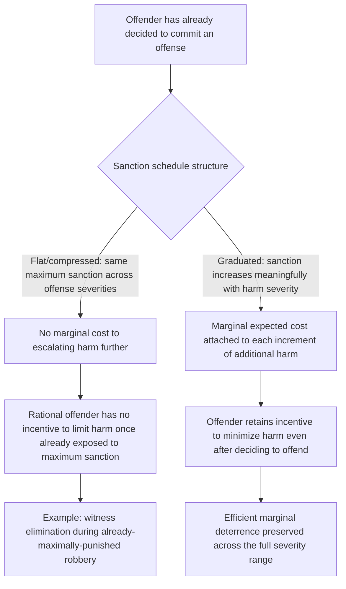

## Marginal Deterrence and the Structure of Criminal Sanctions

### Conceptual Foundations

**Key Points**

- **Marginal deterrence** refers to the incremental deterrent effect of increasing a sanction for a *more serious* offense relative to the sanction for a *less serious* offense — the principle that, to discourage escalation from a lesser to a greater harm, the sanction schedule must impose a **meaningfully higher cost on the more serious act**, not merely a uniformly high cost across a range of offenses.
- This concept, formalized by George Stigler (1970) as an extension of the Becker framework, directly qualifies the naive implication (discussed in the baseline Becker model and the probability-severity tradeoff items) that a cost-minimizing planner should simply maximize severity while economizing on detection probability: if severity is already maximized for a lesser offense, **no further sanction is available to specifically discourage escalation to a more serious offense**, eliminating the marginal incentive to stop at the lesser harm.
- The core policy implication is that an efficient sanction structure must be **graduated**: sanctions should increase monotonically (and with sufficient increments) with offense severity, preserving a "sanction gradient" that gives offenders who have already decided to offend a continuing incentive to minimize the additional harm they cause, rather than facing a flat maximum penalty regardless of how much further harm they inflict.

Stigler's canonical illustration captures the intuition directly: if the punishment for armed robbery and the punishment for murder committed during a robbery are identical (both, say, a maximum sentence), an offender who has already committed armed robbery — and who is already exposed to the maximum sanction available — faces **zero additional expected cost** from also murdering a witness to eliminate the risk of identification, since the offender cannot be punished more severely than the maximum already faced. This perversely *increases* the incentive for witness elimination relative to a properly graduated schedule that reserves a meaningfully harsher sanction specifically for the murder.

### The Formal Marginal Deterrence Condition

**Key Points**

- Extending the basic Becker expected-utility framework to an offender choosing not just *whether* to offend but *how much harm to cause* (a continuous or ordered-discrete choice, rather than a binary offend/don't-offend decision), efficient sanction design requires that the **marginal expected sanction increase with the marginal harm caused**, so that the offender's private cost-benefit calculation at each margin of potential escalation tracks the social cost of that escalation.
- If $h$ denotes the harm level chosen by an offender who has already decided to commit some offense, and $f(h)$ denotes the sanction schedule as a function of harm, efficient marginal deterrence requires:

$$\frac{df(h)}{dh} > 0 \quad \text{for all relevant } h$$

with the increment ideally scaled to reflect the actual marginal social harm of increasing $h$, so that an offender comparing "stop here" versus "escalate further" faces an expected marginal cost proportional to the marginal harm of escalating — precisely the condition violated when sanctions are flat or "bunched" at a common maximum across offenses of meaningfully different severity.

- This generates the core structural design implication: a criminal code's sanction schedule should be **structured as a genuine ordinal and cardinal scale**, with sufficient graduated separation between adjacent offense-severity tiers, rather than collapsing many distinct severity levels into a small number of sanction categories (e.g., a single broad felony classification carrying an identical sentencing range for offenses of substantially different actual harm).

### Marginal Deterrence Across Related but Distinct Offenses

**Key Points**

- Marginal deterrence concerns apply not only to a single offense escalating in severity (as in the robbery-to-murder example) but also to the **relative sanctions across categorically related offenses**, where an efficient schedule must preserve incentives to choose the less harmful among available alternative courses of criminal conduct.
- **Example**: If burglary (unlawful entry with intent to commit a crime) and burglary combined with assault carry identical sanctions, an offender who is discovered mid-burglary has no marginal disincentive against assaulting the discovering party to avoid apprehension, since the assault adds no additional expected sanction — the efficient schedule must instead impose an incrementally higher sanction for the combined offense, preserving the offender's incentive to flee or surrender rather than escalate to violence.
- **Example**: Attempted offenses versus completed offenses raise a related marginal deterrence question: if an attempted murder carries the same sanction as a completed murder, an offender whose initial attempt fails has **no marginal disincentive against retrying**, since the sanction exposure does not increase with a second attempt — this is a leading economic rationale (distinct from purely retributive proportionality arguments) for the common legal practice of imposing a **somewhat lower sanction for attempt than for the completed offense**, preserving a marginal incentive not to persist after an initial failed attempt. [Inference] This attempt-versus-completion marginal deterrence argument is a recognized theoretical rationale in the literature, though actual sentencing practice for attempt offenses reflects multiple additional considerations (evidentiary difficulty in proving intent for attempts, retributive proportionality judgments about completed versus merely attempted harm) beyond the marginal deterrence logic alone.

### Interaction with the Probability-Severity Tradeoff

**Key Points**

- Marginal deterrence concerns interact directly with the probability-versus-severity analysis: because marginal deterrence requires **preserving graduated severity headroom** across an offense category's range of possible harms, a policy that pushes severity to its practical or constitutional ceiling for a *broad swath* of offenses (in pursuit of the risk-aversion or enforcement-cost-savings arguments favoring severity) risks **compressing the sanction schedule** and eroding marginal deterrence for the most serious offenses within that swath.
- This provides a structural reason — independent of the error-cost and behavioral-perception arguments discussed in the probability-severity item — for **reserving detection-probability increases, rather than further severity increases, as the primary deterrence lever once a sanction schedule already occupies most of its available severity range**, since severity headroom must be conserved to preserve marginal deterrence at the top of the schedule (for the most serious offenses, such as murder, for which few or no more severe legal sanctions remain available).

### Marginal Deterrence and Mandatory Minimum Sentencing

**Key Points**

- Mandatory minimum sentencing statutes — which impose a fixed minimum sanction for a defined offense category regardless of case-specific circumstances — are frequently critiqued from a marginal deterrence perspective when they **compress the effective sanction gradient** by imposing the same minimum sanction across a range of offense conduct that, absent the mandatory minimum, would receive graduated sentences reflecting differing severity.
- **Example**: A mandatory minimum sentence for drug trafficking triggered by possessing a threshold quantity can create a **discontinuous jump** in sanction exposure at the threshold, but then apply a comparatively flat sanction range above that threshold — potentially eliminating marginal deterrence against trafficking substantially larger quantities once the mandatory-minimum threshold has already been crossed, since additional quantity beyond the threshold may add little or no additional expected sanction under some statutory structures.
- Similarly, mandatory minimums applied uniformly to a broad offense category (e.g., a fixed minimum sentence for "armed robbery" regardless of whether a weapon was brandished, discharged, or used to cause injury) can **flatten what would otherwise be a graduated harm-based sanction schedule**, reintroducing the marginal deterrence problem that Stigler's original analysis identified as the primary structural defect to avoid.

[Unverified] The empirical magnitude of marginal-deterrence erosion attributable specifically to mandatory minimum sentencing structures (as opposed to other effects of mandatory minimums, such as their impact on prosecutorial charging discretion and plea bargaining leverage) is a topic of ongoing empirical criminology and law-and-economics research, and the specific quantitative significance likely varies considerably by offense category and statutory design, so the discussion here reflects the theoretical mechanism identified in the literature rather than a settled empirical consensus on its real-world magnitude.

### Multiple-Offense Sentencing and Marginal Deterrence

**Key Points**

- **Concurrent versus consecutive sentencing rules** (governing whether sanctions for multiple offenses committed together or in sequence are served simultaneously or added together) raise a distinct marginal deterrence question: under a **purely concurrent sentencing regime** (the offender serves only the longest of the multiple applicable sentences, with no additional sanction cost for committing additional offenses alongside the primary one), an offender who has already committed one offense carrying a substantial sentence faces **no marginal deterrent** against committing additional offenses during the same criminal episode, since those additional offenses add no incremental sanction exposure.
- **Consecutive sentencing** (sanctions for multiple offenses are added together) better preserves marginal deterrence at the multiple-offense margin, ensuring that each additional offense committed carries its own incremental expected cost — directly analogous to the single-offense harm-escalation marginal deterrence logic developed above, but applied across a bundle of distinct offenses committed together rather than across degrees of severity within a single offense.
- The tradeoff, as with severity generally, is that consecutive sentencing for extensive offense bundles can produce very long aggregate sentences, raising the same social-cost-of-severity concerns (incarceration cost, deadweight loss of lost offender output, and diminishing marginal deterrent value once sentences already vastly exceed any realistic offender time horizon or life expectancy) discussed in the broader probability-severity and Polinsky-Shavell frameworks.

### Comparative Summary Table

| Design Feature | Marginal Deterrence Risk if Poorly Designed | Efficient Structural Response |
| --- | --- | --- |
| Flat maximum sanction across offense-severity range | No incentive to limit harm once maximum sanction is already faced | Graduated sanction scale increasing with actual harm |
| Identical sanction for base offense and offense-plus-violence | No disincentive against adding violence during commission | Incrementally higher sanction for the aggravated/combined offense |
| Equal sanction for attempt and completed offense | No disincentive against persisting after a failed attempt | Somewhat lower sanction for attempt than completion |
| Mandatory minimums flattening sanctions above a threshold | Reduced marginal deterrence for conduct well beyond the threshold | Continued graduation of sanctions above any mandatory floor |
| Purely concurrent sentencing for multiple offenses | No marginal cost to committing additional offenses in the same episode | Consecutive (additive) sentencing preserving per-offense marginal cost |

### Related Topics

- The Becker model of crime and optimal enforcement
- Probability of detection versus severity of punishment
- Polinsky-Shavell theory of optimal fines and imprisonment
- Mandatory minimum sentencing: empirical effects on prosecutorial discretion and plea bargaining
- Stigler's original formalization of marginal deterrence theory
- Concurrent versus consecutive sentencing regimes: comparative structural analysis
- Attempt liability and the economics of incomplete offenses
- Sentencing guidelines and graduated harm-based scoring systems