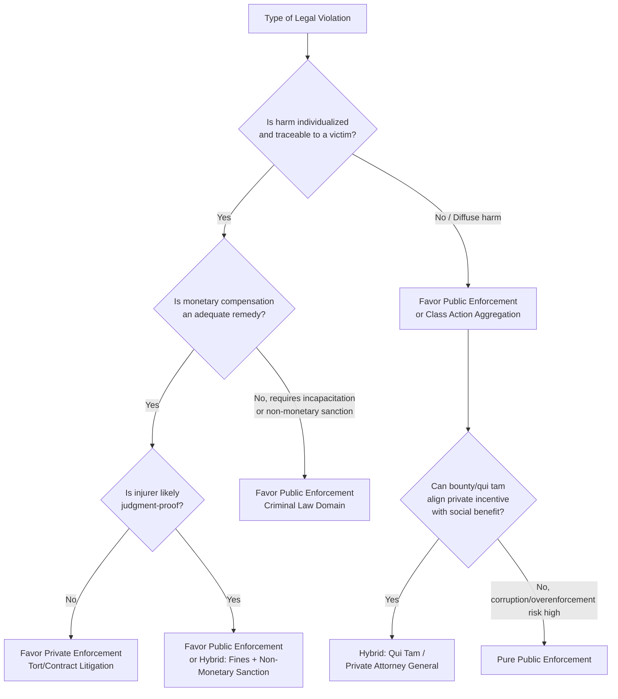

## Public Enforcement Versus Private Enforcement of Law

### Overview and Conceptual Framework

The choice between public and private enforcement is a foundational question in the economic analysis of law, first systematically framed by Becker and Stigler (1974) and extended by Landes and Posner (1975) and Polinsky (1980). The question is: who should detect violations, bring charges, and impose sanctions — a state agency funded by taxes, or private parties (victims, informers, bounty hunters) motivated by financial reward or personal injury?

Every legal system mixes both. Criminal law is predominantly publicly enforced (police, prosecutors); tort law is predominantly privately enforced (injured plaintiffs sue); some domains hybridize (qui tam actions, private attorneys general, antitrust treble damages, environmental citizen suits). The economic question is not "which is inherently correct" but rather: given enforcement costs, error rates, and incentive-compatibility constraints, which institutional arrangement minimizes the sum of (a) harm from underdeterrence, (b) costs of enforcement, and (c) costs of enforcement errors (Type I and Type II)?

### The Core Economic Trade-off

**Key Points**

- **Public enforcement** internalizes enforcement decisions into a salaried bureaucracy. Enforcers do not personally profit from catching violators (in principle), so their incentive to detect is driven by budgets, career concerns, and public mandate rather than direct financial gain.
- **Private enforcement** relies on self-interested actors (victims or bounty-seeking informers) who pursue violators because doing so is profitable or restorative to them personally.

The central trade-off can be summarized as:

$$SW = -H(p) - C_E(p) - C_{err}(p)$$

where $SW$ is social welfare, $H(p)$ is expected harm as a decreasing function of enforcement probability $p$, $C_E(p)$ is the cost of achieving enforcement probability $p$, and $C_{err}(p)$ represents costs from false positives/negatives. Public and private regimes differ in the shape and slope of $C_E(p)$ and $C_{err}(p)$.

### Becker-Stigler Framework: Why Not Always Private?

Becker and Stigler (1974) asked why enforcement is not routinely privatized via bounty systems, since bounty hunters would have strong incentives to detect violations at low public cost. Their analysis identified several reasons public enforcement often dominates:

1. **Corruption resistance**: Publicly salaried enforcers who receive a fixed wage (rather than a share of fines) have less incentive to accept bribes to *not* enforce, because their income doesn't depend on catching the violator. Private/reward-based enforcers have a strong incentive to extract side payments from violators in exchange for non-enforcement.
2. **Overenforcement risk**: Bounty hunters have a private-return incentive to enforce even when the marginal violation causes little social harm, or to entrap innocent parties, because their payoff is tied to convictions/win-rate rather than social harm avoided.
3. **Wealth constraints on violators**: If violators lack wealth to pay large fines, private parties have inadequate incentive to invest in prosecution (this is the same judgment-proof problem discussed in the economics of tort law).
4. **Economies of scale and specialization**: A centralized enforcement bureaucracy can invest in specialized investigative technology (forensics, surveillance, intelligence-sharing) that individual private enforcers cannot efficiently replicate.
5. **Public-good nature of deterrence**: General deterrence is a public good — once one violator is punished, all potential violators are deterred, but no private enforcer captures the full social benefit of deterrence, only their private recovery. This creates underinvestment in a purely private regime unless bounties are calibrated to internalize the externality.

### Landes-Posner Extension: Private Enforcement in a Damages System

Landes and Posner (1975) built a formal model of private enforcement of law via civil litigation, treating plaintiffs as profit-maximizing private enforcers who bring suit if and only if expected recovery exceeds litigation cost.

A representative victim's decision to sue can be modeled as:

$$\pi = p_w \cdot D - C_L$$

where $\pi$ is expected private payoff from suing, $p_w$ is subjective probability of winning, $D$ is expected damages recovered, and $C_L$ is private litigation cost. Suit is brought only if $\pi > 0$.

**Key Points on the Landes-Posner Model:**

- Private enforcement is *self-selecting*: it operates only where private returns are positive, meaning violations that cause diffuse or small individual harms (even if large in aggregate) go unenforced, because no single victim finds it worthwhile to sue. This is the classic **rational apathy** or **rational ignorance** problem.
- To restore adequate enforcement in these diffuse-harm cases, legal systems supplement private incentives with:
  - **Class actions**, which aggregate small individual claims into a single suit large enough to justify litigation costs.
  - **Fee-shifting rules** (e.g., one-way fee shifting favoring plaintiffs, as in some consumer-protection and civil-rights statutes).
  - **Statutory or treble damages**, which artificially inflate $D$ above actual harm to compensate for under-detection probability or to fund litigation costs (this is explicit in U.S. antitrust law, where treble damages compensate for the fact that not all violations are caught).
  - **Qui tam provisions**, allowing private relators to sue on behalf of the government and keep a percentage of recovered damages (e.g., the U.S. False Claims Act).

### Polinsky's Comparative Framework

Polinsky (1980) formalized the comparative-institutional question by modeling public and private enforcement side by side under identical harm and detection-cost assumptions, asking which minimizes total social cost. Key findings that are broadly consistent across the subsequent literature:

- **Private enforcement dominates when**: harm is individualized and easily traceable to a specific victim/injurer, litigation costs are low relative to harm, and reputational/informational advantages exist for private parties.
- **Public enforcement dominates when**: harm is diffuse (spread across many victims each suffering small harm), detection requires specialized investigative capacity, violators are judgment-proof (private suit yields no recovery, so private incentive collapses even though social harm is significant), or there is a risk of private enforcers extracting rents through threats of costly, meritless litigation ("**strike suits**" or "**legal blackmail**").

### Formal Comparison Table

| Dimension | Public Enforcement | Private Enforcement |
| --- | --- | --- |
| Enforcer's incentive | Salary, career, public mandate | Direct financial gain or personal restitution |
| Detection funding | Tax-funded, budget-constrained | Self-funded, contingent on expected recovery |
| Bribery/corruption risk | Lower (no direct stake in fines) | Higher (enforcer profits from settlement/non-enforcement) |
| Response to judgment-proof injurers | Can use non-monetary sanctions (imprisonment) | Weak — civil recovery limited to injurer's wealth |
| Response to diffuse harm | Can aggregate enforcement centrally | Rational apathy; underenforcement absent aggregation devices |
| Risk of overenforcement/extortion | Lower, but political capture possible | Higher (frivolous or strike suits, entrapment incentives) |
| Administrative cost structure | Fixed bureaucratic cost, some economies of scale | Marginal cost borne per suit, decentralized |
| Information advantage | Weaker on primary facts, stronger on cross-case patterns | Often stronger — victim usually best-positioned to know of harm |

### Why Criminal Law Leans Public: The Non-Monetary Sanction Argument

**Key Points**

Criminal law relies overwhelmingly on public enforcement, and the economic literature (particularly Posner's *Economic Analysis of Law*, and Shavell's synthesis) identifies specific reasons this fits the framework above:

1. **Non-monetary sanctions require state coercive authority.** Imprisonment cannot be "purchased" as compensation the way civil damages can; only a public authority with a monopoly on legitimate coercion can administer incarceration, making private enforcement of custodial sentences infeasible by construction.
2. **Judgment-proofness is endemic in crime.** Many offenders (especially in property and violent crime) lack wealth sufficient to pay fines equal to the harm caused, meaning a purely damages-based private system would systematically underdeter — this is the core Shavell/Polinsky argument for supplementing (or replacing) monetary sanctions with imprisonment, which is a public-enforcement-exclusive technology since it cannot be transferred as compensation to the victim.
3. **Externalities beyond the direct victim.** Crime often generates fear and disutility across a broader community (the "external" component of criminal harm), which the direct victim does not fully internalize when deciding whether to pursue a private remedy — creating systematic underinvestment in enforcement if left to the victim alone.
4. **Detection requires investigative technology with scale economies.** Forensics, surveillance, and cross-jurisdictional coordination benefit from centralization; a police force's fixed investment (labs, databases, trained personnel) is more efficient than duplicated private investigative effort.
5. **Avoiding self-help and private vengeance.** Landes and Posner and later scholars (e.g., Friedman) note that unconstrained private enforcement of crime risks feuding, escalation, and disproportionate private retaliation, since private enforcers internalize their own grievance rather than socially optimal sanction levels — a rationale echoing Hobbesian arguments for state monopoly on legitimate force.

### Why Some Domains Lean Private: Torts and Beyond

Conversely, tort law and much of contract law rely on private enforcement because:

- Harms are individualized and identifiable, so the injured party has both standing and precise knowledge of loss.
- Monetary compensation (not incapacitation) is the appropriate remedy, so the wealth-constraint problem is less severe (though it reappears as the "judgment-proof defendant" problem in tort economics).
- Litigation costs are internalized by the party with the best information about the violation, reducing the state's investigative burden.
- Private lawsuits generate a decentralized, information-revealing mechanism: aggregate litigation patterns can reveal systemic risks (e.g., product defects) without requiring the state to proactively monitor every firm.

### Hybrid and Mixed Enforcement Regimes

Modern regulatory economics recognizes that pure public/private dichotomies are rare. Common hybrid mechanisms include:

- **Regulatory enforcement with private rights of action**: environmental law (Clean Water Act citizen suits), securities law (private securities fraud class actions alongside SEC enforcement), and antitrust (private treble-damages suits alongside DOJ/FTC enforcement).
- **Qui tam actions**: the False Claims Act allows private relators to sue on the government's behalf and retain 15-30% of recovered damages, explicitly using private profit motive to overcome the public agency's information deficit regarding fraud against the government.
- **Private attorneys general statutes**: California's PAGA (Private Attorneys General Act) permits employees to sue for labor-code violations on behalf of the state, receiving a share of penalties, addressing the state's limited labor-inspection capacity.
- **Self-regulatory organizations (SROs)**: industry bodies (e.g., FINRA in securities) blend private industry funding with quasi-public enforcement authority delegated by statute.

**[Inference]** The optimal mix in hybrid regimes is generally modeled as choosing a bounty share or fee-shifting parameter that equates the marginal private incentive to sue with the marginal social benefit of an additional suit, though empirically calibrating this parameter is contested and varies by jurisdiction and statute.

### Formal Model: Optimal Enforcement Mix

A generalized version of the enforcement-mix problem (following Shavell's synthesis of public/private enforcement, 1993) treats total enforcement effort as a combination of public probability $p_g$ (achieved via government resources $r$) and private probability $p_v$ (achieved via victim/informer suits), where:

$$p = 1 - (1-p_g)(1-p_v)$$

Total social cost is:

$$TC = H \cdot (1-p) \cdot x + K(r) + n \cdot C_L$$

where $H$ is harm per violation, $x$ is the number of potential violations, $K(r)$ is the increasing convex cost of public enforcement resources, $n$ is number of private suits induced, and $C_L$ is per-suit private litigation cost. The planner chooses the public enforcement budget and the private-incentive parameters (e.g., damage multiplier, fee-shifting rule) jointly to minimize $TC$, subject to the constraint that private suits are induced only when individually profitable to the plaintiff.

**[Inference]** This joint-minimization framework implies that as private litigation costs $C_L$ fall (e.g., via reduced procedural barriers or litigation-funding markets), the optimal public enforcement budget should fall correspondingly, since private suits become a cheaper substitute at the margin — though the magnitude of this substitution effect is sensitive to assumptions about detection technology that are not fully settled empirically.

### Diagram: Enforcement Mode Decision Tree

### Illustrative Example

**Example**

Consider environmental pollution discharge into a shared river, harming 10,000 downstream residents at $50 of harm each ($500,000 aggregate harm), versus a single act of trespass causing $500,000 harm to one landowner.

- **Trespass case**: The single landowner has full incentive to sue — $\pi = p_w \cdot 500{,}000 - C_L$ is very likely positive even with substantial litigation costs. Private enforcement functions efficiently; no public intervention needed beyond providing court infrastructure.
- **Pollution case**: No individual resident has incentive to sue over $50 of harm — litigation costs vastly exceed any individual's recoverable damages, so **rational apathy** yields zero private suits despite identical aggregate harm. This is precisely the diffuse-harm scenario where economic theory predicts private enforcement fails and recommends either (a) public regulatory enforcement (an environmental agency imposing discharge fines), or (b) a class-action mechanism that artificially aggregates the 10,000 individual $50 claims into a single suit worth pursuing.

This example demonstrates that the same aggregate harm magnitude can call for opposite enforcement architectures depending purely on the *distribution* of harm across victims — a central insight of the Landes-Posner/Polinsky tradition.

### Empirical and Policy Considerations

- **[Unverified]** Cross-country comparative claims about the relative deterrent efficiency of public versus private enforcement regimes (e.g., securities fraud enforcement in the U.S. private-litigation-heavy system versus more public-enforcement-centric European regimes) remain empirically contested, with results sensitive to measurement of enforcement intensity and outcome metrics.
- Public choice concerns complicate the pure Beckerian efficiency story: public enforcers may be captured by regulated industries (regulatory capture), underfund enforcement due to budget politics, or over-enforce to generate asset forfeiture revenue — meaning real-world public enforcement does not always match the frictionless welfare-maximizing enforcer assumed in baseline models.
- Private enforcement litigation markets have evolved substantially with the growth of third-party litigation funding, which relaxes the private litigation-cost constraint $C_L$ and may shift the efficient public/private mix over time toward more private enforcement in domains previously thought to require public intervention. **[Speculation]** The long-run equilibrium effect of maturing litigation-finance markets on the optimal enforcement mix is an active and unsettled area of law-and-economics research.

### Conclusion

The public/private enforcement choice is not a binary institutional preference but an optimization problem shaped by (1) the traceability and concentration of harm, (2) the wealth of potential injurers relative to optimal sanctions, (3) whether non-monetary sanctions are required, (4) the scale economies of detection technology, and (5) the corruption and overenforcement risks inherent to reward-based enforcement. Criminal law's reliance on public enforcement follows directly from its use of non-monetary sanctions and the frequent judgment-proofness of offenders; tort law's reliance on private enforcement follows from individualized, traceable harm suited to monetary remedy. Hybrid mechanisms (qui tam, class actions, treble damages, private attorneys general statutes) exist precisely to correct for known failure modes in each pure regime — extending private incentives into public-good-like enforcement gaps, or supplementing public capacity where detection requires victim-specific information.

**Related Topics / Next Steps**

- Becker's economic theory of crime and optimal deterrence (probability-severity trade-off)
- The theory of optimal fines versus imprisonment (judgment-proof injurer problem)
- Class action economics and the aggregation of small claims
- Qui tam litigation and the False Claims Act incentive design
- Treble damages and multiplier remedies in antitrust law
- Regulatory capture and public choice theory of enforcement agencies
- Third-party litigation funding and its effect on private enforcement incentives
- Rational apathy, rational ignorance, and collective action problems in law
- Self-help remedies and the economics of private ordering
- Comparative enforcement regimes: civil law versus common law systems