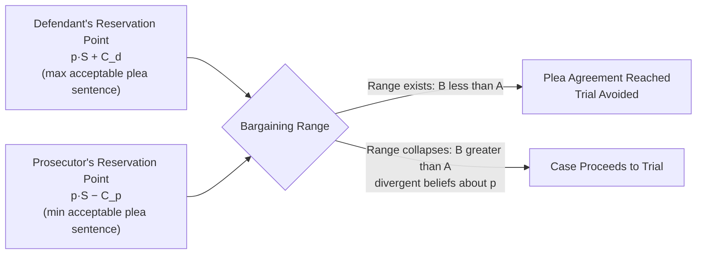

## Economics of Plea Bargaining

### Overview and Conceptual Framework

Plea bargaining is the process by which a criminal defendant agrees to plead guilty — typically to a reduced charge or in exchange for a reduced sentence — in return for the prosecution foregoing a full trial. Economically, plea bargaining is best understood as a **bilateral bargaining problem under asymmetric information and uncertainty**, analogous to settlement bargaining in civil litigation (Landes 1971; Grossman and Katz 1983; Easterbrook 1983; Bar-Gill and Gazal-Ayal 2006; Reinganum 1988). Over 90% of U.S. criminal convictions are resolved by guilty plea rather than trial, making the economics of plea bargaining central to understanding how criminal sanctions are actually administered in practice, as distinct from how they are formally specified in statutes.

The foundational insight — parallel to Coasean bargaining theory and Priest-Klein selection models in civil settlement — is that plea bargaining is a **surplus-splitting exercise**: trial is costly to both prosecution and defense, so if both sides share similar expectations about the probable trial outcome, they can reach an agreement that avoids trial costs and divides the resulting surplus.

### The Basic Bargaining Model

**Key Points**

Let $p$ = probability the defendant is convicted at trial (as jointly estimated by both parties), $S$ = sentence if convicted at trial, $C_p$ = prosecution's cost of going to trial, $C_d$ = defendant's cost of going to trial (including risk-aversion-adjusted disutility of sentence uncertainty), and $s$ = plea sentence offered.

The defendant's expected cost of going to trial is:

$$EC_d = p \cdot S + C_d$$

The defendant accepts a plea offering sentence $s$ if and only if:

$$s < p \cdot S + C_d$$

The prosecutor is willing to offer a plea $s$ so long as it does not fall below what the prosecutor could expect to achieve at trial, net of trial costs:

$$s > p \cdot S - C_p$$

A **bargaining range** exists whenever:

$$p \cdot S - C_p < s < p \cdot S + C_d$$

Because both parties save litigation costs ($C_p$ and $C_d$) by avoiding trial, a mutually beneficial plea agreement exists whenever this range is non-empty — which, absent extreme divergence in beliefs about $p$, is nearly always the case. This is the core reason plea bargaining rates are so high across nearly all criminal justice systems that permit negotiated pleas.

### Divergent Expectations and the Selection of Cases to Trial

Following the logic of the **Priest-Klein selection model** (originally developed for civil settlement, extended to criminal plea bargaining by Grossman and Katz, Reinganum, and others), cases go to trial only when the parties' respective estimates of $p$ diverge sufficiently that no overlapping bargaining range exists. If the prosecutor believes $p$ is high (strong evidence) while the defense believes $p$ is low (weak evidence, viable defense), the prosecutor's minimum acceptable plea $p_{prosecutor} \cdot S - C_p$ may exceed the defendant's maximum acceptable plea $p_{defendant} \cdot S + C_d$, making a trial the only path to resolution.

**[Inference]** This selection logic implies that plea rates are informative about the underlying strength of the prosecution's evidence in the general case pool, but drawing strong conclusions about aggregate case quality purely from observed plea rates is complicated by the endogeneity of charging decisions themselves, which prosecutors adjust anticipating plea bargaining outcomes.

### Why Prosecutors and Defendants Both Favor Pleas: Cost Asymmetries

**Prosecution-side incentives**:

- Trials consume prosecutorial office resources (staff time, expert witnesses, court scheduling) that are scarce relative to caseload, especially in high-volume urban jurisdictions.
- Conviction rates are a salient performance metric for many prosecutorial offices; a guaranteed plea conviction is less risky than an uncertain trial outcome.
- Overcharging (charging a more serious offense than the office ultimately expects to prove) creates negotiating leverage, since the drop from the overcharged offense to the "true" expected offense during plea negotiation feels like a concession to the defendant without changing the prosecutor's actual expected trial outcome.

**Defense-side incentives**:

- Risk-averse defendants prefer a certain, lower sentence over an uncertain distribution of outcomes with a potentially much higher sentence (trial penalty).
- Pretrial detention (when bail is unaffordable) creates strong pressure to plead quickly even absent strong evidence, since time served pretrial may approach or exceed the plea sentence offered — this is the well-documented "process is the punishment" dynamic.
- Public defenders and privately retained counsel both face caseload/resource constraints that make trial preparation costly, creating an agency problem where defense counsel's interest in caseload management may not perfectly align with the defendant's interest in trial vindication.

### The "Trial Penalty" and Its Economic Function

**Key Points**

A **trial penalty** is the observed empirical regularity that defendants who go to trial and are convicted receive substantially harsher sentences than defendants who plead guilty to the same or similar underlying conduct. Economically, the trial penalty functions as the **price mechanism inducing efficient case sorting**:

- Without a sentencing differential between plea and trial conviction, defendants would have no incentive to forgo trial, since $s = p \cdot S$ eliminates any bargaining surplus advantage for the defendant relative to simply litigating.
- The differential ($S - s$) must be large enough to compensate the defendant for surrendering the possibility of acquittal, but the *size* of this differential is a policy design choice, not a natural constant — larger trial penalties induce higher plea rates but raise concerns about coercing pleas from innocent or borderline-guilty defendants (the **false-plea problem**, discussed below).

**[Inference]** Because the trial penalty is jointly a product of legitimate cost-savings (which Coasean bargaining logic supports rewarding) and potential prosecutorial overcharging strategy, empirical decomposition of how much of an observed trial penalty reflects efficient bargaining versus coercive charge-stacking is difficult and remains contested in the criminal-justice economics literature.

### Formal Model: Prosecutorial Overcharging as a Bargaining Chip

Bar-Gill and Gazal-Ayal (2006) and earlier work by Easterbrook (1983) model the prosecutor's charging decision as strategic, not purely evidentiary. If a prosecutor can choose to charge offense $A$ (carrying sentence $S_A$) or a more severe offense $B$ (carrying sentence $S_B > S_A$) where the *evidentiary* probability of conviction is similar for both, charging $B$ initially expands the bargaining range in the prosecutor's favor:

$$s_{max\ defendant} = p \cdot S_B + C_d$$

is larger than it would be if the prosecutor had charged $A$ directly, allowing the prosecutor to extract a plea to $A$ (or something between $A$ and $B$) that the defendant accepts purely to avoid exposure to $S_B$'s higher sentence, even though the prosecutor may never have genuinely intended (or been able) to prove $B$ at trial.

**[Inference]** This overcharging dynamic is a primary mechanism by which mandatory minimum sentencing statutes amplify prosecutorial bargaining leverage: a statute establishing a severe mandatory minimum for a charge that is rarely pursued to actual conviction at trial can nonetheless dramatically shift plea outcomes purely through its threat value, a point emphasized in critiques of mandatory minimums by scholars including Stuntz (2004).

### Innocent Defendants and the False-Plea Problem

A significant strand of the economic literature (Bibas 2004; Bar-Gill and Gazal-Ayal 2006) addresses why factually innocent defendants might rationally plead guilty. Applying the same bargaining-range logic: even an innocent defendant with $p$ (conviction probability) assessed as low but strictly positive faces:

$$EC_d = p \cdot S + C_d$$

If $S$ is severe (e.g., a mandatory minimum) and $C_d$ (cost of mounting a defense, risk of an unpredictable jury, pretrial detention costs) is high, even a modest $p$ can generate an expected cost that exceeds a plea offer $s$, making the plea rational from the defendant's private expected-cost-minimization standpoint despite actual innocence. This is a canonical example of a **false-positive risk that a rational-actor bargaining framework can generate systematically**, not merely as an occasional error.

**Key factors amplifying false-plea risk**:

- High variance in jury outcomes (risk aversion makes even a small $p$ costly to bear)
- Severe mandatory sentences attached to the charged (not necessarily provable) offense
- Pretrial detention increasing $C_d$ for defendants unable to make bail
- Resource-constrained defense counsel unable to invest in case investigation that would lower the defendant's (and prosecutor's) estimate of $p$

**[Inference]** The false-plea problem implies that plea bargaining systems face an inherent efficiency-accuracy trade-off: mechanisms that increase plea rates (higher trial penalties, more prosecutorial charging discretion) reduce trial costs but may increase wrongful conviction rates among innocent defendants who rationally plead to avoid catastrophic-tail sentencing risk, though precisely quantifying this trade-off empirically is difficult since true guilt/innocence is generally unobservable to researchers.

### Information Asymmetry and Signaling

Plea bargaining also functions as a signaling and information-revelation mechanism, drawing on principal-agent and signaling theory:

- A defendant's willingness to accept a plea (versus insisting on trial) can signal private information about actual guilt to the extent guilty defendants have systematically different expected trial outcomes than innocent ones — though this signal is noisy given risk aversion and resource constraints described above.
- **Discovery rules** (the extent to which the prosecution must disclose evidence before plea negotiations) directly affect the informational symmetry of the bargaining game: greater pretrial discovery narrows the gap between prosecution and defense estimates of $p$, which (per the divergent-expectations model above) increases the likelihood of a mutually acceptable plea range and reduces trials driven purely by informational disagreement rather than genuine case-strength ambiguity.

### Diagram: Plea Bargaining Range

### Diagram: Decision Tree of Defendant's Choice (svg_diagram)

<svg viewBox="0 0 900 480" xmlns="http://www.w3.org/2000/svg">
<text x="450" y="30" text-anchor="middle" font-size="18" font-weight="bold" fill="#1a1a1a">Defendant's Plea vs. Trial Decision (svg_diagram)</text>
<rect x="370" y="55" width="160" height="50" rx="6" fill="#e8eef7" stroke="#2c5aa0" stroke-width="1.5"/>
<text x="450" y="85" text-anchor="middle" font-size="13" fill="#1a1a1a">Prosecutor Offers Plea s</text>
<line x1="450" y1="105" x2="450" y2="140" stroke="#555" stroke-width="1.5" marker-end="url(#arrow)"/>
<rect x="330" y="140" width="240" height="60" rx="6" fill="#fff5e6" stroke="#b36b00" stroke-width="1.5"/>
<text x="450" y="165" text-anchor="middle" font-size="12" fill="#1a1a1a">Defendant Compares:</text>
<text x="450" y="183" text-anchor="middle" font-size="12" fill="#1a1a1a">s vs. (p·S + C_d)</text>
<line x1="400" y1="200" x2="230" y2="250" stroke="#555" stroke-width="1.5" marker-end="url(#arrow)"/>
<line x1="500" y1="200" x2="670" y2="250" stroke="#555" stroke-width="1.5" marker-end="url(#arrow)"/>

<text x="290" y="225" font-size="11" fill="#333">s < p·S + C_d</text>

<text x="590" y="225" font-size="11" fill="#333">s ≥ p·S + C_d</text>

<rect x="110" y="250" width="240" height="55" rx="6" fill="#e6f4ea" stroke="#2e7d32" stroke-width="1.5"/>
<text x="230" y="280" text-anchor="middle" font-size="13" fill="#1a1a1a">Accept Plea</text>
<text x="230" y="296" text-anchor="middle" font-size="11" fill="#333">(Certain, lower sentence s)</text>
<rect x="550" y="250" width="240" height="55" rx="6" fill="#fdecea" stroke="#c62828" stroke-width="1.5"/>
<text x="670" y="280" text-anchor="middle" font-size="13" fill="#1a1a1a">Reject Plea → Trial</text>
<text x="670" y="296" text-anchor="middle" font-size="11" fill="#333">(Uncertain outcome: p·S)</text>
<line x1="670" y1="305" x2="670" y2="340" stroke="#555" stroke-width="1.5" marker-end="url(#arrow)"/>
<rect x="530" y="340" width="130" height="55" rx="6" fill="#f0f0f0" stroke="#555" stroke-width="1.5"/>
<text x="595" y="365" text-anchor="middle" font-size="12" fill="#1a1a1a">Acquittal</text>
<text x="595" y="381" text-anchor="middle" font-size="10" fill="#333">Prob. 1−p</text>
<rect x="680" y="340" width="130" height="55" rx="6" fill="#f0f0f0" stroke="#555" stroke-width="1.5"/>
<text x="745" y="365" text-anchor="middle" font-size="12" fill="#1a1a1a">Conviction</text>
<text x="745" y="381" text-anchor="middle" font-size="10" fill="#333">Prob. p, sentence S</text>
<line x1="670" y1="330" x2="595" y2="340" stroke="#555" stroke-width="1"/>
<line x1="670" y1="330" x2="745" y2="340" stroke="#555" stroke-width="1"/>
<defs>
<marker id="arrow" markerWidth="8" markerHeight="8" refX="7" refY="4" orient="auto">
<path d="M0,0 L8,4 L0,8 Z" fill="#555"/>
</marker>
</defs>
</svg>

### Illustrative Example

**Example**

Suppose a defendant faces a charge carrying a sentence of $S = 10$ years if convicted at trial. Both prosecution and defense estimate the probability of conviction at trial as $p = 0.4$. The defendant's cost of trial (attorney fees, lost wages, psychological cost of risk) is $C_d = 0.5$ years-equivalent, and the prosecutor's cost of trial (staff time, opportunity cost of docket space) is $C_p = 0.3$ years-equivalent.

- Defendant's maximum acceptable plea: $0.4 \times 10 + 0.5 = 4.5$ years
- Prosecutor's minimum acceptable plea: $0.4 \times 10 - 0.3 = 3.7$ years

A bargaining range exists between 3.7 and 4.5 years. A plea agreement at, say, **4 years** falls within this range, saving both parties their respective trial costs while giving the defendant a sentence below the trial-expected value ($p \cdot S = 4$ years) — this is the surplus-splitting outcome. If instead the defense believed $p = 0.15$ (confident in an acquittal defense) while the prosecutor believed $p = 0.6$ (confident in conviction), the defendant's maximum acceptable plea would fall to $0.15 \times 10 + 0.5 = 2.0$ years while the prosecutor's minimum would rise to $0.6 \times 10 - 0.3 = 5.7$ years — no overlapping range exists, and the case proceeds to trial precisely because of this divergence in beliefs, not because of any inherent property of the underlying facts.

### Institutional and Policy Design Considerations

- **Sentencing guidelines and mandatory minimums** interact with plea bargaining in economically significant ways: guidelines that formally cap judicial discretion at sentencing shift bargaining leverage toward whichever party controls the *charging* decision (typically the prosecutor), since the "effective" sentence is substantially determined pre-trial via charge selection rather than post-trial via judicial discretion.
- **Charge bargaining versus sentence bargaining**: charge bargaining (pleading to a lesser offense) and sentence bargaining (pleading to the same offense in exchange for a sentencing recommendation) have different transparency and oversight properties — charge bargaining can obscure the "true" offense of conviction from public records and recidivism-tracking statutes, a concern raised in the law-and-economics literature on optimal record-keeping and specific deterrence.
- **Judicial approval requirements**: many jurisdictions require judicial acceptance of plea agreements, which theoretically provides a check on prosecutorial overcharging, but economically this check is only as effective as the judge's independent information about case strength, which is often limited relative to the negotiating parties.
- **Prohibition or regulation of plea bargaining**: a small number of jurisdictions (some civil law systems historically, and some U.S. jurisdictions experimentally) have restricted plea bargaining, generally resulting in either (a) increased trial rates and associated system costs, or (b) informal/covert bargaining substitutes (charge bargaining shifted earlier into the charging decision itself), illustrating that bargaining pressure tends to reassert itself somewhere in the process given the underlying cost asymmetries described above.

### Empirical Considerations and Open Questions

**[Unverified]** Cross-jurisdictional empirical estimates of the magnitude of the trial penalty vary substantially by offense type, jurisdiction, and time period, and isolating the causal trial-penalty effect from selection effects (i.e., defendants who go to trial may differ systematically in observable and unobservable ways from those who plead) remains a significant identification challenge in the empirical criminal-justice economics literature.

**[Speculation]** The growing use of algorithmic risk-assessment tools in bail and sentencing may alter plea-bargaining dynamics by changing defendants' and prosecutors' shared estimates of $p$ and by shifting pretrial detention rates (a key driver of $C_d$), though the net effect on plea rates and false-plea risk is not yet well-established in the literature.

### Conclusion

The economics of plea bargaining models the guilty-plea decision as a bilateral bargaining problem structurally similar to civil settlement, where a positive bargaining range exists whenever litigation costs and risk aversion make trial costlier than a mutually acceptable negotiated sentence. This framework explains both the near-universality of plea bargaining as a case-resolution mechanism and its most contested features: the trial penalty (which functions as the price inducing efficient case sorting but also as a coercive lever), prosecutorial overcharging (which expands bargaining leverage independent of underlying evidentiary strength), and the false-plea problem (whereby even innocent, risk-averse, or detention-constrained defendants may rationally accept a plea). Policy interventions — discovery reform, sentencing guideline design, judicial oversight of plea acceptance, and pretrial detention reform — each operate by altering one or more of the parameters in the underlying bargaining-range equation ($p$, $S$, $C_p$, $C_d$), making the formal model a useful lens for evaluating proposed criminal procedure reforms.

**Related Topics / Next Steps**

- Priest-Klein selection model and its application to civil settlement versus trial
- Economics of sentencing guidelines and judicial discretion
- Mandatory minimum sentences and prosecutorial charging discretion
- Bail, pretrial detention, and their effect on case outcomes
- Principal-agent problems in public defense representation
- Discovery rules and information asymmetry in criminal procedure
- Wrongful convictions: economic models of error costs in criminal adjudication
- Comparative criminal procedure: plea bargaining in common law versus civil law systems
- Risk aversion and expected utility theory in legal decision-making
- Prosecutorial discretion and economic theories of public choice in criminal justice