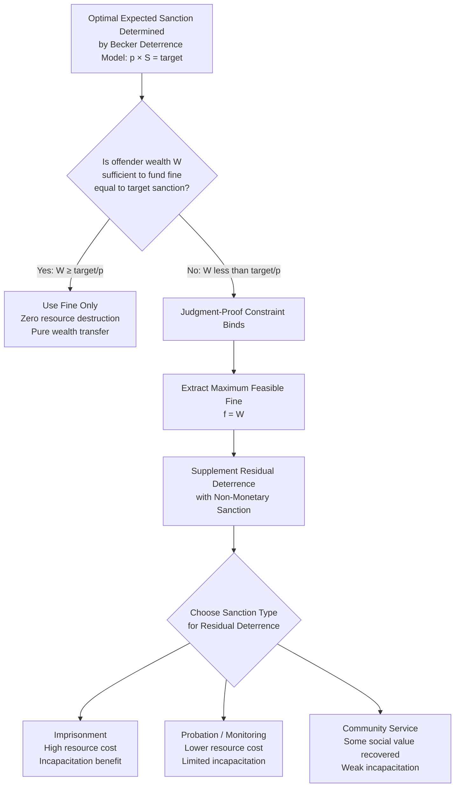

## Economic Analysis of Incarceration and Alternative Sanctions

### Overview and Conceptual Framework

The economic analysis of sanctions asks a deceptively simple question: given that society wants to deter a given quantity of harmful conduct, what is the least-cost combination of sanction type, severity, and probability that achieves the target deterrence level? Incarceration is one point on a broader menu of sanction technologies that includes fines, probation, community service, electronic monitoring, restorative justice, and (in some systems) corporal or capital punishment. Each sanction type has a distinct **cost structure**, a distinct **incapacitative effect**, and a distinct **deterrent efficiency**, and the economic literature (Becker 1968; Posner 1980, 1985; Polinsky and Shavell 1984, 2000; Kaplow 1990; Levitt 1996) evaluates them along these dimensions rather than treating incarceration as normatively privileged.

The foundational Beckerian insight is that sanctions are not costless transfers — imprisonment destroys real resources (the cost of incarceration itself, plus the offender's foregone productive output), whereas a monetary fine is, to a first approximation, a **pure transfer** from offender to state that does not destroy social wealth. This asymmetry drives much of the normative literature toward favoring fines wherever feasible, with imprisonment reserved for cases where fines cannot achieve adequate deterrence.

### The Becker Baseline: Why Fines Are the Efficient Benchmark

**Key Points**

In Becker's (1968) framework, if imprisonment and fines were both freely available and costlessly imposed, the state should always prefer fines because:

$$SC_{fine} = pC_{detect} + p \cdot 0 \quad (\text{fine is a transfer, not a resource cost})$$

$$SC_{prison} = pC_{detect} + p \cdot C_{prison}(t)$$

where $C_{prison}(t)$ is the real resource cost of $t$ periods of incarceration (facility operation cost, guard salaries, plus the offender's foregone legitimate earnings — the opportunity cost of their labor). Since $C_{prison}(t) > 0$ while a fine's transfer cost is definitionally zero at the margin (ignoring collection costs), a risk-neutral planner should set the fine as high as possible before resorting to any incarceration, to conserve enforcement and sanction-imposition costs.

This generates what Polinsky and Shavell (1984) formalize as **the "fine first" principle**: optimal sanction design uses the maximum feasible fine before adding any probability-costly, resource-destroying sanction like imprisonment.

### Why Imprisonment Persists: The Wealth Constraint

The fine-first principle immediately confronts a binding real-world constraint: **most offenders lack sufficient wealth to pay a fine equal to optimal deterrence levels** for serious crimes. If optimal deterrence requires an expected sanction of, say, $500,000 and detection probability is $p = 0.1$, the fine must be $5,000,000 — far beyond most individual offenders' wealth.

This **judgment-proof problem** (Shavell 1986; Polinsky and Shavell 1991) is the central economic justification for incarceration's persistence in criminal law:

$$\text{If } W_i < \frac{H}{p} \quad \text{(wealth is less than optimal fine)}, \quad \text{fines alone underdeter}$$

where $W_i$ is the offender's wealth and $H/p$ is the Beckerian optimal fine. When this constraint binds, imprisonment (or another non-monetary sanction) must supplement or substitute for the fine to restore adequate deterrence, since imprisonment's "cost" to the offender (lost liberty, foregone earnings, psychological harm) is not wealth-constrained in the same way a cash payment is.

### Formal Model: Optimal Combination of Fines and Imprisonment

Polinsky and Shavell's (1984) model treats total sanction severity as a combination $\sigma = f + \gamma \cdot t$ where $f$ is a monetary fine, $t$ is imprisonment length, and $\gamma$ is a conversion factor representing the offender's (and society's) marginal disutility/cost per unit of imprisonment. The planner minimizes:

$$TC = H \cdot x(σ) + p \cdot C_{detect} \cdot x(σ) + p \cdot C_{prison}(t) \cdot x(σ)$$

subject to the deterrence constraint that $x(\sigma)$ (the quantity of crime committed) responds negatively to expected sanction $p \cdot \sigma$, and subject to $f \leq W_i$ (the fine cannot exceed offender wealth).

**Key implication**: the optimal policy sets $f = W_i$ (extract the offender's full wealth as a fine, since this portion is costless to society) and then uses imprisonment $t$ only for the *residual* deterrence needed beyond what the maximum feasible fine provides. This produces the well-known prediction that **richer offenders should face proportionally more fine and less imprisonment than poorer offenders for the same offense**, holding harm and desired deterrence constant — a prediction that is both a clean theoretical result and a source of significant equity controversy in application, since it appears to endorse wealth-based sentencing disparities.

**[Inference]** Real-world sentencing systems generally reject this wealth-contingent sentencing prediction on fairness and equal-treatment grounds, meaning the pure Polinsky-Shavell efficiency result is not directly implemented in most legal systems, even though the underlying "fine first, prison only for residual deterrence" logic partially explains why many jurisdictions do offer fines as an alternative to short custodial sentences for less serious offenses.

### The Multiple Functions of Incarceration: Deterrence, Incapacitation, Rehabilitation

Economic analysis typically decomposes incarceration's total social benefit into three separable channels, each with distinct economic logic:

1. **General deterrence** — the effect of the threat of imprisonment on the broader population's decision to offend, operating through the expected sanction $p \times S$ as in the standard Beckerian model.
2. **Specific deterrence** — the effect of having been imprisoned on that specific individual's post-release offending, operating through updated beliefs about $p$ or $S$, or through stigma/labeling effects on legitimate labor market opportunities.
3. **Incapacitation** — the mechanical reduction in crime achieved purely by physically removing an offender from the general population during the incarceration period, independent of any deterrent or rehabilitative effect. Levitt (1996) and subsequent work attempt to empirically decompose observed crime reductions from incarceration into incapacitation versus deterrence components.

**[Unverified]** The empirical magnitude of each channel's contribution to crime reduction is a matter of ongoing dispute in the criminology and economics literature; estimates of incarceration's elasticity of crime reduction vary substantially by offense type, offender population, and identification strategy (e.g., studies using prison-capacity-driven early release as a natural experiment tend to find different specific-deterrence and incapacitation estimates than studies using cross-sectional variation).

A fourth potential channel — **rehabilitation** (reducing post-release offending by improving the offender's skills, treating underlying conditions, or altering behavior) — is treated economically as a production function question: does time spent incarcerated increase or decrease the offender's post-release "human capital" and legitimate earning capacity relative to the counterfactual? **[Inference]** A substantial body of research on incarceration's effect on subsequent labor market outcomes suggests that incarceration may reduce post-release legitimate earning capacity (via skill atrophy, stigma, and disrupted social/employment ties), which — if accurate — implies incarceration can be criminogenic on net for the specific-deterrence/rehabilitation channel even while it reduces crime via incapacitation during the sentence itself, though the size and even sign of this effect vary considerably across studies and populations.

### Diagram: The Sanction-Cost Decision Framework

### Comparative Cost Structure of Sanction Types

| Sanction Type | Resource Cost to Society | Incapacitative Effect | Wealth-Constraint Sensitivity | Reversibility if Error Discovered |
| --- | --- | --- | --- | --- |
| Monetary fine | Near zero (transfer, minus collection cost) | None | High (binds quickly for low-wealth offenders) | Fully reversible (refundable) |
| Imprisonment | High (facility cost + foregone offender output) | Strong (physical removal) | Low (not wealth-constrained) | Largely irreversible (time cannot be returned) |
| Probation/parole supervision | Moderate (monitoring cost, lower than incarceration) | Weak to moderate (depends on monitoring intensity/technology) | Low | Reversible (can be terminated) |
| Electronic monitoring | Low-to-moderate (technology + monitoring staff) | Moderate (restricts movement without full removal) | Low | Reversible |
| Community service | Low (some offsetting social value produced) | Minimal | Low | Reversible |
| Restorative justice / restitution | Low-to-moderate (facilitation cost) | None | Moderate (offender must have capacity to perform) | Partially reversible |
| Capital punishment | High (extensive legal process cost) plus irreversibility risk | Absolute (permanent) | None | **Fully irreversible** — the central objection in error-cost analysis |

### Alternative Sanctions: Economic Rationale

**Key Points**

The shift toward alternative (non-custodial) sanctions in many jurisdictions since the late 20th century is substantially motivated by the Beckerian resource-cost logic above: if a lower-cost sanction can achieve comparable deterrence and incapacitation for a given offense category, social welfare is improved by substituting away from incarceration.

- **Fines with wealth-adjusted structures (day-fines)**: Scandinavian and some continental European systems scale fines to a percentage of the offender's daily income rather than a fixed amount, directly implementing the equal-marginal-disutility logic embedded in the Polinsky-Shavell framework while avoiding the equity objections to purely efficiency-driven wealth-contingent imprisonment terms.
- **Electronic monitoring**: substitutes a lower-cost technological incapacitation-substitute (restricting movement, verifying location) for the high resource cost of physical incarceration, appropriate when the offender's continued presence in the community poses limited marginal risk relative to the cost savings.
- **Probation and supervised release**: relies primarily on the deterrent threat of *future* incarceration (conditional on violation) rather than current incapacitation, economizing on resource costs by only imposing the expensive sanction (imprisonment) in the lower-probability event of a violation.
- **Restorative justice programs**: internalize an additional consideration absent from the pure deterrence/incapacitation framework — direct compensation and reconciliation with the victim, which can be modeled as increasing the offender's private cost of the sanction (through required victim engagement) while simultaneously *reducing* net social cost relative to imprisonment (via the resource-destruction differential) and *increasing* victim welfare directly, a three-way improvement when applicable.
- **Community service**: functions similarly to a fine paid "in kind" via labor, with the notable feature of returning some positive social value (completed public work) that partially offsets its imposition cost, unlike pure incarceration.

### The Wealth-Effect Critique and Distributive Concerns

**[Inference]** Because monetary fines are, by construction, evaluated against the offender's wealth constraint, a system that maximizes efficiency by pushing lower-wealth offenders toward more imprisonment and higher-wealth offenders toward more fines risks systematically correlating sanction severity with socioeconomic status rather than culpability or harm caused — a critique raised prominently in critical and behavioral law-and-economics literature responding to the Polinsky-Shavell tradition. This tension between efficiency (minimize resource destruction) and equity (treat similarly-culpable offenders similarly regardless of wealth) is a recurring theme in sanction-design debates and is not fully resolved by the base economic model, which typically treats distributive concerns as either exogenous constraints or a separate welfare-weighting exercise layered on top of the efficiency analysis.

### Error Costs and Sanction Severity: The Case for Marginal Deterrence

A related economic consideration in sanction design is **marginal deterrence** (Stigler 1970; Shavell 1992): if all offenses above a certain severity threshold carry the same maximum sanction (e.g., life imprisonment for both burglary and murder), offenders have no marginal incentive to avoid the more severe offense once committed to the lesser one. Economically efficient sanction schedules should be **strictly increasing in harm caused**, preserving an incentive at each margin to avoid escalating the severity of the offense (e.g., not killing a witness to a robbery, since doing so incurs an additional marginal sanction).

**[Inference]** This marginal-deterrence logic provides an independent economic rationale (beyond retributive proportionality arguments) for graduated sentencing schedules, and is frequently invoked in critiques of policies (such as certain mandatory minimum statutes or "three-strikes" laws) that compress sentencing differentials across offenses of meaningfully different severity, since compression can eliminate marginal deterrence at the compressed range.

### Illustrative Example

**Example**

Consider two offenders who commit an identical fraud offense causing $100,000 in harm, with detection probability $p = 0.25$, implying an optimal expected sanction (Becker) of $100{,}000 / 0.25 = \$400{,}000$.

- **Offender A** has wealth $W_A = \$600{,}000$. Under the fine-first principle, a fine of $400,000 fully achieves optimal deterrence at zero resource cost — no imprisonment is economically justified for deterrence purposes (though incapacitation or retributive considerations outside the pure efficiency model might still support some).
- **Offender B** has wealth $W_B = \$50{,}000$. The maximum feasible fine is $50,000, leaving a **deterrence shortfall** of $400{,}000 - 50{,}000 = \$350{,}000$ in expected-sanction terms. Under the Polinsky-Shavell framework, this shortfall must be closed with imprisonment: solving $\gamma \cdot t = 350{,}000$ (given some monetized value of a unit of imprisonment $\gamma$) yields the residual prison term needed to restore deterrence to the target level.

This example makes concrete why, under a pure efficiency criterion, offender B (poorer) receives prison time for the *same offense and same harm* that offender A (wealthier) resolves entirely through a fine — the equity objection to the framework noted above arises directly from this mechanical implication.

### Capital Punishment: A Special Case in Error-Cost Terms

**[Unverified]** Capital punishment occupies a distinct position in the sanction menu because of its complete irreversibility: unlike imprisonment (which can be partially remedied through release, though lost time cannot be restored) or fines (fully refundable), a wrongful execution admits no correction. Economic treatments of capital punishment (e.g., in the law-and-economics literature on error costs, following Kaplow and Shavell's broader framework on legal error) therefore weight Type I error costs (wrongful conviction leading to execution) as categorically different from Type I errors under reversible sanctions, and empirical estimates of capital punishment's marginal deterrent effect beyond long-term imprisonment remain highly contested and are not treated here as settled.

### Conclusion

The economic analysis of incarceration treats it as one sanction technology among several, distinguished primarily by its high real resource cost (facility operation, foregone offender productivity) relative to the near-zero resource cost of monetary fines, but justified by its insensitivity to the offender's wealth constraint — a constraint that binds fines well below optimal deterrence levels for offenders of modest means. The Polinsky-Shavell "fine first" framework formalizes this trade-off and generates the efficiency-driven (and equity-contested) prediction that optimal sanctions should combine maximum feasible fines with residual imprisonment scaled to the wealth gap. Alternative sanctions — day-fines, electronic monitoring, probation, restorative justice, community service — represent institutional responses to the same underlying cost-minimization logic, substituting lower-resource-cost mechanisms wherever they can achieve comparable deterrent and incapacitative effect. Marginal deterrence considerations further require that sanction schedules remain strictly increasing in harm severity to preserve incentives against offense escalation, a principle frequently in tension with compressed or mandatory sentencing regimes.

**Related Topics / Next Steps**

- Becker's foundational model of crime and punishment (probability-severity trade-off)
- The judgment-proof problem in tort and criminal sanctioning
- Marginal deterrence theory and graduated sentencing design
- Economics of recidivism and specific deterrence versus incapacitation
- Day-fine systems and wealth-adjusted monetary sanctions (comparative law)
- Economics of capital punishment and irreversible error costs
- Restorative justice economics and victim-offender reconciliation models
- Labor market effects of incarceration and post-release human capital
- Mandatory minimum sentences and their interaction with marginal deterrence
- Public finance perspectives on prison costs and correctional budgeting