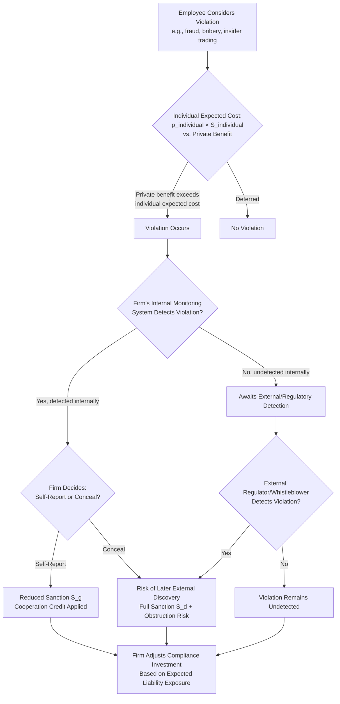

## White-Collar Crime and Corporate Criminal Liability

### Overview and Conceptual Framework

White-collar crime — fraud, embezzlement, insider trading, antitrust violations, bribery, and regulatory offenses committed in the course of otherwise legitimate business activity — presents distinct economic challenges relative to street crime, requiring modifications to the standard Beckerian deterrence model. The offender population is typically wealthier, more rational and calculating (lower variance in decision-making relative to crimes of passion or opportunity), and often embedded within organizational structures where the identity of the responsible party (individual employee, executive, or the corporation itself) is ambiguous. Corporate criminal liability — extending criminal (and civil/regulatory) sanctions to the firm as an entity distinct from its individual employees — is the institutional response to this ambiguity, and its economic justification and design has generated substantial literature (Coffee 1981; Kraakman 1984; Arlen 1994; Arlen and Kraakman 1997; Polinsky and Shavell 1993).

### Why White-Collar Crime Fits the Becker Model Especially Well

**Key Points**

White-collar offenders are frequently modeled as closer to the risk-neutral, rational, expected-cost-minimizing agent assumed in Becker's baseline model than typical street-crime offenders, for several reasons:

- White-collar crime typically involves deliberate, planned conduct with time for calculation (as opposed to impulsive or emotionally-driven offenses), making the expected-cost framework $EC = p \cdot S$ a more descriptively accurate model of the decision process.
- Offenders often have accurate information about detection probabilities (informed by industry practice, past enforcement patterns, and legal advice), reducing the perception-versus-reality gap that complicates deterrence modeling for street crime.
- Offenders generally possess sufficient wealth that monetary sanctions (fines, disgorgement, civil penalties) are not immediately wealth-constrained in the way described for street-crime offenders in the judgment-proof problem — reinforcing the Beckerian preference for fines over imprisonment where feasible, though very large-scale frauds can still exceed individual or even corporate wealth.

**[Inference]** This closer fit to the rational-actor assumption is a key reason white-collar-crime enforcement policy discussions (unlike much street-crime policy discussion) engage relatively directly with formal expected-cost deterrence calculations — e.g., debates over whether SEC or antitrust penalties are calibrated to $H/p$ — though this does not mean behavioral departures from full rationality (overconfidence, motivated reasoning about detection risk, groupthink within organizations) are absent from the white-collar context.

### The Corporate Liability Puzzle: Who Bears the Sanction?

A corporation is a legal fiction — it cannot be imprisoned, and its "intent" is a legal construct built from the intent of its human agents (under doctrines such as *respondeat superior* in U.S. federal criminal law). Economically, this raises a foundational question: **does imposing criminal liability on the corporate entity (as opposed to, or in addition to, individual employees) improve deterrence, and through what mechanism?**

Kraakman's (1984) and Arlen's (1994) analyses identify the core economic function of corporate liability as **inducing the firm to monitor and control its own agents** — a delegated enforcement mechanism, sometimes called **"gatekeeper" or "private policing" liability**. The firm has:

1. **Superior information** about its internal operations, employee conduct, and internal control weaknesses relative to external regulators.
2. **Lower-cost monitoring technology** — the firm can implement internal compliance systems, audits, and incentive structures more cheaply than an external enforcer investigating after the fact.
3. **The organizational capacity to adjust incentives** (compensation structure, promotion criteria, internal reporting requirements) in ways that reduce the likelihood employees commit violations in the first place.

Corporate liability, by imposing a sanction on the firm for employee misconduct committed within the scope of employment, creates a **private enforcement incentive internal to the firm** — the firm, facing potential liability, will invest resources in self-policing to reduce expected liability exposure.

### Formal Model: Optimal Corporate Liability and Self-Reporting

Arlen and Kraakman (1997) model the firm's decision to invest in a compliance/monitoring system $m$ at cost $C(m)$, which reduces the probability of employee violation $q(m)$ (with $q' < 0$) and, if a violation occurs and is discovered by the firm's own monitoring, allows the firm to decide whether to self-report to authorities.

The firm's optimization problem is:

$$\min_m \; C(m) + q(m) \cdot \left[ \theta \cdot p_g \cdot S_g + (1-\theta) \cdot p_d \cdot S_d \right]$$

where $\theta$ is the probability the firm's monitoring detects the violation internally, $p_g$ and $S_g$ are the detection probability and sanction if the firm self-reports (government leniency), and $p_d$ and $S_d$ are the detection probability and sanction if the government discovers the violation independently (without firm cooperation).

**Key design implications**:

- If self-reporting sanctions ($S_g$) are set sufficiently below independently-discovered sanctions ($S_d$), the firm has an incentive to invest in monitoring specifically because monitoring creates the *option* to self-report and obtain leniency — this is the economic rationale behind corporate leniency and cooperation-credit policies (e.g., U.S. Sentencing Guidelines' credit for "an effective compliance and ethics program," and DOJ corporate cooperation frameworks).
- **[Inference]** If sanctions do not vary with self-reporting, the firm's incentive to invest in costly monitoring is weakened, since detecting a violation internally without an accompanying leniency benefit only exposes the firm to a decision of whether to report a violation it would otherwise remain unaware of — implying that *some* self-reporting discount is generally necessary to make monitoring investment individually rational for the firm, though the socially optimal discount size depends on enforcement-cost parameters that are difficult to observe empirically.

### Composition of Liability: Corporate-Only, Individual-Only, or Both?

**Key Points**

The economic literature identifies distinct roles for corporate versus individual liability, rather than treating them as substitutes:

- **Individual liability** operates directly on the decision-maker's expected-cost calculation and is essential where the *individual* captures private benefit from the violation (e.g., a trader profiting from insider trading, an executive receiving a bonus tied to fraudulently inflated earnings) — removing personal liability risk would leave this private-benefit-driven incentive undeterred regardless of corporate sanctions.
- **Corporate liability** operates on the firm's *organizational design* incentives — compliance investment, internal reporting structures, hiring and supervision practices — that individual liability alone does not efficiently induce, since no single employee has the authority or information to redesign firm-wide monitoring systems.
- **[Inference]** Because these two liability channels target different margins (individual private-benefit-driven decisions versus firm-wide organizational design), most law-and-economics scholarship in this area (e.g., Arlen 2012) concludes that **optimal deterrence generally requires both individual and corporate liability operating simultaneously**, rather than viewing them as alternative or redundant enforcement tools — a conclusion reflected in most real-world enforcement regimes that pursue both corporate settlements and individual prosecutions in significant cases.

### The Overdeterrence and "Vicarious Liability Chilling" Problem

A distinct concern raised by Arlen (1994) and others: if corporate liability is imposed too broadly or severely relative to the firm's actual capacity to prevent violations, it can *discourage* rather than encourage internal monitoring, because:

- If detecting a violation internally exposes the firm to liability regardless of whether it self-reports (i.e., internal monitoring itself increases expected liability without offering a leniency offset), the firm has a perverse incentive to **avoid** investing in detection systems — an "ostrich" or "don't look" incentive, since ignorance of a violation may reduce the firm's own expected liability exposure (particularly under a strict-knowledge or willful-blindness standard) relative to informed inaction.
- This overdeterrence risk is the central economic argument for **calibrated leniency/cooperation credit systems** (as discussed above) rather than simple strict corporate liability for any employee violation discovered by any means.

### Diagram: The Corporate Liability Enforcement Chain

### Comparative Framework: Individual vs. Corporate Sanction Instruments

| Instrument | Targets | Primary Deterrent Margin | Wealth Constraint | Key Design Concern |
| --- | --- | --- | --- | --- |
| Individual fines | Employee/executive | Personal private-benefit calculation | May bind for lower-level employees; less so for executives | Must exceed private gain net of detection probability |
| Individual imprisonment | Employee/executive | Personal private-benefit calculation | Not wealth-constrained | Reserved for cases where fines alone are insufficient given wealth or where retributive/incapacitative goals apply |
| Corporate fines/disgorgement | Firm entity | Organizational monitoring and compliance investment | Can exceed firm's ability to pay in extreme cases (bankruptcy risk) | Risk of passing cost to innocent shareholders, employees, or customers |
| Debarment / license revocation | Firm entity | Firm's incentive to maintain regulatory standing | N/A | Can be disproportionate (collateral consequences to innocent stakeholders — the "Arthur Andersen problem") |
| Deferred/Non-Prosecution Agreements (DPAs/NPAs) | Firm entity | Compliance investment + cooperation incentive | N/A | Balances overdeterrence/collateral-damage concerns against accountability |
| Individual director/officer bars | Executives | Career/reputational incentive | N/A | Effective where monetary sanctions alone insufficient given executive wealth |

### The "Innocent Shareholder" and Collateral Consequences Problem

**Key Points**

A distinctive economic critique of corporate criminal liability, raised prominently after cases like *Arthur Andersen LLP v. United States* (2005), is that corporate sanctions — particularly severe ones like criminal conviction leading to loss of operating licenses or debarment — impose costs on parties who had no ability to prevent the violation and no share of its benefits: current shareholders (who may have purchased stock after the violation occurred), rank-and-file employees (who face job losses if the firm is severely sanctioned or dissolved), and customers/suppliers dependent on the firm's continued operation.

**[Inference]** This collateral-consequences concern is the primary economic rationale offered for the increased U.S. use of **deferred prosecution agreements (DPAs)** and **non-prosecution agreements (NPAs)** in lieu of formal corporate criminal conviction for large financial institutions and corporations since the mid-2000s: DPAs are designed to preserve the deterrent and compliance-investment-inducing functions of corporate liability (via substantial fines, mandated compliance reforms, and independent monitors) while avoiding the potentially disproportionate collateral damage of formal conviction (loss of banking licenses, debarment from government contracts, reputational collapse), though critics argue this approach may under-deter by making the sanction too predictable and manageable a "cost of doing business" for large firms.

### Optimal Penalty Calibration for Corporate Offenses

Following the standard Beckerian multiplier logic adapted for corporate contexts (Polinsky and Shavell 1993), the optimal corporate fine for a detected violation should approximate:

$$F^* = \frac{H}{p}$$

where $H$ is the harm caused (or, in some frameworks, the *gain* to the firm from the violation, used as a proxy where harm is difficult to measure directly — e.g., in bribery or antitrust cases) and $p$ is the probability of detection.

**[Inference]** In practice, calculating $H$ for many white-collar offenses (e.g., diffuse harm from securities fraud spread across a large, dispersed shareholder/market population, or harm from anticompetitive conduct affecting an entire product market over years) is empirically difficult, which is a major reason why actual sentencing frameworks (such as the U.S. Sentencing Guidelines' organizational sentencing table) rely on proxies like the firm's "gain" from the offense, revenue affected by the violation, or statutorily defined harm multipliers rather than direct harm estimation, introducing potential systematic over- or under-deterrence relative to the theoretical Beckerian benchmark depending on how well the chosen proxy tracks actual harm.

### Illustrative Example

**Example**

Consider a firm that engages in a bid-rigging antitrust conspiracy generating $50 million in illicit gains, with a detection probability estimated at $p = 0.2$ (roughly one in five cartels are detected and successfully prosecuted, based on empirical cartel-detection literature).

- Applying the Beckerian multiplier: optimal fine $F^* = 50{,}000{,}000 / 0.2 = \$250{,}000{,}000$.
- If the firm's individual executives who orchestrated the scheme personally profited $2 million via bonuses tied to the resulting margin improvements, individual liability should separately target this $2 million private benefit with its own expected-cost calculation (e.g., a personal fine and/or imprisonment sufficient to offset $2{,}000{,}000 / p_{individual}$, where $p_{individual}$ may differ from the firm-level detection probability if individual culpability is harder or easier to establish than corporate liability).
- If the firm's monitoring system had detected early warning signs of the conspiracy internally, a self-reporting/leniency program (such as the DOJ Antitrust Division's Corporate Leniency Policy, which can reduce fines to zero for the first qualifying self-reporter) would apply a substantially reduced $S_g$, illustrating the self-reporting incentive structure described above — this is, in fact, the actual design logic behind corporate antitrust leniency programs, which are widely credited in the economic literature with significantly increasing cartel detection rates by converting the conspiracy's internal information advantage into a race-to-report dynamic among co-conspirators.

### Whistleblower Programs as a Complementary Enforcement Channel

**Key Points**

Whistleblower bounty programs (e.g., SEC and CFTC whistleblower programs, False Claims Act qui tam provisions) function as a hybrid public-private enforcement mechanism specifically suited to white-collar crime's information-asymmetry problem: violations are often known only to insiders (employees, competitors, or business partners), and external regulators face a substantial detection-cost disadvantage without access to this internal information.

By offering a share of recovered penalties (typically 10-30% under the major U.S. programs) to individuals who report violations, these programs directly address the **rational apathy problem** in a specific way relevant to organizational settings: an employee with knowledge of wrongdoing generally has no independent private incentive to report (and often faces retaliation risk for doing so absent legal protection), so the bounty converts an otherwise externality-generating piece of private information into a monetized, incentive-compatible enforcement input — effectively a private-enforcement supplement layered onto a fundamentally public enforcement regime, consistent with the public-versus-private enforcement hybrid mechanisms discussed generally in the enforcement-design literature.

### Conclusion

White-collar crime and corporate criminal liability extend the basic Beckerian deterrence framework into a setting characterized by rational, well-informed offenders (fitting the model's assumptions relatively well) and organizational complexity (requiring liability rules that operate on both individual decision-makers and the firm as a distinct entity). Corporate liability is economically justified not as a simple extension of individual liability to a fictional person, but as a **delegated enforcement mechanism** that induces the firm — possessing superior information and lower-cost monitoring technology — to invest in internal compliance and self-policing. Optimal design requires careful calibration of self-reporting incentives (to avoid the overdeterrence "don't look" problem), joint use of individual and corporate liability (targeting distinct private-benefit and organizational-design margins respectively), and attention to collateral consequences that fall on parties uninvolved in the underlying violation — considerations that have driven the evolution of deferred prosecution agreements, corporate leniency programs, and whistleblower bounty systems as refinements to simple strict corporate criminal liability.

**Related Topics / Next Steps**

- Becker's foundational model of crime and optimal deterrence
- Public enforcement versus private enforcement of law (whistleblower/qui tam mechanisms)
- Antitrust cartel detection and corporate leniency program design
- Deferred and non-prosecution agreements: economic rationale and criticism
- Securities fraud enforcement and the economics of disgorgement remedies
- Agency theory and executive compensation design as compliance mechanisms
- Optimal fines under the judgment-proof problem (applied to corporate wealth limits)
- Economics of regulatory compliance costs and cost-benefit analysis in regulation
- Reputational sanctions and market-based enforcement of corporate misconduct
- Comparative corporate criminal liability regimes (U.S. respondeat superior vs. other jurisdictional models)