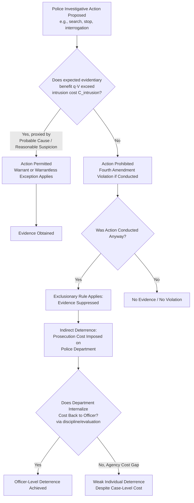

## Economic Analysis of Criminal Procedure and Policing

### Overview and Conceptual Framework

Economic analysis of criminal procedure treats constitutional and statutory procedural rules — the Fourth Amendment's search-and-seizure protections, the Fifth Amendment's privilege against self-incrimination, the Sixth Amendment's right to counsel and jury trial, exclusionary rules, and rules governing police investigative authority — as **cost-allocation and error-minimization mechanisms**, rather than purely as expressions of intrinsic rights independent of consequence. This tradition traces to Posner's early work (1973, 1980) and was substantially developed by Easterbrook (1983), Landes and Posner, and later scholars including Stuntz (1997), Bibas, and Kaplow, applying the same error-cost and cost-minimization logic used elsewhere in law and economics to the specific institutional design of investigative and adjudicative procedure. Policing, as the primary detection mechanism in the criminal justice system, is analyzed as an investment decision: how much resource should be allocated to detection, and how should investigative authority be structured to balance detection efficiency against the costs of erroneous or abusive searches, seizures, and interrogations.

### The General Error-Cost Framework for Procedure

**Key Points**

Following the broader Kaplow-Shavell framework for legal error, criminal procedure rules can be evaluated by their effect on the sum of:

$$TC = C_{admin} + P(\text{false conviction}) \cdot L_{FC} + P(\text{false acquittal}) \cdot L_{FA} + C_{privacy/liberty}$$

where $C_{admin}$ is the administrative cost of the procedure (police time, court time, litigation cost), $L_{FC}$ and $L_{FA}$ are the social losses from false convictions and false acquittals respectively, and $C_{privacy/liberty}$ captures the intrusion cost imposed on innocent and guilty individuals alike by investigative activity (searches, seizures, detention) independent of whether it leads to accurate case outcomes.

Procedural rules — the exclusionary rule, probable cause requirements, Miranda warnings, the right to counsel — are analyzed as instruments that shift these cost components, typically trading increased administrative cost or reduced conviction probability against reduced false-conviction risk or reduced privacy/liberty intrusion.

### The Fourth Amendment: Search and Seizure as Cost-Benefit Regulation

**Key Points**

The probable cause and warrant requirements governing searches can be modeled as a threshold rule restricting police search activity to cases where the expected evidentiary benefit exceeds the expected privacy-intrusion cost. A simplified formalization (following the general logic in Posner's economic analysis of the Fourth Amendment):

$$\text{Search justified if: } q \cdot V_{evidence} > C_{intrusion}$$

where $q$ is the probability the search yields incriminating evidence, $V_{evidence}$ is the social value of obtaining that evidence (contribution to accurate conviction of the guilty), and $C_{intrusion}$ is the privacy/dignitary cost imposed on the searched party — which, notably, is incurred **regardless of whether the target turns out to be guilty or innocent**, since the search itself is intrusive independent of outcome.

**Probable cause** functions as a practical proxy for the threshold condition $q$ being sufficiently high to justify the intrusion, without requiring case-by-case judicial cost-benefit calculation at the point of search (which would be far too slow for operational policing). **[Inference]** This proxy-based design reflects a recognition that a literal case-by-case Kaldor-Hicks calculation is administratively infeasible at the point of a street search, so probable cause acts as a categorical rule calibrated (imperfectly) to approximate the underlying cost-benefit threshold across the general run of cases.

### The Exclusionary Rule: An Incentive-Based Enforcement Mechanism

The exclusionary rule (excluding illegally obtained evidence from trial, per *Mapp v. Ohio* and related doctrine) is a canonical subject of economic analysis because it operates indirectly: rather than directly sanctioning the offending officer, it imposes a cost on the *prosecution's case* to deter future police misconduct.

**Key economic critiques and justifications**:

- **Deterrence rationale**: If police departments and individual officers internalize the cost of lost convictions resulting from suppressed evidence (via performance evaluation, departmental policy, or civil liability concerns), the exclusionary rule creates an indirect Pigouvian-style incentive against unconstitutional searches, since the officer's employer bears the cost of the illegal search in the form of a weakened or lost prosecution.
- **Misalignment critique**: Posner and others note the exclusionary rule's indirect cost-bearer problem — the *cost* of exclusion falls on the prosecution (and, diffusely, on public safety via the released guilty party), while the *misconduct* is committed by the arresting or searching officer, creating an agency-cost gap between who bears the sanction and who commits the violation, unless the department has effective internal mechanisms (discipline, evaluation criteria) to transmit the cost back to the responsible officer.
- **Alternative remedy comparison**: civil damages actions against individual officers (e.g., under 42 U.S.C. § 1983 in the U.S.) more directly target the responsible party's incentives but face their own economic limitations — officer judgment-proofness (a constable's wealth is typically far below plausible civil damages for a serious rights violation), qualified immunity doctrines limiting liability exposure, and juries' general reluctance to award damages against police in ambiguous cases — meaning the exclusionary rule persists partly because the alternative (direct civil liability) suffers from its own judgment-proof-style enforcement gap.

**[Inference]** The theoretical ambiguity about whether the exclusionary rule or direct officer liability produces superior deterrence at lower administrative cost is a long-standing unresolved debate in the law-and-economics literature, and empirical evidence on the exclusionary rule's actual marginal deterrent effect on police behavior (as opposed to its effect on prosecution outcomes, which is more directly observable) remains contested.

### Policing as Resource Allocation: Optimal Detection Investment

**Key Points**

Policing resources (patrol officers, detectives, forensic capacity, surveillance technology) are, in the Beckerian framework, the primary lever determining detection probability $p$. The optimal policing budget allocation follows the same logic as optimal enforcement generally: increase $p$ up to the point where the marginal cost of an additional unit of detection probability equals the marginal social benefit from the resulting increase in deterrence:

$$\frac{\partial C_{police}}{\partial p} = -H \cdot \frac{\partial x(p \cdot S)}{\partial p}$$

where $x(p \cdot S)$ is the crime rate as a decreasing function of expected sanction, and the right-hand side represents the marginal harm reduction from increased detection probability.

**Key allocation considerations**:

- **Diminishing returns to patrol density**: as patrol presence in a given area increases, the marginal deterrent value of additional patrol officers typically declines (each additional officer covers overlapping deterrence "territory" with existing patrols), implying an optimal spatial distribution of policing resources that equalizes marginal deterrent returns across areas rather than uniform density.
- **Hot-spot policing**: empirical criminology and economics research (e.g., Braga and colleagues' hot-spot studies) finds that crime is highly geographically concentrated, and economic efficiency logic suggests concentrating policing resources in high-crime-density locations achieves greater aggregate deterrence per policing dollar than uniform geographic distribution — though this concentration raises independent equity and over-policing concerns regarding the communities subject to concentrated police presence.
- **Certainty versus severity trade-off in policing investment**: consistent with the risk-aversion-driven Becker/Polinsky-Shavell result that increasing detection probability is often a more cost-effective deterrent lever than increasing sanction severity (since sanction severity increases face diminishing marginal deterrent returns once offenders are risk-averse or once severity reaches levels approaching offender wealth/liberty limits), policing investment is frequently identified in the economic literature as an underutilized deterrence margin relative to sentence-length increases, which have faced diminishing empirical support for continued marginal deterrent effect at already-high incarceration levels.

### Diagram: The Investigative Procedure Cost-Allocation Framework

### The Fifth Amendment and Miranda: Interrogation as an Information-Extraction Game

The privilege against self-incrimination and the Miranda warning requirement can be analyzed through the lens of a bargaining/information-extraction game between police and suspect, related to but distinct from the plea-bargaining framework:

- **Without Miranda-style warnings**, suspects (particularly those unfamiliar with their rights, often correlated with lower socioeconomic status or limited education) may unknowingly waive procedural protections during interrogation, producing statements admissible as evidence — raising the false-confession risk discussed further below.
- **With Miranda warnings**, the suspect is informed of the right to silence and counsel, which (in economic terms) increases the suspect's effective bargaining position and reduces the information asymmetry between police and suspect regarding the suspect's procedural rights, at the cost of reducing the *quantity* of self-incriminating information police obtain relative to an unconstrained interrogation regime.
- **[Inference]** This trade-off implies Miranda-style rules impose a real administrative/detection cost (some confessions that would otherwise be obtained are foregone or excluded) in exchange for reduced false-conviction risk from coerced or uninformed confessions — a direct instantiation of the general $L_{FC}$ versus $C_{admin}$ trade-off in the error-cost framework above, though the empirical magnitude of Miranda's effect on both confession rates and false-confession reduction remains debated in the literature (Cassell and others have argued the empirical "cost" in lost confessions is smaller than critics originally feared, though this remains contested).

### False Confessions as a Distinct Error-Cost Category

**Key Points**

The economic analysis of interrogation practice pays particular attention to **false confessions** as a source of false-conviction risk that operates somewhat independently of the underlying evidentiary strength of a case, because:

- Lengthy, high-pressure interrogation techniques can induce false confessions even from innocent suspects under sufficiently adverse conditions (documented extensively in the psychology-of-confession literature and referenced in law-and-economics treatments of interrogation regulation), meaning $p$ (perceived probability of conviction) can be artificially inflated by the interrogation process itself rather than by independent evidence, distorting the plea-bargaining calculus described in the economics-of-plea-bargaining framework (a false confession dramatically raises a defendant's — and prosecutor's — estimate of $p$, pushing even an innocent defendant toward a rational plea).
- Recording requirements for interrogations (mandated in a growing number of jurisdictions) function economically as a **verification/audit mechanism** reducing the informational asymmetry between the interrogation room and the eventual fact-finder (judge or jury) regarding how a confession was obtained, at a relatively low administrative cost (video equipment, storage) relative to the false-conviction risk reduction achieved.

### The Right to Counsel: Correcting an Information and Resource Asymmetry

**Key Points**

*Gideon v. Wainwright*'s right-to-counsel guarantee, and its economic analysis, addresses a structural asymmetry: the state (prosecution) has specialized legal expertise and investigative resources, while an unrepresented defendant typically does not. Economically, counsel serves to:

- Narrow the informational gap between prosecution and defense estimates of $p$ (conviction probability) discussed in the plea-bargaining framework, which (per the Priest-Klein-style selection logic) reduces trials driven by pure informational asymmetry rather than genuine case-strength ambiguity, and reduces false-plea risk among innocent or borderline defendants who would otherwise lack the expertise to evaluate their own position.
- Function as a check on prosecutorial and police overreach at the investigative stage (advising against self-incriminating statements, challenging improper searches), directly interacting with the Fourth and Fifth Amendment frameworks above.

**[Inference]** Chronic underfunding of public defender systems in many U.S. jurisdictions — producing extremely high public defender caseloads — is frequently analyzed in the law-and-economics literature as a systemic factor undermining the theoretical function of the right to counsel: a formally guaranteed right to counsel with insufficient resource backing may fail to meaningfully close the prosecution-defense information and expertise gap the doctrine is designed to address, though quantifying the causal effect of caseload levels on case outcomes (accounting for selection effects in which cases go to trial versus plea) is methodologically challenging.

### Comparative Table: Procedural Rules as Cost-Allocation Instruments

| Procedural Rule | Primary Cost Addressed | Trade-off Imposed | Economic Mechanism |
| --- | --- | --- | --- |
| Probable cause requirement | Privacy/liberty intrusion on innocent parties | Reduces detection rate for guilty parties too | Threshold proxy for cost-benefit search justification |
| Exclusionary rule | Deterring unconstitutional searches | Reduces conviction rate in cases with tainted evidence | Indirect cost imposed on prosecution to incentivize police compliance |
| Miranda warnings | False/coerced confessions, informational asymmetry | Reduces quantity of self-incriminating statements obtained | Equalizes suspect's awareness of procedural rights |
| Right to counsel | Prosecution-defense resource/expertise asymmetry | Increases per-case litigation/defense cost | Narrows estimation gap on conviction probability |
| Recording of interrogations | False confessions, unverifiable interrogation conduct | Equipment/storage administrative cost | Creates verifiable record reducing fact-finder informational asymmetry |
| Speedy trial requirements | Extended pretrial detention costs, evidence degradation | Compresses case preparation time for both sides | Limits prosecutorial delay-driven leverage in plea bargaining |
| Double jeopardy protection | Repeated prosecution costs, prosecutorial overreach | Precludes retrial even with new evidence in most cases | Limits state's repeated-attempt advantage in adversarial system |

### Illustrative Example

**Example**

Consider a police department with a fixed annual budget deciding how to allocate resources between (a) increasing routine patrol density across a city and (b) investing in a specialized forensic/detective unit for property crime investigation.

Suppose current data suggests patrol density increases have entered a range of diminishing marginal deterrent returns (each additional patrol-hour reduces the crime rate only marginally, since criminals largely avoid already-visible existing patrols), while the forensic unit investment would increase clearance rates for property crime (raising $p$, the probability that a given property crime results in identification and prosecution of the offender) from a currently low baseline.

Applying the marginal-cost-equals-marginal-benefit allocation rule: if $\frac{\partial C}{\partial p_{forensic}} < \frac{\partial C}{\partial p_{patrol}}$ at current allocation levels (i.e., a dollar spent on forensic capacity buys more marginal detection probability than a dollar spent on additional patrol, given patrol's already-high density), efficient reallocation shifts resources toward the forensic unit until marginal returns equalize — illustrating how the general enforcement-resource-allocation logic from the Becker framework applies directly to concrete departmental budgeting decisions, independent of the type of crime being targeted.

### Behavioral and Empirical Complications

**[Unverified]** A significant complication for the pure rational-actor procedural-economics framework is substantial evidence from criminology and behavioral economics that potential offenders' *subjective* perception of detection probability often diverges systematically from actual detection rates (frequently overestimated for rare, high-profile crime types and underestimated for common low-visibility offenses), meaning policy changes that alter *actual* $p$ may have a different-than-predicted deterrent effect if they do not proportionally alter offenders' *perceived* $p$ — an issue increasingly incorporated into empirical policing-effectiveness research but only partially integrated into the classical formal models presented above.

**[Speculation]** The growing use of predictive policing algorithms and data-driven resource allocation tools raises novel economic questions about whether algorithmically-optimized patrol allocation can outperform traditional hot-spot policing on a cost-per-unit-deterrence basis, though rigorous causal evidence isolating the incremental effect of algorithmic allocation (versus simply increased data availability generally) is still developing and contested on both efficacy and equity grounds.

### Conclusion

The economic analysis of criminal procedure and policing extends the general error-cost and resource-allocation frameworks of law and economics to the specific institutions governing detection, investigation, and adjudication of crime. Fourth Amendment search rules, the exclusionary rule, Miranda warnings, and the right to counsel are each analyzed as mechanisms that trade administrative cost or reduced detection efficiency against reductions in false-conviction risk and intrusion costs imposed on innocent parties — instantiating the general $TC = C_{admin} + P(FC) \cdot L_{FC} + P(FA) \cdot L_{FA} + C_{intrusion}$ framework in specific doctrinal contexts. Policing resource allocation follows the standard Beckerian marginal-cost-equals-marginal-benefit logic applied to detection probability $p$, with hot-spot concentration and diminishing-returns considerations shaping efficient spatial and functional resource distribution. A persistent theme across this literature is the **agency-cost gap** between the party bearing a procedural sanction (the prosecution, via exclusion; the department, via civil liability) and the individual officer responsible for the underlying conduct, which limits the direct deterrent efficiency of many procedural remedies relative to a hypothetical regime of perfectly targeted individual accountability.

**Related Topics / Next Steps**

- Becker's foundational model of crime and optimal deterrence
- Economics of plea bargaining (interaction with confession and counsel effects)
- Error-cost theory in legal adjudication (Kaplow-Shavell framework)
- Hot-spot policing and geographic concentration of crime
- Economics of public defender funding and caseload effects
- Civil rights litigation (Section 1983) as a deterrence mechanism for police misconduct
- Qualified immunity doctrine and its economic effects on officer accountability
- False confession psychology and its interaction with plea bargaining incentives
- Predictive policing and algorithmic resource allocation
- Comparative criminal procedure across common law and civil law investigative systems