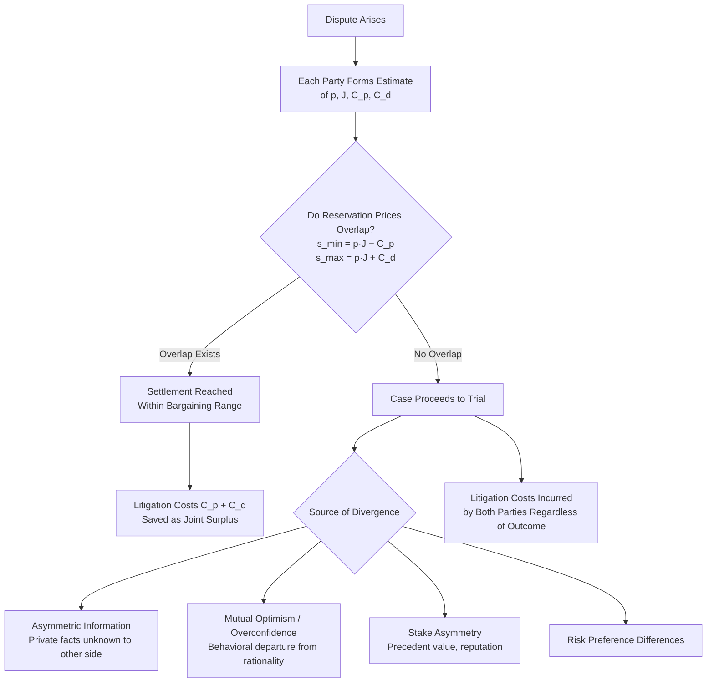

## The Decision to Litigate Versus Settle

### Overview and Conceptual Framework

The decision to litigate versus settle is the foundational model in the economic analysis of civil procedure, formalized principally by Landes (1971), Gould (1973), Posner (1973), Priest and Klein (1984), and Bebchuk (1984). The core economic insight is that litigation is costly and settlement, when feasible, allows both parties to avoid these costs by dividing the expected trial outcome between them. Whether a case settles or proceeds to trial depends on whether the parties' respective valuations of the case create a mutually beneficial bargaining range — a framework structurally identical to the plea-bargaining model but applied to the civil context, where both parties are typically risk-averse-to-neutral profit-maximizers rather than facing the asymmetric criminal-versus-defendant liberty interests present in criminal procedure.

### The Basic Settlement Bargaining Model

**Key Points**

Let $p$ = plaintiff's estimated probability of prevailing at trial, $J$ = expected judgment if plaintiff prevails, $C_p$ = plaintiff's litigation cost to trial, $C_d$ = defendant's litigation cost to trial, and $s$ = settlement amount.

The plaintiff's minimum acceptable settlement (reservation price) is:

$$s_{min} = p \cdot J - C_p$$

The defendant's maximum acceptable settlement (reservation price) is:

$$s_{max} = p \cdot J + C_d$$

A **positive settlement range** exists whenever:

$$p \cdot J - C_p < p \cdot J + C_d$$

This inequality holds trivially whenever $C_p$ and $C_d$ are both positive (i.e., trial is costly to both sides) and both parties share the same estimate of $p \cdot J$ — meaning that **whenever both parties agree on the expected trial outcome, settlement is always jointly preferable to trial**, since the combined litigation cost savings $(C_p + C_d)$ represents pure surplus available to be split between the parties via the settlement amount. This is the central theoretical puzzle motivating the entire field: if settlement is (almost) always jointly efficient when beliefs align, **why does any litigation proceed to trial at all?**

### Why Cases Go to Trial: Divergent Expectations

The dominant explanation, formalized by Priest and Klein (1984) and Shavell (1982), is that trials occur when the parties' beliefs about $p$ (or $J$) diverge sufficiently that no overlapping settlement range exists. If the plaintiff is optimistic ($p_{plaintiff}$ high) while the defendant is optimistic about their own prospects ($p_{defendant}$ correspondingly low, since $p$ represents plaintiff's win probability from the defendant's perspective too but their belief may differ), the ranges fail to overlap:

$$p_{plaintiff} \cdot J - C_p > p_{defendant} \cdot J + C_d \quad \Rightarrow \quad \text{Trial occurs}$$

**Sources of divergent expectations**:

- **Asymmetric information**: each party may possess private information about facts bearing on liability or damages that the other party lacks or cannot verify, producing genuinely different (not merely mistaken) rational estimates of $p$.
- **Mutual optimism / overconfidence**: behavioral departures from purely rational belief formation — each party may be systematically overconfident about their own litigation prospects (a well-documented finding in behavioral law-and-economics research on litigant psychology), which can produce trial even where verifiable common information, if shared and processed identically, would not support divergent estimates.
- **Differing risk preferences**: even with identical beliefs about $p$, a risk-averse party may have a lower reservation price (if plaintiff) or higher reservation price (if defendant) than a risk-neutral counterpart, and asymmetric risk aversion between the parties can either widen or narrow the settlement range depending on which party is more risk-averse.
- **Stake asymmetries and precedent value**: a defendant facing potential future litigation from other plaintiffs on the same legal theory may value a favorable precedent well beyond the instant case's damages, raising $s_{max}$ far above what the instant case's $p \cdot J$ alone would justify, or conversely, a defendant fearing an adverse precedent's effect on future cases may refuse settlement terms that would otherwise be acceptable purely on the instant case's economics.

### The Priest-Klein Selection Model and Trial Win-Rate Predictions

**Key Points**

Priest and Klein's (1984) most influential and empirically tested contribution is not merely explaining *why* trials occur, but predicting *which* cases go to trial and what this implies about observed trial win rates. Their key insight: if both parties have reasonably accurate (even if imperfect) information about case strength, cases will only proceed to trial when the outcome is genuinely close to the legal decision-making standard — clearly one-sided cases (where $p$ is very high or very low) will settle, because the settlement range is wide and easy to locate, while genuinely uncertain cases (where $p \approx 0.5$, or more precisely, where $p$ is close to whatever threshold makes both parties' independent case assessments diverge) are the ones most likely to lack an overlapping settlement range.

This generates the counterintuitive **"50-percent" selection hypothesis**: under certain symmetry assumptions about litigation cost and error distributions, the set of cases that proceed to trial should exhibit a plaintiff win rate converging toward 50%, *regardless of the underlying legal standard's stringency or the overall population of disputes' true liability distribution* — not because the legal system is arbitrary, but because the *selection* of which cases reach trial filters out the clear cases, leaving only the genuinely close ones.

**[Inference]** Empirical testing of the strict 50-percent prediction has produced mixed results across different case types and jurisdictions, with plaintiff trial win rates observed to deviate from 50% in economically meaningful ways in several studies — a finding generally interpreted not as refuting the underlying selection logic, but as evidence that the model's restrictive symmetry assumptions (particularly regarding relative litigation costs, stake symmetry, and error-distribution symmetry between plaintiffs and defendants) do not hold uniformly across case types, since asymmetric stakes or costs shift the win-rate prediction away from exactly 50% in a direction that depends on which asymmetry dominates.

### Bebchuk's Extension: Asymmetric Information and Settlement Failure

Bebchuk (1984) extended the framework using formal game-theoretic bargaining models with asymmetric information, showing that even without behavioral overconfidence, purely rational parties with private information can fail to settle due to a **signaling/screening problem**: if a defendant does not know the plaintiff's true case strength, the defendant may rationally offer a settlement reflecting the *average* case strength across the population of plaintiffs who might bring similar claims. Plaintiffs with unusually strong cases may reject this "pooling" offer (since it undervalues their specific claim) and proceed to trial to reveal their true strength, while weaker-case plaintiffs accept the offer. This is directly analogous to adverse-selection problems in insurance and labor markets (Akerlof, Spence), applied to litigation bargaining.

**[Inference]** This asymmetric-information mechanism for settlement failure is theoretically distinct from the simple divergent-expectations story, since it can generate trials even when both parties are risk-neutral and share common priors about the general population of similar disputes — the trial arises specifically from private, case-specific information that cannot be credibly communicated through settlement negotiation alone, and this distinction matters for policy interventions, since discovery-based solutions (which work well against pure information-based divergence) may be less effective against strategic information-withholding modeled in signaling frameworks.

### Diagram: The Litigate-or-Settle Decision Framework

### Formal Model: Settlement Rate as a Function of Cost and Stake Ratios

The proportion of disputes that settle (rather than proceed to trial) in a given population can be modeled as a function of the **ratio of litigation costs to stakes** and the **degree of informational symmetry**:

$$\text{Settlement Rate} = f\left(\frac{C_p + C_d}{J}, \; \text{Info Symmetry}, \; \text{Belief Divergence}\right)$$

**Key comparative statics**:

- As $\frac{C_p + C_d}{J}$ increases (litigation costs large relative to stakes), the settlement range widens proportionally, making settlement more likely even with some belief divergence — this explains why very high-stakes litigation (where legal fees, though large in absolute terms, are small relative to the amount at issue) can sometimes show *lower* settlement rates than smaller disputes, since the relative cost-savings-to-stake ratio is smaller.
- As informational symmetry increases (e.g., through robust discovery processes), belief divergence narrows, increasing settlement rates for a given cost structure — this is the primary economic justification for expansive pretrial discovery rules as a settlement-promoting (and thus litigation-cost-reducing) procedural mechanism.
- Fee-shifting rules (loser-pays "British Rule" versus "American Rule" where each side bears its own costs) alter both $C_p$ and $C_d$ in outcome-contingent ways, and their effect on settlement rates is theoretically ambiguous: fee-shifting can increase the *stakes* of litigation (since losing means paying the other side's fees too), which under some models increases divergence-driven trial rates (parties fight harder over increased stakes) while under other models increases settlement rates (larger stakes at risk make both parties more risk-averse about proceeding to an uncertain trial).

### Comparative Table: American Rule vs. British Rule Effects

| Feature | American Rule (each side bears own costs) | British/English Rule (loser pays both sides' costs) |
| --- | --- | --- |
| Effect on weak claims | Discourages some low-probability suits (plaintiff bears own cost even if losing) | Can discourage weak claims further (added risk of paying defendant's costs too) but may encourage strong claims (confident plaintiff externalizes cost risk onto losing defendant) |
| Effect on settlement range width | Narrower — costs are fixed regardless of outcome | Wider variance — outcome-contingent cost shifts increase the stakes of the litigation decision itself |
| Risk-aversion interaction | Moderate — costs are certain | Stronger — adds outcome-contingent cost risk on top of merits risk, increasing effective risk exposure |
| Predicted effect on frivolous litigation | Some deterrence (cost is sunk regardless of outcome) | **[Inference]** Theoretically ambiguous — reduces frivolous suits from risk-averse claimants but may not deter well-resourced or confident claimants, and empirical cross-jurisdictional comparisons face significant confounding from other procedural and substantive legal differences |

### The Role of Litigation Cost Asymmetries and Nuisance Value Suits

**Key Points**

A distinct phenomenon addressed in this literature is the **nuisance suit** or **strike suit**: cases with genuinely low probability of success on the merits ($p$ very low) that nonetheless extract a positive settlement because the defendant's litigation cost $C_d$ to *defeat* even a weak claim exceeds a modest settlement demand. Formally, a plaintiff can extract settlement $s$ even when $p \cdot J$ is small, so long as:

$$s < C_d \quad \text{(defendant prefers paying nuisance settlement to litigation cost of dismissal)}$$

This is a direct consequence of the basic bargaining framework rather than a departure from it — it arises whenever defense litigation costs are structurally high relative to the stakes of a marginal claim (common in cases requiring extensive discovery or expert testimony even to resolve a facially weak claim), and is a recurring justification offered for procedural reforms such as early dismissal mechanisms (e.g., motions to dismiss, summary judgment standards, anti-SLAPP statutes) designed to allow low-merit claims to be resolved before triggering the full $C_d$ that gives them settlement leverage.

### Illustrative Example

**Example**

A plaintiff sues for breach of contract, seeking $J = \$1{,}000{,}000$ in damages. Plaintiff's litigation cost to trial is $C_p = \$150{,}000$; defendant's litigation cost to trial is $C_d = \$200{,}000$ (defendant faces higher costs due to more complex factual defenses requiring expert witnesses).

**Scenario 1 — aligned beliefs**: both parties estimate $p = 0.6$.

- Plaintiff's minimum acceptable settlement: $0.6 \times 1{,}000{,}000 - 150{,}000 = \$450{,}000$
- Defendant's maximum acceptable settlement: $0.6 \times 1{,}000{,}000 + 200{,}000 = \$800{,}000$
- A wide settlement range ($450,000–$800,000) exists; settlement is highly likely, e.g., at $600,000, splitting the combined $350,000 litigation-cost surplus.

**Scenario 2 — divergent beliefs after limited discovery**: plaintiff believes $p = 0.75$ (confident based on internal documents), while defendant believes $p = 0.3$ (confident in an affirmative defense not yet disclosed to plaintiff).

- Plaintiff's minimum acceptable settlement: $0.75 \times 1{,}000{,}000 - 150{,}000 = \$600{,}000$
- Defendant's maximum acceptable settlement: $0.3 \times 1{,}000{,}000 + 200{,}000 = \$500{,}000$
- No overlapping range exists ($600,000 floor exceeds $500,000 ceiling); the case proceeds toward trial *unless* further discovery narrows the belief gap (e.g., disclosure of the defendant's affirmative defense evidence could shift plaintiff's estimate of $p$ downward, potentially restoring an overlapping range) — illustrating precisely why expanded discovery is predicted to increase settlement rates by narrowing exactly this kind of belief divergence.

### Timing of Settlement: The Cost-Accumulation Dynamic

**Key Points**

Settlement bargaining is not a single-shot decision but occurs (and can occur) at multiple points across the litigation timeline — pre-filing, post-filing/pre-discovery, post-discovery, mid-trial, and post-verdict-pre-appeal. The economic framework predicts settlement timing shifts based on the evolving cost and information structure at each stage:

- **Early settlement** (before significant discovery costs are sunk) captures the largest share of potential cost savings but occurs under the highest degree of informational asymmetry, meaning early settlements are most vulnerable to the Bebchuk-style pooling/signaling problems described above.
- **Later settlement** (after discovery, but before trial) occurs after informational asymmetry has been substantially reduced (discovery has revealed most case-relevant facts to both sides) but after a significant fraction of total litigation cost has already been sunk, meaning the *remaining* cost-savings surplus from settling rather than proceeding to trial is smaller — explaining the well-documented empirical pattern of settlements clustering shortly before scheduled trial dates ("courthouse steps" settlements), when the *marginal* remaining trial cost (the specific cost of the trial itself, as opposed to already-sunk discovery cost) becomes the relevant comparison rather than total litigation cost.

**[Inference]** This dynamic implies that procedural rules affecting the *sequencing* of cost accumulation (e.g., bifurcating discovery into an initial low-cost phase focused on threshold issues before authorizing full-scale discovery) can be used to try to capture settlement gains earlier in the process without waiting for the full discovery-driven informational convergence, though the practical effectiveness of such sequencing reforms depends heavily on case-specific factors not fully captured in the general model.

### Conclusion

The litigate-versus-settle decision is modeled economically as a bargaining problem in which settlement represents the efficient default outcome whenever litigation costs are positive and party beliefs about likely trial outcomes are reasonably aligned — meaning the theoretically interesting question is not why parties settle, but why *any* cases proceed to trial. The dominant answers — divergent expectations arising from private information or overconfidence (Priest-Klein), and strategic information asymmetry in bargaining (Bebchuk) — generate distinct empirical predictions, most notably the Priest-Klein selection hypothesis that trial win rates should cluster near 50% due to the systematic settlement of one-sided cases. This framework grounds a wide range of procedural policy analysis: discovery rules (narrowing informational divergence), fee-shifting regimes (altering the cost structure underlying reservation prices), and early-dismissal mechanisms (addressing nuisance-value settlement leverage arising from asymmetric litigation costs) are each best understood as interventions targeting specific parameters within this general reservation-price bargaining model.

**Related Topics / Next Steps**

- Priest-Klein selection model and empirical tests of the 50-percent trial win-rate hypothesis
- Economics of pretrial discovery and information disclosure rules
- Fee-shifting regimes: American Rule versus British Rule comparative analysis
- Class action litigation economics and claim aggregation
- Nuisance suits, strike suits, and anti-SLAPP procedural reforms
- Bebchuk's asymmetric information bargaining model and adverse selection in litigation
- Risk aversion and expected utility theory in litigant decision-making
- Economics of contingency fee arrangements and litigation finance
- Alternative dispute resolution (mediation, arbitration) as cost-reduction mechanisms
- Appellate settlement dynamics and post-verdict bargaining