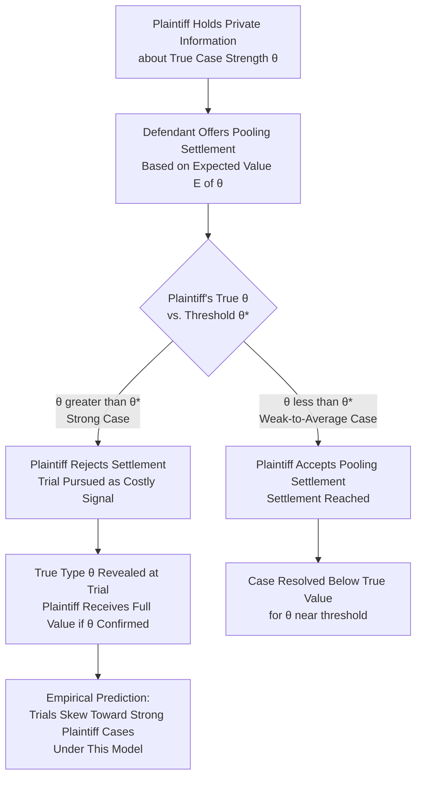

## Asymmetric Information and Settlement Bargaining

### Overview and Conceptual Framework

Asymmetric information models of settlement bargaining depart from the simpler divergent-expectations account (Priest-Klein) by treating settlement failure as arising from a **formal bargaining problem under private information**, rather than from parties simply holding different beliefs about a common set of facts. Where the divergent-expectations model treats belief differences as exogenous (parties happen to disagree), the asymmetric-information tradition — grounded in mechanism design and signaling/screening theory developed by Akerlof (1970), Spence (1973), and applied to litigation specifically by Bebchuk (1984), P'ng (1983), Reinganum and Wilde (1986), and Schweizer (1989) — treats belief-relevant information as **privately held by one party** and asks whether, and how, rational bargaining can transmit that information without resorting to costly trial.

The central question this literature answers: even if both parties are fully rational, share common priors about the general population of similar disputes, and correctly update on all available information, can settlement still fail purely because one party's private information cannot be credibly communicated to the other except through the costly signal of proceeding to trial?

### The Basic One-Sided Asymmetric Information Model

**Key Points**

Consider a setting where the plaintiff possesses private information about case strength (e.g., the plaintiff alone knows the severity of an injury, or has private knowledge of a favorable witness) that the defendant cannot directly observe. Let case strength (equivalently, the probability of prevailing at trial or the magnitude of provable damages) be represented by a type parameter $\theta \in [\theta_L, \theta_H]$, known to the plaintiff but not the defendant, with the defendant holding only a prior distribution $F(\theta)$ over possible plaintiff types.

The defendant, unable to distinguish plaintiff types, must offer a settlement $s$ based on the *expected* value of $\theta$ across the distribution of plaintiffs who might present a similar claim:

$$s = E[\theta] \cdot J - (\text{adjustment for defendant's own litigation cost})$$

This is a **pooling offer** — a single settlement amount offered regardless of the plaintiff's true (unobserved) type. The critical dynamic: plaintiffs with $\theta > E[\theta]$ (stronger-than-average cases) are undercompensated by the pooling offer relative to their true expected trial value, while plaintiffs with $\theta < E[\theta]$ (weaker-than-average cases) are overcompensated.

### The Screening Problem and Trial as a Costly Signal

**Key Points**

Because the pooling settlement systematically undercompensates strong-case plaintiffs, those plaintiffs face an incentive to **reject the pooling offer and proceed to trial**, since trial (despite its cost) allows their true type $\theta_H$ to be revealed and rewarded at its actual value, rather than being averaged down with weaker claims. This generates a **separating equilibrium** in which:

- Weak-case plaintiffs (below some threshold $\theta^*$) accept the pooling settlement, since their true value is close to or below what the pooling offer provides.
- Strong-case plaintiffs (above $\theta^*$) reject the settlement offer and proceed to trial, using trial itself as a **costly signal** that credibly reveals their private information (a costly signal is credible precisely because a weak-case plaintiff would not find it worthwhile to bear trial costs to pursue a low-value claim, satisfying the standard signaling-theory credibility condition from Spence's original framework).

**[Inference]** This screening dynamic implies that under one-sided asymmetric information favoring the plaintiff, the trials that *do* occur are systematically the **strongest** cases from the plaintiff's perspective — a prediction that stands in some tension with the Priest-Klein selection model's prediction that trials cluster around the *closest*, most uncertain cases, illustrating that these are genuinely distinct (not merely reformulated) theories of trial selection with different empirical implications depending on which asymmetric-information or divergent-expectations mechanism dominates in a given case-type population.

### Reinganum-Wilde Screening Model: Plaintiff Signaling Through Settlement Demands

Reinganum and Wilde (1986) formalize a related but distinct mechanism in which the **informed party makes the offer** (rather than the uninformed party, as in the basic pooling model above). If the plaintiff (who knows their own type) makes a settlement demand, and the uninformed defendant must decide whether to accept or reject based on the demand's signaling content, a **separating equilibrium** can arise in which different plaintiff types make systematically different demands, credibly revealing type through the size of the demand itself — since a low-value-case plaintiff who demanded a high settlement would face rejection and an unfavorable trial outcome, making high demands credible only for genuinely strong cases.

**Key implications of the screening-via-demand model**:

- The equilibrium settlement demand function is generally **strictly increasing in plaintiff type** $\theta$, so that observing the demand size allows (at least partial) inference of case strength even without direct verification.
- Trial still occurs in equilibrium for some range of plaintiff types (typically the highest types, whose demands the defendant finds unprofitable to accept relative to litigating), preserving the core prediction that trials are non-randomly selected from the case-strength distribution based on the information-asymmetry structure specifically (as opposed to purely stochastic divergent beliefs).

### Two-Sided Asymmetric Information

**Key Points**

Extending the model to **two-sided asymmetric information** (both plaintiff and defendant hold private information relevant to case value — e.g., plaintiff knows injury severity, defendant knows internal facts bearing on liability or the strength of an affirmative defense) substantially complicates equilibrium characterization, but the general economic insight persists: **settlement failure can arise purely from the structure of private information and strategic communication incentives, without requiring any irrationality, mutual optimism, or exogenous belief divergence.**

Schweizer (1989) and subsequent bargaining-theoretic work show that under two-sided private information, achieving full ex-post efficiency (i.e., settling in all cases where settlement would be jointly beneficial given the true, fully-revealed values) is generally **not achievable** by any incentive-compatible bargaining mechanism — a result closely related to the celebrated Myerson-Satterthwaite (1983) impossibility theorem in bilateral trade theory, which establishes that no bargaining mechanism can simultaneously be efficient, individually rational for both parties, and budget-balanced when both parties hold private information about their valuations.

**[Inference]** The Myerson-Satterthwaite connection implies that some level of "inefficient" trial (i.e., trial occurring even in instances where, had information been symmetric, the parties would have settled) is a structural, unavoidable feature of bargaining under two-sided private information — not merely an artifact of specific institutional design choices, meaning procedural reforms can reduce but likely cannot fully eliminate information-asymmetry-driven trial rates without also reducing the underlying informational asymmetry itself (e.g., via discovery).

### Diagram: Screening Equilibrium Under One-Sided Asymmetric Information

### The Role of Discovery in Resolving Asymmetric Information

**Key Points**

Pretrial discovery is the principal procedural mechanism designed to directly reduce the informational asymmetry underlying both the divergent-expectations and formal signaling models of settlement failure. Economically, discovery functions as a **mandated information-transfer mechanism** that substitutes for (or supplements) the costly signaling achieved naturally through trial itself:

- To the extent discovery successfully transfers a party's private information to the other side (interrogatories, depositions, document production, expert disclosure), it narrows the gap between $\theta_{plaintiff-believed}$ and $\theta_{defendant-believed}$, directly shrinking the parameter space in which no settlement range exists.
- **[Inference]** However, discovery is itself costly, and the same reservation-price logic governing the underlying litigate-versus-settle decision applies recursively to discovery scope decisions: parties (and courts, via proportionality rules such as U.S. Federal Rule of Civil Procedure 26(b)(1)) must weigh the incremental information-revelation value of additional discovery against its incremental cost, meaning discovery is not necessarily expanded to the point of full informational symmetry even when technically feasible, since the marginal cost of additional discovery may exceed its marginal settlement-facilitating value well before full symmetry is reached.
- Discovery asymmetries by party type are also economically significant: in some case types (e.g., products liability, employment discrimination), the defendant characteristically holds most of the case-relevant private information (internal safety records, personnel files), meaning discovery rules' allocation of production burdens and cost-shifting directly affects which asymmetric-information model (pooling by an informed plaintiff versus pooling by an informed defendant) better describes the resulting settlement dynamics.

### Offer-of-Judgment Rules as a Screening Mechanism

**Key Points**

Formal settlement-offer procedural rules — such as U.S. Federal Rule of Civil Procedure 68, under which a defendant can make a formal settlement offer that, if rejected and the plaintiff subsequently fails to obtain a judgment exceeding the offer, shifts certain post-offer costs onto the plaintiff — function economically as a **mechanism-design intervention** intended to induce more efficient screening than a simple, cost-consequence-free settlement offer would achieve.

By attaching a cost consequence to rejection of a *sufficiently generous* offer, such rules increase the effective cost to a plaintiff of rejecting a settlement that turns out (ex post) to have been fair or generous relative to the eventual trial outcome, which — in the screening-model framework — can induce weaker-case plaintiffs (who might otherwise gamble on trial hoping to be pooled favorably, or simply due to overconfidence) to accept settlement offers they would otherwise reject, narrowing the range of cases proceeding to costly trial.

**[Inference]** The empirical effectiveness of offer-of-judgment rules in actually shifting settlement behavior (as opposed to their theoretical mechanism-design appeal) is contested in the literature, with some studies finding only modest measurable effects on settlement rates or timing, potentially because the rules' cost-shifting consequences are not sufficiently salient or certain to strongly affect plaintiff risk calculations in practice, or because strategic offer-setting by defendants (setting offers just below what they believe plaintiffs will accept) can limit the rule's screening efficiency relative to its theoretical potential.

### Comparative Table: Divergent-Expectations vs. Asymmetric-Information Models of Trial Selection

| Dimension | Priest-Klein (Divergent Expectations) | Bebchuk / Reinganum-Wilde (Asymmetric Information) |
| --- | --- | --- |
| Source of settlement failure | Both parties hold (possibly mistaken) beliefs about a common, in-principle-observable case strength; beliefs happen to diverge | One party holds private information the other cannot observe; belief formation itself may be fully rational given available (asymmetric) information |
| Requires irrationality/error? | Can be pure information-processing error, or genuinely differing rational estimates from differential information | No — settlement failure is a structural bargaining-theoretic result under full rationality |
| Predicted trial win-rate pattern | Trials cluster near 50% (closest cases select into trial) | Trials skew toward extreme-type cases (e.g., strongest plaintiff cases in one-sided screening models) |
| Effect of improved discovery | Narrows belief divergence, increases settlement rate | Narrows the information asymmetry the screening equilibrium depends on, changing (not necessarily eliminating) the separating threshold |
| Theoretical limit on achievable settlement rate | No hard theoretical floor on inefficient trial rate (approaches zero as information symmetry approaches perfect) | Myerson-Satterthwaite implies a **structural floor** on inefficient trial under genuine two-sided private information, even with maximal feasible discovery |

### Illustrative Example

**Example**

Consider a products-liability mass-tort context where a manufacturer (defendant) faces claims from a large population of plaintiffs, each with differing true injury severity $\theta$ known privately to each plaintiff (via their own medical evaluation) but not directly verifiable by the defendant without individualized investigation.

The defendant, lacking case-by-case verification capacity for the full population, offers a **standardized settlement grid** — a pooling mechanism sorting claims into a small number of tiers based on easily verifiable proxies (injury type, documented medical treatment) rather than the plaintiff's full private information about symptom severity or long-term impact.

- Plaintiffs whose true private severity substantially exceeds their assigned tier's typical value face the classic screening incentive: reject the grid-based settlement and pursue individual litigation to reveal (via expert testimony, detailed medical evidence) their true higher-severity type — these are the cases predicted by the Reinganum-Wilde framework to select into trial or individualized settlement negotiation outside the standard grid.
- Plaintiffs whose true severity is at or below their assigned tier's typical value rationally accept the grid settlement, since litigating to reveal a lower-than-average severity would only reduce their recovery relative to the pooled tier value.

This illustrates why mass-tort settlement grids characteristically face a residual population of "opt-out" or individually-litigated claims disproportionately drawn from the higher-severity end of the claim population — a direct empirical manifestation of the screening/signaling dynamic predicted by the one-sided asymmetric information model.

### Policy Implications

**Key Points**

- **Mandatory disclosure regimes** (requiring automatic exchange of certain categories of information without a discovery request, as in some jurisdictions' "core disclosure" rules) can be understood as attempts to reduce the *baseline* level of asymmetric information before costly adversarial discovery or trial-as-signal mechanisms are needed, potentially achieving some of discovery's informational-symmetry benefit at lower administrative cost.
- **Special master and court-appointed expert mechanisms** in complex litigation can function as a third-party information-verification device that reduces reliance on costly adversarial signaling (trial) to resolve private-information disputes, particularly effective where the private information is of a technical nature (e.g., causation in toxic tort cases) that a neutral expert can assess more cheaply than dueling party experts.
- **[Speculation]** Emerging use of structured settlement algorithms and data-driven claim valuation tools in high-volume claim contexts (mass torts, insurance claims processing) may be viewed as an evolving institutional response to the pooling-equilibrium screening problem, attempting to use larger datasets to construct finer-grained (less pooled) valuation tiers that reduce the residual "opt-out" population predicted by the screening models above, though rigorous evidence on whether such tools measurably reduce information-asymmetry-driven litigation rates (as opposed to simply processing claims faster) remains limited.

### Conclusion

Asymmetric information models of settlement bargaining establish that trial can arise as a fully rational, structural consequence of private information and strategic communication constraints, independent of the exogenous belief-divergence or behavioral-overconfidence mechanisms emphasized in the Priest-Klein tradition. Where an informed party's type cannot be credibly communicated except through the costly signal of proceeding to trial, screening and signaling equilibria predict systematically different patterns of trial selection — often skewing toward extreme rather than merely uncertain cases — with important implications for the case types affected (mass torts, information-asymmetric claim categories) and for procedural design (discovery scope, offer-of-judgment rules, mandatory disclosure). The Myerson-Satterthwaite impossibility result further establishes that under genuine two-sided private information, some baseline level of bargaining inefficiency (trial occurring even where full information would have supported settlement) is a structural feature that no incentive-compatible mechanism can fully eliminate, setting a theoretical limit on how far procedural reform alone can push settlement rates absent a genuine reduction in underlying informational asymmetry.

**Related Topics / Next Steps**

- The decision to litigate versus settle (Priest-Klein divergent-expectations baseline model)
- Myerson-Satterthwaite impossibility theorem and bilateral trade under private information
- Signaling and screening theory (Spence, Akerlof) applied to legal bargaining contexts
- Economics of pretrial discovery scope and proportionality rules
- Offer-of-judgment rules (FRCP 68) and fee-shifting mechanism design
- Mass tort settlement grids and claim aggregation under heterogeneous private information
- Mechanism design theory and incentive-compatible bargaining institutions
- Behavioral law and economics: overconfidence and mutual optimism in litigation
- Class action certification and the interaction with asymmetric information problems
- Insurance claims processing and adverse selection parallels in settlement valuation