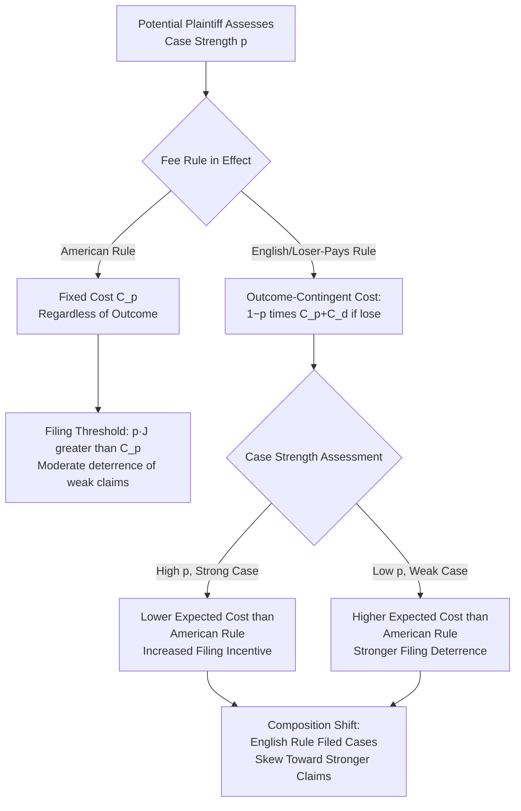

## The American Rule Versus Fee-Shifting Rules

### Overview and Conceptual Framework

The allocation of litigation costs — specifically, whether each party bears its own attorney's fees regardless of outcome (the **American Rule**) or whether the losing party must reimburse the prevailing party's fees (the **English/British Rule**, and various intermediate fee-shifting regimes) — is a central design parameter in the economics of civil procedure, because it directly alters the reservation-price parameters ($C_p$, $C_d$) governing the litigate-versus-settle bargaining framework. The foundational economic treatment is Posner's early work, substantially extended by Shavell (1982), Rowe (1984), Katz (1987), and Bebchuk and Chang, treating the fee allocation rule as a policy lever whose effects ripple through case-filing decisions, settlement rates, litigation intensity, and claim quality composition.

### The American Rule: Baseline Cost Structure

**Key Points**

Under the American Rule (the default in most U.S. jurisdictions absent a specific fee-shifting statute or contractual provision), each party bears its own litigation costs regardless of outcome. In the standard settlement-bargaining framework:

$$s_{min}^{plaintiff} = p \cdot J - C_p \qquad s_{max}^{defendant} = p \cdot J + C_d$$

Costs $C_p$ and $C_d$ are **fixed and outcome-independent** — the plaintiff pays $C_p$ whether they win or lose, and likewise for the defendant. This has two significant economic implications:

1. **Filing threshold for plaintiffs**: a rational, wealth-unconstrained plaintiff files suit only if $p \cdot J > C_p$ — the American Rule's fixed-cost structure means a plaintiff bears the full cost of litigating even a losing case, creating an independent filing-deterrence effect on low-probability claims (all else equal) relative to a regime where losing plaintiffs might have their costs covered.
2. **No stake amplification from cost-shifting**: because costs do not vary with outcome, the American Rule does not add outcome-contingent risk beyond the underlying merits risk — the total "stake" at issue in litigation is simply $J$ (the judgment amount) plus each party's own fixed litigation cost, without an additional fee-shifting risk layered on top.

### The English/British Rule: Outcome-Contingent Cost Allocation

**Key Points**

Under a pure loser-pays rule, the losing party bears both parties' litigation costs. This transforms the reservation-price calculation because costs become **outcome-contingent** rather than fixed:

$$\text{Plaintiff's expected cost of trial} = (1-p)(C_p + C_d) \qquad \text{Plaintiff's expected net value} = p \cdot J - (1-p)(C_p + C_d)$$

$$\text{Defendant's expected cost of trial} = p(C_p + C_d) \qquad \text{Defendant's expected net cost} = p \cdot J + p(C_p + C_d)$$

**Key comparative-statics implications**:

- **Amplifies the stakes of high-confidence cases**: a plaintiff who believes $p$ is high faces a *lower* expected cost under the English Rule than under the American Rule (since a likely win means the defendant, not the plaintiff, bears both parties' costs) — this creates a stronger filing incentive for plaintiffs confident in their case strength.
- **Discourages low-probability claims more severely**: conversely, a plaintiff who believes $p$ is low faces a *higher* expected cost under the English Rule than under the American Rule (since a likely loss means the plaintiff bears both parties' costs, not just their own) — the English Rule is generally predicted to more strongly deter marginal, low-probability-of-success suits than the American Rule, a frequently cited justification for loser-pays regimes as reducing "frivolous" litigation.
- **Increases variance/risk exposure for both parties**: regardless of confidence level, the English Rule adds an outcome-contingent cost-shifting risk on top of the underlying merits risk, meaning risk-averse litigants face amplified effective risk under the English Rule relative to the American Rule for any given $p$ not equal to 0 or 1 — this is a key mechanism by which the two rules can produce different settlement-rate predictions even holding $p$, $J$, and base costs constant.

### Shavell's Comparative Analysis: Ambiguous Effects on Filing and Settlement

**Key Points**

Shavell's (1982) formal comparison shows the choice between rules has **theoretically ambiguous net effects** on total litigation volume and settlement rates, because the two mechanisms identified above pull in different directions across the distribution of case types:

- **Composition effect on filings**: the English Rule discourages low-$p$ (weak) claims disproportionately while encouraging high-$p$ (strong) claims disproportionately relative to the American Rule, meaning the *composition* of filed cases shifts toward stronger claims under English Rule, but the *net change in total filing volume* depends on the relative population sizes of weak versus strong potential claims and is not determinate from theory alone.
- **Settlement-range effects**: because the English Rule amplifies the stakes of litigation (adding outcome-contingent cost risk), it can either widen or narrow the settlement bargaining range depending on the parties' relative risk aversion and their relative confidence levels — if both parties are highly confident in *opposite* outcomes (mutual optimism), the English Rule's stake amplification can widen the gap between reservation prices and *reduce* settlement likelihood, while if parties share similar beliefs, the amplified joint cost-savings-from-settling can *increase* settlement likelihood.

**[Inference]** This theoretical ambiguity is a primary reason cross-jurisdictional empirical comparisons between American Rule and English Rule jurisdictions (e.g., U.S. versus U.K. or continental European systems) have not produced a clear, uncontested consensus on which rule produces lower aggregate litigation costs or higher settlement rates, since observed differences are confounded by numerous other procedural, substantive, and institutional differences between jurisdictions beyond the fee-shifting rule itself.

### Diagram: Fee-Shifting Rule Effect on Filing Incentives by Case Strength

### Intermediate Fee-Shifting Regimes

**Key Points**

Most real-world systems deploy intermediate mechanisms rather than pure American or English rules, each with distinct economic properties:

- **One-way fee-shifting statutes**: many U.S. civil rights, consumer protection, and employment statutes (e.g., Title VII, the ADA, various state consumer protection acts) allow a **prevailing plaintiff** to recover fees from the defendant, but do not require a losing plaintiff to pay the defendant's fees. Economically, this asymmetric structure is designed to encourage "**private attorney general**" enforcement of statutes serving broader public interests (deterring discrimination, unsafe products, etc.) by removing the fee-shifting *downside* risk for plaintiffs while preserving an *upside* incentive (fee recovery if successful) that can make marginal or modest-damages claims economically viable for plaintiffs' attorneys who might otherwise decline representation given low expected direct damages recovery alone.
- **Offer-of-judgment rules** (e.g., U.S. Federal Rule of Civil Procedure 68): a hybrid, contingent fee-shifting mechanism that only activates cost-shifting consequences if a party rejects a formal settlement offer and subsequently fails to do better at trial than the rejected offer — this targets fee-shifting specifically at the *marginal* bargaining decision (accept or reject a specific offer) rather than applying blanket outcome-based shifting to the entire case, a design intended to more precisely target the screening/settlement-inducement goal discussed in the asymmetric-information settlement literature without imposing the full stake-amplification effects of a pure loser-pays regime on the initial filing decision.
- **Statutory fee caps and multipliers**: some fee-shifting statutes incorporate multipliers (enhancing recoverable fees beyond actual cost, particularly in public-interest litigation) or caps (limiting maximum recoverable fees), each altering the effective magnitude of the fee-shifting incentive independent of the underlying binary win/lose fee allocation rule.
- **Contractual fee-shifting provisions**: in commercial contracts, parties frequently specify ex ante (before any dispute arises) that the prevailing party in any future contract dispute will recover attorney's fees — this represents a private ordering solution allowing sophisticated contracting parties to select their preferred fee allocation rule directly, and **[Inference]** the prevalence of such clauses in negotiated commercial contracts (as opposed to their near-absence in, say, ordinary tort contexts where no ex ante contractual relationship exists) suggests that at least some commercial contracting parties view loser-pays-style provisions as efficiency-enhancing for their specific transactional context, though this preference need not generalize to all dispute types given the differing case-strength distributions and risk-aversion profiles present in commercial contract disputes versus other litigation categories.

### Comparative Table: Fee-Shifting Regime Effects

| Regime | Effect on Weak Plaintiff Claims | Effect on Strong Plaintiff Claims | Risk Exposure Added | Primary Policy Rationale |
| --- | --- | --- | --- | --- |
| American Rule | Moderate deterrence (fixed cost still a filing barrier) | Moderate encouragement (no fee-shifting upside, but no downside risk either) | None beyond merits risk | Predictability; avoids amplifying litigation stakes |
| Pure English Rule (loser-pays both ways) | Strong deterrence (added downside risk of paying both sides' costs) | Strong encouragement (potential to litigate at reduced net expected cost) | Significant (outcome-contingent cost risk layered on merits risk) | Reduce frivolous/weak litigation; align cost-bearing with fault for bringing/defending losing positions |
| One-way fee-shifting (pro-plaintiff statutory) | Encouraged for statutorily favored claim types (civil rights, consumer protection) despite modest direct damages | Strongly encouraged (fee recovery upside with no downside risk) | Asymmetric — defendant bears added risk, plaintiff does not | Private attorney general enforcement of public-interest statutes |
| Offer-of-judgment (FRCP 68-style) | Deters rejection of reasonable settlement offers specifically | Limited direct effect (targets bargaining stage, not filing stage) | Contingent and offer-specific, not case-wide | Screen out inefficient offer-rejection; encourage settlement at bargaining margin |
| Contractual fee-shifting | Deterrence effect set by contracting parties ex ante | Encouragement effect set by contracting parties ex ante | As negotiated | Private ordering; sophisticated parties select preferred allocation |

### Fee-Shifting and Attorney Financing: The Contingency Fee Interaction

**Key Points**

Fee-shifting rules interact significantly with contingency-fee arrangements (common in U.S. plaintiff-side personal injury and civil rights practice), because contingency fees already partially insulate the plaintiff personally from the fixed-cost filing threshold under the American Rule — the plaintiff's attorney, not the plaintiff directly, bears much of the effective litigation cost risk in exchange for a percentage of any recovery.

**[Inference]** This interaction means that fee-shifting rules' theoretical filing-deterrence effects (as modeled in the Shavell framework above, which generally assumes the plaintiff directly bears $C_p$) may operate somewhat differently in contingency-fee-dominated practice areas, since the *attorney's* risk-adjusted expected-value calculation (across a portfolio of cases, allowing for risk diversification unavailable to an individual one-shot plaintiff) becomes the operative filing-decision framework rather than a single risk-averse plaintiff's direct cost-bearing calculation — a distinction that matters significantly for predicting fee-shifting rule effects in practice areas where contingency fee arrangements are prevalent (personal injury, employment) versus those where they are not (most commercial litigation, where hourly-fee arrangements with the plaintiff directly bearing cost risk remain standard).

### Illustrative Example

**Example**

Consider a potential plaintiff evaluating a claim with $J = \$200{,}000$ in potential damages, $C_p = C_d = \$40{,}000$ (symmetric litigation costs), assessing their own win probability as $p = 0.3$ (a genuinely weak claim).

**Under the American Rule**: expected net value of filing $= 0.3 \times 200{,}000 - 40{,}000 = \$20{,}000$ — the claim clears the filing threshold and would be filed, though it is a fairly weak claim in absolute probability terms.

**Under the English Rule**: expected net value of filing $= 0.3 \times 200{,}000 - 0.7 \times (40{,}000 + 40{,}000) = 60{,}000 - 56{,}000 = \$4{,}000$ — the claim still clears the (now much lower) filing threshold, but the margin has shrunk dramatically due to the added downside risk of paying both parties' costs in the 70% probability scenario where the plaintiff loses.

If the same plaintiff instead assessed $p = 0.2$ (a weaker claim still): American Rule expected value $= 0.2 \times 200{,}000 - 40{,}000 = \$0$ (marginal, borderline filing decision), while English Rule expected value $= 0.2 \times 200{,}000 - 0.8 \times 80{,}000 = 40{,}000 - 64{,}000 = -\$24{,}000$ — under the English Rule this claim would **not** be filed, while under the American Rule it sits exactly at the marginal filing threshold. This demonstrates concretely how the English Rule's outcome-contingent cost structure produces a **more steeply case-strength-sensitive filing threshold** than the American Rule's fixed-cost structure, consistent with the general prediction that loser-pays regimes disproportionately deter weaker claims.

### Empirical Considerations and Policy Debate

**[Unverified]** Empirical research comparing litigation rates, settlement rates, and case-outcome distributions across American Rule and various fee-shifting jurisdictions has produced mixed and context-dependent findings; effects appear to vary substantially by practice area (e.g., fee-shifting effects in employment discrimination litigation versus general commercial litigation), and isolating the fee-rule's causal effect from other confounding differences between comparison jurisdictions remains a significant empirical challenge, meaning strong general claims about which regime is unambiguously superior on efficiency grounds should be treated with caution.

**[Inference]** A recurring theme in the policy debate is that the American Rule's primary advantage — avoiding the stake-amplification and risk-exposure effects of outcome-contingent fee-shifting — may be particularly valuable in access-to-justice terms for individual, risk-averse plaintiffs bringing claims against better-resourced, more risk-tolerant institutional defendants (a common asymmetry in consumer, employment, and civil rights litigation), which helps explain the prevalence of one-way, pro-plaintiff fee-shifting statutes (preserving the American Rule's protection against plaintiff-side downside risk while adding a plaintiff-side upside incentive) as a middle path between pure American and pure English rules in precisely those practice areas where access-to-justice concerns are most salient.

### Conclusion

The choice between the American Rule and fee-shifting alternatives is a direct policy lever operating on the $C_p$ and $C_d$ parameters of the basic settlement-bargaining model, with the critical distinction being whether costs are fixed (American Rule) or outcome-contingent (English Rule and its variants). Outcome-contingent fee-shifting amplifies the stakes of litigation in a case-strength-dependent way — encouraging confident plaintiffs to litigate more aggressively while more strongly deterring weak claims — but the net theoretical effect on aggregate filing rates, settlement rates, and litigation composition is ambiguous and empirically contested, since the rule's effects vary with the underlying distribution of case strength, party risk aversion, and belief structure across different litigation contexts. Real-world systems have largely converged on intermediate solutions — one-way statutory fee-shifting, offer-of-judgment rules, and negotiated contractual fee provisions — that attempt to capture fee-shifting's screening and litigation-quality benefits in targeted contexts (public-interest enforcement, specific bargaining-stage decisions, sophisticated commercial contracting) while avoiding the broad stake-amplification and access-to-justice concerns associated with a blanket loser-pays regime.

**Related Topics / Next Steps**

- The decision to litigate versus settle (baseline reservation-price bargaining model)
- Asymmetric information and settlement bargaining (interaction with fee-shifting screening effects)
- Contingency fee arrangements and litigation finance economics
- Class action fee awards and the economics of aggregate litigation financing
- Private attorney general statutes and public-interest litigation incentive design
- Comparative civil procedure: cost allocation rules across common law and civil law jurisdictions
- Frivolous litigation deterrence mechanisms (Rule 11 sanctions, anti-SLAPP statutes)
- Access to justice economics and litigation cost barriers for individual claimants
- Offer-of-judgment rules and their empirical effectiveness in inducing settlement
- Risk aversion and expected utility theory applied to litigation financing decisions