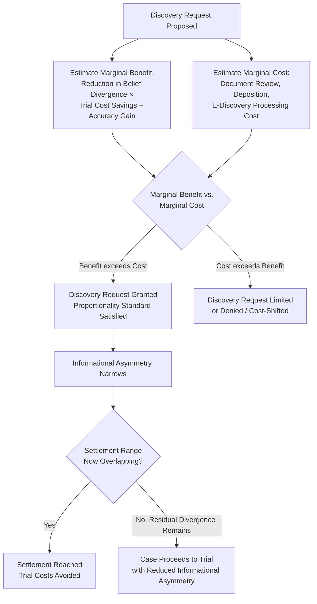

## Discovery Rules and Their Economic Function

### Overview and Conceptual Framework

Discovery — the pretrial process by which parties exchange information, documents, and testimony bearing on the merits of a dispute — occupies a distinctive position in the economics of civil procedure: it is simultaneously the primary institutional mechanism for reducing the informational asymmetry that drives litigation failure (as established in the asymmetric-information settlement literature) and a substantial, independently significant litigation cost in its own right. The economic analysis of discovery, developed principally by Cooter and Rubinfeld (1994), Hay (1994), Shavell (1989), and subsequent work on cost-shifting and proportionality, treats discovery scope and cost-allocation rules as instruments for optimizing the trade-off between **information-revelation benefits** (narrower belief divergence, higher settlement rates, more accurate trial outcomes when trial does occur) and **discovery's own administrative cost**, which in complex litigation frequently constitutes the single largest component of total litigation expense.

### Discovery's Core Economic Function: Reducing Informational Asymmetry

**Key Points**

As established in the settlement-bargaining framework, trial occurs when parties' beliefs about $p$ (probability of prevailing) and $J$ (judgment value) diverge sufficiently that no overlapping settlement range exists — whether due to differential private information (Bebchuk-style asymmetric information) or simple mistaken/differing estimates (Priest-Klein divergent expectations). Discovery directly targets both mechanisms by **transferring information from the party that possesses it to the party that does not**, narrowing the estimation gap:

$$|\hat{p}_{plaintiff} - \hat{p}_{defendant}| \; \text{decreases as discovery-revealed information} \; I \; \text{increases}$$

To the extent this narrowing is sufficient to restore an overlapping settlement range, discovery converts what would otherwise be a trial-bound case into a settled one — capturing the joint litigation-cost savings $(C_p + C_d)$ that trial would have consumed. This is discovery's primary claimed efficiency benefit: it is a cost incurred specifically to **avoid the larger cost of trial** by resolving the informational conditions that make trial necessary.

### The Discovery Cost Problem: A Cost Incurred to Avoid a Cost

**Key Points**

Discovery itself, however, is not costless — document review, deposition preparation and conduct, interrogatory responses, and (increasingly) electronic discovery (e-discovery) processing of large digital datasets can consume substantial resources, sometimes exceeding the cost of trial itself in complex commercial litigation. This generates a **recursive optimization problem**: parties (and courts, via proportionality rules) must determine the discovery scope that itself maximizes net social value, which requires comparing:

$$\text{Marginal value of additional discovery} = \Delta(\text{settlement probability}) \times (C_p + C_d) + \Delta(\text{trial accuracy}) \times \Delta L_{error}$$

against:

$$\text{Marginal cost of additional discovery} = C_{discovery}'(\text{scope})$$

Discovery scope is efficiently expanded only up to the point where these marginal quantities are equal — beyond that point, additional discovery costs more than the settlement-facilitation and accuracy benefits it generates, meaning **full discovery (complete elimination of informational asymmetry) is generally not the efficient outcome**, even though full discovery would in principle maximize settlement probability and trial accuracy in isolation.

**[Inference]** This recursive cost-benefit structure is the core economic justification for proportionality-based discovery limitation rules (such as the explicit "proportionality" standard incorporated into U.S. Federal Rule of Civil Procedure 26(b)(1)), which direct courts to weigh the importance of the discovery sought against its burden and expense relative to the amount in controversy — a direct doctrinal instantiation of the marginal-cost-equals-marginal-benefit principle rather than a purely intuitive fairness consideration.

### Diagram: The Optimal Discovery Scope Framework

### Discovery Asymmetry and Strategic Discovery Behavior

**Key Points**

A significant complication for the simple "discovery reduces asymmetry, therefore increases settlement" model is that discovery is not a neutral, symmetric information-transfer process — it is conducted by adversarial parties with strategic incentives that can distort its information-revelation function:

1. **Asymmetric discovery burden by party type**: in many litigation categories (products liability, employment discrimination, antitrust), one party (typically the institutional defendant) holds substantially more of the case-relevant information (internal records, communications, technical data) than the other, meaning discovery costs and benefits are not symmetrically distributed — the party with less private information to disclose bears correspondingly lower discovery-response costs while potentially capturing most of the informational benefit, creating a structural cost-benefit asymmetry between plaintiff-side and defendant-side discovery burdens.
2. **Discovery as a cost-imposition strategy ("discovery abuse")**: because discovery costs are real and can be substantial, a party (typically better-resourced) may propound expansive discovery requests not primarily to obtain case-relevant information but to impose litigation cost pressure on a resource-constrained opposing party, potentially inducing settlement on terms reflecting discovery-cost avoidance rather than the underlying merits — this is the economic mechanism underlying "discovery abuse" concerns and is a primary justification for cost-shifting sanctions and proportionality limits functioning as a check on strategic over-requesting.
3. **Strategic non-disclosure and privilege assertions**: parties retain incentives to withhold discoverable information where permitted (attorney work-product protections, privilege claims, or simply incomplete good-faith compliance with disclosure obligations), meaning actual achieved informational symmetry from discovery is generally less than the theoretical maximum achievable under the formal discovery rules, and the gap between formal discovery entitlement and actual information transfer is itself a function of enforcement intensity (sanctions for discovery misconduct, judicial oversight of compliance) which carries its own administrative cost.

**[Inference]** These strategic dynamics mean the simple monotonic prediction — "more discovery always increases settlement rates by reducing asymmetry" — requires qualification: discovery rules must be evaluated not only for their information-transfer potential in a cooperative, good-faith compliance scenario, but for their vulnerability to strategic manipulation, which is why discovery rule design (proportionality limits, cost-shifting for disproportionate requests, sanctions for non-compliance) addresses both the information-transfer function and the strategic-cost-imposition risk simultaneously.

### Cost-Shifting Rules for Discovery

**Key Points**

The default rule in most jurisdictions (including U.S. federal practice) is that each party bears its own discovery compliance costs (a "producer pays" default consistent with the general American Rule orientation), but courts retain authority to shift discovery costs to the requesting party in specific circumstances, particularly for disproportionately burdensome requests (a doctrine substantially developed around electronic discovery cost allocation, following influential frameworks like the *Zubulake* line of decisions in U.S. federal practice).

**Economic rationale for cost-shifting authority**:

- Under a pure "producer pays" default, the requesting party's marginal cost of propounding an additional discovery request approaches zero (beyond their own attorney time drafting the request), while the marginal cost of complying falls entirely on the producing party — this asymmetry creates a structural incentive for the requesting party to over-request relative to the socially efficient discovery scope, since they do not internalize the compliance cost their request imposes.
- Cost-shifting (requiring the requesting party to bear some or all of the compliance cost for particularly burdensome requests) partially internalizes this externality, restoring the requesting party's incentive to calibrate requests toward genuine informational need rather than costless-to-them cost-imposition on the opposing party.
- **[Inference]** The empirical calibration of *when* cost-shifting should apply (e.g., factors used in the *Zubulake*-style multi-factor tests balancing accessibility of the requested information, cost, and the requesting party's need) reflects an attempt to approximate the marginal-cost-equals-marginal-benefit threshold discussed above without requiring a full formal cost-benefit calculation in every discovery dispute, though the accuracy of these judicially-administered proxy tests in tracking the theoretically efficient discovery scope is difficult to verify empirically given the absence of a directly observable "efficient" benchmark against which to measure actual outcomes.

### Electronic Discovery: Scale Effects on the Cost-Benefit Calculus

**[Unverified]** The dramatic increase in the volume of potentially discoverable electronic information (emails, messaging platforms, cloud-stored documents, metadata) over recent decades has substantially shifted the practical cost side of the discovery cost-benefit equation in ways the classical discovery-economics literature (developed primarily around paper-document-era discovery costs) did not originally anticipate, though the underlying marginal-cost-equals-marginal-benefit framework remains the operative analytical structure even as the specific cost magnitudes and technologies involved (predictive coding, technology-assisted review, and other e-discovery cost-reduction tools) have evolved substantially. Whether technology-assisted review tools have shifted the efficient discovery-scope equilibrium meaningfully closer to full informational symmetry (by reducing the marginal cost of processing large document volumes) or have simply enabled proportionally larger discovery requests that preserve a similar cost-benefit balance at a higher absolute volume is not a settled empirical question.

### Comparative Table: Discovery Rule Design and Economic Function

| Design Feature | Economic Function | Risk Addressed |
| --- | --- | --- |
| Proportionality standard (burden vs. amount in controversy) | Approximates marginal-cost-equals-marginal-benefit threshold | Prevents disproportionate discovery cost relative to case stakes |
| Producer-pays default | Preserves basic cost-bearing simplicity, avoids litigating cost allocation in every case | Baseline predictability; may create over-requesting incentive absent cost-shifting backstop |
| Cost-shifting for burdensome requests | Internalizes the compliance-cost externality onto the requesting party | Discourages strategic over-requesting / discovery-cost-imposition tactics |
| Mandatory initial disclosures | Reduces baseline informational asymmetry without requiring adversarial requests | Lowers the transaction cost of obtaining basic case information |
| Privilege and work-product protections | Preserves incentive for candid attorney-client communication and case preparation | Balances information-transfer goal against distinct incentive-preservation goal (candid legal advice-seeking) |
| Sanctions for discovery misconduct/spoliation | Deters strategic non-disclosure and evidence destruction | Maintains the credibility of the discovery process as an actual information-transfer mechanism |

### Illustrative Example

**Example**

Consider a products liability suit where the plaintiff alleges a design defect. The defendant manufacturer holds extensive internal engineering records, prior incident reports, and design-review communications — information highly relevant to establishing whether the defendant knew or should have known of the alleged defect — while the plaintiff holds comparatively little private information beyond their own injury circumstances.

- **Without meaningful discovery**: the plaintiff's estimate of $p$ (probability of establishing defect and knowledge) may be based on limited public information (product recall history, similar litigation outcomes), while the defendant possesses much more precise private knowledge of its own internal records. This asymmetry can produce either a Bebchuk-style pooling settlement offer from the defendant (reflecting the *average* case in the relevant claim population rather than this specific claim's true strength) or, if the plaintiff's attorney has litigated similar cases and holds reasonably calibrated priors, a Priest-Klein-style divergent-belief standoff.
- **With targeted discovery**: production of internal design-review documents and depositions of engineering personnel substantially narrows this asymmetry, moving the plaintiff's estimate of $p$ toward the defendant's true private assessment (whichever direction that shifts it). If document review reveals no evidence of known defect risk, plaintiff's estimate of $p$ may fall, potentially enabling settlement at a lower value that both sides now agree reflects the actual weak evidentiary picture. If document review instead reveals internal warnings about the defect that were not acted upon, plaintiff's estimate of $p$ rises substantially, potentially producing a settlement at a value much closer to full expected trial value, since the defendant's incentive to concede is now grounded in a genuinely accurate shared assessment of unfavorable internal evidence.
- **Discovery cost consideration**: if the request encompasses years of unrelated engineering records well beyond the specific product line at issue, a court applying proportionality analysis would likely limit the request's scope, reasoning that the marginal informational value of records unrelated to the specific alleged defect is low relative to the substantial review and production cost of comprehensive engineering-archive discovery — illustrating the proportionality standard's operation in practice.

### Discovery Timing and the Sequencing of Cost Accumulation

**Key Points**

As discussed in the general litigate-versus-settle framework, discovery cost accumulation interacts with settlement timing: settlements clustering after discovery but before trial reflect the point at which informational asymmetry has been substantially resolved but the *remaining* marginal trial cost (as distinct from already-sunk discovery cost) becomes the operative comparison. This has motivated procedural innovations aimed at **front-loading the highest-value, lowest-cost discovery** while deferring more expensive discovery until its marginal value has been demonstrated:

- **Bifurcated or phased discovery**: courts increasingly permit an initial phase focused on low-cost, high-value information (e.g., core liability documents) before authorizing more extensive and costly discovery (e.g., full damages-related financial discovery), allowing parties to test for settlement viability after the cheaper phase before committing to the more expensive phase — directly implementing the marginal-cost-sequencing logic in procedural design.
- **[Inference]** This sequencing approach is consistent with the broader principle that the *most valuable* discovery (in terms of belief-divergence reduction per dollar of discovery cost) should generally be conducted first, since early resolution of high-value informational gaps captures the largest share of potential early-settlement cost savings, while lower-value, higher-cost discovery should only proceed if the case survives past the point where cheaper discovery alone would have been sufficient to enable settlement.

### Conclusion

Discovery rules occupy a distinctive dual role in the economics of civil procedure: they are the primary mechanism for resolving the informational asymmetry that causes litigation to proceed to costly trial rather than efficient settlement, while simultaneously constituting a substantial, independently significant cost that must itself be subjected to marginal cost-benefit analysis rather than expanded without limit. Proportionality standards, cost-shifting rules for burdensome requests, and phased-discovery sequencing each represent institutional attempts to approximate the theoretically efficient discovery scope — the point at which the marginal settlement-facilitation and accuracy benefit of additional discovery equals its marginal administrative cost — while guarding against strategic manipulation of the discovery process itself, whether through cost-imposition-driven over-requesting or strategic non-disclosure that undermines discovery's core information-transfer function. The dramatic scale increase associated with electronic discovery has intensified rather than altered this basic analytical structure, raising the practical stakes of getting discovery-scope calibration right without changing the fundamental economic logic governing its design.

**Related Topics / Next Steps**

- Asymmetric information and settlement bargaining (discovery's role in narrowing belief divergence)
- The decision to litigate versus settle (baseline framework discovery interventions target)
- Priest-Klein selection model and empirical trial win-rate predictions
- Electronic discovery (e-discovery) technology and cost-reduction tools (predictive coding, technology-assisted review)
- Proportionality standards in comparative civil procedure
- Discovery sanctions, spoliation doctrine, and strategic non-compliance deterrence
- Attorney-client privilege and work-product doctrine: economic rationale for information-transfer exceptions
- Class actions and aggregate litigation economics (discovery cost dynamics in complex multi-party litigation)
- The American Rule versus fee-shifting rules (interaction with discovery cost allocation)
- Access to justice and discovery cost barriers for resource-constrained litigants