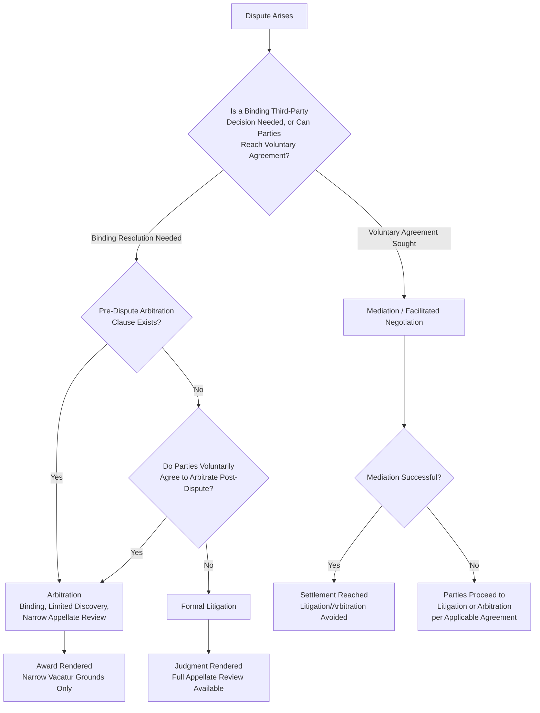

## Alternative Dispute Resolution Mechanisms

### Overview and Conceptual Framework

Alternative dispute resolution (ADR) — mediation, arbitration, negotiation-facilitation processes, and hybrid mechanisms (med-arb, early neutral evaluation) — represents an institutional substitute for formal court litigation, and its economic analysis extends the same reservation-price bargaining and information-asymmetry frameworks developed for the litigate-versus-settle decision into a setting where a **third-party neutral** is introduced to facilitate or impose resolution. The foundational law-and-economics treatment draws on Mnookin and Kornhauser's (1979) "bargaining in the shadow of the law" framework, extended by Shavell (1995) on the choice between mediation and litigation, and by the broader arbitration-economics literature (e.g., work on mandatory arbitration clauses and their welfare effects). The central economic question ADR mechanisms address: **can a lower-cost, third-party-facilitated process capture some or all of the same dispute-resolution value as formal litigation, at lower administrative cost, and if so, under what conditions?**

### Mediation: Facilitated Bargaining Without Binding Authority

**Key Points**

Mediation introduces a neutral third party whose role is to facilitate communication and bargaining between disputants **without the power to impose a binding outcome** — the mediator's function is purely to help the parties reach their own negotiated settlement, operating within the same reservation-price framework as ordinary settlement bargaining but with an added information-transfer and communication-facilitation mechanism.

Mediation's core economic value proposition operates through several distinct channels:

1. **Reducing strategic information withholding**: in the Bebchuk-style asymmetric-information framework, direct bilateral bargaining can fail because credible information transfer is difficult absent a costly signal like trial. A mediator, meeting privately with each party (caucusing), can sometimes extract and selectively convey information that facilitates settlement without either party having to publicly reveal it to their adversary in a way that could be exploited — the mediator functions as a **trusted information intermediary** reducing the strategic cost of communication that exists in direct bilateral bargaining.
2. **De-escalating mutual optimism**: to the extent trial-bound cases result from behavioral overconfidence (mutual optimism) rather than genuine private information, a skilled mediator can employ "reality-testing" techniques — presenting each party with an independent, non-adversarial assessment of their case's weaknesses — that may correct overconfident self-assessments more effectively than the adversarial posture of direct settlement negotiation, where each side has an incentive to project confidence rather than genuinely reconsider their position.
3. **Reducing negotiation transaction costs**: mediators can structure and pace negotiation sessions, propose compromise frameworks, and manage the psychological/relational dynamics of dispute resolution (particularly valuable in disputes involving ongoing relationships — commercial partners, family members, employer-employee relationships) in ways that reduce the transaction costs of reaching agreement relative to unstructured direct negotiation.

**[Inference]** Because mediation does not bind the parties (either party can walk away and proceed to litigation if mediation fails), its expected value to a rational party is bounded below by their litigation reservation price — a party should never accept a mediated settlement worse than their own $s_{min}$ or $s_{max}$ as calculated in the standard bargaining framework, meaning mediation's economic contribution is best understood as **improving the probability of finding and reaching an existing settlement range**, rather than fundamentally altering the underlying reservation prices themselves.

### Arbitration: Binding Third-Party Resolution

**Key Points**

Arbitration differs fundamentally from mediation in that the arbitrator (or arbitration panel) has authority to impose a **binding decision** on the parties, functioning economically as a privatized substitute for judicial adjudication rather than a facilitated-bargaining supplement to it. This shifts the economic analysis toward comparing arbitration's cost and accuracy properties directly against formal litigation, rather than treating it as a settlement-facilitation mechanism.

**Key comparative economic properties of arbitration versus litigation**:

- **Lower administrative cost**: arbitration typically involves streamlined procedures (limited or no formal discovery, relaxed evidentiary rules, compressed timelines, no extended appellate review), generally producing substantially lower per-case administrative cost than full litigation — this cost reduction is arbitration's primary claimed efficiency advantage.
- **Reduced discovery-driven information transfer**: because arbitration typically limits discovery relative to litigation, it captures less of discovery's informational-asymmetry-reduction benefit (as discussed in the discovery-economics framework) — meaning disputes resolved via arbitration may proceed to a binding decision with less informational symmetry between the parties than would have been achieved through full litigation discovery, a trade-off between cost savings and decision accuracy.
- **Selection of decision-maker expertise**: parties (or their pre-dispute contract) typically select an arbitrator with specific subject-matter expertise (e.g., construction arbitration panels with engineering backgrounds, commercial arbitration panels with industry-specific experience), potentially improving decision accuracy on technical questions relative to a generalist judge or lay jury, at least in principle.
- **Limited appellate review**: arbitration awards are generally subject to only narrow grounds for judicial vacatur (rather than full appellate review on the merits), reducing the total system-wide cost of the dispute (no extended appeals process) but also reducing the error-correction function that appellate review provides in the litigation system — a direct trade-off between cost savings and the error-cost-reduction value of multi-tier review.

### Diagram: ADR Mechanism Selection Framework

### Mandatory Pre-Dispute Arbitration Clauses: A Distinct Economic Category

**Key Points**

A significant portion of real-world arbitration arises not from post-dispute voluntary agreement but from **pre-dispute mandatory arbitration clauses** embedded in contracts of adhesion (consumer contracts, employment agreements, terms of service) — a category raising economic considerations distinct from voluntarily-negotiated commercial arbitration between sophisticated parties of comparable bargaining power.

**Key economic considerations specific to mandatory pre-dispute clauses**:

1. **Ex ante versus ex post selection**: because the arbitration clause is agreed to before any dispute exists (and typically before either party knows whether they will be a repeat player, like the drafting firm, or a one-shot claimant, like the individual consumer or employee), the clause reflects the drafting party's ex ante assessment of which forum will be more favorable **on average across the full population of future disputes**, not a case-specific assessment — this is economically distinct from post-dispute arbitration agreements, where both parties can assess the *specific* dispute's characteristics before choosing the forum.
2. **Repeat-player advantage**: firms that repeatedly arbitrate similar disputes (e.g., employers facing recurring employment arbitration, financial institutions facing recurring consumer arbitration) may develop informational and relational advantages with arbitration providers and arbitrators relative to one-shot individual claimants — a potential source of systematic outcome asymmetry not present (or present to a lesser degree) in the ordinary judicial system, where judges are randomly assigned and lack an ongoing relationship with either party across cases.
3. **Class-action waiver interaction**: mandatory arbitration clauses frequently incorporate class-action waivers, requiring individual arbitration of claims that might otherwise be aggregated into a class action — given the rational-apathy dynamics discussed in the class-action-economics framework, this interaction can effectively eliminate the aggregation mechanism that makes small, diffuse claims economically viable to pursue at all, since individual arbitration of a small claim faces the same negative-expected-value problem as individual litigation of a small claim.

**[Inference]** These considerations mean the welfare effects of mandatory pre-dispute arbitration clauses are theoretically ambiguous and depend heavily on empirical questions — whether repeat-player advantages are economically significant in practice, whether arbitration's cost savings are passed through to consumers/employees in the form of lower prices or improved terms elsewhere in the contract, and whether the elimination of class-aggregation access for small claims is offset by arbitration's lower individual-claim litigation cost — making this a genuinely contested area of law-and-economics policy debate rather than one with a clear efficiency-based resolution favoring either strict enforcement or restriction of such clauses.

### Comparative Table: Mediation, Arbitration, and Litigation

| Dimension | Mediation | Arbitration | Litigation |
| --- | --- | --- | --- |
| Binding authority | None — parties must voluntarily agree | Binding, narrow judicial review | Binding, full appellate review available |
| Administrative cost | Low (facilitator fee, limited process) | Moderate (streamlined but still substantive process) | Highest (full discovery, motion practice, trial, appeals) |
| Discovery/information transfer | Minimal, informal only | Limited, party-controlled | Extensive, court-supervised |
| Decision-maker selection | Parties jointly select facilitator | Parties/contract select arbitrator, often with subject expertise | Randomly assigned judge/jury |
| Error-correction mechanism | N/A (no binding decision to correct) | Narrow vacatur grounds only | Full appellate review |
| Precedential value | None | Generally none (private, often confidential) | Creates binding or persuasive precedent |
| Class aggregation compatibility | Compatible in principle | Often limited/waived in mandatory consumer/employment clauses | Fully compatible (Rule 23-style mechanisms) |

### Early Neutral Evaluation and Hybrid Mechanisms

**Key Points**

**Early neutral evaluation (ENE)** — a process in which a neutral expert provides a non-binding assessment of likely case outcomes early in the dispute, without the full facilitation role of mediation or the binding authority of arbitration — targets specifically the divergent-expectations mechanism of settlement failure (Priest-Klein) by providing both parties a common, credible, non-adversarial estimate of $p$ and $J$ early in the process, before substantial discovery or litigation costs are sunk.

**[Inference]** ENE's distinct economic value proposition, relative to mediation or arbitration, is its specific targeting of the *belief-divergence* channel of settlement failure at minimal cost and at the earliest possible stage — since it does not require the extensive discovery that would otherwise be needed to narrow information asymmetry, nor does it impose a binding outcome that forecloses the parties' own bargaining, it is theoretically well-suited to the specific case type where trial-bound disputes result primarily from correctable mutual overconfidence or informational gaps that a credible neutral assessment can efficiently close, though it may be less effective where settlement failure stems from genuine two-sided private information that a neutral's outside assessment (based on the same limited information available pre-discovery) cannot resolve.

**Med-arb** (mediation followed by binding arbitration if mediation fails, often using the same neutral in both roles) attempts to capture mediation's low-cost facilitation benefit while providing a backstop binding-resolution mechanism if voluntary settlement is not reached, though **[Inference]** the dual-role design raises a potential incentive concern: parties may behave more guardedly during the mediation phase if they know the same neutral could subsequently render a binding decision based partly on information or positions revealed during mediation caucusing, potentially undermining the candid-communication benefit that separate mediator and arbitrator roles would otherwise preserve.

### Illustrative Example

**Example**

Consider a commercial dispute between a supplier and a manufacturer over an alleged breach of a long-term supply contract, where the parties have an ongoing business relationship they wish to preserve, and where damages calculation involves complex accounting questions but the underlying contractual interpretation question is relatively narrow.

- **Litigation path**: full discovery (including extensive financial records production), formal briefing on contract interpretation, potential jury trial on damages — likely producing a high administrative cost given the accounting-heavy inquiry, plus reputational and relationship strain from the adversarial public process.
- **Mediation path**: a mediator with commercial contract experience facilitates direct discussion of both the interpretation dispute and the ongoing relationship value, potentially reaching a settlement that addresses not only the specific damages claim but also renegotiates forward-looking contract terms — capturing value (relationship preservation) that a binding litigation or arbitration outcome, focused narrowly on backward-looking damages for the specific breach, would not address.
- **Arbitration path**: if mediation fails or the parties prefer a faster, binding resolution focused specifically on the contract-interpretation and damages questions, arbitration before a commercial-contracts-experienced arbitrator could resolve the dispute at lower cost and with greater subject-matter expertise than a generalist court, though at the cost of reduced discovery (potentially leaving some information asymmetry about the disputed accounting questions unresolved) and no meaningful appellate check on the arbitrator's damages calculation if either party believes it contains a significant error.

This example illustrates why real-world dispute-resolution-clause drafting for ongoing commercial relationships frequently specifies **tiered dispute resolution** (mandatory mediation, followed by arbitration only if mediation fails) — an institutional design directly reflecting the economic logic that mediation's low-cost, relationship-preserving, voluntary-agreement properties should be exhausted before resorting to a more costly binding mechanism.

### Conclusion

Alternative dispute resolution mechanisms extend the reservation-price bargaining and informational-asymmetry frameworks developed for ordinary settlement negotiation by introducing a third-party neutral whose role varies from purely facilitative (mediation, early neutral evaluation) to fully binding (arbitration). Mediation's economic value lies primarily in improving the probability that an existing settlement range is found and reached — through information-intermediation and overconfidence-correction functions — without altering the underlying reservation prices themselves. Arbitration functions as a genuine substitute for litigation, trading reduced discovery and appellate-review cost against reduced informational symmetry and diminished error-correction capacity. The welfare analysis of these mechanisms is generally favorable when adopted through genuine ex post or symmetric ex ante agreement between comparable-bargaining-power parties, but becomes considerably more contested — particularly regarding mandatory pre-dispute arbitration clauses in consumer and employment contracts — where repeat-player advantages, class-action-waiver interactions with the rational-apathy problem, and asymmetric ex ante bargaining power raise genuine questions about whether the cost savings ADR mechanisms generate are captured broadly or concentrated disproportionately in favor of the drafting party.

**Related Topics / Next Steps**

- The decision to litigate versus settle (baseline reservation-price framework underlying ADR economics)
- Asymmetric information and settlement bargaining (mediation's information-intermediation function)
- Discovery rules and their economic function (arbitration's reduced discovery trade-off)
- Class actions and aggregate litigation economics (class-action-waiver interaction with mandatory arbitration)
- Mandatory arbitration clauses in consumer and employment contracts: policy debate and empirical evidence
- Repeat-player theory in dispute resolution (Galanter's "why the haves come out ahead")
- Behavioral law and economics: overconfidence correction in mediation practice
- Comparative dispute resolution systems: international commercial arbitration frameworks
- Contract drafting economics: tiered dispute resolution clause design
- Judicial review standards for arbitration awards (Federal Arbitration Act vacatur grounds)