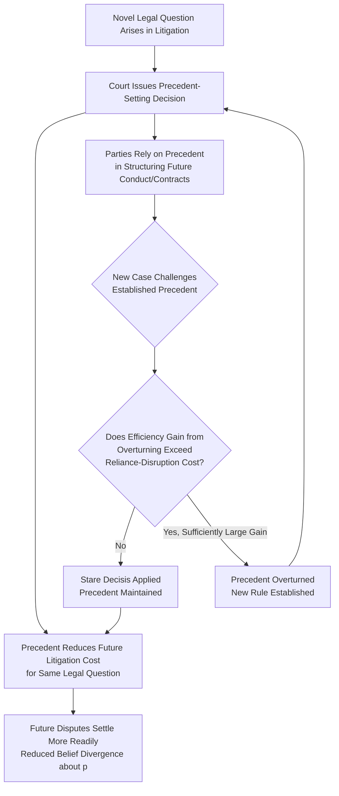

## Precedent, Stare Decisis, and Legal Evolution

### Overview and Conceptual Framework

The economic analysis of precedent treats *stare decisis* — the doctrine that courts should follow prior decisions on similar questions — as an institutional mechanism serving specific efficiency functions distinct from, though related to, both litigant-level dispute resolution and the broader law-formation process. The foundational treatments include Landes and Posner (1976) on the economics of precedent, Rubin (1977) and Priest (1977) on the evolutionary efficiency of common law, Kornhauser (1989) on precedent as an information good, and Gennaioli and Shleifer (2007) on judicial law-making and legal change. This literature addresses two related but analytically distinct questions: (1) what economic function does adherence to precedent serve, given that it constrains individual judges from deciding each case purely on its perceived merits, and (2) does the accumulated body of case-by-case litigation and precedent-formation tend toward economically efficient legal rules over time, and if so, through what mechanism?

### Precedent as an Information and Coordination Good

**Key Points**

Landes and Posner (1976) model precedent as a form of **capital investment in legal information**: a judicial opinion resolving a legal question produces a durable good — the announced rule — that reduces the cost of resolving future disputes raising the same question, since future courts, litigants, and their counsel can rely on the existing precedent rather than re-litigating the underlying legal issue from scratch in every case.

$$\text{Social value of precedent} = \sum_{t=1}^{\infty} \frac{n_t \cdot C_{avoided}}{(1+r)^t}$$

where $n_t$ is the number of future disputes raising the same legal question in period $t$, $C_{avoided}$ is the litigation cost saved per dispute by having an existing precedent rather than requiring fresh adjudication of the legal question, and $r$ is the discount rate. This framing generates several economic implications:

1. **Precedent value increases with the frequency of the underlying legal question's recurrence**: legal rules addressing commonly-recurring fact patterns (e.g., standard contract interpretation questions, common tort liability standards) generate more social value per precedent-setting decision than rules addressing rare, idiosyncratic fact patterns, since more future disputes benefit from the settled rule.
2. **Precedent functions as a coordination mechanism reducing the divergent-expectations problem**: as established in the litigate-versus-settle framework, trials occur substantially due to belief divergence between parties about likely outcomes. Clear, well-settled precedent narrows this divergence by providing both parties a common, verifiable reference point for estimating $p$, directly reducing trial rates for disputes governed by settled law relative to disputes governed by unclear or contested legal standards — this is a direct application of the general principle that reduced informational/estimation asymmetry increases settlement rates.
3. **Precedent as an incentive to litigate (or not)**: the private incentive to litigate a case to a full, precedent-setting decision (rather than settling) depends partly on whether the litigant places value on the precedent itself, beyond the instant case's stakes — a party with a strong interest in establishing favorable precedent for future disputes (e.g., a repeat-player defendant facing many similar claims) may have private litigation incentives systematically different from a one-shot litigant with no stake in the precedent's future application, a consideration returned to below in the context of asymmetric litigation incentives and precedent formation.

### Stare Decisis as a Constraint on Individual Judicial Discretion: The Reliance and Predictability Function

**Key Points**

Beyond precedent's informational-capital function, *stare decisis* as a normative doctrine (constraining judges to follow prior decisions even where they might individually prefer a different rule) serves a distinct economic function: **preserving the reliance value of legal predictability** for parties structuring their conduct, contracts, and transactions in anticipation of how courts will resolve future disputes.

- If courts could freely depart from precedent whenever an individual judge's assessment of the "correct" rule differed from prior decisions, the resulting **unpredictability** would undermine the ex ante planning value of legal rules — parties structuring transactions (contracts, corporate governance, property arrangements) rely on a reasonably stable expectation of how courts will interpret relevant legal doctrines, and this reliance value is itself a form of social capital that unconstrained judicial discretion would erode.
- **[Inference]** This reliance-preservation function explains why *stare decisis* is typically treated as a rebuttable rather than absolute constraint — courts generally require a stronger showing (changed circumstances, demonstrated unworkability, doctrinal inconsistency with related developments) to overturn established precedent than to resolve a genuinely novel question, reflecting an implicit cost-benefit calculation in which the reliance-disruption cost of overturning settled precedent must be outweighed by a sufficiently large efficiency gain from the doctrinal change, rather than a marginal or contestable improvement alone justifying departure.

### Diagram: The Precedent Formation and Reliance Cycle

### The Efficiency-of-the-Common-Law Hypothesis

**Key Points**

A distinct and more ambitious strand of this literature — associated principally with Rubin (1977), Priest (1977), and later formalized by Cooter and Kornhauser (1980) and others — asks whether the accumulated body of common-law precedent, shaped by decentralized case-by-case litigation over time, tends to **evolve toward efficient legal rules**, even absent any individual judge's conscious effort to maximize social welfare.

**The core mechanism** proposed by Rubin and Priest operates through **differential litigation incentives**: parties are more likely to litigate (rather than settle or simply comply) disputes governed by *inefficient* legal rules than disputes governed by efficient rules, because inefficient rules impose larger costs on the disadvantaged party, creating a stronger incentive to challenge and seek to overturn them. If this differential litigation pattern holds, inefficient rules face disproportionately frequent challenge (and thus disproportionately frequent opportunity for judicial reconsideration and change), while efficient rules, imposing lower costs on parties, are relitigated less often and thus persist — producing a selection dynamic analogous to natural selection, in which legal rules survive or are eliminated based on their efficiency properties rather than through any judge's deliberate efficiency-maximizing intent.

**[Inference]** This "evolutionary efficiency" hypothesis has faced substantial theoretical and empirical criticism, including from Priest's own later reconsiderations and from scholars questioning whether the underlying assumption — that inefficient rules generate systematically more relitigation pressure than efficient ones — holds robustly across different legal contexts, since the relevant comparison depends heavily on assumptions about relative stakes, litigation costs, and the distribution of affected parties' resources across rule types, none of which are fixed constants but rather vary by legal domain in ways that could support or undermine the predicted selection dynamic depending on context.

### Rubin's Asymmetric Stakes Refinement

Rubin's (1977) original formulation specifically emphasizes that the evolutionary-efficiency mechanism depends critically on **litigation incentive symmetry between the parties who would benefit from efficient versus inefficient rules**. Where one side of a recurring dispute type (e.g., landlords in landlord-tenant disputes, or employers in employment disputes) is a **repeat player** with ongoing incentive to invest in precedent-shaping litigation, while the other side consists largely of **one-shot litigants** with limited individual stake in the precedent's future application, the repeat player's litigation investment incentive can dominate the evolutionary process — potentially steering precedent development toward outcomes favorable to the repeat-player category specifically, rather than toward efficiency in a distributionally neutral sense.

**[Inference]** This asymmetric-stakes refinement connects directly to the broader "repeat player advantage" literature (associated with Galanter's sociolegal scholarship, "Why the 'Haves' Come Out Ahead") and implies that the evolutionary-efficiency hypothesis, even if the underlying selection mechanism operates as originally theorized, would predict efficient outcomes specifically **from the perspective of whichever category of litigant systematically has stronger repeat-player incentives to invest in precedent formation**, rather than efficiency defined relative to the interests of the full population of affected parties — a significant qualification to the strong form of the evolutionary-efficiency claim.

### Precedent Value and the Incentive to Litigate to Judgment

**Key Points**

Because precedent-setting requires a case to be litigated to a full judicial decision (rather than settled, which produces no binding precedent), the settlement-bargaining framework interacts with precedent-value considerations in a specific way: a party who anticipates significant future benefit from a favorable precedent (typically a repeat player) has an added private incentive to litigate to judgment rather than settle, **even where settlement would otherwise be jointly efficient considering only the instant case's stakes**.

$$\text{Modified reservation price (defendant, precedent value)} = p \cdot J + C_d - V_{precedent}$$

where $V_{precedent}$ represents the defendant's private valuation of the precedent that would be established by a favorable outcome, which **lowers** the defendant's effective willingness to settle (since settling forecloses precedent formation) relative to the standard model without precedent considerations. Symmetrically, a plaintiff (or plaintiff's counsel, in a repeat-player context such as class-action or public-interest litigation) with a stake in future precedent may similarly refuse settlements that a purely instant-case-focused calculation would accept.

**[Inference]** This precedent-value effect implies that settlement rates should be systematically lower, and litigation-to-judgment rates systematically higher, in dispute categories where at least one party is a repeat player with substantial precedent-formation stakes (e.g., novel constitutional questions, test-case civil rights litigation, first-impression commercial law questions) compared to dispute categories where both parties are one-shot litigants with no meaningful precedent interest beyond the instant case's stakes — a prediction broadly consistent with the observed pattern of major precedent-setting cases frequently arising from deliberately selected "test case" litigation strategies pursued by repeat-player institutional litigants (public interest organizations, trade associations, government agencies) specifically because standard settlement incentives would otherwise resolve most disputes before they reach a precedent-setting judicial decision.

### Comparative Table: Precedent's Economic Functions

| Function | Mechanism | Effect on Litigation Behavior |
| --- | --- | --- |
| Information-cost reduction | Settled rule avoids re-litigating legal questions from scratch | Increases settlement rates for disputes governed by clear precedent |
| Reliance/predictability preservation | Constrains judicial discretion to depart from established rules | Enables ex ante contractual and behavioral planning |
| Coordination on shared expectations | Provides common reference point narrowing belief divergence | Reduces trial rates attributable to differing legal-outcome estimates |
| Evolutionary selection (contested) | Inefficient rules allegedly relitigated more, efficient rules persist | Predicts gradual efficiency improvement, subject to Rubin's repeat-player qualification |
| Precedent-value litigation incentive | Repeat players value future precedent beyond instant-case stakes | Reduces settlement rates in precedent-significant "test case" disputes |

### Illustrative Example

**Example**

Consider a novel legal question regarding the enforceability of a specific type of contractual limitation-of-liability clause in software licensing agreements, arising in a dispute between a software vendor (a repeat player, facing many similar contracts and potential future disputes over the same clause language) and an individual small-business customer (a one-shot litigant with no stake in the clause's treatment beyond this specific contract).

- **Without precedent-value considerations**: applying the standard reservation-price model, if $p \cdot J$ (expected trial value) is modest and litigation costs are significant relative to the individual dispute's stakes, both parties would likely find a settlement range and resolve the dispute without ever generating binding precedent on the clause's enforceability.
- **With precedent-value considerations**: the vendor, anticipating that a favorable precedent upholding the clause's enforceability would benefit them across potentially hundreds of future similar disputes, may refuse settlement offers that a purely instant-case calculation would accept, effectively subsidizing the cost of litigating to judgment out of the *precedent's* expected value rather than the instant case's stakes alone. This illustrates concretely why apparently "small" disputes sometimes proceed to full litigation and generate significant new precedent — not because the instant case's stakes justify the litigation cost in isolation, but because a repeat-player party's aggregated future interest across many similar future disputes does.
- This example also illustrates the Rubin asymmetric-stakes concern directly: because only the vendor (not the one-shot customer) has a strong incentive to invest in shaping this specific precedent, the resulting body of case law on this clause type may evolve in a direction reflecting vendor interests specifically, rather than a distributionally neutral efficiency criterion balancing vendor and customer interests equally.

### Legal Change and the Pace of Doctrinal Evolution

**[Inference]** The interaction between *stare decisis*'s reliance-preservation function and the evolutionary-selection dynamics described above generates a further implication: legal doctrine should be expected to evolve **gradually rather than abruptly** under normal common-law development, since the reliance-disruption cost of frequent doctrinal reversal would undermine precedent's coordination value faster than incremental efficiency gains from doctrinal refinement could offset — this is broadly consistent with the observed pattern of common-law development proceeding through incremental distinguishing and narrowing of existing precedent (rather than wholesale doctrinal reversal) as the typical mode of legal change, with outright precedent-overturning decisions remaining comparatively rare events reserved for cases where accumulated inefficiency or doctrinal inconsistency has grown substantial enough to outweigh the reliance-disruption cost of a more significant departure.

### Conclusion

The economic analysis of precedent and *stare decisis* identifies multiple distinct but interrelated efficiency functions: precedent functions as a durable information good reducing future litigation costs, as a reliance-preservation mechanism enabling ex ante planning, and — in the more contested evolutionary-efficiency tradition associated with Rubin and Priest — potentially as a selection mechanism through which decentralized litigation incentives gradually filter out inefficient legal rules in favor of efficient ones. This evolutionary hypothesis, however, requires the significant qualification that differential litigation incentives across repeat-player and one-shot litigant categories can steer the selection process toward outcomes efficient primarily from the repeat player's perspective rather than a distributionally neutral standard, and the broader precedent-value effect on litigation-versus-settlement decisions helps explain why significant new precedent frequently emerges from deliberately pursued test-case litigation rather than from the ordinary run of disputes, which the standard settlement-bargaining framework predicts should typically resolve without ever generating a binding, precedent-setting judicial decision.

**Related Topics / Next Steps**

- The decision to litigate versus settle (interaction with precedent-value litigation incentives)
- Rubin and Priest's evolutionary efficiency of the common law hypothesis and its critics
- Repeat-player theory in litigation (Galanter's "why the haves come out ahead")
- Class actions and aggregate litigation economics (test-case and precedent-formation strategy)
- Judicial decision-making theory and the economics of appellate review
- Asymmetric information and settlement bargaining (precedent's role in narrowing belief divergence)
- Legal certainty, reliance interests, and contract/transactional planning
- Comparative legal systems: precedent's role in common law versus civil law traditions
- Public interest litigation strategy and deliberate test-case selection
- Path dependence and legal institutional change over time