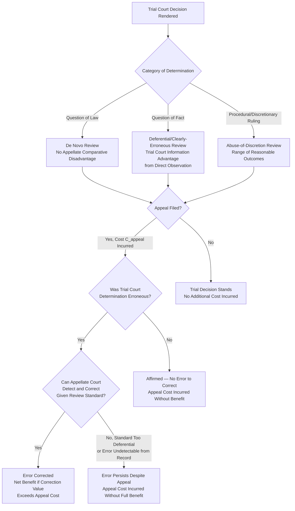

## Appellate Review and Error Correction Economics

### Overview and Conceptual Framework

The economic analysis of appellate review treats multi-tier judicial systems as an institutional mechanism for trading additional administrative cost against reduced error costs in legal adjudication. The foundational framework draws on Shavell's (1995) formal model of the appeals process, Posner's broader treatment of the judicial hierarchy, and the general Kaplow-Shavell error-cost methodology applied specifically to the trial-appellate relationship. The central question: given that trial-level adjudication is imperfect (producing both Type I errors — erroneous findings for plaintiffs/erroneous convictions — and Type II errors — erroneous findings for defendants/erroneous acquittals), does adding a costly additional layer of review reduce total error costs by enough to justify its administrative expense, and how should appellate access, standards of review, and case-selection mechanisms be designed to maximize this net benefit?

### The Basic Cost-Benefit Structure of Appellate Review

**Key Points**

Following the general error-cost framework, total system cost can be decomposed as:

$$TC = C_{trial} + C_{appeal} \cdot P(\text{appeal filed}) + P(\text{error at trial}) \cdot L_{error} \cdot [1 - P(\text{error corrected on appeal})]$$

Appellate review is economically justified when its marginal cost — $C_{appeal}$, incurred each time a case is appealed — is more than offset by the marginal reduction in expected residual error cost it achieves, i.e., when:

$$C_{appeal} < P(\text{trial court erred}) \times P(\text{appellate court corrects the error} \mid \text{error occurred}) \times L_{error}$$

This framework immediately generates several design implications explored below: appellate review is most valuable where trial-court error rates are relatively high, where the harm from an uncorrected error is large, and where appellate courts have a genuine comparative advantage at detecting and correcting the specific type of error at issue — conditions that vary systematically across different categories of legal and factual questions.

### Standards of Review as Error-Cost Calibration

**Key Points**

A central institutional design feature addressed by this literature is the differential **standard of review** applied to different categories of trial-court determinations — de novo review for questions of law, "clearly erroneous" or substantial-evidence review for findings of fact, and abuse-of-discretion review for certain procedural and discretionary rulings. Shavell's framework explains this differentiation as an efficient calibration of appellate scrutiny intensity to the **relative comparative advantage of trial versus appellate courts** at accurately resolving each category of question:

1. **De novo review for legal questions**: appellate courts (particularly multi-judge panels, often with more time for reflection and broader doctrinal perspective than a single trial judge under time pressure) have **no comparative disadvantage**, and often develop advantages, relative to trial courts in resolving pure questions of law — legal interpretation does not depend on having directly observed witness testimony or other trial-specific information, so appellate courts can review legal conclusions with the same or better information than the trial court possessed, justifying the most searching (de novo) standard of review for this category.
2. **Deferential review for factual findings**: trial courts (or juries) that directly observed witness testimony, assessed credibility, and evaluated physical evidence possess an **information advantage** that an appellate court, reviewing only a written record, cannot fully replicate — the appellate court lacks access to demeanor evidence, the immediacy of live testimony, and other trial-specific information inputs. Deferential review (reversing factual findings only where "clearly erroneous") reflects a recognition that appellate courts have a **comparative disadvantage** at re-adjudicating factual questions, meaning the expected error-correction benefit of intensive appellate factual review is lower (and the risk of appellate courts introducing *new* errors by second-guessing well-informed trial-level factual determinations is correspondingly higher) than for legal questions.
3. **Abuse-of-discretion review for procedural/discretionary rulings**: many trial-management decisions (scheduling, evidentiary admissibility calls requiring contextual judgment, sentencing within a statutory range) involve a range of reasonable outcomes rather than a single objectively correct answer, meaning the "error cost" concept itself is harder to define — abuse-of-discretion review reflects a judgment that these decisions should be disturbed only when they fall clearly outside the range of reasonable outcomes, since more searching review would impose the cost of appellate re-litigation without a correspondingly well-defined error to correct.

**[Inference]** This differentiated standard-of-review structure is best understood as an implicit, doctrinally-encoded application of the comparative-advantage principle from the general error-cost literature, allocating scarce appellate-review intensity toward the categories of trial-court determination where appellate courts can most reliably improve accuracy, rather than applying uniform scrutiny across all categories of trial-court decision-making regardless of the appellate court's actual comparative capacity to improve upon the trial court's determination in that specific category.

### Diagram: The Appellate Error-Correction Framework

### The Decision to Appeal: A Reservation-Price Framework

**Key Points**

Shavell (1995) models the decision to appeal using a structure directly analogous to the litigate-versus-settle framework: a losing trial-court party appeals if and only if the expected value of appeal exceeds its cost:

$$\text{Appeal filed if: } p_{reversal} \cdot (J_{trial} - J_{expected\ on\ retrial\ or\ modified\ judgment}) - C_{appeal} > 0$$

where $p_{reversal}$ is the appealing party's estimated probability of securing reversal or modification, and the bracketed term represents the value differential between the original trial outcome and the expected outcome if the appeal succeeds. This generates predictions structurally parallel to the trial-selection literature:

- **Appeals should be filed disproportionately in cases with higher stakes** (larger $J$), since the fixed cost of appellate litigation is more easily justified relative to larger amounts in controversy — a prediction broadly consistent with the observed correlation between case stakes and appeal rates in most empirical studies of litigation behavior.
- **Appeals should be filed disproportionately where the losing party perceives a meaningful probability of reversal**, meaning cases with genuinely close or legally contested trial-court rulings should generate higher appeal rates than cases with clearly correct, well-settled trial outcomes — a selection dynamic analogous to the Priest-Klein trial-selection model, but operating at the trial-to-appeal transition rather than the settlement-to-trial transition.
- **[Inference]** This selection dynamic implies that the population of *appealed* cases is not a random sample of trial outcomes, but is systematically skewed toward higher-stakes and more legally contestable determinations — a consideration relevant to interpreting appellate reversal-rate statistics, since a high reversal rate among appealed cases does not necessarily indicate a high error rate among trial-court decisions generally, given that the appealed subset is specifically selected for perceived reversal potential rather than representing trial courts' overall accuracy.

### Precedent Value and the Incentive to Appeal

**Key Points**

Consistent with the broader precedent-formation literature, a party's decision to appeal is influenced not only by the instant case's stakes but also by the value of any precedent that a favorable appellate ruling would establish for future disputes — directly paralleling the precedent-value modification to the reservation-price framework discussed in the context of trial-versus-settlement decisions. Repeat-player litigants (government agencies, trade associations, entities facing recurring similar claims) may pursue appeals even where the instant case's stakes alone would not justify the appellate litigation cost, specifically because a favorable appellate precedent would benefit them across a broader population of future disputes — this is a significant reason why appellate courts frequently see appeals pursued by institutional, repeat-player litigants at rates disproportionate to their share of trial-court litigation generally.

### The Two-Tiered System's Aggregate Error-Reduction Function

**Key Points**

Beyond case-specific error correction, the appellate system serves an aggregate, forward-looking function: appellate decisions on legal questions generate binding precedent (per the precedent-economics framework) that guides *future* trial-court decision-making, meaning appellate review's error-correction value extends beyond the instant case to encompass the entire population of future cases governed by the resulting legal rule.

$$\text{Total error-reduction value of appellate legal ruling} = L_{error}^{instant\ case} + \sum_{t} n_t \times \Delta P(\text{trial error}) \times L_{error}$$

**[Inference]** This forward-looking, precedent-generating function is a primary economic justification for maintaining relatively intensive (de novo) appellate review of legal questions specifically — even where the instant case's stakes might not independently justify the appellate cost from a purely backward-looking, case-specific error-correction perspective, the value of correctly resolving a legal question that will recur across many future trial-court proceedings can justify appellate review intensity that a purely case-specific cost-benefit calculation would not support, since the aggregate future-error-reduction benefit compounds across the full future population of similarly-situated cases.

### Multiple Layers of Review: Diminishing Returns and Selective Certiorari

**Key Points**

Many judicial systems incorporate more than two tiers (trial court, intermediate appellate court, and a highest court exercising discretionary review, such as certiorari jurisdiction). The economic analysis of this further tier addresses **diminishing marginal returns to additional review layers**:

- The marginal error-correction value of a *second* layer of appellate review (beyond the first) is generally lower than the marginal value of the first appellate layer, since the first layer of review has already corrected the most clearly erroneous trial-court decisions, leaving a residual population of genuinely close or difficult legal questions for the second layer — meaning the second-layer error-detection rate, applied to an already-filtered population, will generally be lower than the first layer's error-detection rate applied to the full population of trial-court decisions.
- **Discretionary review mechanisms** (certiorari, permission-to-appeal requirements) function as a further selection/gatekeeping device, allowing the highest court to allocate its limited review capacity toward the subset of cases where the aggregate future-error-reduction value (per the forward-looking precedent function above) is highest — typically cases involving unsettled legal questions, circuit splits or lower-court disagreement (indicating genuine legal uncertainty warranting authoritative resolution), or issues of broad recurring importance — rather than toward case-specific error correction for the individual litigants involved, which is presumed to have already received adequate attention at the mandatory first-appeal stage.
- **[Inference]** This discretionary-review design directly reflects the aggregate, forward-looking error-reduction logic: a highest court exercising discretionary jurisdiction is economically justified in declining review of cases presenting settled legal questions (even where the instant litigants may have a colorable claim of trial or intermediate-appellate error) precisely because the marginal value of correcting an instant-case-specific error, without any forward-looking precedent-clarification benefit, is unlikely to justify the highest court's scarce review capacity relative to cases presenting genuinely unsettled questions with substantial future-case-population impact.

### Comparative Table: Review Standards and Their Economic Rationale

| Determination Type | Standard of Review | Comparative Advantage Basis | Forward-Looking Precedent Value |
| --- | --- | --- | --- |
| Pure legal questions | De novo | No trial-court information advantage; appellate courts may have superior doctrinal perspective | High — governs future cases |
| Mixed questions of law and fact | Varies (often de novo for legal component) | Partial trial-court advantage on factual component only | Moderate to high depending on legal component's generality |
| Findings of fact (bench trial) | Clearly erroneous | Trial court's direct observation of evidence/testimony | Low — fact-specific, limited future applicability |
| Jury factual findings | Highly deferential (sufficiency of evidence) | Jury's direct assessment of credibility and evidence weight | Very low — case-specific |
| Discretionary/procedural rulings | Abuse of discretion | Range of reasonable outcomes; trial court's contextual management role | Low — case-specific application |
| Discretionary highest-court review (certiorari-style) | Selective — granted based on broader importance | N/A — selection mechanism, not a review standard per se | Very high — cases selected specifically for precedent-clarification value |

### Illustrative Example

**Example**

Consider two cases decided by the same trial court in a given month: Case A involves a jury's factual finding on whether a specific defendant's conduct met a "reasonable person" negligence standard on disputed witness testimony, while Case B involves the trial court's legal interpretation of an ambiguous statutory term that will govern many future similar cases.

- **Case A on appeal**: an appellate court reviewing the jury's negligence finding faces a significant comparative disadvantage — it did not observe witness demeanor, cannot assess credibility firsthand, and the "reasonable person" determination is inherently fact-specific to this dispute with essentially no forward-looking precedent value for other cases with different facts. Applying deferential review here reflects the low expected error-correction benefit (appellate court unlikely to reliably outperform the jury's assessment) relative to the cost of intensive review, and the near-total absence of aggregate future-case benefit from re-litigating this specific factual question.
- **Case B on appeal**: an appellate court reviewing the statutory interpretation question faces no comparative disadvantage relative to the trial court (both are working from the same statutory text and legislative history, without any need for direct testimony observation), and a definitive appellate resolution will govern potentially hundreds of future cases interpreting the same statutory term. Applying de novo, searching review here reflects both the absence of a trial-court information advantage and the substantial aggregate future-error-reduction value of getting the legal question right for the full population of future similarly-situated cases — justifying appellate resource investment far exceeding what Case B's individual stakes alone might warrant.

This paired example illustrates concretely why the same appellate court, reviewing two cases from the identical trial proceeding or court, would apply dramatically different review intensity to different components of the underlying decisions — not due to arbitrary doctrinal formalism, but reflecting the differing comparative-advantage and precedent-value calculations underlying each category of determination.

### Empirical and Institutional Considerations

**[Unverified]** Empirical measurement of appellate systems' actual error-correction effectiveness faces a fundamental methodological challenge: the "true" error rate of trial-court decisions is not independently observable, meaning researchers must generally rely on proxies (reversal rates, subsequent doctrinal developments, expert assessment of decision quality) that are themselves imperfect and potentially biased by the same selection dynamics (appeals disproportionately drawn from contestable cases) discussed above, making rigorous empirical validation of the theoretical comparative-advantage framework's specific predictions an ongoing and only partially resolved area of research.

**[Inference]** Resource-constrained appellate systems facing caseload pressure (a common feature of many judicial systems, particularly at the intermediate appellate level) may be forced to depart from the theoretically optimal review-intensity allocation described above, applying more abbreviated review (e.g., summary affirmance without full opinion, reduced oral argument allocation) across a broader range of cases than the pure error-cost framework would recommend — implying that observed appellate practice reflects not only the theoretical error-cost-minimization logic but also independent administrative capacity constraints that interact with, and sometimes override, that logic in practice.

### Conclusion

Appellate review and its associated doctrinal structures — differentiated standards of review, the appeal-filing decision, and discretionary highest-court jurisdiction — are best understood economically as a system of calibrated error-correction investment, allocating scarce, costly appellate scrutiny toward the categories of trial-court determination and case types where appellate courts hold a genuine comparative advantage at improving accuracy, and where the resulting corrections (particularly on legal questions generating binding precedent) yield the largest aggregate benefit across the full future population of similarly-situated cases. This framework explains the pervasive, seemingly formalistic distinction between de novo review of legal questions and deferential review of factual findings as a substantively grounded response to differing information asymmetries between trial and appellate courts, and explains discretionary highest-court review as a mechanism for concentrating the most searching, precedent-clarifying review specifically on cases with the highest forward-looking, aggregate error-reduction value — reinforcing the broader theme, recurring throughout the economics of civil procedure, that seemingly technical and doctrinal procedural design choices are frequently best understood as calibrated responses to underlying cost-benefit and comparative-advantage considerations.

**Related Topics / Next Steps**

- Precedent, stare decisis, and legal evolution (forward-looking value of appellate legal rulings)
- The decision to litigate versus settle (structural parallel to the appeal-filing decision)
- Error-cost theory in legal adjudication (Kaplow-Shavell general framework)
- Repeat-player theory and asymmetric incentives to pursue appellate precedent
- Discovery rules and their economic function (interaction with factual-record quality for appellate review)
- Comparative judicial hierarchy design across common law and civil law systems
- Certiorari and discretionary review mechanisms in supreme/highest court jurisdiction
- Economics of judicial caseload management and administrative capacity constraints
- Jury versus bench trial fact-finding and appellate deference implications
- Empirical measurement challenges in judicial error-rate estimation