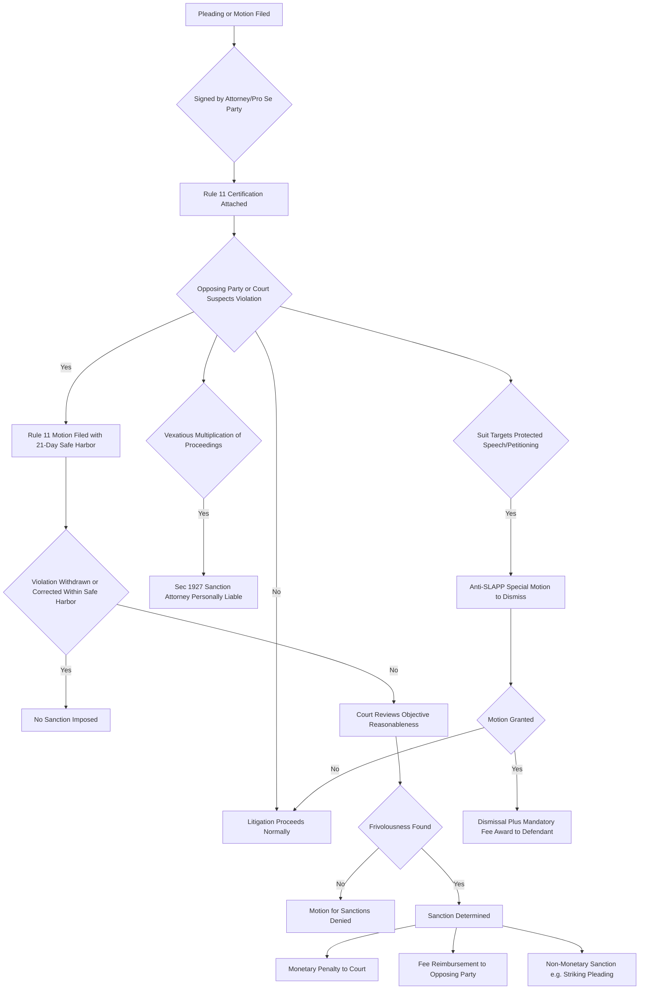

## Frivolous Litigation and Sanctions

### Definition and Conceptual Framework

Frivolous litigation refers to legal claims, defenses, or motions filed without a reasonable basis in law or fact, typically pursued for improper purposes such as harassment, delay, or imposing costs on an opposing party. From an economics of law perspective, frivolous litigation represents a form of rent-seeking behavior and a negative externality imposed on the judicial system, opposing litigants, and society at large.

Sanctions are the legal mechanisms — monetary penalties, fee-shifting orders, dismissal with prejudice, or professional discipline — designed to deter the filing of such claims. The economic analysis of sanctions centers on how legal rules can be calibrated to filter out socially wasteful suits while preserving access to courts for meritorious ones.

### The Economic Rationale for Concern

Litigation, even meritorious litigation, consumes real resources: attorney time, court administration, discovery costs, and the opportunity cost of the parties' time. A suit is socially frivolous when its expected social benefit (largely, accurate dispute resolution and deterrence of genuine wrongdoing) is smaller than its social cost (resources consumed in litigating it).

This differs from a suit merely being "weak" or having a low probability of success. A plaintiff may rationally file a claim with a modest win probability $p$ if the expected value exceeds filing costs:

$$EV = p \cdot J - c_p$$

where $J$ is the judgment amount and $c_p$ is the plaintiff's litigation cost. A suit becomes economically "frivolous" in the pejorative sense typically when $p$ is at or near zero, yet the suit is still filed — meaning the plaintiff's motive lies outside the expected-judgment calculus (e.g., nuisance value extraction, discovery abuse, delay, or nonmonetary retaliation).

**Key Points**

- Frivolous suits are not simply low-probability suits; rational litigation with positive expected value is not frivolous even if it ultimately loses.
- The core economic pathology is a suit filed to extract "settlement value" disconnected from any realistic assessment of the merits.
- Asymmetric information about case merit between plaintiff and defendant is central to why frivolous suits can succeed in extracting settlements.

### The Nuisance Suit / Settlement Extraction Model

A canonical model (following Rosenberg & Shavell-type analysis) explains why a plaintiff might file a suit known (or believed) to have zero or near-zero probability of success.

Suppose the defendant's cost to litigate to judgment is $c_d$, and the defendant cannot costlessly distinguish frivolous suits from meritorious ones at the pleading stage (a screening/signaling problem). The plaintiff can credibly threaten to impose $c_d$ on the defendant by proceeding to trial. The plaintiff will find it profitable to file if:

$$c_p < S \leq c_d$$

where $S$ is the settlement amount extracted. That is, if the plaintiff's cost of filing and threatening suit is lower than what a rational defendant would pay to avoid its own higher litigation cost, a wholly meritless suit can still generate positive expected value for the plaintiff *purely from the defendant's cost-avoidance incentive*, independent of the claim's underlying merit.

This model demonstrates a crucial point: **the frivolous suit problem is fundamentally an asymmetric litigation-cost problem**, not merely a merits problem. Any legal system with $c_d$ meaningfully larger than $c_p$ creates room for nuisance-value settlements.

### Why the American Rule Facilitates Frivolous Filing

Under the American Rule (each side bears its own attorney's fees regardless of outcome), a plaintiff filing a frivolous suit faces limited downside — bounded by $c_p$ — while imposing a cost of up to $c_d$ on the defendant. This asymmetry is a primary economic driver of the incentive to file low-merit claims for settlement value.

Contrast this with the English Rule (loser-pays), under which the expected cost to the plaintiff of losing a frivolous suit rises substantially, since losing means paying both parties' fees. The general prediction:

- **American Rule**: Filters out very low-value meritorious claims (because plaintiffs must fully bear their own costs even when they would win) but does relatively little to deter frivolous claims aimed at settlement extraction, since the plaintiff's downside is capped.
- **English Rule**: Deters frivolous suits more effectively (higher expected cost of losing) but can also deter meritorious suits by risk-averse plaintiffs, particularly where the plaintiff has limited wealth relative to the potential fee-shifting exposure (judgment-proof plaintiff problem).

[Inference] The net welfare effect of switching fee rules is theoretically ambiguous and depends on the distribution of case merit, litigant risk aversion, and litigant wealth constraints — a point extensively debated in the law-and-economics literature (e.g., Shavell 1982; Rowe 1984).

### Sanctions Mechanisms in Practice

**Rule 11 (U.S. Federal Rules of Civil Procedure)**

Rule 11 requires that every pleading, motion, or paper be certified by the signing attorney as (1) not presented for any improper purpose, (2) warranted by existing law or a non-frivolous argument for changing the law, and (3) having evidentiary support or likely to have such support after reasonable investigation. Violations can result in sanctions, which may include monetary penalties, reimbursement of the opposing party's fees and costs directly caused by the violation, or non-monetary directives.

Economically, Rule 11 functions as a screening device: it raises $c_p$ (the plaintiff's or attorney's private cost of filing) specifically for suits lacking a good-faith basis, without raising costs uniformly for all litigation. This is a more targeted instrument than a blanket fee-shifting rule.

**28 U.S.C. § 1927**

This statute allows a court to require an attorney who "multiplies proceedings ... unreasonably and vexatiously" to satisfy personally the excess costs and fees incurred because of such conduct. This targets an attorney's *litigation conduct* (e.g., dilatory tactics, repeated frivolous motions) rather than the pleading itself, making it a complementary tool to Rule 11.

**Inherent Court Authority**

Courts possess inherent equitable power to sanction bad-faith litigation conduct even absent a specific rule violation, generally requiring a finding of bad faith (a higher evidentiary bar than the objective standard under Rule 11).

**Fee-Shifting Statutes (Prevailing-Party and One-Way Fee Shifting)**

Certain statutory contexts (e.g., civil rights litigation, some IP and consumer statutes) employ asymmetric fee-shifting: a prevailing plaintiff often recovers fees, while a prevailing defendant recovers fees from the plaintiff only upon a showing that the suit was frivolous, unreasonable, or without foundation (the *Christiansburg Garment* standard in Title VII cases). This asymmetry is designed to preserve access to justice for potentially under-resourced plaintiffs in socially valuable litigation categories, while still deterring genuinely baseless claims.

**State-Level Anti-SLAPP Statutes**

Anti-SLAPP (Strategic Lawsuit Against Public Participation) statutes address a specific subcategory of frivolous or abusive litigation: suits filed to chill speech or petitioning activity rather than to vindicate a genuine legal injury. These statutes typically allow early dismissal and mandatory fee-shifting to the successful defendant, directly counteracting the asymmetric-cost dynamic described above by front-loading the plaintiff's exposure.

### Optimal Sanction Design: The Deterrence Calculus

From a deterrence standpoint, an economically efficient sanction regime should set the expected sanction equal to the social cost the frivolous filing imposes, adjusted for the probability that the frivolous conduct is detected and punished. Using the standard Beckerian deterrence formula:

$$E[\text{Sanction}] = q \cdot F$$

where $q$ is the probability that frivolous conduct is detected and sanctioned, and $F$ is the sanction magnitude. For deterrence to be efficient, this should approximate the harm imposed, $H$ (the wasted litigation costs, judicial resources, and opposing party's costs):

$$q \cdot F \approx H$$

Because detection and adjudication of frivolousness itself is costly and imperfect (courts are reluctant to sanction aggressively for fear of chilling legitimate advocacy), $q$ is typically well below 1. This implies $F$ must be set considerably higher than $H$ per instance to achieve efficient deterrence — yet courts are systematically hesitant to impose large sanctions due to concerns about access to justice, attorney livelihood, and appellate reversal risk. **This produces persistent underdeterrence of frivolous filing in most real-world systems.**

**Key Points**

- Underdeterrence arises because $q$ (detection/enforcement probability) is low and courts intentionally moderate $F$ (sanction severity) to avoid chilling legitimate claims.
- The "chilling effect" concern is the central counterweight to aggressive sanctioning: excessive $F$ or overly aggressive $q$ risks deterring valid claims with facially uncertain merit (a Type I/Type II error tradeoff).

### Type I and Type II Error Tradeoff

Sanctions regimes must balance two error types:

- **Type I Error (False Positive)**: Sanctioning a litigant who filed a genuinely meritorious, though ultimately unsuccessful or novel, claim. This chills legitimate legal innovation and access to courts, particularly for plaintiffs advancing good-faith arguments for extending or changing existing law.
- **Type II Error (False Negative)**: Failing to sanction a litigant who filed a genuinely frivolous claim, allowing nuisance-value extraction and resource waste to continue.

The Rule 11 standard's "objective reasonableness" test (rather than requiring proof of subjective bad faith) reflects an attempt to lower the cost of Type II errors, at some risk of increasing Type I errors relative to a purely subjective bad-faith standard.

### Diagram: Litigation Filing Decision and Sanction Screening (svg_diagram)

<svg xmlns="http://www.w3.org/2000/svg" viewBox="0 0 800 460" font-family="Arial, sans-serif">
<text x="400" y="28" font-size="18" font-weight="bold" text-anchor="middle">Frivolous Litigation Filing and Sanction Screening (svg_diagram)</text>
<rect x="30" y="60" width="200" height="60" rx="8" fill="#e8f0fe" stroke="#2b579a" stroke-width="1.5" />
<text x="130" y="85" font-size="13" text-anchor="middle">Potential Plaintiff</text>
<text x="130" y="103" font-size="11" text-anchor="middle">Evaluates EV of filing</text>
<line x1="230" y1="90" x2="300" y2="90" stroke="#333" stroke-width="1.5" marker-end="url(#arrow)" />
<polygon points="300,60 420,90 300,120 180,90" fill="#fff3cd" stroke="#a67c00" stroke-width="1.5" />
<text x="300" y="85" font-size="12" text-anchor="middle">p ≈ 0 and</text>
<text x="300" y="100" font-size="12" text-anchor="middle">c_p &lt; S ≤ c_d ?</text>
<line x1="420" y1="90" x2="500" y2="90" stroke="#333" stroke-width="1.5" marker-end="url(#arrow)" />
<text x="450" y="80" font-size="11" text-anchor="middle">Yes</text>
<rect x="500" y="60" width="220" height="60" rx="8" fill="#fde8e8" stroke="#a32020" stroke-width="1.5" />
<text x="610" y="85" font-size="13" text-anchor="middle">Nuisance Suit Filed</text>
<text x="610" y="103" font-size="11" text-anchor="middle">Settlement extraction motive</text>
<line x1="300" y1="120" x2="300" y2="170" stroke="#333" stroke-width="1.5" marker-end="url(#arrow)" />
<text x="330" y="150" font-size="11">No</text>
<rect x="190" y="170" width="220" height="60" rx="8" fill="#e6f4ea" stroke="#1e7a34" stroke-width="1.5" />
<text x="300" y="195" font-size="13" text-anchor="middle">Merit-Based Suit Filed</text>
<text x="300" y="213" font-size="11" text-anchor="middle">EV &gt; 0 from judgment probability</text>
<line x1="610" y1="120" x2="610" y2="170" stroke="#333" stroke-width="1.5" marker-end="url(#arrow)" />
<rect x="500" y="170" width="220" height="60" rx="8" fill="#e8f0fe" stroke="#2b579a" stroke-width="1.5" />
<text x="610" y="192" font-size="13" text-anchor="middle">Court / Defense Screening</text>
<text x="610" y="210" font-size="11" text-anchor="middle">Rule 11, §1927, Anti-SLAPP</text>
<line x1="610" y1="230" x2="610" y2="280" stroke="#333" stroke-width="1.5" marker-end="url(#arrow)" />
<polygon points="610,250 720,280 610,310 500,280" fill="#fff3cd" stroke="#a67c00" stroke-width="1.5" />
<text x="610" y="277" font-size="12" text-anchor="middle">Detected?</text>
<text x="610" y="293" font-size="11" text-anchor="middle">(probability q)</text>
<line x1="720" y1="280" x2="770" y2="280" stroke="#333" stroke-width="1.5" marker-end="url(#arrow)" />
<text x="745" y="270" font-size="10" text-anchor="middle">Yes</text>
<text x="770" y="285" font-size="11">↓</text>
<rect x="620" y="340" width="150" height="55" rx="8" fill="#fde8e8" stroke="#a32020" stroke-width="1.5" />
<text x="695" y="362" font-size="12" text-anchor="middle">Sanction F Imposed</text>
<text x="695" y="378" font-size="10" text-anchor="middle">q·F ≈ H (target)</text>
<line x1="695" y1="310" x2="695" y2="340" stroke="#333" stroke-width="1.5" marker-end="url(#arrow)" />
<line x1="500" y1="290" x2="430" y2="340" stroke="#333" stroke-width="1.5" marker-end="url(#arrow)" />
<text x="450" y="315" font-size="10">No</text>
<rect x="330" y="340" width="150" height="55" rx="8" fill="#f0f0f0" stroke="#666" stroke-width="1.5" />
<text x="405" y="362" font-size="12" text-anchor="middle">Undeterred</text>
<text x="405" y="378" font-size="10" text-anchor="middle">Settlement value realized</text>
<line x1="300" y1="230" x2="300" y2="280" stroke="#333" stroke-width="1.5" marker-end="url(#arrow)" />
<rect x="190" y="280" width="220" height="55" rx="8" fill="#e6f4ea" stroke="#1e7a34" stroke-width="1.5" />
<text x="300" y="302" font-size="12" text-anchor="middle">Adjudicated on Merits</text>
<text x="300" y="318" font-size="10" text-anchor="middle">No sanction (Type I error avoided)</text>
</svg>

### Flowchart of Procedural Sanction Pathways

### Comparative Empirical Considerations

[Unverified] Empirical estimates of the actual incidence and cost of frivolous litigation vary substantially across studies and are politically contested, in part because "frivolous" is not a self-evidently observable category — a suit's frivolousness is often only established after adjudication, raising a fundamental measurement problem for researchers.

Some consistent empirical patterns reported in the literature include:

- Sanction motions under Rule 11 are granted in only a minority of cases in which they are filed, consistent with judicial reluctance to impose sanctions absent clear evidence.
- Anti-SLAPP statutes with mandatory fee-shifting show measurably higher early dismissal rates for speech-related tort claims in jurisdictions that have adopted them compared to those that have not. [Inference — directionally supported by multiple state-level comparative studies, though effect sizes vary by jurisdiction and statute design.]

**Behavioral disclaimer**: Actual court behavior in applying sanctions rules varies considerably by jurisdiction, judge, and case posture; the models above describe the economic logic of the incentive structure rather than a guarantee of how any particular court will rule.

### Worked Numerical Example

Assume:

- Defendant's cost to litigate to judgment, $c_d = \$150{,}000$
- Plaintiff's cost to file and threaten suit through early discovery, $c_p = \$10{,}000$
- Plaintiff has no genuine expectation of prevailing ($p \approx 0$)

The plaintiff can rationally demand any settlement $S$ such that $\$10{,}000 < S \leq \$150{,}000$, since the defendant strictly prefers paying $S$ to incurring $c_d$. Suppose the plaintiff demands $S = \$60{,}000$. The plaintiff's net profit from an entirely meritless claim is:

$$\$60{,}000 - \$10{,}000 = \$50{,}000$$

**Example**

If a Rule 11 sanction regime imposes an expected sanction $E[\text{Sanction}] = q \cdot F$ where the enforcement probability $q = 0.15$ (courts sanction only 15% of legitimately frivolous filings) and the court sets $F = \$80{,}000$ upon a finding of frivolousness, the plaintiff's *ex ante* expected payoff becomes:

$$0.85 \times \$50{,}000 + 0.15 \times (\$50{,}000 - \$80{,}000) = \$42{,}500 - \$4{,}500 = \$38{,}000$$

Even with a nontrivial sanction magnitude, low detection probability leaves substantial expected profit from filing, illustrating the underdeterrence problem discussed above.

### Related Topics

- Fee-shifting rules: American Rule vs. English Rule (comparative law and economics)
- Settlement bargaining models and asymmetric information (Bebchuk, Priest-Klein selection hypothesis)
- Discovery abuse and cost allocation in civil procedure
- Class action economics and the agency problem between named plaintiffs and counsel
- Judgment-proof defendants and litigation financing (third-party litigation funding)
- SLAPP suits and the economics of strategic litigation against speech
- Contingency fee arrangements and their effect on case selection
- Alternative dispute resolution as a substitute for costly litigation screening