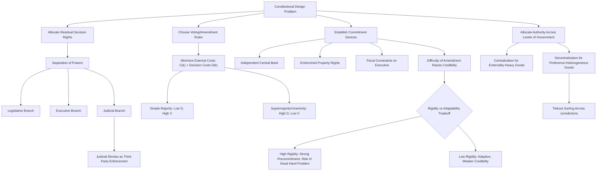

## Economic theories of constitutional design

### Overview and Framing

Economic theories of constitutional design apply the analytical apparatus of law and economics — rational choice, game theory, contract theory, and public choice — to the question of why constitutions take the form they do and how their structural features affect governance outcomes. The central move is to treat a constitution not as a sacred or purely political document but as a **long-term incomplete contract** among citizens, and among citizens and the state, written under uncertainty about future states of the world.

This framing generates a distinct research agenda: constitutions are analyzed for their capacity to solve commitment problems, allocate decision rights efficiently, constrain agency costs in government, and provide durable rules that are costly to amend precisely because durability itself has value.

### The Constitution as an Incomplete Contract

Contract theory treats agreements as "incomplete" when it is prohibitively costly to specify contingent obligations for every possible future state of the world. Constitutions are the paradigmatic incomplete contract: they cannot enumerate a rule for every future policy dispute, so they instead allocate **residual decision-making rights** — who decides matters not explicitly addressed — among branches of government, levels of government, and between government and citizens.

$$U_i(\text{Constitution}) = \sum_{s \in S} \pi(s) \cdot V_i(a^*(s) \mid \text{Constitution})$$

where $S$ is the set of possible future states of the world, $\pi(s)$ is the probability of state $s$, and $V_i(a^*(s) \mid \text{Constitution})$ is citizen $i$'s payoff from the constitutionally-determined action $a^*(s)$ taken in state $s$. Because constitution-writers cannot know $S$ or $\pi(s)$ with precision, efficient constitutional design under this framework emphasizes **procedural rules and default allocations of authority** over substantive outcome mandates — a rule for deciding, rather than an attempt to decide everything in advance.

**Key Points**

- Constitutional incompleteness is not a drafting failure; it is an efficient response to the prohibitive cost of complete contracting over an unknowable future.
- The central design question becomes: who should hold residual decision rights, and under what constraints, given that neither the drafters nor future officials can be fully trusted or fully informed?

### The Veil of Ignorance and Ex Ante Efficiency

Buchanan and Tullock's constitutional political economy (developed most fully in *The Calculus of Consent*, 1962) argues that constitutional rules should be evaluated for their efficiency at the moment of adoption — behind a partial "veil of uncertainty" about which position (majority, minority, winner, loser) any given citizen will occupy under any specific future policy. Because self-interested individuals cannot predict their future position with certainty at the constitutional stage, they have an incentive to agree to rules that are fair and efficient across the whole distribution of possible future positions, rather than rules that favor only their known current interest.

This generates the **two-stage model of collective choice**:

1. **Constitutional stage**: Rules of the game are chosen, ideally unanimously or near-unanimously, because all parties face symmetric uncertainty about future distributional impact.
2. **Post-constitutional (in-period) stage**: Ordinary political and policy decisions are made within the rules fixed at the constitutional stage, typically via majority voting or other decision rules specified constitutionally.

**Example**

A constitutional rule requiring a supermajority (e.g., two-thirds) for tax increases can be rational for a risk-averse citizen at the constitutional stage — before knowing whether she will later be in the taxed majority or the protected minority — even though, in any *particular* later policy vote, she might prefer simple majority rule if she happens to favor the tax at that moment.

### Optimal Majority Rules: The Buchanan-Tullock Tradeoff

Buchanan and Tullock formalize the choice of a voting rule (e.g., what supermajority threshold $k$ percent is required to pass legislation) as a tradeoff between two cost categories:

- **External costs** $C(k)$: the expected costs imposed on an individual by decisions made by others under decision rule $k$. External costs are highest under unanimity is not required (low $k$, e.g., simple majority) because a bare majority can impose costs on the minority with no compensation, and they fall toward zero as $k$ approaches unanimity (100%), since near-unanimity requires broad buy-in before any binding decision is made.
- **Decision-making (transaction) costs** $D(k)$: the costs of reaching a decision under rule $k$ — bargaining, negotiation, and time delay. These costs rise as $k$ increases, since higher supermajority thresholds make it progressively harder to assemble a winning coalition, with unanimity typically the most costly (and most vulnerable to holdout/strategic bargaining behavior).

The efficient constitutional voting rule $k^*$ minimizes the sum of these two cost functions:

$$k^* = \arg\min_{k} \left[ C(k) + D(k) \right]$$

**Diagram: Buchanan-Tullock Optimal Majority Model (svg_diagram)**

<svg xmlns="http://www.w3.org/2000/svg" viewBox="0 0 700 420" font-family="Arial, sans-serif">
<text x="350" y="28" font-size="17" font-weight="bold" text-anchor="middle">Buchanan-Tullock Optimal Majority Rule (svg_diagram)</text>
<line x1="80" y1="360" x2="640" y2="360" stroke="#333" stroke-width="1.5" />
<line x1="80" y1="360" x2="80" y2="50" stroke="#333" stroke-width="1.5" />
<text x="360" y="395" font-size="13" text-anchor="middle">Decision Rule k (% required to pass, 0 to 100)</text>
<text x="30" y="200" font-size="13" text-anchor="middle" transform="rotate(-90 30 200)">Cost</text>

<text x="80" y="375" font-size="11" text-anchor="middle">0%</text>

<text x="640" y="375" font-size="11" text-anchor="middle">100%</text>

<text x="360" y="375" font-size="11" text-anchor="middle">50%</text>

<path d="M 80,80 Q 300,120 640,350" fill="none" stroke="#a32020" stroke-width="2.5" />
<text x="560" y="330" font-size="12" fill="#a32020">External Costs C(k)</text>
<path d="M 80,350 Q 400,120 640,70" fill="none" stroke="#2b579a" stroke-width="2.5" />
<text x="470" y="110" font-size="12" fill="#2b579a">Decision Costs D(k)</text>
<path d="M 80,220 Q 300,90 400,110 Q 500,130 640,230" fill="none" stroke="#1e7a34" stroke-width="2.5" stroke-dasharray="4,3" />
<text x="230" y="115" font-size="12" fill="#1e7a34">Total Cost C(k)+D(k)</text>
<line x1="400" y1="360" x2="400" y2="115" stroke="#666" stroke-width="1" stroke-dasharray="3,3" />
<circle cx="400" cy="112" r="5" fill="#1e7a34" />
<text x="410" y="100" font-size="12" font-weight="bold">k* (optimal supermajority)</text>
</svg>

**Key Points**

- Unanimity minimizes external costs to zero but maximizes decision costs (holdout problem, strategic bargaining, potential paralysis).
- Simple majority minimizes decision costs but exposes minorities to potentially unlimited external costs.
- The efficient rule $k^*$ is generally *not* simple majority for all decision types — constitutional provisions requiring supermajorities for certain categories of decision (e.g., constitutional amendment, treaty ratification) reflect an implicit judgment that those decisions carry unusually high potential external costs relative to their decision costs.
- [Inference] The Buchanan-Tullock framework is a normative benchmark for *comparing* decision rules; it does not by itself predict which rule any particular historical constitution-making body will adopt, since actual constitutional conventions are also shaped by bargaining power and path dependence.

### Constitutions as Solutions to Credible Commitment Problems

A large strand of the literature (North & Weingast 1989; Weingast 1995) treats constitutional design as fundamentally a solution to the sovereign's commitment problem: a government powerful enough to protect property rights and enforce contracts is, by the same token, powerful enough to expropriate wealth or renege on its own promises (the "fundamental political dilemma of an economic system").

Constitutional constraints — separation of powers, independent judiciaries, entrenched property rights, restrictions on the executive's fiscal and monetary discretion — function as **self-binding commitment devices**. Their economic value lies precisely in their difficulty to alter: a constraint that the sovereign could unilaterally rescind at will provides no credible assurance to citizens, investors, or other branches of government.

$$\text{Value of Constraint} = f(\text{amendment difficulty}, \text{enforcement mechanism}, \text{third-party monitoring})$$

**Example**

England's post-1688 constitutional settlement (parliamentary control over taxation and the Crown's need for parliamentary consent to raise revenue) is frequently analyzed as historically enabling a credible commitment against arbitrary expropriation, which in turn is argued to have lowered the Crown's borrowing costs and expanded access to capital markets — an early illustration of the link between constitutional credibility and economic performance. [Unverified — this remains a debated empirical claim in economic history, with some scholars challenging the magnitude and even the direction of the causal relationship (e.g., critiques by Clark, Sussman & Yafeh, and others of the original North-Weingast thesis).]

### Separation of Powers as an Agency-Cost Solution

Public choice and positive political theory model separation of powers (legislative, executive, judicial) as a mechanism for controlling **agency costs** between citizens (principals) and government officials (agents). Each branch functions partly as a monitor of the others, reducing the capacity of any single actor to deviate from the interests of the constituent principal without detection or correction.

This can be modeled using a **veto-player framework** (Tsebelis): the number and configuration of institutional actors whose agreement is necessary to change the status quo policy. More veto players, and greater ideological distance among them, increases policy stability (reduces the "winset" of alternatives that can defeat the status quo) but also raises the transaction costs of adapting law to new circumstances — a direct structural analogue to the Buchanan-Tullock $D(k)$ decision-cost curve.

**Key Points**

- Separation of powers trades policy responsiveness for policy stability and reduced risk of unilateral executive overreach.
- Bicameralism, presidential veto power, and judicial review can each be modeled as additional veto players, each incrementally shrinking the set of policies that can displace the status quo.
- [Inference] Whether a given number of veto players is "optimal" depends on the volatility of the policy environment and the severity of the underlying agency problem the constitution is designed to address — there is no single efficient number of veto players applicable across all polities.

### Federalism and the Allocation of Governmental Authority

The economic theory of federalism (Oates' "Decentralization Theorem," Tiebout's model of jurisdictional competition) treats the constitutional allocation of authority between central and subnational governments as an assignment problem governed by the tradeoff between:

- **Economies of scale and internalization of externalities**, which favor centralization for goods and regulations with spillover effects across jurisdictions (national defense, macroeconomic stabilization, interstate commerce regulation).
- **Heterogeneity of local preferences and information advantages of local government**, which favor decentralization for goods whose optimal provision level varies by locality (local public goods, land use, many aspects of policing and education).

Tiebout's model further suggests that a constitutional structure permitting multiple competing subnational jurisdictions allows citizens to "vote with their feet," sorting into jurisdictions matching their preferred bundle of local public goods and taxation, which can approximate efficient provision absent a central planner.

$$W = \sum_{j} \int_{i \in j} u_i(g_j, t_j) \, di$$

where $g_j$ is the public goods bundle and $t_j$ the tax rate in jurisdiction $j$, and efficient constitutional federalism design seeks an assignment of authority that maximizes aggregate welfare $W$ given the distribution of citizen preferences across potential jurisdictions.

**Key Points**

- Constitutional federalism provisions (enumerated powers, supremacy clauses, fiscal transfer rules) function as the "assignment rule" allocating which level of government has residual authority over which policy domain.
- The efficiency case for decentralization weakens as interjurisdictional externalities and races-to-the-bottom risks (e.g., environmental or tax competition) grow relative to the preference-matching benefits.

### Constitutional Rigidity, Amendment Rules, and the Precommitment-Flexibility Tradeoff

A constitution's amendment procedure is itself a designed parameter, subject to the same efficiency logic as ordinary decision rules. A very rigid constitution (extremely high supermajority or multi-stage ratification requirements for amendment) maximizes the credibility of the commitments it enshrines but risks becoming increasingly maladapted to changed circumstances over time — the "dead hand" problem, where founding-generation preferences bind later generations facing different conditions.

Formally, this can be represented as balancing **commitment value** against **adaptation cost**:

$$\text{Net Value of Rigidity} = \underbrace{\text{Credibility Gain from Precommitment}}_{\text{increasing in rigidity}} - \underbrace{\text{Cost of Failure to Adapt}}_{\text{increasing in rigidity and environmental volatility}}$$

[Inference] Optimal constitutional rigidity is therefore likely to be higher for provisions governing matters with stable, well-understood tradeoffs (e.g., basic due process guarantees) and lower for provisions governing matters subject to rapid technological, economic, or social change, though translating this insight into specific amendment-threshold design remains a matter of institutional judgment rather than a precise formula derivable from theory alone.

### Constitutional Courts and Judicial Review as an Enforcement Mechanism

Because a constitution is a contract that the government itself is a party to (and potential violator of), enforcement cannot rely solely on the promising party's self-restraint. Judicial review by an independent constitutional court is modeled as a **third-party enforcement mechanism**, analogous to third-party contract enforcement in ordinary commercial law, that increases the credibility of constitutional constraints by raising the expected cost to political actors of violating them.

The efficiency of this mechanism depends on:

- **Judicial independence** (insulation from removal or budgetary retaliation by the branches being monitored), which affects the court's actual willingness to rule against powerful political actors.
- **Enforcement/compliance mechanisms**, since a court's ruling has no independent coercive power and ultimately depends on other branches' or society's willingness to comply — a recursive commitment problem sometimes termed the question of "who guards the guardians."

### Diagram: Constitutional Design Decision Structure

### Critiques and Limitations of the Economic Approach

[Inference] Critics of the rational-choice constitutional design literature argue that treating constitutional adoption as if it resulted from a coherent, welfare-maximizing bargaining process behind a veil of ignorance understates the role of historical contingency, unequal bargaining power among founding factions, and the influence of non-instrumental commitments (national identity, ideology, path-dependent institutional legacies) that shape actual constitution-writing processes.

Additionally, empirical constitutional political economy faces a significant identification problem: because constitutions are endogenous to the societies that adopt them (a society capable of writing and sustaining a credible, well-functioning constitution may already possess underlying institutional or social-capital advantages), establishing that a specific constitutional design *causes* particular economic outcomes, rather than merely correlating with them, remains methodologically difficult. [Unverified — cross-national empirical work on constitutional design and growth (e.g., studies of presidential vs. parliamentary systems, proportional vs. majoritarian electoral rules) produces contested and sometimes conflicting findings across different specifications and country samples.]

### Related Topics

- Public choice theory and rational choice institutionalism
- Veto player theory and comparative political institutions (Tsebelis)
- The economics of federalism and fiscal decentralization (Oates, Tiebout)
- Judicial independence and the political economy of courts
- Property rights, credible commitment, and long-run economic growth (North, Weingast, Acemoglu)
- Constitutional political economy and the Virginia School (Buchanan, Tullock)
- Comparative constitutional design: presidentialism vs. parliamentarism
- Social contract theory and its relationship to constitutional economics