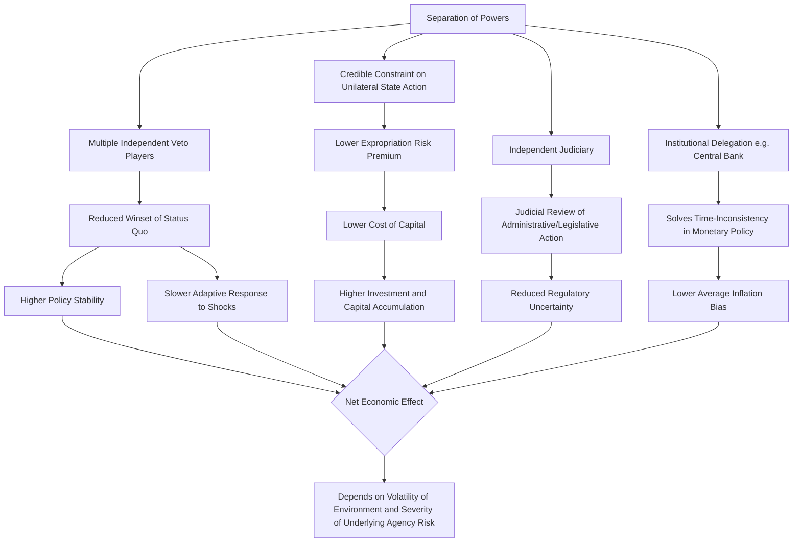

## Separation of powers and economic efficiency

### Overview and Framing

Separation of powers — the constitutional division of governmental authority among legislative, executive, and judicial branches — is analyzed in law and economics as an institutional design choice with direct consequences for economic performance, primarily through its effects on credible commitment, agency-cost control, and policy stability. Rather than treating separation of powers as a purely political or philosophical safeguard against tyranny, the economic approach asks how the structural allocation of veto power and monitoring authority among branches affects investment incentives, contract enforcement, regulatory predictability, and the state's capacity to expropriate wealth.

### Separation of Powers as an Agency-Cost Control Mechanism

Government can be modeled as a principal-agent relationship in which citizens (principals) delegate authority to officials (agents) who may have interests diverging from the citizenry's. Separation of powers is a structural response to the resulting agency problem: by dividing authority among branches with distinct selection mechanisms, terms of office, and constituencies, no single actor can unilaterally convert delegated authority into rent extraction without another branch's cooperation or acquiescence.

$$\text{Agency Cost} = \text{Monitoring Cost} + \text{Bonding Cost} + \text{Residual Loss}$$

Separation of powers primarily operates on the **residual loss** term: even without perfect monitoring, the requirement that multiple independently-selected actors concur before certain state actions can be taken (appointments, appropriations, treaty ratification, judicial enforcement) reduces the scope for any single agent's deviation from citizen interests to translate into realized harm.

**Key Points**

- The economic case for separation of powers does not require assuming officials are venal; it holds even under uncertainty about which officials, if any, will act opportunistically, because the structure limits the *magnitude* of harm from opportunism by any one actor.
- Separation of powers is best understood as a form of institutionalized mutual monitoring, not merely a static division of labor.

### Veto Player Theory and Policy Stability

Tsebelis's veto player framework formalizes separation of powers using spatial (Euclidean) models of policy preferences. A veto player is any individual or collective actor whose agreement is necessary for a change to the status quo policy. The **winset** of the status quo — the set of alternative policies that could defeat and replace it — shrinks as the number of veto players increases and as the ideological (policy) distance between them grows.

$$W(SQ) = \{ x \in \mathbb{R}^n : x \text{ is preferred to } SQ \text{ by all veto players} \}$$

where $W(SQ)$ is the winset of the status quo $SQ$. When $W(SQ) = \emptyset$, the status quo is unbeatable and policy stability is maximal.

**Diagram: Veto Player Winset Shrinkage (svg_diagram)**

<svg xmlns="http://www.w3.org/2000/svg" viewBox="0 0 700 380" font-family="Arial, sans-serif">
<text x="350" y="26" font-size="17" font-weight="bold" text-anchor="middle">Veto Players and the Shrinking Winset (svg_diagram)</text>

<text x="130" y="55" font-size="13" text-anchor="middle" font-weight="bold">One Veto Player</text>

<circle cx="130" cy="180" r="70" fill="`#e8f0fe`" stroke="`#2b579a`" stroke-width="1.5" />

<circle cx="130" cy="180" r="4" fill="`#a32020`" />

<text x="130" y="200" font-size="10" text-anchor="middle">SQ</text>

<text x="130" y="270" font-size="11" text-anchor="middle">Large winset</text>

<text x="130" y="285" font-size="11" text-anchor="middle">Easy policy change</text>

<text x="360" y="55" font-size="13" text-anchor="middle" font-weight="bold">Two Veto Players</text>

<circle cx="330" cy="180" r="65" fill="`#e8f0fe`" stroke="`#2b579a`" stroke-width="1.5" fill-opacity="0.5" />

<circle cx="400" cy="180" r="65" fill="`#fde8e8`" stroke="`#a32020`" stroke-width="1.5" fill-opacity="0.5" />

<circle cx="365" cy="180" r="4" fill="`#1e7a34`" />

<text x="365" y="150" font-size="10" text-anchor="middle">SQ</text>

<text x="365" y="270" font-size="11" text-anchor="middle">Smaller winset</text>

<text x="365" y="285" font-size="11" text-anchor="middle">(overlap region only)</text>

<text x="600" y="55" font-size="13" text-anchor="middle" font-weight="bold">Three Veto Players</text>

<circle cx="570" cy="165" r="55" fill="`#e8f0fe`" stroke="`#2b579a`" stroke-width="1.5" fill-opacity="0.4" />

<circle cx="630" cy="165" r="55" fill="`#fde8e8`" stroke="`#a32020`" stroke-width="1.5" fill-opacity="0.4" />

<circle cx="600" cy="215" r="55" fill="`#fff3cd`" stroke="`#a67c00`" stroke-width="1.5" fill-opacity="0.4" />

<circle cx="600" cy="185" r="4" fill="`#1e7a34`" />

<text x="600" y="270" font-size="11" text-anchor="middle">Winset near empty</text>

<text x="600" y="285" font-size="11" text-anchor="middle">High policy stability</text>

</svg>

**Key Points**

- More veto players (or greater ideological distance among existing veto players) increases policy stability but reduces the capacity of government to respond to new information or exogenous shocks.
- Presidential systems with an independently elected executive and separately elected legislature (especially under divided government) generally generate more veto players than parliamentary fusion-of-powers systems, where the executive is drawn from and dependent on the legislative majority.
- [Inference] The economic implication is a tradeoff: systems with more veto players offer greater protection against arbitrary policy reversal (valuable for long-horizon investment) but may be slower to correct inefficient legacy policies or respond to crises requiring rapid legislative action.

### Credible Commitment and Investment Incentives

Separation of powers is central to the North-Weingast style analysis of credible commitment: a government that can unilaterally alter property rights, contract terms, or regulatory rules whenever politically expedient generates an expropriation risk that rational investors price into their decisions, reducing investment, raising the cost of capital, and lowering long-run capital accumulation.

By requiring the concurrence of multiple independently-accountable branches to change legal rules governing property and contract, separation of powers raises the **cost of ex post opportunism** by government — the classic "hold-up problem" applied to the sovereign-investor relationship.

$$r = r_f + \rho(\text{expropriation risk})$$

where $r$ is the required rate of return demanded by investors, $r_f$ is the risk-free rate, and $\rho(\cdot)$ is a risk premium increasing in the perceived probability of arbitrary state expropriation or rule-changing. A separation-of-powers structure that credibly limits unilateral executive or legislative rule-changing lowers $\rho$, and therefore lowers the cost of capital faced by the economy overall.

**Example**

An independent judiciary empowered to invalidate retroactive tax legislation or uncompensated regulatory takings provides a credible constraint against a scenario where a legislature, having induced investment under one set of rules, opportunistically changes those rules once the investment is sunk (a textbook "time-inconsistency" or "hold-up" problem in dynamic public finance). This checks the temptation described formally in dynamic taxation models where a government's *ex ante* optimal announced tax policy differs from its *ex post* optimal policy once capital is already committed and immobile.

### Independent Central Banks as a Separation-of-Powers Application

The economic literature on central bank independence (Kydland-Prescott, Barro-Gordon) extends the separation-of-powers logic to monetary policy specifically. A government controlling both fiscal policy and money creation faces a time-inconsistency problem: it has an incentive to promise low inflation to anchor expectations, then generate surprise inflation to reduce the real value of public debt or temporarily stimulate output, once private-sector inflation expectations are already fixed.

$$\pi^* = \pi^e + \gamma(u^n - u)$$

This is the core Barro-Gordon inflationary bias result: absent commitment, the discretionary policy equilibrium produces inflation $\pi^*$ above the socially optimal rate, because rational agents anticipate the government's incentive to renege and adjust their expectations $\pi^e$ accordingly, eliminating any real output gain from surprise inflation while leaving the economy with the higher equilibrium inflation rate.

Delegating monetary policy to an institutionally separate, insulated central bank (a form of horizontal separation of powers within the executive function) is modeled as a solution: an independent central bank with a mandate and personnel insulated from short-term electoral or fiscal pressure can credibly commit to low inflation in a way an elected fiscal authority cannot.

**Key Points**

- Central bank independence is a specific institutional instance of the general separation-of-powers logic: separating the authority that benefits from short-term policy deviation (fiscal authority) from the authority that implements the policy instrument (monetary authority).
- Empirical cross-country studies from the 1990s onward have generally found central bank independence associated with lower average inflation, though [Inference] the causal direction and the magnitude of any output-cost tradeoff remain subjects of ongoing empirical debate, particularly regarding whether independence itself or other confounding institutional quality factors drive the correlation.

### Regulatory Predictability and the Judiciary's Role

Separation of powers affects economic efficiency partly through the judiciary's function in enforcing legislative and constitutional constraints on executive/administrative action. Administrative agencies, as delegated implementers of legislative mandates, face agency-cost problems of their own (drift from legislative intent, capture by regulated industries). Judicial review of administrative action — requiring agencies to act within statutory authority and follow required procedures — functions as a check that increases the predictability of the regulatory environment facing firms.

$$\text{Regulatory Uncertainty Premium} \propto \frac{1}{P(\text{judicial enforcement of statutory/procedural limits})}$$

Firms operating under a legal system where administrative overreach faces a credible probability of judicial correction face lower regulatory uncertainty, all else equal, than firms operating where administrative agencies face no meaningful external check — though [Inference] excessively aggressive judicial review of routine regulatory action can itself generate uncertainty and litigation costs, so the relationship between judicial review intensity and regulatory predictability is not strictly monotonic.

### The Efficiency-Responsiveness Tradeoff

The central tension in the economic analysis of separation of powers is the tradeoff between **policy stability/credibility** and **adaptive efficiency** — the system's capacity to update rules efficiently as circumstances change.

| Dimension | High Separation (Many Veto Players) | Low Separation (Fused/Concentrated Power) |
| --- | --- | --- |
| Credibility of long-term commitments | High | Low |
| Investment/capital cost implications | Lower risk premium | Higher risk premium |
| Speed of crisis response | Slower | Faster |
| Risk of policy drift/inefficient status quo persistence | Higher | Lower |
| Risk of arbitrary expropriation or rent extraction | Lower | Higher |
| Transaction costs of ordinary legislation | Higher | Lower |

[Inference] No general theoretical result establishes a single efficient degree of separation of powers applicable across all economies; the efficient level plausibly depends on the volatility of the policy environment the polity faces, the severity of the underlying expropriation/agency risk, and the quality of alternative accountability mechanisms (a free press, competitive elections, an active civil society) that might substitute for formal institutional veto points.

### Diagram: Separation of Powers and Economic Channels

### Empirical Considerations and Critiques

[Unverified] Cross-national empirical work comparing presidential and parliamentary systems, and comparing federations with varying degrees of separation, produces mixed findings on growth and investment outcomes; identifying the causal effect of separation of powers independent of other correlated institutional and historical factors (colonial legal origin, legal tradition, level of economic development at the time of constitutional adoption) remains methodologically contested in the empirical political economy literature.

Critics also note that separation of powers can be nominal rather than substantive: formal constitutional division of authority does not guarantee de facto independence if, for example, a dominant party or executive controls appointments to the ostensibly independent judiciary, or if informal power (patronage networks, military influence) circumvents formal constitutional checks. [Inference] This suggests that the economic benefits attributed to separation of powers in cross-country studies may partly reflect broader institutional quality and rule-of-law culture rather than the formal constitutional text alone.

**Behavioral disclaimer**: The magnitude and even direction of empirical relationships between specific separation-of-powers configurations and economic outcomes vary across studies, time periods, and country samples; the theoretical mechanisms described above characterize the underlying economic logic rather than a guaranteed empirical regularity in any particular jurisdiction.

### Related Topics

- Veto player theory and comparative institutional analysis (Tsebelis)
- Time inconsistency and the Kydland-Prescott critique of discretionary policy
- Central bank independence and monetary policy credibility
- Judicial review and the political economy of courts
- Administrative law and the economics of agency delegation and drift
- Property rights, credible commitment, and long-run growth (North, Weingast)
- Presidential vs. parliamentary systems: comparative constitutional economics
- Divided government and legislative gridlock: economic consequences