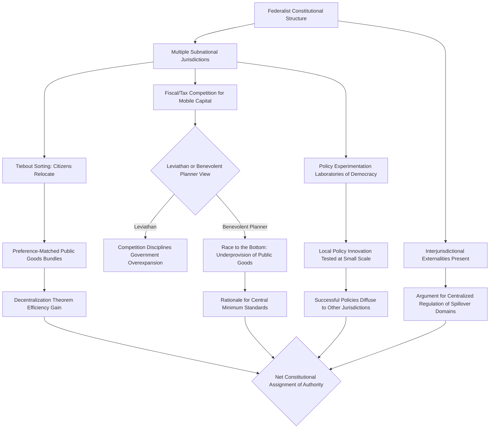

## Federalism as a mechanism for jurisdictional competition

### Overview and Framing

Federalism as a mechanism for jurisdictional competition treats the constitutional division of authority among multiple subnational governments not merely as an administrative convenience but as an institutional structure that subjects governments themselves to competitive discipline analogous to firms in a market. Because citizens and capital can, to varying degrees, relocate across jurisdictional boundaries, subnational governments compete for mobile residents, businesses, and investment by adjusting tax rates, regulatory regimes, and public goods provision. This reframes federalism as an economic mechanism for constraining government behavior through exit, rather than solely through voice (voting).

### Tiebout's Model of Jurisdictional Sorting

Charles Tiebout's 1956 model provides the foundational theoretical basis for viewing decentralized government as a market-like mechanism. In Tiebout's framework, local governments offer differentiated bundles of local public goods $g_j$ financed by local taxes $t_j$. Mobile citizens, aware of the offerings of each jurisdiction, "vote with their feet" by relocating to the jurisdiction whose bundle $(g_j, t_j)$ best matches their preferences.

$$\max_{j} \, u_i(g_j, t_j) \quad \text{subject to individual mobility and jurisdiction choice}$$

Under a stringent set of assumptions — a large number of communities among which to choose, full information about each community's tax-service package, no interjurisdictional externalities or spillovers, costless mobility, and communities operating at an optimal scale — Tiebout sorting can approximate the efficient provision of local public goods that a centralized government, lacking granular information about heterogeneous local preferences, would find difficult to replicate.

**Key Points**

- The Tiebout mechanism substitutes for the standard market failure argument for public goods (non-excludability, non-rivalry preventing efficient private provision) by using *locational* choice as a revealed-preference mechanism, since a citizen's choice of where to live becomes analogous to a purchase decision.
- The model requires citizens to sort into homogeneous-preference communities; heterogeneity within a jurisdiction after sorting is, in principle, minimized as an equilibrium outcome.
- [Inference] The strength of Tiebout sorting in reality is constrained by the cost of relocation (housing costs, employment ties, social networks), meaning perfect sorting is a theoretical benchmark rather than an empirically observed outcome, though partial sorting effects are frequently documented in local public finance research.

### Diagram: Tiebout Sorting Mechanism (svg_diagram)

<svg xmlns="http://www.w3.org/2000/svg" viewBox="0 0 720 380" font-family="Arial, sans-serif">
<text x="360" y="26" font-size="17" font-weight="bold" text-anchor="middle">Tiebout Sorting Across Competing Jurisdictions (svg_diagram)</text>
<rect x="40" y="70" width="180" height="90" rx="8" fill="#e8f0fe" stroke="#2b579a" stroke-width="1.5" />
<text x="130" y="95" font-size="12" text-anchor="middle" font-weight="bold">Jurisdiction A</text>
<text x="130" y="115" font-size="11" text-anchor="middle">High tax, t_A</text>
<text x="130" y="132" font-size="11" text-anchor="middle">High services, g_A</text>
<text x="130" y="149" font-size="10" text-anchor="middle">(e.g., strong schools)</text>
<rect x="270" y="70" width="180" height="90" rx="8" fill="#fff3cd" stroke="#a67c00" stroke-width="1.5" />
<text x="360" y="95" font-size="12" text-anchor="middle" font-weight="bold">Jurisdiction B</text>
<text x="360" y="115" font-size="11" text-anchor="middle">Moderate tax, t_B</text>
<text x="360" y="132" font-size="11" text-anchor="middle">Moderate services, g_B</text>
<text x="360" y="149" font-size="10" text-anchor="middle">(balanced bundle)</text>
<rect x="500" y="70" width="180" height="90" rx="8" fill="#e6f4ea" stroke="#1e7a34" stroke-width="1.5" />
<text x="590" y="95" font-size="12" text-anchor="middle" font-weight="bold">Jurisdiction C</text>
<text x="590" y="115" font-size="11" text-anchor="middle">Low tax, t_C</text>
<text x="590" y="132" font-size="11" text-anchor="middle">Low services, g_C</text>
<text x="590" y="149" font-size="10" text-anchor="middle">(minimal bundle)</text>
<circle cx="130" cy="260" r="6" fill="#333" />
<circle cx="360" cy="260" r="6" fill="#333" />
<circle cx="590" cy="260" r="6" fill="#333" />
<text x="130" y="285" font-size="10" text-anchor="middle">High-preference citizens</text>
<text x="360" y="285" font-size="10" text-anchor="middle">Median-preference citizens</text>
<text x="590" y="285" font-size="10" text-anchor="middle">Low-preference citizens</text>
<line x1="130" y1="240" x2="130" y2="165" stroke="#2b579a" stroke-width="1.5" marker-end="url(#a2)" />
<line x1="360" y1="240" x2="360" y2="165" stroke="#a67c00" stroke-width="1.5" marker-end="url(#a2)" />
<line x1="590" y1="240" x2="590" y2="165" stroke="#1e7a34" stroke-width="1.5" marker-end="url(#a2)" />

<text x="360" y="340" font-size="12" text-anchor="middle" font-style="italic">Citizens relocate ("vote with their feet") to match preferred (g, t) bundle</text>

</svg>

### The Decentralization Theorem

Wallace Oates' Decentralization Theorem provides the counterpart efficiency benchmark: absent economies of scale in provision and absent interjurisdictional spillovers, decentralized provision of a local public good — tailored to each jurisdiction's specific demand — is always at least as efficient as, and generically strictly more efficient than, uniform centralized provision, because centralization forces a single output level $g$ on all jurisdictions regardless of heterogeneous local demand.

$$W_{decentralized} = \sum_j \max_{g_j} \int_{i \in j} u_i(g_j) \, di \; \geq \; W_{centralized} = \sum_j \int_{i \in j} u_i(\bar{g}) \, di$$

where $\bar{g}$ is the single uniform output level a central planner would set (typically approximating the average preference across all jurisdictions), and the inequality is generically strict whenever local preferences $g_j^*$ differ across jurisdictions.

**Key Points**

- The Decentralization Theorem is a *pure preference-heterogeneity* argument, distinct from Tiebout sorting: it holds even holding population fixed within jurisdictions (no relocation required), simply because a decentralized government can tailor $g_j$ to its jurisdiction's actual demand while a central planner cannot costlessly price-discriminate across regions.
- The theorem's efficiency conclusion is explicitly conditional on the *absence* of scale economies and spillovers; when either is present, the case for centralization strengthens correspondingly.

### The Tradeoff: Centralization vs. Decentralization

The constitutional assignment of authority between central and subnational governments under this framework is a solution to a tradeoff between two competing forces:

| Factor | Favors Centralization | Favors Decentralization |
| --- | --- | --- |
| Interjurisdictional externalities/spillovers | Strong argument (e.g., pollution crossing borders) | Weak spillovers favor local control |
| Economies of scale in provision | Strong argument (e.g., national defense) | Minimal scale economies favor local control |
| Heterogeneity of local preferences | Weakens centralization case | Strong argument for tailored local provision |
| Information about local conditions/costs | Central government has less | Local governments have more |
| Risk of interjurisdictional "race to the bottom" | Argument for minimum central standards | N/A |
| Value of policy experimentation ("laboratories of democracy") | Weakens centralization case | Strong argument for decentralization |

### Fiscal Competition: Tax Competition and the "Race to the Bottom" Debate

Beyond public-goods matching, federalism subjects subnational governments to **fiscal competition** for mobile capital and high-income residents. Because capital is more mobile across jurisdictional borders than most forms of labor (particularly for corporate investment), jurisdictions have an incentive to lower capital tax rates relative to the rate a coordinated, non-competing set of jurisdictions would choose, in order to attract or retain investment.

$$t_j^* = \arg\max_j \left[ \text{Revenue}(t_j, K_j(t_j)) \right], \quad \frac{\partial K_j}{\partial t_j} < 0$$

where $K_j(t_j)$ is capital located in jurisdiction $j$ as a decreasing function of its own tax rate relative to competitors. Because each jurisdiction fails to internalize that lowering $t_j$ to attract capital imposes a negative fiscal externality on competing jurisdictions (whose capital base shrinks correspondingly), the resulting Nash equilibrium tax rate across all competing jurisdictions is generally **below** the rate that would maximize aggregate welfare across all jurisdictions combined — the classic "race to the bottom" prediction from tax competition theory (Zodrow-Mieszkowski, Wilson).

**Two competing schools of thought exist regarding whether this is efficient or inefficient:**

- **"Leviathan" view (Brennan-Buchanan)**: Because governments are prone to overexpansion absent external constraint (a rent-seeking or budget-maximizing tendency of political actors), tax competition is a *welfare-improving* disciplinary mechanism, constraining otherwise excessive government size and forcing efficient public spending, analogous to product-market competition disciplining monopolistic firms.
- **"Race to the bottom" view (Oates, Zodrow-Mieszkowski)**: Because governments are (at least approximately) benevolent welfare-maximizers responding to genuine constituent preferences, tax competition produces an inefficiently low level of public goods provision relative to what citizens would collectively prefer, since no single jurisdiction can unilaterally raise taxes to fund a higher (efficient) level of public goods without losing its capital base to competitors.

**Key Points**

- Which view is correct is fundamentally an empirical question about the underlying objective function of subnational governments (rent-seeking Leviathan vs. benevolent planner), and [Inference] the answer plausibly varies across jurisdictions and time periods depending on the strength of local democratic accountability mechanisms.
- The race-to-the-bottom concern provides the standard economic rationale for constitutional or supra-jurisdictional minimum standards in certain policy domains (environmental regulation floors, minimum wage floors, certain federal welfare-spending minimums) even within an otherwise decentralized federal system.

### Diagram: Federalism and Jurisdictional Competition Channels

### "Laboratories of Democracy" and Policy Experimentation

A related economic rationale for federalism, associated with Justice Brandeis's phrase, treats decentralization as valuable for generating information under genuine uncertainty about which policy design is efficient. Because policy experimentation at the national level carries the risk of a single, large-scale, costly failure, decentralized policy authority allows multiple subnational jurisdictions to trial different approaches simultaneously, generating comparative information about relative policy performance at a fraction of the cost and risk of nationwide implementation, with successful approaches subsequently available for adoption by other jurisdictions or the center.

**Example**

State-level variation in approaches to occupational licensing, minimum wage levels, or unemployment insurance program design within a federal system such as the United States allows researchers and policymakers to observe comparative outcomes across jurisdictions with differing policies, generating quasi-experimental evidence that would be unavailable under uniform national policy. [Inference] The informational value of this mechanism depends on jurisdictions being sufficiently comparable (similar underlying economic conditions) that policy-outcome differences can be plausibly attributed to the policy difference itself rather than confounding factors.

### Empirical Considerations and Limits of the Competitive Federalism Model

[Unverified] The empirical magnitude of Tiebout sorting and tax competition effects varies substantially across the public finance and urban economics literature, with estimated elasticities of capital and household mobility with respect to tax differentials differing significantly by study design, geographic scope (intra-metropolitan vs. interstate vs. international), and time period.

Constraints on the pure competitive-federalism model in practice include:

- **Imperfect mobility**: Housing costs, employment ties, family and social networks, and the costs of establishing residency (school enrollment disruption, professional licensing portability) all reduce the responsiveness of relocation decisions to tax-service differentials relative to the frictionless Tiebout assumption.
- **Interjurisdictional externalities**: Many policy domains (environmental regulation, transportation infrastructure, public health) generate spillovers across jurisdictional boundaries that violate the Decentralization Theorem's no-spillover assumption, weakening the efficiency case for decentralized provision in those specific domains.
- **Unequal fiscal capacity across jurisdictions**: Poorer jurisdictions may be unable to fund even efficient levels of local public goods from their own tax base, motivating intergovernmental fiscal transfer mechanisms that themselves alter the competitive dynamics predicted by the pure model.

**Behavioral disclaimer**: The strength of jurisdictional competition effects, and whether such competition is welfare-improving or welfare-reducing in any specific policy domain, depends heavily on context-specific factors including mobility costs, the presence of externalities, and the underlying objective function of subnational governments; the models above describe the theoretical channels rather than a universally applicable empirical prediction.

### Related Topics

- Fiscal federalism and intergovernmental transfer design
- Tax competition theory and international corporate tax coordination
- Local public finance and property tax capitalization
- Public choice theory and the Leviathan model of government (Brennan-Buchanan)
- Comparative federalism: cooperative vs. dual vs. competitive federalism models
- Interjurisdictional externalities and environmental federalism
- Constitutional allocation of enumerated vs. residual powers
- Metropolitan fragmentation and local government consolidation debates