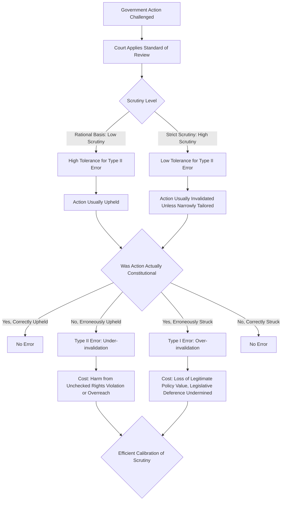

## Economic analysis of judicial review

### Overview and Framing

Economic analysis of judicial review examines the practice of courts invalidating legislative or executive action as unconstitutional through the lens of institutional design, agency theory, and welfare economics. Rather than treating judicial review as a purely doctrinal or normative-political question (countermajoritarian difficulty, interpretive theory), the economic approach asks what function judicial review serves in the broader constitutional architecture, what incentive structures it creates for other branches of government, and under what conditions it improves versus degrades aggregate social welfare.

### Judicial Review as Third-Party Contract Enforcement

Treating the constitution as an incomplete long-term contract (per the constitutional-design literature) generates an immediate enforcement problem: the government is itself a party to this contract and cannot be relied upon for impartial self-enforcement of constraints upon its own power. Judicial review supplies a **third-party enforcement mechanism**, structurally analogous to the role of courts in ordinary contract and commercial law, where an independent adjudicator applies the negotiated terms against a party's ex post self-interested reinterpretation of them.

$$P(\text{Constraint Binds}) = P(\text{Violation Detected}) \times P(\text{Judicial Invalidation} \mid \text{Detected}) \times P(\text{Compliance} \mid \text{Invalidated})$$

The value of judicial review as an enforcement mechanism is a function of all three probabilities, not merely the court's willingness to rule against the political branches. A high-quality constitutional constraint requires reasonably high values across detection, adjudication, and compliance — a chain that can fail at any link even where courts themselves act with full independence and rigor.

**Key Points**

- Judicial review's economic value lies in raising the *expected cost* to political actors of violating constitutional constraints, thereby increasing the credibility of the commitments those constraints represent to citizens, investors, and other branches.
- Unlike private contract enforcement, judicial review has no independent coercive apparatus; the ultimate compliance probability depends on the political branches' and society's willingness to accept judicial rulings — the recursive "who guards the guardians" problem.

### Judicial Independence as a Precondition for Enforcement Value

The enforcement value of judicial review is conditional on the judiciary's actual independence from the political actors it monitors. If judicial appointment, tenure, compensation, or budget can be manipulated by the very branches subject to review, the court's rulings cease to function as an external check and instead risk becoming an extension of the reviewed branch's own preferences.

Economic models of judicial independence typically examine:

- **Appointment mechanisms**: Whether judges are selected by a single branch (increasing capture risk) or through mechanisms requiring cross-branch concurrence (e.g., executive nomination with legislative confirmation), which raises the cost of appointing judges who will reliably favor the appointing branch.
- **Tenure security**: Life tenure or long, non-renewable terms reduce a judge's exposure to retaliation for unpopular rulings against sitting political actors, addressing a specific time-consistency problem in judicial incentives.
- **Compensation protection**: Constitutional prohibitions on reducing judicial salaries during tenure remove a direct retaliation channel available to the legislature.

**Example**

A constitutional provision guaranteeing life tenure "during good behavior" for federal judges, combined with a prohibition on diminishing their compensation while in office, is designed to insulate judicial decision-making from the electoral and budgetary pressures that could otherwise compromise a judge's willingness to rule against a sitting government's preferred policy, thereby preserving the judiciary's function as a credible external monitor.

### The Countermajoritarian Function as Efficient Precommitment

From a public-choice perspective, the "countermajoritarian difficulty" — that unelected judges can override decisions made by elected, majoritarian bodies — is reframed not as a democratic deficiency but as the constitutional design's *intended function*, analogous to Ulysses binding himself to the mast. Certain constraints (protection of political minorities, entrenched property rights, procedural due process guarantees) are placed beyond ordinary majoritarian revision precisely because a simple majority, in any given period, may have an incentive to violate them for short-term gain at the expense of long-term aggregate welfare or minority interests.

$$U(\text{Precommitment}) = U(\text{Long-run Credibility Gain}) - U(\text{Loss of Majoritarian Flexibility})$$

**Key Points**

- Under this framing, judicial review functions as the enforcement arm of a constitutional-stage precommitment made under conditions of greater uncertainty about future political position (the veil-of-ignorance logic from constitutional design theory), rather than as an ongoing anti-democratic override of majority will.
- [Inference] This justification's persuasiveness depends on accepting that the constitutional-stage bargain was in fact broadly fair and reflective of citizen interests at the time of adoption — a premise itself subject to the historical-contingency critiques raised in the broader constitutional political economy literature.

### Judicial Review and Legislative Incentive Effects

Economic analysis extends beyond the direct case-by-case effect of judicial review to its **anticipatory** effect on legislative and executive behavior. Because political actors know that certain categories of action face a nontrivial probability of judicial invalidation, judicial review shapes the *ex ante* menu of policies legislatures and executives are willing to propose, independent of any particular ruling.

$$E[\text{Payoff to Legislature from Policy } x] = B(x) - P(\text{Invalidation} \mid x) \cdot C_{invalidation}$$

where $B(x)$ is the political/social benefit of policy $x$ and $C_{invalidation}$ represents the costs of pursuing a policy that is ultimately struck down (wasted legislative resources, reputational cost, policy uncertainty for affected parties during litigation). A legislature rationally discounts proposals with high anticipated invalidation risk, meaning judicial review's primary economic effect may operate largely through **deterrence of constitutionally dubious legislation before enactment**, rather than through the formal act of invalidation itself.

**Diagram: Judicial Review's Ex Ante Deterrent Channel (svg_diagram)**

<svg xmlns="http://www.w3.org/2000/svg" viewBox="0 0 720 340" font-family="Arial, sans-serif">
<text x="360" y="26" font-size="17" font-weight="bold" text-anchor="middle">Judicial Review: Direct and Anticipatory Channels (svg_diagram)</text>
<rect x="30" y="60" width="180" height="55" rx="8" fill="#e8f0fe" stroke="#2b579a" stroke-width="1.5" />
<text x="120" y="90" font-size="12" text-anchor="middle">Legislature Considers Policy x</text>
<line x1="210" y1="87" x2="290" y2="87" stroke="#333" stroke-width="1.5" marker-end="url(#a3)" />
<polygon points="290,60 400,87 290,115 180,87" fill="#fff3cd" stroke="#a67c00" stroke-width="1.5" />
<text x="290" y="82" font-size="11" text-anchor="middle">High P(Invalidation)?</text>
<line x1="400" y1="87" x2="470" y2="87" stroke="#333" stroke-width="1.5" marker-end="url(#a3)" />
<text x="435" y="77" font-size="10" text-anchor="middle">Yes</text>
<rect x="470" y="60" width="220" height="55" rx="8" fill="#fde8e8" stroke="#a32020" stroke-width="1.5" />
<text x="580" y="82" font-size="12" text-anchor="middle">Anticipatory Deterrence</text>
<text x="580" y="99" font-size="10" text-anchor="middle">Policy narrowed or abandoned ex ante</text>
<line x1="290" y1="115" x2="290" y2="165" stroke="#333" stroke-width="1.5" marker-end="url(#a3)" />
<text x="320" y="145" font-size="10">No</text>
<rect x="180" y="165" width="220" height="55" rx="8" fill="#e6f4ea" stroke="#1e7a34" stroke-width="1.5" />
<text x="290" y="187" font-size="12" text-anchor="middle">Policy Enacted</text>
<text x="290" y="204" font-size="10" text-anchor="middle">Proceeds through normal implementation</text>
<line x1="580" y1="115" x2="580" y2="165" stroke="#333" stroke-width="1.5" marker-end="url(#a3)" />
<rect x="470" y="165" width="220" height="55" rx="8" fill="#fff3cd" stroke="#a67c00" stroke-width="1.5" />
<text x="580" y="187" font-size="12" text-anchor="middle">Policy Enacted Despite Risk</text>
<text x="580" y="204" font-size="10" text-anchor="middle">e.g., political urgency outweighs risk</text>
<line x1="580" y1="220" x2="580" y2="255" stroke="#333" stroke-width="1.5" marker-end="url(#a3)" />
<rect x="470" y="255" width="220" height="55" rx="8" fill="#fde8e8" stroke="#a32020" stroke-width="1.5" />
<text x="580" y="277" font-size="12" text-anchor="middle">Direct Review Channel</text>
<text x="580" y="294" font-size="10" text-anchor="middle">Litigated; possible invalidation</text>
</svg>

### Type I / Type II Error Tradeoff in Judicial Review Intensity

Judicial review intensity — how readily courts invalidate legislative or executive action — presents its own error-cost tradeoff structurally similar to sanctions design:

- **Type I Error (over-invalidation)**: Courts strike down policies that were in fact constitutionally sound and socially beneficial, substituting judicial policy preference for legitimate legislative judgment (sometimes termed "judicial activism" in the doctrinal literature, though the economic framing avoids the normative connotation and treats it as an error-cost category).
- **Type II Error (under-invalidation)**: Courts fail to strike down policies that genuinely violate constitutional constraints, allowing the harm those constraints were designed to prevent (rights violations, expropriation, agency overreach) to proceed unchecked.

$$\text{Total Error Cost} = P(\text{Type I}) \cdot C_{I} + P(\text{Type II}) \cdot C_{II}$$

The efficient standard of judicial review (the intensity of scrutiny courts apply — e.g., rational basis vs. intermediate scrutiny vs. strict scrutiny in U.S. constitutional doctrine) can be understood as an attempt to calibrate this tradeoff differently across policy categories, applying more searching review (lower tolerance for Type II error) to categories where the potential harm from erroneous legislative/executive action is judged especially severe or difficult to reverse through ordinary political processes (e.g., restrictions on fundamental rights, classifications historically associated with majoritarian bias against politically powerless minorities).

**Key Points**

- Tiered scrutiny frameworks in constitutional doctrine can be read, through this economic lens, as a proxy for varying $C_I$ relative to $C_{II}$ across different categories of government action.
- [Inference] This economic reading does not resolve the underlying normative dispute over which policy categories genuinely warrant heightened scrutiny; it reframes that dispute as a question about the relative social costs of erroneous invalidation versus erroneous non-invalidation in each category, which is itself a matter of empirical and normative judgment rather than one derivable from theory alone.

### Diagram: Judicial Review Error-Cost Structure

### Public Choice Critiques of Judicial Review

Public choice scholarship raises a distinct concern: judges, like legislators, are themselves self-interested agents subject to their own agency problems, including ideological preference, career concerns (for judges facing reappointment, election, or promotion), and potential capture by legal elites or organized interest groups filing repeat litigation (e.g., well-resourced repeat litigants able to strategically select cases and jurisdictions favorable to their preferred doctrinal outcomes — a phenomenon studied under the "haves come out ahead" literature in law and society/law and economics scholarship).

[Inference] This critique implies that judicial review's net welfare effect cannot be assumed positive simply because courts are formally independent of the legislative and executive branches; the relevant comparative question is whether judicial decision-making, subject to its own distinct agency costs and biases, produces systematically better-calibrated outcomes than the political-branch decision-making it reviews — a comparative institutional question that admits no universal answer and is likely to vary by policy domain, judicial selection method, and the broader legal culture.

### Judicial Review and Regulatory Predictability

Beyond constitutional constitutional-rights litigation, judicial review of administrative agency action (reviewing whether agencies acted within delegated statutory authority and followed required procedures) functions as a distinct but related check on executive-branch agency costs. This dimension of judicial review is analyzed in administrative law and economics as reducing the **regulatory uncertainty premium** faced by regulated firms, since a credible probability of judicial correction for administrative overreach constrains the scope for arbitrary or ultra vires agency action, though [Inference] excessively intensive review of routine agency determinations can itself generate litigation costs and delay that offset some of this predictability benefit.

### Empirical Considerations

[Unverified] Cross-national empirical work comparing the economic effects of jurisdictions with strong versus weak judicial review (e.g., systems with active constitutional courts versus parliamentary sovereignty systems lacking a judicial review function) produces mixed and contested findings; separating the causal effect of judicial review itself from broader correlated measures of rule-of-law quality, legal tradition, and historical institutional development remains a significant identification challenge in this literature.

**Behavioral disclaimer**: Actual judicial behavior — the standard of review applied, the willingness to invalidate politically salient legislation, and compliance by other branches with adverse rulings — varies substantially across jurisdictions, historical periods, and individual courts; the models above characterize the underlying economic logic and incentive structures rather than a guaranteed empirical pattern in any specific legal system.

### Related Topics

- Constitutional design as incomplete contracting and credible commitment
- Judicial independence: selection mechanisms, tenure, and compensation protections
- Tiered scrutiny doctrine and its economic rationale (rational basis, intermediate, strict scrutiny)
- Public choice theory applied to judicial behavior and decision-making
- Administrative law and the economics of agency delegation, drift, and review
- The countermajoritarian difficulty in constitutional theory
- Comparative constitutional courts: centralized vs. diffuse judicial review models
- Repeat-player litigation dynamics and interest group capture of courts