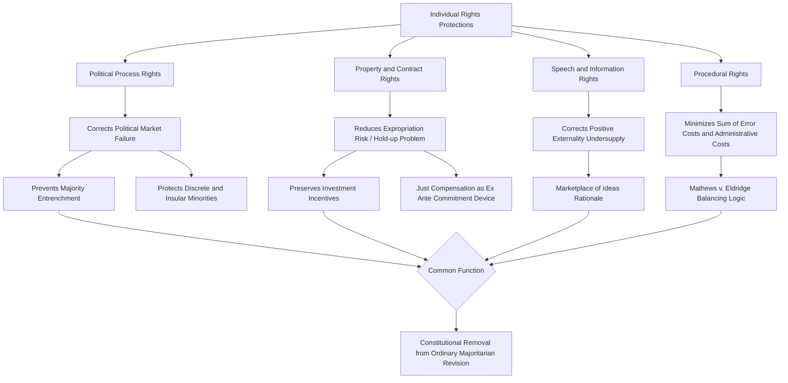

## Economic analysis of individual rights protections

### Overview and Framing

Economic analysis of individual rights protections applies property-rights theory, public choice, and welfare economics to constitutionally entrenched individual rights (speech, property, due process, equal protection, and similar guarantees). Rather than treating rights purely as moral entitlements independent of consequences, the economic approach asks what function constitutionalizing a right serves relative to leaving the matter to ordinary majoritarian legislation, and what efficiency properties different rights-protection regimes exhibit.

### Rights as Constitutionally Entrenched Property Rules

A foundational move in this literature (drawing on Calabresi and Melamed's property rule / liability rule framework, extended to constitutional rights) is to treat individual rights as a form of property entitlement held against the state, protected by a **property rule** — an entitlement that cannot be taken without the holder's consent — rather than merely a **liability rule**, under which the entitlement can be taken but the taker must pay objectively-determined compensation.

$$\text{Property Rule: } \text{Taking requires } V \geq V^{reservation}_{holder}, \text{ set by holder}$$

$$\text{Liability Rule: } \text{Taking permitted at price } p = V^{court-determined}, \text{ set externally}$$

Constitutionalizing a right as subject to a property-rule-like protection (e.g., strict scrutiny requiring near-insurmountable justification before infringement) reflects a judgment that the entitlement holder's own valuation is more reliable than externally-imposed compensation, or that transaction costs of negotiated exchange between the state and the rights-holder are low enough that voluntary exchange (e.g., eminent domain requiring "just compensation" negotiated or judicially assessed) is preferable to unilateral taking.

**Key Points**

- Most individual rights against the state function closer to a hybrid: some (core political speech, freedom from uncompensated physical taking) receive near-absolute property-rule protection, while others (regulatory takings, certain due process interests) are protected by liability-rule-like compensation requirements.
- [Inference] The choice between property-rule and liability-rule protection for a given right can be understood as reflecting an implicit judgment about the relative transaction costs of negotiated versus judicially-imposed valuation in that context, though this is a normative reconstruction of doctrine rather than an explicit doctrinal test courts apply.

### Rights as Solutions to Externalities from Majoritarian Decision-Making

A central economic rationale for constitutionally entrenching individual rights, distinct from ordinary legislative protection, addresses a specific **externality problem in majoritarian voting**: a bare majority deciding policy through ordinary legislation does not fully internalize the costs imposed on the minority whose rights or interests are burdened by that policy.

Recall the Buchanan-Tullock external-cost function $C(k)$ from constitutional voting-rule design: rights that receive constitutional (rather than ordinary statutory) protection are effectively assigned the maximal possible barrier to majoritarian override — removed from the $k$-percent voting-rule spectrum entirely and placed instead under judicial review with a high threshold for permissible infringement. This reflects a judgment that certain categories of majoritarian decision (restricting minority political participation, targeting unpopular groups, restricting politically disfavored speech) carry systematically higher external costs than the median piece of ordinary legislation, justifying removal from simple majoritarian control altogether.

$$C_{rights\text{-}protected\text{-}policy}(k) \gg C_{ordinary\text{-}policy}(k) \quad \text{for any given } k$$

**Example**

Constitutional protection of minority political speech against majoritarian suppression addresses a structural externality: the political majority benefiting from suppressing minority viewpoints does not bear the full social cost of that suppression, which includes lost information value to the broader polity, chilling of future political competition, and entrenchment of the majority's own position against electoral correction — costs that a simple majority vote systematically fails to internalize.

### The Ely "Representation-Reinforcement" Theory as an Economic Argument

John Hart Ely's process-based theory of judicial review — that courts should intervene most readily to protect rights where the ordinary political process is itself malfunctioning (e.g., a majority entrenching itself against political competition, or systematically excluding a "discrete and insular minority" from the political bargaining process that would otherwise protect their interests) — maps closely onto public choice concerns about political market failure.

$$\text{Judicial Intervention Warranted} \Leftrightarrow \text{Political Market Failure Present}$$

Political market failure in this sense parallels ordinary market failure categories: a "monopoly" problem (incumbent majority blocking political competition through gerrymandering, ballot access restrictions, or suppression of opposition speech) or an "externality" problem (majority imposing costs on a minority group excluded from the political bargaining coalition that would otherwise force internalization of those costs, such as a group facing pervasive discrimination that prevents effective coalition-formation and vote-trading with other political actors).

**Key Points**

- This framing provides an economic rationale for heightened judicial scrutiny of restrictions on political participation itself (voting rights, political speech, association) distinct from and prior to scrutiny of substantive policy outcomes — protecting the *process* by which political preferences translate into policy is a precondition for majoritarian decision-making to reflect genuine aggregate preferences at all.
- [Inference] Identifying which groups constitute a "discrete and insular minority" facing genuine political-process exclusion, versus a group that has simply lost a fair political contest, is a contestable empirical and doctrinal judgment not resolved by the economic framework itself.

### Diagram: Rights Protection and Political Market Failure (svg_diagram)

<svg xmlns="http://www.w3.org/2000/svg" viewBox="0 0 720 380" font-family="Arial, sans-serif">
<text x="360" y="26" font-size="16" font-weight="bold" text-anchor="middle">Individual Rights as Correction for Political Market Failure (svg_diagram)</text>
<rect x="30" y="60" width="300" height="80" rx="8" fill="#e8f0fe" stroke="#2b579a" stroke-width="1.5" />
<text x="180" y="85" font-size="13" text-anchor="middle" font-weight="bold">Functioning Political Market</text>
<text x="180" y="105" font-size="11" text-anchor="middle">Groups can form coalitions,</text>
<text x="180" y="120" font-size="11" text-anchor="middle">trade votes, compete for office</text>
<rect x="390" y="60" width="300" height="80" rx="8" fill="#fde8e8" stroke="#a32020" stroke-width="1.5" />
<text x="540" y="85" font-size="13" text-anchor="middle" font-weight="bold">Political Market Failure</text>
<text x="540" y="105" font-size="11" text-anchor="middle">Entrenchment, exclusion, or</text>
<text x="540" y="120" font-size="11" text-anchor="middle">suppression blocks coalition-formation</text>
<line x1="180" y1="140" x2="180" y2="185" stroke="#333" stroke-width="1.5" marker-end="url(#a4)" />
<rect x="60" y="185" width="240" height="55" rx="8" fill="#e6f4ea" stroke="#1e7a34" stroke-width="1.5" />
<text x="180" y="207" font-size="12" text-anchor="middle">Ordinary Majoritarian Process</text>
<text x="180" y="224" font-size="10" text-anchor="middle">Deference to legislative outcome</text>
<line x1="540" y1="140" x2="540" y2="185" stroke="#333" stroke-width="1.5" marker-end="url(#a4)" />
<rect x="420" y="185" width="240" height="55" rx="8" fill="#fff3cd" stroke="#a67c00" stroke-width="1.5" />
<text x="540" y="207" font-size="12" text-anchor="middle">Heightened Judicial Scrutiny</text>
<text x="540" y="224" font-size="10" text-anchor="middle">Ely's representation-reinforcement</text>
<line x1="540" y1="240" x2="540" y2="285" stroke="#333" stroke-width="1.5" marker-end="url(#a4)" />
<rect x="420" y="285" width="240" height="60" rx="8" fill="#fde8e8" stroke="#a32020" stroke-width="1.5" />
<text x="540" y="308" font-size="12" text-anchor="middle">Constitutional Rights Protection</text>
<text x="540" y="325" font-size="10" text-anchor="middle">Speech, voting, equal protection</text>
<text x="540" y="340" font-size="10" text-anchor="middle">as process-correcting mechanism</text>
</svg>

### Rights, Investment Incentives, and Sunk-Cost Expropriation

Property and contract rights protections carry direct economic-efficiency implications through their effect on investment behavior, applying the general credible-commitment logic from constitutional design theory to specific rights categories.

**Takings and regulatory expropriation**: A citizen or firm considering a long-lived, irreversible investment (a factory, a patent-dependent R&D program, a long-term lease improvement) faces a **hold-up risk**: once the investment is sunk, the government has an increased temptation to impose taxes, regulations, or outright takings that extract the investment's value, since the sunk investor's outside option (relocating the already-built asset) is now foreclosed.

$$\text{Investment Level} = I^* \quad \text{where} \quad I^* = \arg\max_I \left[ E[R(I)] - I - \rho(\text{expropriation risk}) \cdot I \right]$$

Constitutional protection against uncompensated takings (property rule protection with a "just compensation" requirement) reduces $\rho(\cdot)$, restoring investment incentives closer to the first-best level that would prevail absent expropriation risk.

**Key Points**

- The "just compensation" requirement for takings functions economically as a mechanism to preserve investment incentives ex ante, distinct from any concern about fairness to the individual property owner ex post — though both justifications are typically invoked in the doctrinal literature.
- [Inference] The efficiency case for compensation requirements is strongest for physical takings of already-sunk investment and weaker (more contested) for regulatory restrictions on future use, since the latter category raises harder line-drawing questions about which regulatory burdens constitute a compensable "taking" versus ordinary background regulatory risk that a rational investor should have anticipated.

### Free Speech Protections: An Economic (Marketplace of Ideas) Rationale

Constitutional protection of speech has an economic rationale distinct from its political-participation function discussed above: speech and information have significant positive externalities (a speaker's information often benefits listeners beyond the speaker's own private return from speaking), suggesting that private incentives alone would tend to produce an **undersupply** of valuable speech/information relative to the social optimum absent strong protection against suppression, which would only exacerbate this undersupply.

$$MSB(\text{speech}) > MPB(\text{speech})$$

where $MSB$ is marginal social benefit and $MPB$ is marginal private benefit to the speaker — the standard positive-externality condition implying underprovision absent correction. Strong constitutional protection against government suppression addresses one (though not the only) obstacle to speech provision, though it does not directly subsidize speech to correct the underlying externality-driven underprovision; it primarily removes an additional suppression-based disincentive layered on top of the baseline externality problem.

[Inference] This economic framing is a supplementary, not exclusive, justification for free speech protection in the broader legal literature, which also emphasizes non-economic values (autonomy, self-governance, truth-seeking through open discourse) that are not fully captured by the externality-correction framing alone.

### Due Process, Notice, and Transaction-Cost Reduction

Procedural due process guarantees (notice and opportunity to be heard before government deprivation of life, liberty, or property) can be analyzed as a mechanism for reducing the error costs and transaction costs of government decision-making, applying a Type I / Type II error framework similar to that used for judicial review scrutiny levels generally.

$$\text{Optimal Procedure} = \arg\min_{\text{procedure}} \left[ P(\text{erroneous deprivation}) \cdot C_{error} + \text{Administrative Cost of Procedure} \right]$$

This is the economic logic underlying the U.S. Supreme Court's *Mathews v. Eldridge* balancing test, which explicitly weighs the private interest affected, the risk of erroneous deprivation under existing procedures and the probable value of additional procedural safeguards, against the government's interest including the administrative and fiscal burden of additional procedures — a direct application of cost-minimization logic to procedural design. [Unverified — whether courts in practice apply this balancing test with anything resembling quantitative rigor, versus using it as a looser qualitative framework, is a matter of ongoing doctrinal debate rather than settled economic fact.]

### Diagram: Rights Protection Economic Rationale Map

### Public Choice Critique: Rights as Interest-Group Entrenchment

A skeptical strand of the public choice literature warns that constitutionally entrenched rights are not always neutral corrections of political market failure but can themselves reflect successful interest-group capture at the constitutional-drafting stage — a politically powerful group at the time of adoption may succeed in constitutionally entrenching protections that favor its own interests against future majoritarian correction, effectively using constitutional status to lock in a favorable bargain that an ordinary legislative majority might later wish to revisit.

[Inference] This critique does not deny that rights protections can serve genuine efficiency-enhancing or process-correcting functions; it cautions against assuming that constitutional status alone certifies a right's efficiency, since the same entrenchment mechanism that protects a "genuine" minority from majoritarian externality can equally protect a powerful faction's rent-seeking gain from majoritarian correction.

### Empirical Considerations

[Unverified] Empirical work attempting to measure the economic effects of specific rights protections (e.g., property rights security and investment/growth, judicial protection of contract enforcement and credit market development) generally finds positive correlations between measured rights security and economic outcomes, but faces the same endogeneity and reverse-causality concerns present throughout the constitutional political economy literature — societies capable of sustaining credible rights protections may already possess confounding institutional advantages that independently drive economic performance.

**Behavioral disclaimer**: The degree to which any given constitutional rights regime functions as intended — correcting genuine political-process failures or expropriation risk rather than entrenching a historically dominant faction's interests — depends on context-specific institutional and historical factors; the frameworks above describe underlying economic logic and rationale rather than a guarantee of any particular jurisdiction's actual rights-protection performance.

### Related Topics

- Property rule vs. liability rule protection (Calabresi-Melamed framework)
- Takings law and the economics of eminent domain and regulatory takings
- Ely's representation-reinforcement theory and process-based judicial review
- Positive externalities and the economics of free expression
- Procedural due process and the Mathews v. Eldridge cost-minimization framework
- Public choice critiques of constitutional entrenchment and interest-group capture
- Discrete and insular minorities and equal protection doctrine
- Credible commitment and property rights security in comparative economic development