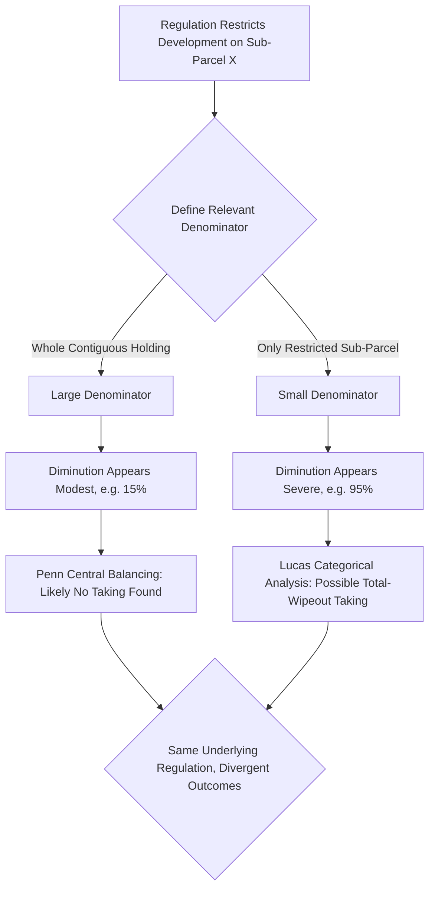

## The Takings Clause and regulatory takings

### Overview and Framing

The Takings Clause of the Fifth Amendment ("nor shall private property be taken for public use, without just compensation") is one of the most extensively analyzed constitutional provisions in law and economics, providing a direct textual hook for applying property-rights theory, hold-up models, and cost-benefit analysis to constitutional doctrine. The regulatory takings question — whether a government regulation that restricts an owner's use of property without physically appropriating it can nonetheless constitute a compensable "taking" — is the doctrinal area where economic analysis has been most influential and most contested.

### The Efficiency Rationale for Compensation Requirements

The foundational law and economics argument for requiring compensation when government takes private property, developed extensively by Frank Michelman and Richard Epstein, centers on preserving efficient investment incentives against a specific hold-up problem: without a compensation requirement, government has an incentive to expropriate value from already-sunk, immobile investments whenever politically expedient, since the investor's outside options (moving the factory, relocating the improvement) are foreclosed once the investment is made.

$$I^* = \arg\max_I \left[ E[R(I)] - I - E[\text{Uncompensated Loss} \mid \text{Taking Occurs}] \cdot P(\text{Taking}) \right]$$

Absent a credible compensation guarantee, rational investors discount expected returns by the perceived risk of uncompensated expropriation, reducing investment below the socially efficient level $I^*$ that would prevail if expropriation risk were fully eliminated or compensated. The Takings Clause functions as the constitutional mechanism restoring investment incentives closer to this first-best benchmark by committing the government to pay for what it takes.

**Key Points**

- The efficiency rationale for compensation is distinct from (though often layered with) fairness-based justifications — the economic argument is about preserving accurate price signals and investment incentives, not primarily about distributive justice to the individual owner.
- [Inference] A pure efficiency framing would suggest compensation should track the owner's actual economic loss (including subjective value) rather than a court's estimate of fair market value, though actual "just compensation" doctrine generally uses fair market value as the measure, which can systematically undercompensate owners with above-market subjective valuations.

### Michelman's Cost-Benefit Formula

Michelman's influential 1967 framework proposes that compensation should be paid for a government action when the **demoralization costs** of not compensating exceed the **settlement costs** of paying compensation, net of the costs the action was designed to avoid in the first place:

$$\text{Compensate if: } DC > SC$$

where $DC$ (demoralization costs) represents the disutility suffered by the uncompensated losing owner plus the broader social cost of reduced investment incentives and reduced perceived security of property rights going forward (a dynamic, forward-looking cost), and $SC$ (settlement costs) represents the transaction costs of identifying claimants, valuing losses, and administering compensation payments.

**Key Points**

- This formula explains why *widely distributed, generally applicable* regulations (e.g., a general zoning ordinance affecting all landowners in a district roughly proportionally) are typically not compensable: settlement costs of compensating every affected owner would be very high, while demoralization costs are relatively low because losses are diffuse and the regulatory burden was broadly and predictably shared.
- Conversely, this explains why a **singled-out, disproportionate burden** on a specific owner (e.g., a regulation effectively eliminating all economic use of one particular parcel while surrounding parcels remain unaffected) tends to be compensable: demoralization costs are high (a specific, identifiable owner bears a concentrated loss) while settlement costs of compensating that single owner are comparatively low.

### The Physical vs. Regulatory Takings Distinction

U.S. constitutional doctrine, as it has developed through case law, distinguishes between:

- **Physical (per se) takings**: Any permanent physical occupation of property by the government, or its authorization, is compensable regardless of how minor the economic impact (*Loretto v. Teleprompter Manhattan CATV Corp.*), reflecting a bright-line property-rule protection with essentially zero tolerance for uncompensated physical invasion.
- **Regulatory takings**: A regulation that restricts use without physical occupation may or may not constitute a taking, generally analyzed under the multi-factor balancing test from *Penn Central Transportation Co. v. New York City*, which weighs (1) the economic impact of the regulation on the claimant, (2) the extent of interference with distinct investment-backed expectations, and (3) the character of the government action.
- **Categorical regulatory takings**: A narrow subset of regulatory action is treated as a per se taking even without the *Penn Central* balancing analysis — most notably a regulation that deprives an owner of *all* economically beneficial use of the property (*Lucas v. South Carolina Coastal Council*), unless the restricted use was already prohibited under background principles of state property or nuisance law.

**Diagram: Takings Doctrine Decision Tree (svg_diagram)**

<svg xmlns="http://www.w3.org/2000/svg" viewBox="0 0 760 460" font-family="Arial, sans-serif">
<text x="380" y="26" font-size="16" font-weight="bold" text-anchor="middle">Takings Analysis Decision Structure (svg_diagram)</text>
<rect x="290" y="50" width="180" height="50" rx="8" fill="#e8f0fe" stroke="#2b579a" stroke-width="1.5" />
<text x="380" y="80" font-size="12" text-anchor="middle">Government Action</text>
<line x1="380" y1="100" x2="380" y2="140" stroke="#333" stroke-width="1.5" marker-end="url(#a5)" />
<polygon points="380,120 480,150 380,180 280,150" fill="#fff3cd" stroke="#a67c00" stroke-width="1.5" />
<text x="380" y="145" font-size="11" text-anchor="middle">Physical Occupation?</text>
<text x="380" y="160" font-size="10" text-anchor="middle">(even minor/permanent)</text>
<line x1="480" y1="150" x2="560" y2="150" stroke="#333" stroke-width="1.5" marker-end="url(#a5)" />
<text x="520" y="140" font-size="10">Yes</text>
<rect x="560" y="120" width="180" height="60" rx="8" fill="#fde8e8" stroke="#a32020" stroke-width="1.5" />
<text x="650" y="145" font-size="12" text-anchor="middle">Per Se Physical Taking</text>
<text x="650" y="163" font-size="10" text-anchor="middle">Loretto rule — always compensable</text>
<line x1="380" y1="180" x2="380" y2="220" stroke="#333" stroke-width="1.5" marker-end="url(#a5)" />
<text x="410" y="205" font-size="10">No (regulatory only)</text>
<polygon points="380,220 490,255 380,290 270,255" fill="#fff3cd" stroke="#a67c00" stroke-width="1.5" />
<text x="380" y="250" font-size="11" text-anchor="middle">All Economic Use</text>
<text x="380" y="264" font-size="11" text-anchor="middle">Eliminated?</text>
<line x1="490" y1="255" x2="570" y2="255" stroke="#333" stroke-width="1.5" marker-end="url(#a5)" />
<text x="530" y="245" font-size="10">Yes</text>
<rect x="570" y="225" width="180" height="60" rx="8" fill="#fde8e8" stroke="#a32020" stroke-width="1.5" />
<text x="660" y="250" font-size="12" text-anchor="middle">Categorical Taking</text>
<text x="660" y="268" font-size="10" text-anchor="middle">Lucas rule (unless nuisance exception)</text>
<line x1="380" y1="290" x2="380" y2="330" stroke="#333" stroke-width="1.5" marker-end="url(#a5)" />
<text x="410" y="315" font-size="10">No (partial impact)</text>
<rect x="230" y="330" width="300" height="90" rx="8" fill="#e6f4ea" stroke="#1e7a34" stroke-width="1.5" />
<text x="380" y="352" font-size="12" text-anchor="middle" font-weight="bold">Penn Central Balancing Test</text>
<text x="380" y="370" font-size="10" text-anchor="middle">1. Economic impact on claimant</text>
<text x="380" y="385" font-size="10" text-anchor="middle">2. Interference with investment-backed expectations</text>
<text x="380" y="400" font-size="10" text-anchor="middle">3. Character of government action</text>
</svg>

### Economic Critique of the Physical/Regulatory Distinction

Law and economics scholars have long questioned whether the sharp doctrinal line between physical and regulatory takings tracks any principled economic distinction. From a pure welfare-effects standpoint, a regulation eliminating 95% of a parcel's economic value can impose a loss on the owner economically indistinguishable from a partial physical taking of equivalent value, yet the two receive very different doctrinal treatment (automatic compensation for even trivial physical occupation vs. a demanding multi-factor test, often resulting in no compensation, for even severe regulatory diminution).

[Inference] One economic rationalization for retaining the distinction, despite this apparent inconsistency, is a **rule vs. standard efficiency tradeoff**: a bright-line physical-occupation rule has low administrative/decision costs (easy to apply, minimizes litigation and valuation disputes) at the cost of potential over- and under-inclusiveness, while the regulatory takings balancing test allows more calibrated case-by-case assessment at the cost of significantly higher litigation and adjudication costs and reduced ex ante predictability for both government and property owners.

### The "Denominator Problem"

A well-recognized analytical difficulty in regulatory takings analysis is the **denominator problem**: when assessing the economic impact of a regulation (e.g., under *Penn Central* or *Lucas*), courts must define the relevant unit of property against which the percentage diminution in value is measured. A regulation restricting development on a small portion of a much larger parcel might show a modest percentage diminution when measured against the whole parcel, but a near-total diminution when measured against only the restricted portion.

$$\text{Percentage Diminution} = \frac{V_{before} - V_{after}}{V_{before}}$$

where the choice of denominator (the entire contiguous holding vs. only the specifically regulated parcel or interest) can produce dramatically different results from the identical regulation, and courts have not adopted a fully consistent rule for defining the relevant property unit. [Unverified — courts continue to apply varying approaches to defining the relevant parcel, and the U.S. Supreme Court has declined to adopt a single categorical rule resolving the denominator problem across all contexts.]

**Key Points**

- The denominator problem is functionally equivalent to defining the relevant market in antitrust economics — the analytical conclusion is highly sensitive to a threshold definitional choice that precedes the substantive economic analysis.
- This ambiguity itself imposes a cost: the unpredictability of how courts will define the relevant parcel in any given regulatory takings dispute increases litigation costs and reduces the ex ante clarity of investment-backed expectations that the compensation requirement is partly designed to protect.

### Diagram: Denominator Problem Illustration

### Nuisance Exception and the "Background Principles" Limitation

Even a regulation eliminating all economically beneficial use of property escapes *Lucas* categorical-taking liability if the restricted use was never part of the owner's title to begin with — that is, if the restriction merely codifies a use restriction that already existed under background principles of state property or nuisance law (e.g., a use that would have constituted a common-law nuisance even absent the new regulation).

Economically, this exception can be understood as a recognition that the owner never possessed the entitlement the regulation is accused of "taking" — an entitlement that was never validly held cannot be expropriated, so no compensable loss of investment-backed expectation occurs. [Inference] This creates an incentive for governments to frame new regulations, where legally plausible, as clarifications or codifications of pre-existing background common-law limitations rather than as novel restrictions, since the former framing forecloses compensation liability entirely.

### Exactions and the Nexus/Rough Proportionality Requirements

A related doctrinal area — land-use exactions, where government conditions development permit approval on the developer providing some public benefit (a dedication of land, an impact fee) — has generated its own economic-efficiency-oriented doctrine. The *Nollan/Dolan* line of cases requires an "essential nexus" between the exaction and the legitimate government interest the permit condition purports to address, and "rough proportionality" between the burden of the exaction and the projected impact of the proposed development.

$$\text{Exaction Value} \leq f(\text{Projected Development Impact})$$

Economically, this doctrine addresses a specific hold-up concern distinct from the general takings analysis above: a government holding monopoly permitting authority over a proposed development has significant leverage to extract exactions well beyond what is needed to offset the development's actual externalities, effectively using the permitting process to capture surplus value that has nothing to do with mitigating the development's genuine social costs. The nexus/proportionality requirements function as a judicially-enforced constraint against this permit-leverage extraction.

### Empirical and Practical Considerations

[Unverified] Empirical studies estimating the actual economic effects of takings doctrine on land-use regulation stringency, development patterns, and municipal regulatory behavior produce mixed findings, and isolating the causal effect of takings doctrine from other confounding local land-use and political-economy factors remains methodologically difficult.

**Behavioral disclaimer**: Judicial application of the *Penn Central* balancing test, the *Lucas* categorical rule, and the denominator problem varies substantially across jurisdictions, individual courts, and case-specific facts; the frameworks above describe the underlying economic logic of takings doctrine rather than a guarantee of how any particular regulatory dispute will be resolved.

### Related Topics

- Michelman's demoralization costs / settlement costs framework
- Property rule vs. liability rule protection (Calabresi-Melamed)
- Eminent domain, public use doctrine, and *Kelo v. City of New London*
- Land-use exactions and the *Nollan/Dolan* nexus and proportionality tests
- Zoning economics and the efficient regulation of land-use externalities
- Nuisance law and background-principles limitations on property entitlements
- Hold-up problems and credible commitment in constitutional property protection
- Comparative takings doctrine across jurisdictions and legal traditions