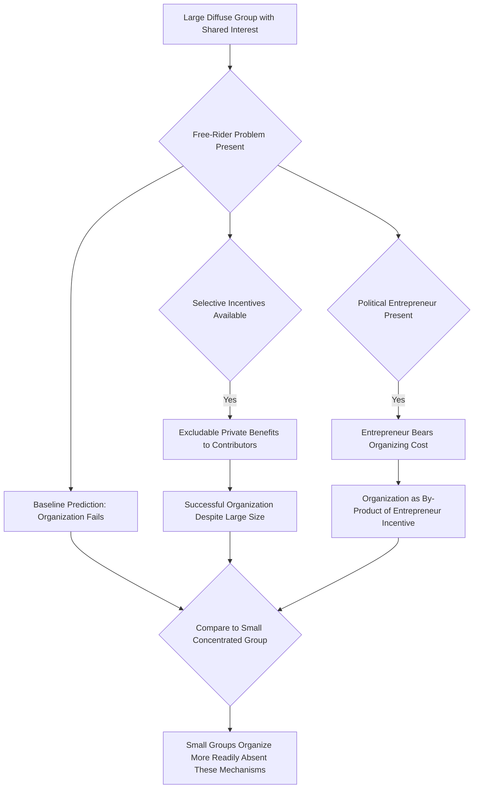

## Theory of collective action and interest groups

### Overview and Framing

The theory of collective action and interest groups examines why groups of individuals with shared interests do or do not successfully organize to pursue those interests through political action, and what implications this has for the pattern of legislation and regulation produced by democratic political systems. Mancur Olson's foundational contribution — that shared interest alone is insufficient to predict successful group organization — reoriented public choice theory away from naive pluralist assumptions that all affected interests are represented roughly proportionally in the political process, toward a rational-choice account of *systematic asymmetries* in political organization.

### The Free-Rider Problem in Collective Action

Olson's core insight, developed in *The Logic of Collective Action* (1965), is that political action to secure a group benefit (a favorable regulation, a tariff, a subsidy) typically has the character of a **public good** for members of the benefited group: the benefit, once obtained, is non-excludable among group members regardless of whether any individual member contributed effort or resources toward securing it.

$$U_i = B_i(\text{group success}) - C_i(\text{individual contribution to organizing})$$

Because an individual member's own contribution has a negligible effect on the probability of group success in a large group, while the cost of contributing (time, money, effort) is fully borne by the contributor, each rational, self-interested member has an incentive to **free-ride** on the contributions of others, hoping to enjoy the benefit without bearing the organizing cost.

$$\frac{\partial P(\text{success})}{\partial \text{(individual contribution)}} \to 0 \quad \text{as group size } n \to \text{large}$$

**Key Points**

- The free-rider problem intensifies as group size increases, because each individual's marginal effect on the probability of collective success shrinks toward zero, weakening the incentive to contribute even when the aggregate stakes for the group are large.
- This generates Olson's counterintuitive core prediction: **large, diffuse groups with large aggregate stakes are often less successful at political organization than small, concentrated groups with smaller aggregate stakes**, precisely because the free-rider problem is less severe in small groups.

### Group Size, Per-Capita Stakes, and the Concentrated-Benefits/Diffuse-Costs Pattern

Olson's analysis generates the single most influential prediction in the interest-group literature: political outcomes systematically favor small groups with large per-capita stakes over large groups with small per-capita stakes, even when the large group's aggregate stake is far greater.

| Group Characteristic | Small, Concentrated Group (e.g., an industry) | Large, Diffuse Group (e.g., consumers) |
| --- | --- | --- |
| Number of members | Small | Large |
| Per-capita stake in outcome | High | Low |
| Free-rider problem severity | Low | High |
| Ease of monitoring member contributions | High (repeated interaction, mutual observability) | Low (members often unaware of each other) |
| Likelihood of successful political organization | High | Low |
| Typical policy outcome | Regulation/subsidy favoring the group | Diffuse cost borne largely unnoticed |

**Example**

A tariff or quota benefiting a specific domestic industry concentrates substantial per-firm gains among a relatively small number of producers, each with strong individual incentive to lobby, while the resulting higher consumer prices are spread across millions of consumers, each bearing only a small individual cost — too small, typically, to justify any individual consumer's own investment in opposing the tariff politically. The result is a political process in which the concentrated beneficiary group organizes effectively while the diffuse cost-bearing group does not, producing a policy outcome favoring the concentrated interest despite the aggregate cost to consumers plausibly exceeding the aggregate gain to the industry — precisely the pattern predicted by the concentrated-benefits/diffuse-costs framework.

### Diagram: Concentrated Benefits, Diffuse Costs (svg_diagram)

<svg xmlns="http://www.w3.org/2000/svg" viewBox="0 0 740 380" font-family="Arial, sans-serif">
<text x="370" y="26" font-size="16" font-weight="bold" text-anchor="middle">Concentrated Benefits vs. Diffuse Costs (svg_diagram)</text>
<rect x="40" y="60" width="280" height="140" rx="8" fill="#e8f0fe" stroke="#2b579a" stroke-width="1.5" />
<text x="180" y="85" font-size="13" text-anchor="middle" font-weight="bold">Small Group (e.g., Industry)</text>
<circle cx="100" cy="120" r="10" fill="#2b579a" />
<circle cx="160" cy="120" r="10" fill="#2b579a" />
<circle cx="220" cy="120" r="10" fill="#2b579a" />
<circle cx="280" cy="120" r="10" fill="#2b579a" />
<text x="180" y="150" font-size="11" text-anchor="middle">High per-capita stake each</text>
<text x="180" y="167" font-size="11" text-anchor="middle">Low free-rider severity</text>
<text x="180" y="184" font-size="11" text-anchor="middle" font-weight="bold">→ Organizes Successfully</text>
<rect x="420" y="60" width="280" height="140" rx="8" fill="#fde8e8" stroke="#a32020" stroke-width="1.5" />
<text x="560" y="85" font-size="13" text-anchor="middle" font-weight="bold">Large Group (e.g., Consumers)</text>
<g fill="#a32020">
<circle cx="450" cy="110" r="4" /><circle cx="470" cy="115" r="4" /><circle cx="490" cy="108" r="4" />
<circle cx="510" cy="118" r="4" /><circle cx="530" cy="105" r="4" /><circle cx="550" cy="120" r="4" />
<circle cx="570" cy="110" r="4" /><circle cx="590" cy="115" r="4" /><circle cx="610" cy="108" r="4" />
<circle cx="630" cy="118" r="4" /><circle cx="650" cy="105" r="4" /><circle cx="670" cy="120" r="4" />
</g>
<text x="560" y="150" font-size="11" text-anchor="middle">Low per-capita stake each</text>
<text x="560" y="167" font-size="11" text-anchor="middle">High free-rider severity</text>
<text x="560" y="184" font-size="11" text-anchor="middle" font-weight="bold">→ Fails to Organize</text>
<line x1="180" y1="200" x2="180" y2="250" stroke="#333" stroke-width="1.5" marker-end="url(#a6)" />
<line x1="560" y1="200" x2="560" y2="250" stroke="#333" stroke-width="1.5" marker-end="url(#a6)" />
<line x1="200" y1="280" x2="540" y2="280" stroke="#333" stroke-width="1" stroke-dasharray="4,3" />
<rect x="220" y="290" width="300" height="60" rx="8" fill="#fff3cd" stroke="#a67c00" stroke-width="1.5" />
<text x="370" y="313" font-size="12" text-anchor="middle" font-weight="bold">Political Outcome</text>
<text x="370" y="330" font-size="10" text-anchor="middle">Policy favors concentrated group</text>
<text x="370" y="345" font-size="10" text-anchor="middle">despite larger aggregate cost to diffuse group</text>
</svg>

### Selective Incentives as a Solution to the Free-Rider Problem

Olson's framework identifies **selective incentives** — benefits available only to members who contribute to the group's collective effort, excludable from non-contributing free-riders — as the primary mechanism by which large groups can overcome the free-rider problem and sustain organization despite the underlying collective-action logic working against them.

$$U_i = B_i(\text{group success}) + S_i(\text{selective incentive} \mid \text{contributed}) - C_i(\text{contribution})$$

**Example**

Labor unions and professional associations frequently supplement the pure public good of favorable legislation with excludable private benefits available only to dues-paying members — group insurance products, professional certification services, legal representation, or in some historical labor contexts, closed-shop employment arrangements conditioning employment itself on union membership. These selective incentives alter the individual member's calculus, making contribution privately rational independent of the individual's negligible effect on the probability of the group's political success.

**Key Points**

- Selective incentives explain why some large groups (major labor unions, large professional associations) achieve effective political organization despite Olson's baseline prediction that large-group collective action should fail — the key mechanism is converting what would otherwise be a pure public good into a privately-excludable bundle.
- [Inference] The availability and effectiveness of selective incentives varies substantially across group types, which helps explain persistent asymmetries even among large groups: professional associations with clear excludable service offerings (bar associations, medical associations) tend to sustain stronger organization than diffuse consumer or taxpayer groups lacking comparable excludable-benefit mechanisms.

### Political Entrepreneurs and By-Product Theory

An alternative or supplementary explanation for large-group organization, associated with the concept of the **political entrepreneur**, holds that a motivated individual or small leadership cadre may bear disproportionate organizing costs themselves — funded by outside patrons, ideological commitment, or the pursuit of personal career benefits from leading a prominent organization — effectively supplying the collective action good to the broader group as a by-product of the entrepreneur's own independent incentive structure, without requiring each member to individually overcome the free-rider problem.

[Inference] This mechanism is frequently invoked to explain the successful mobilization of diffuse public-interest groups (environmental organizations, consumer advocacy groups) that lack strong selective-incentive mechanisms but have nonetheless achieved meaningful political organization historically, suggesting Olson's baseline framework, while a powerful organizing benchmark, does not fully determine political-organization outcomes without accounting for entrepreneurial and philanthropic supply-side factors.

### Diagram: Pathways to Overcoming the Free-Rider Problem

### Interest Group Competition and the Becker Model

Gary Becker's 1983 model extends Olson's framework by treating political outcomes as the equilibrium result of **competition among interest groups**, each investing resources in political pressure to influence policy in its favored direction, rather than treating any single group's organizational success in isolation.

$$\text{Political Influence}_i = f(\text{Pressure}_i, \text{Group Efficiency}_i, \text{Deadweight Cost of Redistribution})$$

A key implication of the Becker model is that policies imposing large **deadweight losses** relative to the redistribution they achieve are less likely to survive in equilibrium, because the deadweight loss itself represents a cost that the losing group has a stronger incentive to organize against, all else equal, than a policy achieving the same redistribution with lower efficiency cost. This generates a partial efficiency-enhancing prediction from the interest-group competition model: political competition, while not eliminating rent-seeking redistribution, tends to favor comparatively efficient redistributive mechanisms (e.g., a direct subsidy) over highly inefficient mechanisms (e.g., a price-distorting production quota causing large deadweight loss) for delivering the same net benefit to the favored group.

[Unverified] Whether the Becker model's efficiency-favoring prediction holds robustly across empirical settings, or whether observed regulatory patterns are dominated instead by inefficient rent-seeking mechanisms as an earlier generation of public choice scholarship (e.g., the Chicago/Virginia school "capture theory" tradition) emphasized, remains a genuinely contested question in the empirical public choice literature.

### Rent-Seeking and the Social Cost of Interest-Group Competition

The resources interest groups expend competing for a fixed transfer or favorable regulation (lobbying expenditure, campaign contributions, legal and public-relations resources) are themselves a social cost — not merely a distributive transfer from losers to winners, but resources consumed in the contest itself that produce no offsetting social value. Gordon Tullock's analysis of rent-seeking formalizes this: the social cost of a sought-after transfer or monopoly rent can substantially exceed the standard deadweight-loss triangle from the underlying market distortion once the resources expended in competing for that rent are counted.

$$\text{Total Social Cost} = \underbrace{\text{DWL}_{\text{market distortion}}}_{\text{Harberger triangle}} + \underbrace{\sum_i \text{Expenditure}_i \text{ on rent-seeking}}_{\text{Tullock rectangle}}$$

**Key Points**

- Under conditions where rent-seeking expenditure fully dissipates the value of the rent being sought (a competitive rent-seeking equilibrium), the entire value of the transfer itself can be consumed by the resources spent competing for it, making the effective social cost of the underlying distortion far larger than a conventional deadweight-loss calculation alone would suggest.
- [Inference] The magnitude of rent dissipation in practice depends on the structure of the rent-seeking contest (number of competitors, whether the contest is winner-take-all or probabilistic, whether losing bids are wholly sunk or partially recoverable), and full rent dissipation is a theoretical benchmark rather than a universally observed empirical outcome.

### Implications for Legislative Output and Regulatory Capture

The collective action framework provides a rational-choice microfoundation for regulatory capture theory (associated with George Stigler's "economic theory of regulation"): if concentrated industry interests systematically organize more effectively than diffuse consumer interests, regulatory agencies nominally created to protect the public interest are structurally susceptible to being shaped, over time, primarily to serve the regulated industry's interests, since the industry is both a persistent, well-organized political actor and possesses superior information about the regulated domain relative to diffuse and poorly-organized consumer interests.

$$\text{Regulatory Outcome} = g(\text{Organized Industry Pressure}, \text{Diffuse Public Pressure}), \quad \frac{\partial g}{\partial \text{Industry Pressure}} \gg \frac{\partial g}{\partial \text{Public Pressure}}$$

**Key Points**

- Capture theory does not require assuming regulators are corrupt or acting in bad faith; it can arise purely from the structural information and organizational asymmetry between concentrated and diffuse interests interacting with regulators over a long time horizon.
- This framework generates a broader legislative implication: statutory design itself (which interests bear concentrated stakes and which bear diffuse costs) can be understood as an outcome partially predictable from the underlying collective-action structure of the affected groups, independent of the formal legislative process's stated public-interest rationale.

### Empirical Considerations

[Unverified] Empirical tests of Olson's group-size prediction and Becker-style interest-group competition models have produced broadly supportive but not unqualified findings across various policy domains (trade protection, occupational licensing, agricultural subsidies), and measuring "group organization success" and "per-capita stakes" with the precision needed for rigorous empirical testing remains methodologically challenging, particularly for assessing the counterfactual policy that would have emerged absent the interest group's political activity.

**Behavioral disclaimer**: The strength of collective action and free-rider dynamics in any specific historical or contemporary political episode depends on numerous context-specific factors (group cohesion, availability of selective incentives, presence of political entrepreneurs, existing organizational infrastructure); the frameworks above characterize the underlying theoretical logic rather than a deterministic prediction of any particular group's political success or failure.

### Related Topics

- Public choice theory foundations and rational choice institutionalism
- Stigler's economic theory of regulation and regulatory capture
- Gordon Tullock's rent-seeking and the social cost of monopoly/transfer-seeking
- Becker's model of competition among pressure groups
- Selective incentives and the economics of voluntary association
- Political entrepreneurship and by-product theories of organization
- Median voter theorem and its interaction with interest-group influence
- Legislative subsidy theory and statutory interpretation as interest-group bargain enforcement