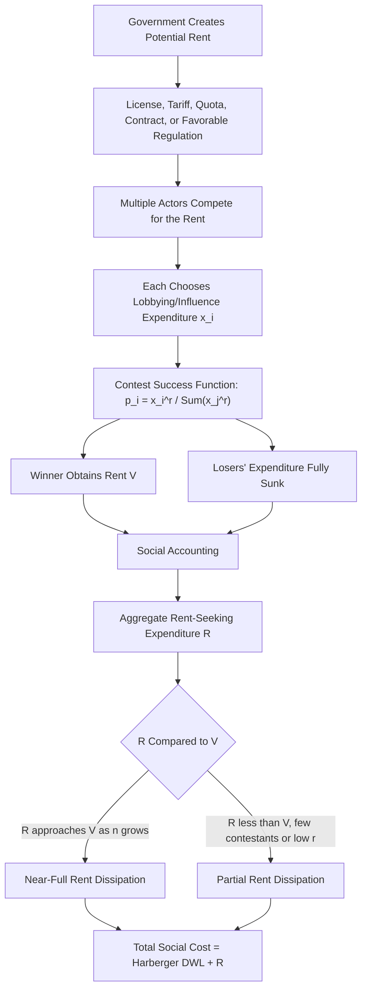

## Rent-seeking and its social costs

### Overview and Framing

Rent-seeking refers to the expenditure of real resources by individuals or groups to obtain, retain, or influence the distribution of a transfer, monopoly privilege, or other artificially created economic rent, rather than to create new wealth. The economic analysis of rent-seeking, pioneered by Gordon Tullock (1967) and later named and extended by Anne Krueger (1974) and James Buchanan, represents a foundational contribution to public choice theory by demonstrating that the welfare costs of government-created monopolies, tariffs, licenses, and other artificial restrictions substantially exceed the conventional deadweight-loss triangle recognized in standard microeconomic monopoly analysis.

### The Conventional Deadweight Loss Benchmark

Standard microeconomic analysis of a government-created monopoly (e.g., an exclusive license or import quota) measures social cost using the **Harberger triangle** — the deadweight loss from restricted output and the resulting allocative inefficiency, holding the monopoly rent itself to be a pure transfer from consumers to the monopolist with no independent social cost.

$$DWL_{Harberger} = \frac{1}{2}(P_m - P_c)(Q_c - Q_m)$$

where $P_m, Q_m$ are the monopoly price and quantity and $P_c, Q_c$ are the competitive price and quantity. Under this conventional framework, the monopoly rent itself — $(P_m - P_c) \times Q_m$, the rectangular area representing transferred surplus — is treated as distributively significant but allocatively neutral: a transfer from one party to another with no net destruction of social value.

**Key Points**

- Tullock's central contribution challenges the "transfer neutrality" assumption embedded in the conventional Harberger analysis: if the monopoly rent itself is valuable and obtainable through competitive effort (lobbying for the exclusive license, bribing the regulator, investing in political influence), rational actors will expend real resources competing for that rent up to its expected value.
- This transforms what conventional analysis treats as a costless transfer into an additional, and potentially much larger, social cost — resources genuinely consumed in the contest for the rent, producing no offsetting social value analogous to productive investment.

### The Tullock Rectangle: Rent Dissipation

Tullock's insight is that the monopoly rent itself becomes the target of competitive rent-seeking expenditure. If entry into rent-seeking competition is free and rent-seekers are risk-neutral, competition for the rent will, in the limiting case, dissipate the *entire* value of the rent in resources expended trying to win it — analogous to firms competing away economic profit in a competitive market, except here the "competition" consumes resources in an unproductive contest rather than in productive output.

$$\text{Total Social Cost} = \underbrace{DWL_{Harberger}}_{\text{allocative inefficiency}} + \underbrace{R}_{\text{Tullock rectangle: rent-seeking expenditure}}$$

where, under full rent dissipation, $R \to (P_m - P_c) \times Q_m$ — the entire monopoly rent itself is consumed by aggregate lobbying, bribery, legal, and related expenditures across all competing rent-seekers.

**Diagram: Harberger Triangle vs. Tullock Rectangle (svg_diagram)**

<svg xmlns="http://www.w3.org/2000/svg" viewBox="0 0 700 420" font-family="Arial, sans-serif">
<text x="350" y="26" font-size="16" font-weight="bold" text-anchor="middle">Deadweight Loss vs. Rent Dissipation (svg_diagram)</text>
<line x1="80" y1="360" x2="620" y2="360" stroke="#333" stroke-width="1.5" />
<line x1="80" y1="360" x2="80" y2="50" stroke="#333" stroke-width="1.5" />
<text x="350" y="395" font-size="12" text-anchor="middle">Quantity</text>
<text x="35" y="200" font-size="12" text-anchor="middle" transform="rotate(-90 35 200)">Price</text>
<line x1="80" y1="330" x2="600" y2="90" stroke="#2b579a" stroke-width="2" />
<text x="610" y="90" font-size="11" fill="#2b579a">Demand</text>
<line x1="80" y1="200" x2="600" y2="200" stroke="#1e7a34" stroke-width="1.5" stroke-dasharray="3,3" />
<text x="620" y="200" font-size="11" fill="#1e7a34">MC (competitive P)</text>
<line x1="80" y1="130" x2="600" y2="130" stroke="#a32020" stroke-width="1.5" stroke-dasharray="3,3" />
<text x="620" y="130" font-size="11" fill="#a32020">Monopoly P</text>
<line x1="380" y1="200" x2="380" y2="360" stroke="#666" stroke-width="1" stroke-dasharray="2,2" />
<text x="380" y="378" font-size="10" text-anchor="middle">Q_c</text>
<line x1="290" y1="130" x2="290" y2="360" stroke="#666" stroke-width="1" stroke-dasharray="2,2" />
<text x="290" y="378" font-size="10" text-anchor="middle">Q_m</text>
<polygon points="290,130 380,200 290,200" fill="#fde8e8" fill-opacity="0.7" stroke="#a32020" stroke-width="1" />
<text x="315" y="185" font-size="10" fill="#a32020">DWL</text>
<text x="315" y="197" font-size="9" fill="#a32020">(Harberger)</text>
<rect x="80" y="130" width="210" height="70" fill="#fff3cd" fill-opacity="0.6" stroke="#a67c00" stroke-width="1" />
<text x="150" y="165" font-size="11" fill="#a67c00" font-weight="bold">Monopoly Rent</text>
<text x="150" y="180" font-size="10" fill="#a67c00">(Tullock rectangle —</text>
<text x="150" y="192" font-size="10" fill="#a67c00">dissipated by rent-seeking)</text>

<text x="150" y="115" font-size="11" text-anchor="middle" font-weight="bold">Conventional view: pure transfer</text>

<text x="150" y="130" font-size="10" text-anchor="middle" fill="`#a32020`">Tullock view: consumed as real cost</text>

</svg>

**Key Points**

- The Tullock rectangle can equal or exceed the conventional Harberger triangle in magnitude, meaning the true social cost of monopoly-creating government intervention may be substantially larger than traditional welfare-loss estimates suggest.
- Whether full rent dissipation occurs depends critically on the structure of the rent-seeking contest — the number of competing rent-seekers, whether the contest is a deterministic auction or a probabilistic lottery-like contest, and whether resources expended by losing rent-seekers are entirely sunk or partially recoverable/redeployable.

### The Rent-Seeking Contest Function

Formal rent-seeking models typically employ a **contest success function**, most commonly the Tullock contest function, specifying the probability that rent-seeker $i$ wins the rent as a function of relative lobbying expenditure:

$$p_i = \frac{x_i^r}{\sum_{j=1}^{n} x_j^r}$$

where $x_i$ is rent-seeker $i$'s expenditure, $n$ is the number of competing rent-seekers, and $r$ is a parameter governing the sensitivity of winning probability to relative effort (often called the "decisiveness" parameter). Each rent-seeker chooses $x_i$ to maximize expected payoff:

$$\max_{x_i} \; p_i \cdot V - x_i$$

where $V$ is the value of the rent. In the symmetric Nash equilibrium of this contest with $n$ identical risk-neutral rent-seekers and $r = 1$, aggregate equilibrium rent-seeking expenditure is:

$$\sum_i x_i^* = \frac{n-1}{n} V$$

As $n \to \infty$, aggregate rent-seeking expenditure approaches $V$ — full dissipation of the rent's value in the limiting case of many competing rent-seekers.

**Key Points**

- The degree of rent dissipation is not fixed at 100% across all rent-seeking contexts; it depends sensitively on the number of contestants, the contest's decisiveness parameter $r$, risk attitudes, and whether rent-seekers can collude to limit aggregate expenditure.
- [Inference] Empirically calibrating the actual dissipation rate in any specific real-world rent-seeking episode (a specific lobbying campaign for a specific regulatory or trade protection) is difficult, since lobbying expenditure is not always fully observable and the relevant contest structure (number of true competitors, decisiveness of expenditure) is rarely known with precision.

### Forms of Rent-Seeking Activity

Rent-seeking manifests across a wide variety of institutional contexts wherever government action creates an artificial scarcity or advantage subject to competitive pursuit:

- **Tariff and quota lobbying**: Domestic industries expending resources lobbying for import protection, where the resulting protected-market rent becomes a lobbying target (Krueger's original 1974 analysis focused specifically on import-licensing rent-seeking in developing economies).
- **Occupational licensing**: Incumbent practitioners in a licensed profession may lobby for restrictive licensing requirements that limit new entry, capturing a rent from reduced competition, with resources expended both securing the restrictive licensing regime and, at the margin, meeting compliance requirements beyond their genuine quality-signaling value.
- **Government contract and procurement competition**: Firms competing for exclusive government contracts may expend resources on bid preparation, political contributions, and relationship-building well beyond what would be required in a genuinely competitive procurement process, particularly where contract award criteria are opaque or subject to political discretion.
- **Regulatory capture pursuit**: Industries lobbying to shape the substantive content of regulation in their favor (favorable classification, exemptions, compliance-cost-raising rules that disproportionately burden smaller competitors), extending rent-seeking beyond simple monopoly-creation to more subtle competitive-advantage-shaping regulatory design.
- **Litigation and legal rent-seeking**: Resources expended in litigation aimed at redistributing existing wealth (as opposed to resolving genuine legal uncertainty or enforcing efficient legal rules) can itself be analyzed as a form of rent-seeking, connecting this topic to the frivolous-litigation analysis in civil procedure economics.

### Diagram: Rent-Seeking Contest Structure

### Rent Extraction: The Reverse Direction

A related but distinct phenomenon, termed **rent extraction** (McChesney), reverses the causal direction from standard rent-seeking: rather than private actors initiating lobbying to obtain a government-created rent, politicians and regulators may themselves initiate threats of adverse regulatory or legislative action specifically to extract payments (campaign contributions, political support) from private parties who pay to avoid the threatened harm, rather than to obtain an affirmative benefit.

$$U_{politician} = \text{Payment received to withdraw threatened harmful legislation} - \text{Cost of credibly maintaining the threat}$$

**Key Points**

- Rent extraction implies that political actors are not merely passive recipients of rent-seeking pressure but can be active initiators of a threat-based extraction dynamic, generating a social cost structurally similar to conventional rent-seeking (private resources diverted to political payments) but reversing which party initiates the transaction.
- [Inference] Empirically distinguishing rent-seeking from rent-extraction in any observed episode of lobbying or political payment is difficult, since both produce observationally similar patterns of private-to-political resource flows, differing primarily in which party is understood to have initiated the underlying threat or opportunity.

### Rent-Seeking and the Design of Government Intervention

The rent-seeking framework generates several design implications for reducing the social cost of any given government intervention that creates a scarce, valuable, government-controlled allocation:

- **Auction rather than administrative/political allocation**: Allocating a scarce government-created right (e.g., a broadcast spectrum license, an import quota) via competitive cash auction converts what would otherwise be dissipated rent-seeking expenditure into government revenue captured through the auction price, since the winning bidder pays the government directly for the rent rather than expending resources on political influence that produces no revenue and no offsetting social value.
- **Reducing discretion in allocation criteria**: Rules-based, transparent, and objectively verifiable allocation criteria reduce the returns to political lobbying relative to allocation processes involving substantial administrative or political discretion, since lobbying is most valuable precisely where discretionary judgment can be influenced.
- **Minimizing the creation of artificial scarcity in the first place**: Since rent-seeking costs are entirely a function of the existence of a valuable, contestable government-created rent, the most direct way to eliminate rent-seeking costs in a given domain is to avoid creating the artificial scarcity or restriction that generates the rent (e.g., removing an import quota rather than administering its allocation more efficiently).

**Example**

The historical shift in U.S. and other countries' allocation of wireless spectrum licenses from administrative "beauty contest" processes (in which the government granted licenses based on political and administrative judgment of applicant merit) to competitive cash auctions is frequently cited as a direct policy application of rent-seeking theory: auctions convert lobbying-driven rent dissipation into captured government revenue, while beauty-contest allocation created strong incentives for costly, socially wasteful lobbying and application-preparation expenditure by competing firms with comparatively little offsetting social benefit.

### Critiques and Qualifications of the Full Dissipation Result

[Inference] The theoretical prediction of full or near-full rent dissipation represents a limiting-case benchmark under specific assumptions (risk neutrality, free entry into the rent-seeking contest, no collusion among rent-seekers) that frequently do not hold in practice. Several qualifications are widely recognized in the literature:

- **Risk aversion** among rent-seekers generally reduces equilibrium rent-seeking expenditure below the full-dissipation benchmark, since risk-averse actors discount the uncertain prospect of winning the contest.
- **Barriers to entry into the rent-seeking contest itself** (e.g., only a small number of firms are realistically positioned to compete for a given regulatory favor) limit the number of active rent-seekers, correspondingly limiting aggregate dissipation relative to the many-contestant theoretical limit.
- **Collusion among rent-seekers** (e.g., an industry association coordinating lobbying on behalf of the collective industry rather than firms competing independently) can substantially reduce aggregate rent-seeking expenditure relative to the fully competitive contest benchmark, effectively reintroducing a version of the collective-action free-rider problem into the rent-seeking contest itself.

[Unverified] Empirical measurement of actual rent dissipation rates across specific historical rent-seeking episodes (tariff lobbying, licensing lobbying, spectrum allocation battles) produces widely varying estimates, and isolating true lobbying-related expenditure from expenditure serving other simultaneous purposes (genuine information provision to regulators, general public relations) is a persistent measurement challenge in this empirical literature.

### Connection to Broader Public Choice and Regulatory Theory

Rent-seeking theory provides the underlying welfare-cost mechanism that complements Olson's collective-action theory and Stigler's capture theory: Olson explains *which* groups are likely to successfully organize to pursue rents, Stigler's theory explains how this organizational asymmetry translates into regulatory outcomes favoring concentrated interests, and Tullock's rent-seeking framework quantifies the *additional social cost*, beyond conventional deadweight loss, generated by the resulting competition for those rents once a rent-generating policy exists.

**Behavioral disclaimer**: The magnitude of rent dissipation, and the net welfare cost of any specific instance of government-created scarcity subject to competitive rent-seeking, varies considerably depending on contest structure, number of competitors, and institutional context; the models above characterize the underlying theoretical mechanism rather than a fixed, universally applicable cost estimate.

### Related Topics

- Theory of collective action and the free-rider problem (Olson)
- Stigler's economic theory of regulation and capture theory
- Becker's model of competition among pressure groups
- Contest theory and the Tullock contest success function
- Auction design as a rent-dissipation-minimizing allocation mechanism
- Krueger's analysis of rent-seeking in trade protection and import licensing
- McChesney's rent extraction and political threat theory
- Frivolous litigation as a form of legal rent-seeking