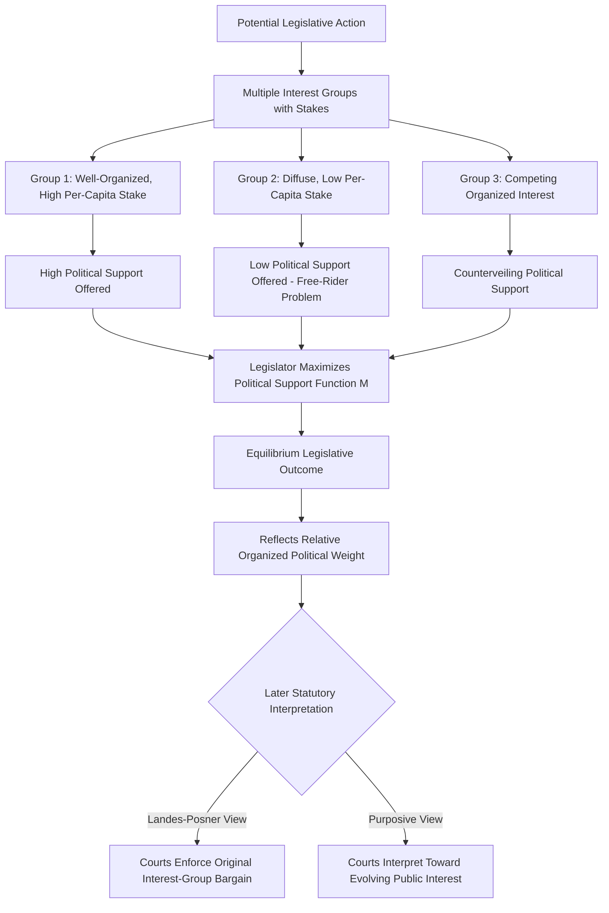

## The economic theory of legislation

### Overview and Framing

The economic theory of legislation applies rational-choice and market-based analysis to the legislative process itself, treating statutes as the equilibrium output of a political market in which legislators supply legislation and interest groups (and, to a lesser extent, diffuse voters) demand it. This framework, most associated with George Stigler's foundational 1971 article "The Theory of Economic Regulation" and subsequently formalized by Sam Peltzman and Gary Becker, departs sharply from the "public interest theory" of legislation, which assumes legislators enact laws to correct market failures or otherwise serve the general welfare.

### The Public Interest Theory as the Baseline Contrast

Prior to Stigler's intervention, the dominant framework for understanding regulation and legislation treated government action as a corrective response to identified market failures — externalities, monopoly power, information asymmetry, public goods underprovision — enacted by legislators and administered by regulators acting as more or less faithful agents of the general public interest.

$$\text{Public Interest View: } \text{Legislation} = f(\text{Market Failure Severity})$$

The economic theory of legislation does not deny that market failures exist or that legislation sometimes addresses them; rather, it challenges the assumption that the mere *existence* of a market failure reliably predicts *whether, when, or how* legislation will address it, arguing instead that the legislative response is itself mediated by the political market dynamics of interest-group demand and legislator supply, independent of the underlying market failure's objective severity.

**Key Points**

- The public interest theory struggles to explain well-documented empirical patterns, such as regulation persisting long after any plausible market-failure rationale has been addressed or has changed, or regulation being applied selectively to industries or firms in ways uncorrelated with the magnitude of the underlying market failure.
- The economic theory of legislation was developed substantially in response to these empirical anomalies, seeking a model that better predicts observed patterns of legislative and regulatory activity.

### Stigler's Capture Theory: Regulation as a Good Demanded and Supplied

Stigler's foundational contribution reframes regulation as a **good** subject to standard supply-and-demand analysis in a political market: industries demand regulation that serves their interests (entry barriers, price floors, subsidies, restrictions on substitute products or new entrants), and legislators supply this regulation in exchange for political support (votes, campaign contributions, favorable coverage).

$$\text{Regulation Supplied} = f(\text{Political Support Offered by Demanding Group}, \text{Political Cost of Opposition})$$

Because concentrated industry interests, per Olson's collective-action framework, organize more effectively and can offer more valuable, better-coordinated political support than diffuse consumer interests, the equilibrium in this political market systematically favors industry-demanded regulation over consumer-protective regulation, even where a nominal public-interest rationale for the regulation is invoked in its passage.

**Example**

Stigler's original analysis examined state-level occupational licensing and entry regulation, finding that the pattern of which occupations achieved restrictive licensing correlated more closely with the occupation's capacity for political organization (number of practitioners, geographic concentration, existing professional association infrastructure) than with any plausible public-interest rationale (consumer protection from incompetent practice) that licensing proponents typically invoked to justify the restriction.

### Diagram: Political Market for Legislation (svg_diagram)

<svg xmlns="http://www.w3.org/2000/svg" viewBox="0 0 720 400" font-family="Arial, sans-serif">
<text x="360" y="26" font-size="16" font-weight="bold" text-anchor="middle">The Political Market for Legislation (svg_diagram)</text>
<rect x="40" y="60" width="240" height="90" rx="8" fill="#e8f0fe" stroke="#2b579a" stroke-width="1.5" />
<text x="160" y="85" font-size="13" text-anchor="middle" font-weight="bold">Demand Side</text>
<text x="160" y="105" font-size="11" text-anchor="middle">Organized Interest Groups</text>
<text x="160" y="122" font-size="11" text-anchor="middle">Offer: votes, campaign funds,</text>
<text x="160" y="137" font-size="11" text-anchor="middle">political support</text>
<rect x="440" y="60" width="240" height="90" rx="8" fill="#fde8e8" stroke="#a32020" stroke-width="1.5" />
<text x="560" y="85" font-size="13" text-anchor="middle" font-weight="bold">Supply Side</text>
<text x="560" y="105" font-size="11" text-anchor="middle">Legislators</text>
<text x="560" y="122" font-size="11" text-anchor="middle">Maximize: reelection probability,</text>
<text x="560" y="137" font-size="11" text-anchor="middle">political support</text>
<line x1="280" y1="105" x2="440" y2="105" stroke="#333" stroke-width="1.5" marker-end="url(#a7)" />
<text x="360" y="95" font-size="10" text-anchor="middle">Requests favorable legislation</text>
<line x1="440" y1="130" x2="280" y2="130" stroke="#333" stroke-width="1.5" marker-end="url(#a7)" />
<text x="360" y="150" font-size="10" text-anchor="middle">Delivers legislation</text>
<rect x="240" y="200" width="240" height="70" rx="8" fill="#fff3cd" stroke="#a67c00" stroke-width="1.5" />
<text x="360" y="225" font-size="12" text-anchor="middle" font-weight="bold">Equilibrium Legislation</text>
<text x="360" y="243" font-size="10" text-anchor="middle">Favors best-organized demanders,</text>
<text x="360" y="258" font-size="10" text-anchor="middle">not necessarily aggregate welfare</text>
<line x1="160" y1="150" x2="300" y2="200" stroke="#333" stroke-width="1.5" marker-end="url(#a7)" />
<line x1="560" y1="150" x2="420" y2="200" stroke="#333" stroke-width="1.5" marker-end="url(#a7)" />
<rect x="240" y="310" width="240" height="60" rx="8" fill="#e6f4ea" stroke="#1e7a34" stroke-width="1.5" />
<text x="360" y="335" font-size="12" text-anchor="middle">Diffuse Public Interest</text>
<text x="360" y="352" font-size="10" text-anchor="middle">Underrepresented (free-rider problem)</text>
<line x1="360" y1="270" x2="360" y2="310" stroke="#666" stroke-width="1" stroke-dasharray="3,3" />
<text x="380" y="295" font-size="9" fill="#666">weak counter-pressure</text>
</svg>

### Peltzman's Formalization: Balancing Multiple Interest Groups

Sam Peltzman's 1976 extension formalizes Stigler's insight into an explicit optimization model in which the regulator/legislator maximizes political support as a weighted function of support from *multiple* competing interest groups (e.g., both producers and consumers of a regulated good), rather than serving a single dominant industry exclusively.

$$M = M(P^*, n_1, n_2, \ldots)$$

where $M$ is total political support (majority function), $P^*$ is the price/regulatory outcome chosen, and $n_1, n_2, \ldots$ represent the political effectiveness/organization of each affected group. The legislator/regulator sets the regulatory outcome to maximize $M$, balancing the marginal political gain from favoring one group against the marginal political loss from opposing another, rather than fully capturing the outcome for the single best-organized group.

$$\frac{\partial M}{\partial P^*} = 0 \quad \text{at the political equilibrium}$$

**Key Points**

- Peltzman's model predicts that regulatory outcomes will generally not fully maximize any single group's welfare (contrary to a pure, uncomplicated capture-theory prediction), but will instead reflect an intermediate compromise reflecting the *relative* political weight of all organized (and to a limited degree, unorganized) interests affected by the regulation.
- This refinement helps explain observed regulatory patterns where regulated industries do not obtain their theoretically maximal monopoly outcome, but instead a moderated outcome reflecting some counterveiling pressure from other organized interests (competing industries, large organized consumer or downstream-industry interests) even where fully diffuse, unorganized consumers exert comparatively little direct influence.

### Becker's Interest Group Competition Model Applied to Legislation

Gary Becker's 1983 model, discussed in the collective-action context, applies directly to legislative output by modeling legislation as the equilibrium outcome of competition between opposing pressure groups, each investing political influence resources to shift policy toward their preferred outcome, with the equilibrium favoring the group whose "political influence production function" (converting resource expenditure into effective political pressure) is more efficient, not necessarily the group with the larger aggregate stake.

$$\text{Equilibrium Policy} = \arg\max \left[ \text{Influence}_{group A}(x_A) - \text{Influence}_{group B}(x_B) \right]$$

**Key Points**

- Becker's model generates the partial efficiency-favoring prediction discussed in the rent-seeking context: legislation imposing especially large deadweight losses relative to the redistribution achieved faces a comparatively larger organized opposition (since the deadweight loss represents an additional cost the losing group has incentive to contest), pushing equilibrium legislative outcomes toward comparatively efficient redistributive mechanisms, all else equal.
- [Inference] This "efficient legislation" prediction from Becker's competition model remains contested against the earlier Stigler/Peltzman capture-theory tradition, which places less emphasis on any systematic efficiency-favoring tendency and more on raw organizational and political-support asymmetries as the primary determinant of legislative outcomes.

### Legislation as Durable Interest-Group Bargains: The Landes-Posner Theory

Landes and Posner's 1975 extension of the economic theory of legislation to statutory interpretation treats a statute as a **negotiated deal** among the interest groups (and legislators) that produced it at the time of enactment — analogous to a contract whose terms reflect the specific bargain struck by the parties present at drafting. On this view, courts interpreting ambiguous statutory language should seek to enforce the original interest-group bargain as struck, rather than pursuing what a court believes to be the statute's underlying public-spirited purpose, because the latter approach risks unraveling the durability of the original legislative bargain and undermining legislators' capacity to credibly "sell" durable legislative deals to interest groups in the first place.

$$\text{Statutory Interpretation Goal} = \text{Enforce Original Interest-Group Bargain}, \; \text{not} \; \text{Court's View of Public Interest}$$

**Key Points**

- This theory provides an economic rationale for textualist and originalist-adjacent statutory interpretation methodologies, distinct from those methodologies' more commonly cited constitutional-structural justifications: if courts systematically reinterpret statutes according to evolving notions of public interest rather than the original bargain, the economic value of legislation as a durable commodity that interest groups can purchase from legislators is undermined, potentially raising the cost of legislative "transactions" and altering the quantity and type of legislation supplied.
- [Inference] The Landes-Posner framework is normatively controversial precisely because it treats interest-group capture as, in some sense, the *legitimate* content of legislation to be judicially enforced, rather than a pathology to be corrected through purposive interpretation — a position many scholars reject on both descriptive and normative grounds.

### Diagram: Legislative Output as Interest-Group Equilibrium

### Empirical Applications and Evidence

The economic theory of legislation has generated substantial empirical work testing its predictions against alternative models, examining domains including:

- **Trucking, airline, and other transportation deregulation**: Historical analysis of the political economy surrounding late-20th-century deregulation in these industries has been used to test whether the *removal* of regulation follows the same interest-group-competition logic as its original *imposition*, examining how changes in the relative organizational strength or economic interests of previously protected industries and their competitors and customers affected the timing and scope of deregulation.
- **Occupational licensing patterns**: Cross-sectional and historical studies examining which occupations obtain licensing restrictions have generally found correlations with practitioner organizational capacity and political mobilization more robust than correlations with objective measures of public-safety risk from unlicensed practice, broadly consistent with Stigler's original capture-theory prediction.
- **Voting patterns on regulatory legislation**: Empirical political science and public choice research examining legislative voting records in relation to constituent industry composition has generally found statistically significant relationships between a legislator's district industry composition and votes on industry-relevant regulatory legislation, though [Unverified] the precise magnitude and robustness of these relationships vary considerably across studies, time periods, and regulatory domains, and distinguishing genuine capture effects from legitimate constituent-service representation remains an ongoing empirical and interpretive challenge.

### Critiques and Alternative Perspectives

Critics of the economic theory of legislation, including some drawing on institutionalist and historical-institutionalist traditions, argue that the framework's exclusive focus on organized material interest understates the independent causal role of ideas, ideology, professional expertise (e.g., economists' and other technocrats' influence on deregulatory policy shifts), and genuine, if imperfect, legislative responsiveness to broad public sentiment, particularly during periods of significant policy change (major regulatory reform waves, financial crisis-driven legislation) that are difficult to explain purely as a shift in the underlying interest-group balance of power.

[Inference] A balanced reading of this literature suggests the economic theory of legislation functions best as a partial, though highly influential, explanatory framework — powerful at explaining persistent, incremental, distributively-skewed regulatory patterns in relatively low-salience policy domains, but requiring supplementation with attention to ideas, crisis dynamics, and genuine public salience to explain major, high-visibility legislative episodes.

**Behavioral disclaimer**: The relative explanatory power of capture-theory, competition-among-groups, and public-interest models varies across policy domains, historical periods, and legislative contexts; the frameworks above characterize competing theoretical lenses within an active empirical research literature rather than a single settled account of how legislation is actually produced in any given jurisdiction.

### Related Topics

- Stigler's economic theory of regulation and capture theory
- Peltzman's model of regulatory equilibrium and multiple interest groups
- Becker's model of competition among pressure groups
- Theory of collective action and interest group organization (Olson)
- Rent-seeking and the social cost of politically created transfers
- Landes-Posner theory of statutory interpretation and legislative bargains
- Textualism, purposivism, and competing theories of statutory interpretation
- Deregulation movements and the political economy of regulatory change