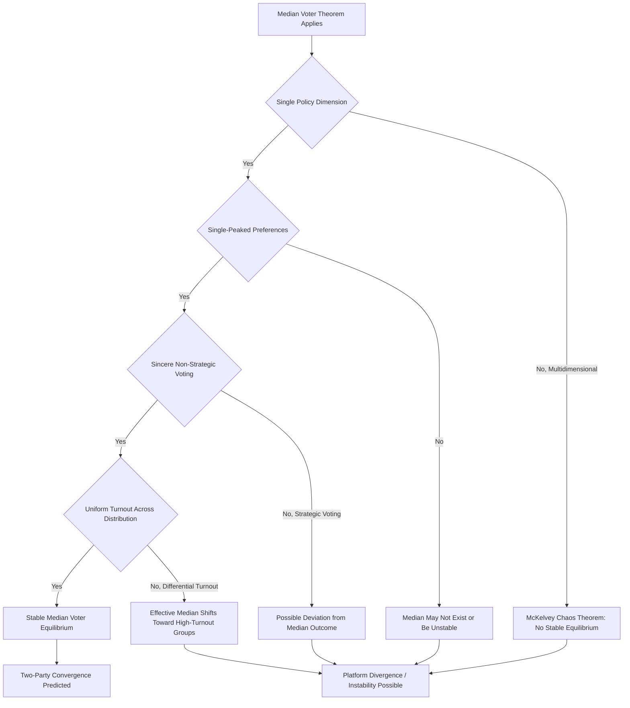

## Median voter theorem and political equilibrium

### Overview and Framing

The median voter theorem is one of the central formal results in public choice theory and spatial voting theory, predicting the outcome of majority-rule elections over a single policy dimension. Originally developed by Duncan Black (1948) and popularized in economics by Anthony Downs (1957), the theorem establishes conditions under which competitive political outcomes converge to the policy preference of the voter located at the median of the distribution of voter preferences — providing a tractable equilibrium prediction for otherwise indeterminate majoritarian political competition.

### The Spatial Model of Voting

The median voter theorem is derived within the **spatial (Hotelling-Downs) model** of political competition, in which policy positions are represented as points along a single ideological or policy dimension (e.g., a left-right spectrum, or a specific numeric policy parameter such as a tax rate), and voters are assumed to have **single-peaked preferences** over this dimension: each voter has an ideal point $x_i^*$, and utility declines monotonically as the proposed policy moves further from that ideal point in either direction.

$$U_i(x) = -|x - x_i^*| \quad \text{or more generally} \quad U_i(x) = -(x - x_i^*)^2$$

Two office-motivated candidates (or parties), each seeking to maximize their vote share or win probability, choose a policy platform to propose. Under the single-peaked preference assumption and a unidimensional policy space, voters simply vote for whichever candidate's platform is closer to their own ideal point.

**Key Points**

- Single-peakedness is the crucial technical condition ensuring a well-defined median exists and that voter preferences over the policy line behave predictably (no voter prefers two distant alternatives to one in between them).
- The model assumes voters are non-strategic (sincere voters) — each voter simply votes for the platform nearest their ideal point, without attempting to vote strategically based on beliefs about other voters' behavior or the likely outcome.

### The Median Voter Theorem: Statement and Intuition

**Formal statement**: In a majority-rule election between two candidates competing over a single policy dimension, with voters having single-peaked preferences, the policy platform preferred by the **median voter** — the voter whose ideal point divides the electorate such that exactly half of voters have ideal points to the left and half to the right — defeats any other proposed platform in pairwise majority-rule voting, and is therefore the unique stable (Condorcet-winning) equilibrium outcome.

$$x^* = x_{median}, \quad \text{where } P(x_i^* < x_{median}) = P(x_i^* > x_{median}) = 0.5$$

**Intuition**: If a candidate proposes any platform to the left of the median voter's ideal point, a rival candidate can propose a platform slightly to the right of the first candidate's platform (but still left of, at, or matching the median), capturing every voter to the right of the original platform — a majority of the electorate, since by definition more than half of voters have ideal points at or to the right of any point left of the median. By symmetric logic, any platform to the right of the median is similarly vulnerable to a rival capturing the majority located to the left. Only the median voter's ideal point is invulnerable to being defeated by any alternative platform in pairwise majority voting.

**Diagram: Median Voter Convergence (svg_diagram)**

<svg xmlns="http://www.w3.org/2000/svg" viewBox="0 0 720 340" font-family="Arial, sans-serif">
<text x="360" y="26" font-size="16" font-weight="bold" text-anchor="middle">Median Voter Theorem: Candidate Convergence (svg_diagram)</text>
<line x1="60" y1="180" x2="660" y2="180" stroke="#333" stroke-width="2" />
<text x="60" y="205" font-size="11" text-anchor="middle">Left</text>
<text x="660" y="205" font-size="11" text-anchor="middle">Right</text>
<g>
<circle cx="120" cy="180" r="4" fill="#666" />
<circle cx="180" cy="180" r="4" fill="#666" />
<circle cx="240" cy="180" r="4" fill="#666" />
<circle cx="300" cy="180" r="4" fill="#666" />
<circle cx="360" cy="180" r="6" fill="#a32020" />
<circle cx="420" cy="180" r="4" fill="#666" />
<circle cx="480" cy="180" r="4" fill="#666" />
<circle cx="540" cy="180" r="4" fill="#666" />
<circle cx="600" cy="180" r="4" fill="#666" />
</g>
<text x="360" y="230" font-size="12" text-anchor="middle" fill="#a32020" font-weight="bold">Median Voter (x*)</text>
<text x="360" y="245" font-size="10" text-anchor="middle">4 voters left, 4 voters right</text>
<circle cx="220" cy="100" r="8" fill="#2b579a" />
<text x="220" y="85" font-size="11" text-anchor="middle" fill="#2b579a">Candidate A (initial)</text>
<path d="M220,108 Q290,140 355,175" fill="none" stroke="#2b579a" stroke-width="1.5" stroke-dasharray="4,3" marker-end="url(#a8)" />
<circle cx="500" cy="100" r="8" fill="#1e7a34" />
<text x="500" y="85" font-size="11" text-anchor="middle" fill="#1e7a34">Candidate B (initial)</text>
<path d="M500,108 Q430,140 365,175" fill="none" stroke="#1e7a34" stroke-width="1.5" stroke-dasharray="4,3" marker-end="url(#a8)" />

<text x="360" y="290" font-size="12" text-anchor="middle" font-style="italic">Both candidates converge toward the median to maximize vote share</text>

</svg>

**Key Points**

- The theorem predicts policy *convergence*, not divergence: rational, office-motivated two-party competition should drive both candidates toward nearly identical platforms located at the median voter's ideal point, a strikingly strong and often empirically counterintuitive prediction given the significant platform divergence frequently observed between competing political parties in practice.
- The theorem applies strictly only to a single policy dimension; extending the model to multidimensional policy spaces (voters simultaneously caring about, e.g., taxation, social policy, and foreign policy as distinct dimensions) generally destroys the guarantee of a stable Condorcet-winning equilibrium except under restrictive symmetry conditions on the preference distribution (McKelvey's chaos theorem shows that without such restrictive conditions, majority-rule cycling can occur across virtually the entire multidimensional policy space).

### Applications to Public Finance: The Median Voter and Public Expenditure

The median voter theorem's most direct application in public economics concerns local and national public expenditure levels determined through majoritarian voting (direct referenda on spending levels, or indirectly through elected representatives responsive to majoritarian pressure). Under the theorem, the equilibrium level of public good provision or tax rate should reflect the preference of the median-income or median-preference voter, not the mean or aggregate-welfare-maximizing level.

$$g^* = g(x_{median}), \quad \text{not} \; g^* = \arg\max \sum_i U_i(g)$$

**Example**

In a jurisdiction with a right-skewed income distribution (a small number of very high earners pulling the mean above the median, as is empirically typical), the median voter theorem predicts that majoritarian voting on tax-financed public expenditure will reflect the preferences of the median-income voter — who has income below the mean — rather than the mean-income voter, generating a theoretical prediction (widely discussed under the "Meltzer-Richard" model of the political economy of redistribution) that more unequal income distributions, holding other factors constant, should generate demand for more redistributive taxation, since a larger income gap between the median and mean voter increases the median voter's relative benefit from redistribution funded by taxing the above-median-income population.

### Divergence from the Theorem's Prediction in Practice

Despite its analytical power, empirical political behavior frequently diverges from the median voter theorem's strict convergence prediction. Public choice and political economy scholarship has identified several factors that weaken or invalidate the theorem's applicability:

- **Multidimensional policy space**: Real political competition rarely occurs over a single, cleanly-defined dimension; candidates and parties compete across multiple simultaneous policy dimensions (economic, social, foreign policy), and as McKelvey's chaos theorem demonstrates, no stable majority-rule equilibrium generally exists in genuinely multidimensional settings without restrictive symmetry conditions.
- **Primary elections and candidate positioning under uncertainty**: In systems with primary elections, candidates must first secure their party's more ideologically extreme primary electorate before competing in a more moderate general election, creating a two-stage game that can produce systematic platform divergence from the theorem's single-election convergence prediction.
- **Valence issues and candidate quality**: Voters often care about candidate characteristics beyond pure policy position (perceived competence, integrity, charisma — "valence" attributes), which can permit an advantaged candidate to maintain a divergent policy position without losing the election, weakening the pure policy-convergence prediction.
- **Turnout effects and voter mobilization**: If voter turnout is not uniform across the ideological spectrum (e.g., more ideologically extreme voters turn out more reliably than moderate voters), the *effective* median among actual voters diverges from the median of the full eligible electorate, shifting the predicted equilibrium.
- **Party discipline and long-run brand/reputation concerns**: Political parties may resist median-convergent platform shifts to preserve a distinct long-term ideological brand or reputation valuable for sustaining donor and activist support, even at some electoral cost in any single election.

**Key Points**

- [Inference] The persistent empirical observation of significant platform divergence between major political parties in many real-world democracies is generally read as evidence that one or more of the median voter theorem's restrictive assumptions (single-dimensionality, sincere non-strategic voting, uniform turnout, absence of valence considerations) fails to hold in practice, rather than as a wholesale rejection of spatial voting theory's usefulness as an analytical framework.

### Diagram: Conditions for Median Voter Theorem Validity

### The Downsian Model and Party Competition

Anthony Downs's broader theoretical apparatus, within which the median voter theorem is typically situated, models political parties as analogous to firms in an economic market, motivated primarily by winning elections (analogous to profit maximization) rather than by any prior ideological commitment, adjusting their platforms strategically in response to the distribution of voter preferences much as firms adjust product characteristics in response to consumer demand.

$$\text{Party Objective: } \max \; \text{Vote Share (or win probability)}, \; \text{subject to platform } x \in [0,1]$$

**Key Points**

- The Downsian "office-seeking" assumption (parties care only about winning, not about policy for its own sake) is a simplifying assumption relaxed in later "policy-seeking" party models, which better accommodate empirically observed platform divergence by allowing that party elites may have genuine intrinsic policy preferences they are only imperfectly willing to sacrifice for marginal electoral gain.
- Downs's framework also generated the influential concept of **rational voter ignorance**: because any individual voter's probability of being pivotal in a large election is vanishingly small, the expected benefit of acquiring costly political information is correspondingly small, providing a rational-choice foundation for the widely observed empirical phenomenon of low voter information levels about specific policy issues and candidate positions.

### Connections to Broader Public Choice Theory

The median voter theorem interacts closely with the interest-group and legislative theories discussed elsewhere in this literature: while the median voter framework predicts electorally-driven policy convergence toward the preferences of the decisive median voter, the Stigler-Peltzman capture-theory tradition emphasizes that concentrated interest groups can secure policy outcomes deviating from the median voter's preference by providing valuable political resources (campaign funding, organizational support, information) that shift the *effective* political calculus faced by office-seeking politicians beyond the pure preference-aggregation logic of the median voter model alone.

[Inference] A synthesis view treats the median voter model as most predictive in high-salience, well-understood policy domains where voters have clear preferences and can meaningfully monitor candidate positions, while the interest-group capture models are more predictive in lower-salience, technically complex regulatory domains where voter information costs are high and organized interests face comparatively little effective electoral counter-pressure from the broader median-voter-aligned public.

### Empirical Considerations

[Unverified] Empirical tests of the median voter theorem's predictive accuracy for actual public expenditure levels, tax rates, and other policy outcomes across jurisdictions and electoral systems produce mixed results; some studies find reasonably strong correlation between measures of median voter preference (e.g., median income in the Meltzer-Richard redistribution application) and observed policy outcomes, while others find substantial and persistent deviation attributable to the various divergence factors discussed above, and disentangling median-voter effects from confounding interest-group and institutional factors remains a significant empirical challenge.

**Behavioral disclaimer**: The median voter theorem's predictive accuracy in any specific electoral or policy context depends heavily on whether its restrictive assumptions (unidimensionality, single-peaked preferences, sincere voting, uniform turnout) approximately hold; the model above characterizes an important theoretical benchmark in spatial voting theory rather than a universally accurate description of observed political outcomes.

### Related Topics

- Spatial voting theory and Hotelling-Downs competition models
- McKelvey's chaos theorem and instability in multidimensional voting
- Meltzer-Richard model of the political economy of redistribution
- Rational voter ignorance and the economics of political information
- Arrow's impossibility theorem and social choice theory foundations
- Interest-group competition models and their interaction with electoral theory (Stigler, Peltzman, Becker)
- Primary elections, candidate positioning, and two-stage electoral games
- Valence politics and candidate quality in spatial competition models