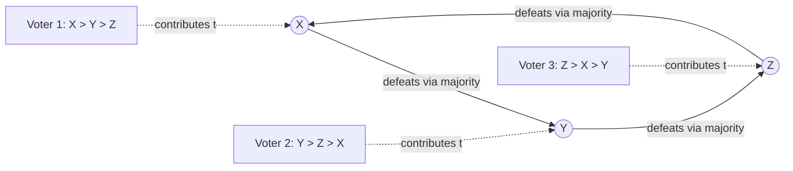
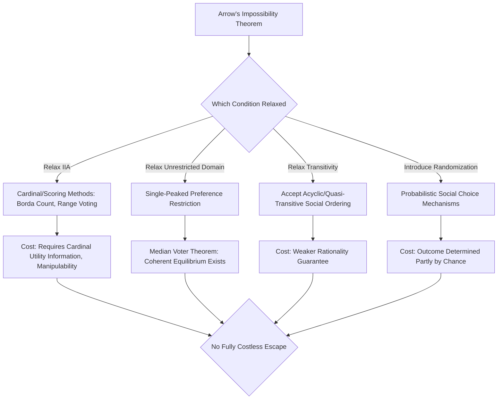

## Arrow's impossibility theorem and social choice

### Overview and Framing

Arrow's impossibility theorem, proven by Kenneth Arrow in his 1951 doctoral thesis *Social Choice and Individual Values*, is the foundational result of modern social choice theory, establishing that no voting or preference-aggregation procedure can convert individual preference orderings into a coherent social preference ordering while simultaneously satisfying a small set of seemingly minimal and reasonable fairness and rationality conditions — except by designating a single individual as a dictator. The theorem's implications extend deeply into public choice theory, constitutional design, and the broader question of whether "the will of society" can be given coherent meaning through any aggregation procedure applied to genuinely diverse individual preferences.

### The Social Choice Problem

The social choice problem asks: given a set of individuals, each with a complete and transitive preference ordering over a set of at least three social alternatives, does there exist a procedure (a **social welfare function**) that aggregates these individual orderings into a single social preference ordering that is itself complete and transitive, while satisfying certain minimal fairness conditions?

$$F: (\succeq_1, \succeq_2, \ldots, \succeq_n) \rightarrow \succeq_{social}$$

where $\succeq_i$ represents individual $i$'s preference ordering over the set of alternatives, and $F$ is the social welfare function mapping the profile of individual orderings to a single social ordering $\succeq_{social}$.

### Arrow's Conditions

Arrow specified a set of conditions that any minimally reasonable social welfare function should satisfy:

- **Unrestricted domain (U)**: The social welfare function must produce a valid social ordering for *any* possible profile of individual preference orderings (individuals can have any preferences whatsoever; the procedure cannot simply refuse to function for certain preference configurations).
- **Non-dictatorship (ND)**: No single individual's preferences should determine the social ordering regardless of all other individuals' preferences.
- **Pareto efficiency (P)**: If every individual prefers alternative $x$ to alternative $y$, the social ordering must also rank $x$ above $y$.
- **Independence of irrelevant alternatives (IIA)**: The social ranking between any two alternatives $x$ and $y$ should depend only on individuals' relative rankings of $x$ and $y$ specifically, not on how individuals rank some third, irrelevant alternative $z$.

**Arrow's Theorem**: If there are at least three distinct social alternatives to be ranked, no social welfare function can simultaneously satisfy Unrestricted Domain, Pareto Efficiency, Independence of Irrelevant Alternatives, and Non-Dictatorship. Any social welfare function satisfying U, P, and IIA must be dictatorial.

**Key Points**

- The theorem is a **general impossibility result**, not merely a critique of a specific voting procedure such as plurality voting or ranked-choice voting; it establishes that no conceivable preference-aggregation rule, however cleverly designed, can escape the tradeoff among these conditions once there are three or more alternatives.
- Each condition, examined individually, appears to be a modest and unobjectionable requirement of procedural fairness or logical coherence, which is precisely what gives the theorem its force: the impossibility is not the product of one obviously extreme or unreasonable requirement, but emerges from the *joint* incompatibility of conditions that each seem individually indispensable to any democratic aggregation procedure.

### Diagram: Arrow's Impossibility Structure (svg_diagram)

<svg xmlns="http://www.w3.org/2000/svg" viewBox="0 0 720 380" font-family="Arial, sans-serif">
<text x="360" y="26" font-size="16" font-weight="bold" text-anchor="middle">Arrow's Impossibility Theorem: Four Conditions (svg_diagram)</text>
<circle cx="220" cy="140" r="90" fill="#e8f0fe" fill-opacity="0.5" stroke="#2b579a" stroke-width="1.5" />
<text x="220" y="100" font-size="12" text-anchor="middle" font-weight="bold">Unrestricted Domain</text>
<text x="220" y="118" font-size="10" text-anchor="middle">Works for any preference profile</text>
<circle cx="500" cy="140" r="90" fill="#fde8e8" fill-opacity="0.5" stroke="#a32020" stroke-width="1.5" />
<text x="500" y="100" font-size="12" text-anchor="middle" font-weight="bold">Pareto Efficiency</text>
<text x="500" y="118" font-size="10" text-anchor="middle">Unanimous preference respected</text>
<circle cx="220" cy="290" r="90" fill="#fff3cd" fill-opacity="0.5" stroke="#a67c00" stroke-width="1.5" />
<text x="220" y="250" font-size="12" text-anchor="middle" font-weight="bold">Independence of</text>
<text x="220" y="266" font-size="12" text-anchor="middle" font-weight="bold">Irrelevant Alternatives</text>
<text x="220" y="330" font-size="10" text-anchor="middle">No influence from third options</text>
<circle cx="500" cy="290" r="90" fill="#e6f4ea" fill-opacity="0.5" stroke="#1e7a34" stroke-width="1.5" />
<text x="500" y="250" font-size="12" text-anchor="middle" font-weight="bold">Non-Dictatorship</text>
<text x="500" y="330" font-size="10" text-anchor="middle">No single decisive individual</text>

<text x="360" y="200" font-size="13" text-anchor="middle" font-weight="bold" fill="#333">All Four Jointly = Impossible</text>

<text x="360" y="218" font-size="11" text-anchor="middle" fill="#333">(for 3+ alternatives)</text>

</svg>

### Intuitive Illustration: Condorcet's Voting Paradox

The intuitive core of Arrow's theorem is closely related to the **Condorcet paradox** (Marquis de Condorcet, 1785), which predates Arrow's formal theorem but illustrates the same underlying difficulty: majority-rule pairwise voting over three or more alternatives can produce a **cyclical** social preference with no well-defined winner, even though every individual voter has perfectly rational (transitive) preferences.

**Example**

Consider three voters with the following preference orderings over alternatives $X$, $Y$, $Z$:

- Voter 1: $X \succ Y \succ Z$
- Voter 2: $Y \succ Z \succ X$
- Voter 3: $Z \succ X \succ Y$

In pairwise majority voting: $X$ defeats $Y$ (Voters 1 and 3 prefer $X$ to $Y$), $Y$ defeats $Z$ (Voters 1 and 2 prefer $Y$ to $Z$), and $Z$ defeats $X$ (Voters 2 and 3 prefer $Z$ to $X$). The result is a cycle: $X \succ Y \succ Z \succ X$, with no alternative capable of defeating all others — majority rule fails to produce any coherent, transitive social ordering despite each individual voter's preferences being perfectly transitive.

### Diagram: The Condorcet Cycle

**Key Points**

- The Condorcet paradox demonstrates that majority rule, applied to pairwise comparisons over three or more alternatives, does not in general satisfy the transitivity property individual preferences are assumed to satisfy — social preference cycling is a structural possibility inherent to pairwise majority voting, not an artifact of any particular voter population's unusual preferences.
- Arrow's theorem generalizes this insight from majority rule specifically to *any* conceivable non-dictatorial aggregation procedure satisfying the other stated conditions, showing that the difficulty is not specific to majority rule but pervasive across essentially all reasonable aggregation methods.

### Relaxing Arrow's Conditions: Escape Routes

Because Arrow's theorem shows the *joint* satisfaction of all four conditions is impossible, much subsequent social choice theory has explored what becomes possible when one or more conditions are relaxed or reformulated:

- **Relaxing Independence of Irrelevant Alternatives**: Voting procedures using cardinal utility information (e.g., Borda count, range voting, or other scoring methods) rather than pure ordinal rankings can escape Arrow's impossibility, at the cost of requiring interpersonally comparable cardinal utility information that is itself difficult to elicit or verify, and introducing vulnerability to strategic manipulation of the scoring scale.
- **Relaxing Unrestricted Domain**: If individual preferences are restricted to satisfy **single-peakedness** (as assumed in the median voter theorem), a coherent, non-dictatorial, transitive social ordering (the median voter's preference) becomes achievable — this is precisely the escape route exploited by Black's median voter theorem, which can be understood as identifying a specific domain restriction under which Arrow's impossibility is avoided.
- **Relaxing transitivity of the social ordering**: Some approaches accept a social preference relation that is merely acyclic or quasi-transitive rather than fully transitive, which can restore possibility results at the cost of a weaker rationality requirement on the resulting social preference.
- **Probabilistic/randomized social choice**: Randomized aggregation procedures (assigning outcomes probabilistically based on preference intensity or via randomized dictatorship mechanisms) can satisfy modified versions of Arrow's conditions, at the cost of introducing an element of chance into what might otherwise be understood as a deterministic collective decision.

**Key Points**

- The median voter theorem's validity, properly understood through the lens of Arrow's theorem, is *not* a counterexample to Arrow's impossibility result but rather an illustration of the specific domain-restriction escape route: single-peaked preferences over a single dimension is precisely the kind of restricted domain condition that permits escaping the general impossibility.
- [Inference] No escape route from Arrow's theorem is fully costless; each relaxation of one of Arrow's four conditions purchases a possibility result at the price of accepting some other analytically or practically significant limitation (added information requirements, restricted preference domains, weaker rationality guarantees, or randomization).

### Diagram: Escape Routes from Arrow's Impossibility

### Implications for Constitutional Design and Legislative Institutions

Arrow's theorem carries significant implications for constitutional political economy: because no aggregation procedure can guarantee a coherent, non-dictatorial "social preference" satisfying Arrow's minimal fairness conditions across an unrestricted domain of individual preferences, constitutional and legislative institutional design (committee structures, agenda-setting rules, voting procedures, bicameralism) can be understood, in part, as pragmatic mechanisms for managing or constraining the potential instability and cycling that Arrow's theorem shows is a structural possibility in collective decision-making, rather than as mechanisms capable of eliminating that instability entirely.

$$\text{Institutional Design Goal: } \text{Constrain/Structure Cycling}, \; \text{not} \; \text{Eliminate Arrovian Impossibility}$$

**Key Points**

- **Agenda-setting power**: Because pairwise majority voting over a cyclical preference profile can produce different winners depending on the *order* in which alternatives are voted upon, control over agenda-setting (which alternative is voted on against which, and in what sequence) becomes a source of substantial, and potentially decisive, political power independent of the underlying distribution of voter preferences — a direct institutional implication of Arrow-type instability.
- **Riker's application to constitutional theory**: William Riker extended Arrow's theorem into an influential (and contested) argument that because no coherent, meaningful "will of the people" or "public interest" can be reliably derived from voting procedures once genuine multidimensional preference diversity is present, democratic outcomes should be understood more modestly as contingent products of specific institutional agenda-setting and voting-rule choices, rather than as authoritative expressions of a coherent collective will — a position with significant, and debated, implications for how much substantive legitimacy should be attributed to any particular majoritarian legislative outcome.

### Sen's Liberal Paradox: A Related Impossibility Result

Amartya Sen's related 1970 "liberal paradox" (or "Paretian liberal" impossibility result) demonstrates a structurally analogous impossibility specifically concerning the interaction between individual liberty rights and the Pareto principle: no social choice mechanism can simultaneously guarantee (1) a minimal sphere of protected individual choice for at least two individuals over matters exclusively personal to each, and (2) full satisfaction of the Pareto principle, without generating a logical inconsistency in certain preference configurations.

[Inference] Sen's result is frequently read alongside Arrow's theorem as reinforcing a broader theme in social choice theory: seemingly modest and independently attractive normative requirements for collective decision-making (efficiency, fairness, respect for individual autonomy, non-dictatorship) can prove jointly incompatible once examined with sufficient formal rigor, suggesting that any real-world constitutional or institutional arrangement necessarily makes an implicit, contestable tradeoff among these values rather than fully satisfying all of them simultaneously.

### Critiques and Practical Significance

[Inference] A frequently raised practical critique of Arrow's theorem's real-world significance holds that the theorem's impossibility result, while formally rigorous, describes a worst-case structural possibility (cycling can occur) rather than a claim that cycling is empirically pervasive or that observed democratic institutions function poorly in practice; empirical political science research has found that severe, persistent majority cycling is less commonly observed in real legislative and electoral settings than the pure theoretical possibility might suggest, plausibly because real-world preference distributions, institutional agenda-control mechanisms, and repeated-interaction norms substantially constrain the practical incidence of Arrow-type instability even though the underlying structural possibility remains formally present.

[Unverified] The precise empirical frequency and practical significance of majority cycling in actual legislative and electoral institutions remains a genuinely debated question in empirical political science and social choice research, with reasonable scholarly disagreement about how much weight Arrow's formal impossibility result should carry for evaluating the functional legitimacy of real-world democratic institutions.

### Related Topics

- Median voter theorem as a domain-restriction escape from Arrow's impossibility
- Condorcet paradox and cyclical majority voting
- McKelvey's chaos theorem and multidimensional voting instability
- Sen's liberal paradox and the Pareto principle
- Gibbard-Satterthwaite theorem and strategic voting manipulation
- Riker's theory of liberalism and the limits of democratic legitimacy
- Agenda-setting power and institutional control of voting sequence
- Alternative voting mechanisms: Borda count, approval voting, ranked-choice voting