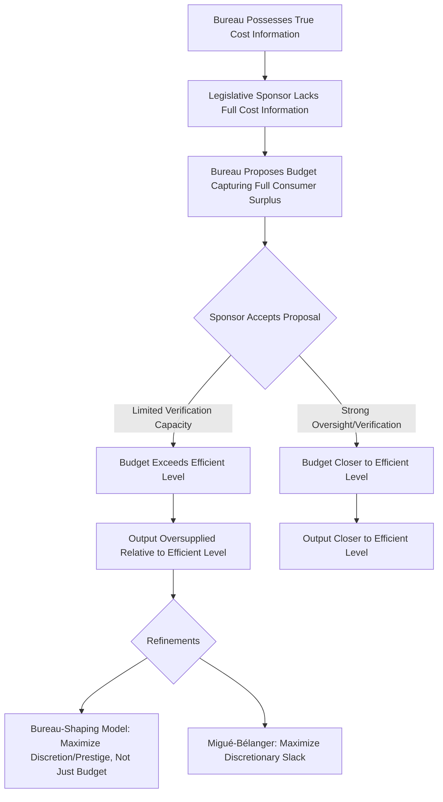

## Regulatory capture and bureaucratic behavior

### Overview and Framing

Regulatory capture describes the phenomenon by which regulatory agencies, established to act in a broad public interest (correcting market failures, protecting consumers, ensuring safety), come to be dominated by, or systematically act in the interest of, the industries or interest groups they are charged with regulating. Bureaucratic behavior theory more broadly examines the incentives facing administrative agencies and their personnel as self-interested actors within a principal-agent structure, rather than as neutral, purely public-spirited implementers of legislative mandates. Together these strands of public choice theory provide a positive (descriptive) account of administrative agency behavior that frequently diverges from the normative ideal of expert, disinterested regulatory administration.

### Stigler's Capture Theory Applied to Agencies

Building directly on the economic theory of legislation, Stigler's capture theory applied specifically to regulatory agencies argues that because regulated industries are typically few in number, well-resourced, and possess strong per-firm stakes in regulatory outcomes (satisfying Olson's conditions for effective collective-action organization), while the broader public bearing the diffuse costs of favorable regulation faces severe free-rider problems, agencies over time tend to be captured by — that is, to act primarily in the interest of — the industries they regulate, rather than the diffuse public the agency was nominally created to protect.

$$\text{Agency Behavior} = f(\text{Industry Political/Informational Resources}, \text{Diffuse Public Counter-Pressure})$$

**Key Points**

- Capture need not involve corruption or bad faith on the part of individual regulators; it can arise purely from structural information and organizational asymmetries, reinforced by the specific institutional dynamics discussed below.
- Stigler's original theory focused primarily on agency *outputs* (regulatory rules and enforcement patterns favoring industry), while later refinements examine the *mechanisms* — information, personnel flows, and repeated interaction — through which capture is thought to occur.

### Mechanisms of Regulatory Capture

Several distinct, mutually reinforcing mechanisms are commonly identified in the literature as channels through which capture occurs:

- **Information asymmetry and agency dependence on regulated-party expertise**: Regulated industries typically possess far greater technical knowledge about their own operations, cost structures, and the practical consequences of proposed regulation than the regulating agency itself, creating a structural dependence on industry-supplied information that can bias agency decisions toward industry-favorable interpretations, even absent any deliberate manipulation.
- **The "revolving door"**: Regulatory personnel frequently move between careers in the regulated industry and careers at the regulating agency (and vice versa), creating both an incentive for current regulators to rule favorably toward industry in anticipation of future industry employment, and a channel through which industry perspective and personal relationships become embedded within the agency's institutional culture.
- **Asymmetric political resources for sustained engagement**: Because industry has a permanent, ongoing stake in the agency's regulatory activity, while diffuse public-interest engagement tends to be episodic (spiking around major controversies, then fading), industry representatives develop deeper, more sustained working relationships with agency staff over time than any comparably-resourced public-interest counterpart typically can.
- **Budgetary and political dependence**: Agencies dependent on legislative appropriations, and legislators dependent on industry political support, create an indirect capture channel in which legislative oversight committees, themselves subject to industry lobbying, exert pressure on agency budgets and leadership appointments in ways favorable to the regulated industry.

**Diagram: Channels of Regulatory Capture (svg_diagram)**

<svg xmlns="http://www.w3.org/2000/svg" viewBox="0 0 740 420" font-family="Arial, sans-serif">
<text x="370" y="26" font-size="16" font-weight="bold" text-anchor="middle">Mechanisms of Regulatory Capture (svg_diagram)</text>
<rect x="280" y="55" width="180" height="55" rx="8" fill="#e8f0fe" stroke="#2b579a" stroke-width="1.5" />
<text x="370" y="88" font-size="13" text-anchor="middle" font-weight="bold">Regulatory Agency</text>
<rect x="40" y="150" width="200" height="60" rx="8" fill="#fff3cd" stroke="#a67c00" stroke-width="1.5" />
<text x="140" y="175" font-size="11" text-anchor="middle">Information Asymmetry</text>
<text x="140" y="192" font-size="10" text-anchor="middle">Agency relies on industry data</text>
<rect x="270" y="150" width="200" height="60" rx="8" fill="#fde8e8" stroke="#a32020" stroke-width="1.5" />
<text x="370" y="175" font-size="11" text-anchor="middle">Revolving Door</text>
<text x="370" y="192" font-size="10" text-anchor="middle">Personnel move agency ↔ industry</text>
<rect x="500" y="150" width="200" height="60" rx="8" fill="#e6f4ea" stroke="#1e7a34" stroke-width="1.5" />
<text x="600" y="175" font-size="11" text-anchor="middle">Sustained Engagement</text>
<text x="600" y="192" font-size="10" text-anchor="middle">Industry maintains ongoing presence</text>
<line x1="140" y1="150" x2="320" y2="110" stroke="#333" stroke-width="1.2" marker-end="url(#a9)" />
<line x1="370" y1="150" x2="370" y2="110" stroke="#333" stroke-width="1.2" marker-end="url(#a9)" />
<line x1="600" y1="150" x2="420" y2="110" stroke="#333" stroke-width="1.2" marker-end="url(#a9)" />
<rect x="40" y="250" width="200" height="60" rx="8" fill="#f0f0f0" stroke="#666" stroke-width="1.5" />
<text x="140" y="275" font-size="11" text-anchor="middle">Budget/Appointment</text>
<text x="140" y="292" font-size="10" text-anchor="middle">Legislative oversight dependency</text>
<line x1="140" y1="250" x2="200" y2="210" stroke="#333" stroke-width="1.2" marker-end="url(#a9)" />
<rect x="270" y="320" width="200" height="60" rx="8" fill="#fde8e8" stroke="#a32020" stroke-width="1.5" />
<text x="370" y="345" font-size="12" text-anchor="middle" font-weight="bold">Net Effect: Capture</text>
<text x="370" y="362" font-size="10" text-anchor="middle">Regulation favors industry</text>
<line x1="370" y1="210" x2="370" y2="320" stroke="#333" stroke-width="1.5" marker-end="url(#a9)" />
</svg>

### The Life-Cycle Theory of Regulatory Agencies

A related, historically influential hypothesis (associated with Marver Bernstein's earlier institutional analysis and consistent with the capture-theory literature) proposes a **life-cycle pattern** in agency behavior: newly created agencies, often established in response to a public scandal or crisis generating strong public salience and political will, initially pursue vigorous, genuinely public-interest-oriented enforcement, but over subsequent years the initial public salience fades, the founding generation of committed regulatory personnel is gradually replaced, and the sustained, well-resourced attention of the regulated industry (which has a permanent stake unlike the episodically-engaged public) increasingly shapes the agency's ongoing priorities and rule-making, producing a gradual drift toward capture over the agency's institutional lifespan.

$$\text{Agency Independence}(t) = \text{Independence}_0 \cdot e^{-\lambda t} \quad \text{(stylized decay pattern)}$$

[Inference] This life-cycle model is a useful heuristic for understanding a commonly observed qualitative pattern, though [Unverified] the precise decay dynamics, and whether agency capture is genuinely monotonic and irreversible as the simplified exponential-decay framing suggests, or whether agencies can experience periodic renewal of independence (through new leadership, renewed public scandal, or legislative reform), varies considerably across specific historical agency case studies and is not a settled empirical regularity.

### Niskanen's Budget-Maximizing Bureaucrat Model

A distinct but complementary strand of bureaucratic behavior theory, developed by William Niskanen (1971), does not focus on capture by external industry interests but instead models the bureaucratic agency itself as a self-interested actor pursuing its own institutional objectives — most centrally, budget maximization — within a principal-agent relationship with the legislative sponsor that funds it.

Niskanen's model treats the bureau as possessing an informational advantage over its legislative sponsor regarding the true cost of providing its output, allowing the bureau to present a budget request that captures the *entire* consumer surplus the sponsor would be willing to pay for the bureau's output, rather than the efficient (minimum-cost) budget that a fully-informed sponsor would authorize.

$$\text{Bureau proposes: } B^{Niskanen} = \text{Total Value of Output to Sponsor}$$

$$\text{Efficient budget: } B^{efficient} = \text{Minimum Cost of Efficient Output Level}$$

$$B^{Niskanen} > B^{efficient}$$

**Key Points**

- Niskanen's model predicts that budget-maximizing bureaus will systematically oversupply their output relative to the level a fully-informed, welfare-maximizing sponsor would choose, because the bureau's informational advantage allows it to extract budget appropriations beyond the sponsor's true marginal cost of provision.
- [Inference] This model's applicability depends on the bureau genuinely possessing an informational advantage over its legislative sponsor, and on the sponsor having only limited capacity or incentive to invest in independently verifying the bureau's cost claims — conditions that plausibly vary substantially across different types of government agencies and oversight regimes.
- Niskanen's original all-or-nothing budget-proposal framing has been criticized and refined in subsequent literature (e.g., by Migué and Bélanger, and by later "bureau-shaping" models associated with Patrick Dunleavy) which argue that senior bureaucrats may maximize other objectives (discretionary budget, agency prestige, or a preferred bureau structure and mission scope) rather than gross budget size specifically.

### Diagram: Niskanen Bureau-Sponsor Interaction

### Dunleavy's Bureau-Shaping Model

Patrick Dunleavy's bureau-shaping model refines Niskanen's framework by arguing that senior bureaucrats, who have the greatest influence over agency strategy, are more plausibly motivated by preferences over the *type* and *structure* of their agency's work (preferring high-status, policy-advisory, centrally-located functions over routine, high-volume, geographically dispersed service-delivery functions) than by simple aggregate budget maximization, since senior officials' personal work environment, prestige, and career prospects are more directly affected by the *shape* of their bureau's activities than by its overall budget size per se.

[Inference] This refinement helps explain empirically observed patterns of agency restructuring and outsourcing (senior bureaucrats sometimes supporting the delegation or contracting-out of routine, high-volume service-delivery functions to external contractors, retaining a smaller, higher-status "core" policy function) that a pure budget-maximization model would not straightforwardly predict, since contracting out routine functions typically *reduces* the agency's direct-employee budget even as it may enhance the remaining core staff's status and working conditions.

### Countervailing Forces Against Capture

The capture-theory literature has been refined by subsequent scholarship identifying countervailing institutional mechanisms that can limit, though rarely fully eliminate, capture dynamics:

- **Multiple, competing organized interests**: As in Peltzman's formalization of the economic theory of legislation, the presence of well-organized *competing* interests (downstream industries, consumer-facing large firms with a stake in lower input costs, competing segments of a regulated industry with divergent interests) can provide meaningful counter-pressure against unilateral capture by any single interest.
- **Judicial review of administrative action**: Courts reviewing agency action for consistency with statutory authority and required procedure (the "arbitrary and capricious" standard and similar doctrines in administrative law) function as an external check potentially constraining the most extreme forms of industry-favorable agency drift, connecting this topic to the broader economic analysis of judicial review discussed in constitutional law and economics.
- **Media scrutiny and investigative journalism**: Periodic renewal of public salience through investigative journalism or high-profile regulatory failures can temporarily reverse the life-cycle drift toward capture, restoring political attention and pressure for reform, though [Inference] this renewal effect is inherently episodic and its durability after the initial salience fades is uncertain.
- **Structural/institutional design choices**: Multi-member commission structures (rather than single-administrator agencies), staggered terms, cross-partisan appointment requirements, and mandated public comment/notice procedures are frequently justified as institutional designs intended to raise the cost and reduce the ease of straightforward industry capture, though the empirical effectiveness of any specific structural design choice in actually limiting capture remains debated.

### Empirical Considerations

[Unverified] Empirical identification of regulatory capture in any specific historical or contemporary agency is methodologically challenging, since observationally similar patterns (agency decisions favorable to industry) can arise either from genuine capture or from a legitimate, technically well-informed assessment that industry-favored positions happen to align with sound regulatory policy in a given instance; distinguishing these explanations typically requires detailed case-study evidence (documented industry influence on specific decisions, revolving-door timing analysis, comparison of agency positions before and after documented industry contact) rather than reliance on outcome patterns alone.

**Behavioral disclaimer**: The degree and mechanism of capture varies substantially across regulatory agencies, industries, and historical periods, and depends on agency-specific institutional design, the presence or absence of organized countervailing interests, and the broader political and media environment; the frameworks above characterize recurring theoretical patterns and mechanisms rather than a claim that any specific agency is, or is not, currently captured.

### Related Topics

- Stigler's economic theory of regulation and the interest-group demand for regulation
- Niskanen's budget-maximizing bureaucrat model and its refinements
- Dunleavy's bureau-shaping model
- Peltzman's formalization of competing interest-group influence on regulation
- Judicial review of administrative action and the arbitrary-and-capricious standard
- The revolving door and post-employment restrictions in administrative law
- Principal-agent theory applied to legislative oversight of agencies
- Theory of collective action and interest group organization (Olson)