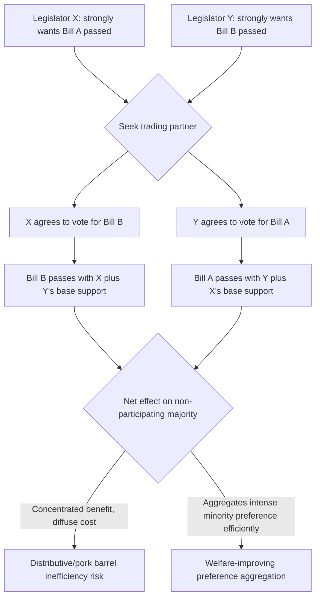

## Logrolling and Legislative Bargaining

### Conceptual Overview

Logrolling is the practice of vote-trading among legislators: a legislator agrees to support another's preferred bill in exchange for reciprocal support on a bill of their own. In public choice theory, logrolling is central to explaining both how legislatures aggregate intensely-felt minority preferences that simple majority voting would otherwise ignore, and how legislatures systematically produce inefficient overspending on geographically concentrated, narrowly-benefiting programs (the classic "pork barrel" problem).

The theoretical treatment of logrolling sits at the intersection of social choice theory (Arrow, Black), spatial voting models, and the economic theory of legislatures (Buchanan and Tullock's *The Calculus of Consent*, 1962, is the foundational text).

### Why Simple Majority Voting Fails to Aggregate Intensity

Ordinary majority voting on a single up-or-down question treats every voter's preference as equally weighted, regardless of **intensity**. Consider two bills, A and B, each favored by a different 40% minority but opposed (mildly) by the other 60%:

| Voter Group | Bill A | Bill B |
| --- | --- | --- |
| Group 1 (40%) | Strongly favor (+10) | Mildly oppose (−1) |
| Group 2 (40%) | Mildly oppose (−1) | Strongly favor (+10) |
| Group 3 (20%) | Indifferent (0) | Indifferent (0) |

Voted separately by simple majority, both bills fail (60% oppose each). But logrolling — Group 1 agrees to vote for Bill B if Group 2 votes for Bill A — allows both bills to pass, and the **aggregate social welfare** is higher: combined value of $+10 - 1 = +9$ for Group 1 and $+9$ for Group 2, versus zero under the status quo where both bills fail. This is the classic **efficiency-enhancing case for logrolling**: it allows intensity of preference, not just headcount, to influence outcomes.

**Key Points**

- Logrolling can be **welfare-improving** when it permits intense minority preferences to be traded against apathetic or mild majority opposition, effectively creating a market-like mechanism for preference aggregation absent from simple majority rule.
- Logrolling can also be **welfare-reducing** when the traded bills involve costs that are diffused across all taxpayers while benefits are concentrated on the bargaining coalition — this is the standard **pork barrel / distributive politics** critique.

### Formal Model: Explicit vs. Implicit Logrolling

**Explicit (vote-trading) logrolling** involves a direct exchange: "I will vote for your bill if you vote for mine." This can occur on sequential or simultaneous votes and is the classic bilateral bargain described above.

**Implicit logrolling** occurs through **bundling**: legislators combine multiple distinct provisions into a single bill (an omnibus bill), so that a legislator who mildly opposes provision A but strongly supports provision B must vote for the entire bundle to get B, effectively "buying" A's passage as a byproduct. Implicit logrolling does not require any explicit bilateral negotiation — it is embedded in the agenda-setting and bill-drafting process itself.

**[Inference]** Because implicit (bundled) logrolling does not require an identifiable bilateral trade, it is generally regarded in the literature as harder to monitor for public accountability and more susceptible to strategic agenda manipulation by whoever controls bill drafting (committee chairs, party leadership) — this is a widely discussed institutional concern rather than a formally proven universal result.

### Diagram: Logrolling Coalition Formation

### The Pork Barrel Problem: Concentrated Benefits, Diffuse Costs

The most-studied inefficiency associated with logrolling arises when legislative districts trade votes for locally-targeted spending projects (infrastructure, military bases, agricultural subsidies) funded from a general tax fund.

**Formal structure**

Suppose $n$ districts, each represented by one legislator. A project benefiting district $i$ costs $C$ (funded from general revenue, so spread across all $n$ districts via taxation) but delivers benefit $B_i$ only to district $i$. If $B_i > C/n$ (the district's own share of the tax cost) but $B_i < C$ (the project is not efficient overall unless $B_i$ exceeds the full cost), then:

$$\text{District } i \text{ favors the project if: } B_i > \frac{C}{n}$$

$$\text{Project is efficient only if: } B_i > C$$

Since $C/n \ll C$ for any reasonably large legislature, there is a wide range of projects that are individually attractive to the benefiting district (because they only bear $1/n$ of the cost) but socially inefficient overall. Logrolling allows legislators to assemble majority coalitions where each district votes for every other district's inefficient project in exchange for support of their own — producing a **"universalism" norm** in which most or all districts receive some form of locally targeted spending, and aggregate spending significantly exceeds the efficient level.

This is sometimes formalized as a **common pool resource problem**: the general tax fund is a shared resource, and each legislator, acting to maximize benefit to their own district, does not internalize the cost imposed on the other $n-1$ districts — a legislative analogue of the tragedy of the commons.

**[Inference]** The magnitude of this overspending bias grows with the number of districts $n$, since each individual district's share of the shared tax cost shrinks as $n$ increases, while the concentrated benefit to the district remains constant — this comparative-static prediction (larger legislatures produce more pork-barrel overspending, all else equal) is a standard theoretical result but its empirical magnitude is contested and depends heavily on institutional counter-mechanisms (see below).

### Table: Logrolling Outcomes by Cost/Benefit Structure

| Cost Structure | Benefit Structure | Likely Outcome | Efficiency Assessment |
| --- | --- | --- | --- |
| Diffuse (general tax) | Diffuse (all districts benefit) | Standard majority voting works | Neutral — logrolling not needed |
| Diffuse (general tax) | Concentrated (few districts) | Logrolling/pork barrel coalition | Likely inefficient overspending |
| Concentrated (targeted tax/fee) | Concentrated (matching districts) | User-pays alignment | Likely efficient |
| Concentrated | Diffuse | Rarely proposed (no coalition benefits) | N/A |

### Institutional Mechanisms That Constrain Logrolling

Legislatures and constitutional designers have developed several mechanisms specifically to limit the inefficiencies associated with logrolling and bill-bundling:

**Single-subject rules**

Many U.S. state constitutions require that legislation address only a single subject, explicitly to prevent implicit logrolling via omnibus bundling. This is a direct constitutional response to the bundling concern described above.

**Line-item veto**

An executive line-item veto (available to many U.S. governors, though not the President following *Clinton v. City of New York*, 1998) allows the executive to strike individual spending provisions from an appropriations bill without vetoing the entire bill — directly undermining the logrolling coalition's ability to bundle mutually-supporting provisions into a single up-or-down vote.

**Germaneness rules**

Legislative procedural rules requiring floor amendments to be "germane" (relevant) to the underlying bill limit legislators' ability to attach unrelated riders, reducing opportunities for implicit logrolling through amendment.

**Supermajority and balanced-budget requirements**

Constitutional or statutory supermajority requirements for tax increases or spending bills raise the coalition size needed to pass a logrolled package, which — per the common-pool logic above — should reduce (though not eliminate) the size of sustainable pork-barrel coalitions, since more legislators must be brought into (and effectively paid off within) the winning coalition.

**[Speculation]** Some public choice scholars argue supermajority rules can paradoxically *increase* per-project costs, since a larger winning coalition may require richer side payments (more provisions bundled in) to secure the additional votes — this is a theoretically plausible but empirically disputed counter-argument to the standard supermajority-constrains-logrolling story.

### Example: Agricultural Subsidy Coalition

**Example**

Consider a legislature of 100 members, each representing a district. A crop-subsidy bill benefits the 15 districts with substantial agricultural production ($10 million benefit each, $150 million total) but is funded from general revenue, so each of the 100 districts bears $1.5 million in tax cost.

- For the 15 agricultural districts: $B_i = \$10M > C/n = \$1.5M$ — strongly favor.
- For the other 85 districts: $B_i = 0 < \$1.5M$ — strongly oppose, in isolation.

Passing this bill by simple majority requires the 15 agricultural legislators to logroll with at least 36 other legislators (to form a 51-vote majority). They do so by attaching provisions benefiting other unrelated industries or districts — a highway project, a defense contractor's home district, a rural broadband subsidy — each individually costed at roughly the same $1.5M-per-district threshold, until 51 legislators each perceive net local benefit exceeding their $1.5M tax share. The resulting omnibus bill passes, but the aggregate $150M+ (now much larger, bundled) package may substantially exceed any efficient level of spending, since **no legislator was required to weigh the total cost against the total benefit** — only their own district's slice against their own district's tax share.

### Median Voter Theorem and Logrolling: A Comparison

The median voter theorem (Black, Downs) predicts convergence to the median voter's preferred outcome under single-dimensional, single-issue majority voting. Logrolling is significant precisely because it operates in **multidimensional issue space**: once legislators can bundle or trade across multiple distinct issues, the median voter theorem's single-dimension stability result breaks down, and legislative outcomes become path-dependent on agenda order, coalition-formation sequencing, and bargaining power — a manifestation of the broader **instability/chaos results** in multidimensional social choice (McKelvey, 1976; Riker's "heresthetic" concept of strategic agenda manipulation exploits precisely this instability).

**[Inference]** This connection between logrolling and multidimensional voting instability is a well-established theoretical link in the public choice literature, though real-world legislatures exhibit far more stability than pure chaos-theorem predictions would suggest — a gap the literature attributes to institutional structure-induced equilibria (committee systems, agenda control, germaneness rules), not to any flaw in the underlying instability result itself.

### Diagram: Cost-Benefit Asymmetry Underlying Pork-Barrel Logrolling (svg_diagram)

<svg xmlns="http://www.w3.org/2000/svg" viewBox="0 0 680 380">
<text x="340" y="25" text-anchor="middle" font-size="16" font-weight="bold" fill="#1a1a1a">Concentrated Benefit vs. Diffuse Cost (svg_diagram)</text>

<rect x="60" y="70" width="140" height="90" fill="#a3d9a5" stroke="#333" />
<text x="130" y="100" text-anchor="middle" font-size="12" fill="#1a1a1a">District i</text>
<text x="130" y="120" text-anchor="middle" font-size="12" fill="#1a1a1a">receives benefit</text>
<text x="130" y="140" text-anchor="middle" font-size="13" font-weight="bold" fill="#2e7d32">B_i = $10M</text>

<line x1="200" y1="115" x2="280" y2="115" stroke="#333" stroke-width="2" marker-end="url(#arrow)" />
<text x="240" y="105" text-anchor="middle" font-size="11" fill="#1a1a1a">funded by</text>

<rect x="290" y="60" width="330" height="110" fill="#ffe0b2" stroke="#333" />
<text x="455" y="80" text-anchor="middle" font-size="12" fill="#1a1a1a">General Tax Fund</text>
<text x="455" y="100" text-anchor="middle" font-size="12" fill="#1a1a1a">Cost C = $150M spread across all n = 100 districts</text>
<text x="455" y="120" text-anchor="middle" font-size="13" font-weight="bold" fill="#e65100">C/n = $1.5M per district</text>
<text x="455" y="145" text-anchor="middle" font-size="11" fill="#1a1a1a">Each of 99 non-benefiting districts pays $1.5M for zero benefit</text>

<rect x="60" y="220" width="60" height="120" fill="#2e7d32" />
<text x="90" y="215" text-anchor="middle" font-size="11" fill="#1a1a1a">B_i</text>
<text x="90" y="360" text-anchor="middle" font-size="11" fill="#1a1a1a">$10M</text>
<rect x="160" y="320" width="60" height="20" fill="#e65100" />
<text x="190" y="315" text-anchor="middle" font-size="11" fill="#1a1a1a">C/n</text>
<text x="190" y="360" text-anchor="middle" font-size="11" fill="#1a1a1a">$1.5M</text>
<rect x="260" y="140" width="60" height="200" fill="none" stroke="#b71c1c" stroke-width="2" stroke-dasharray="5" />
<text x="290" y="135" text-anchor="middle" font-size="11" fill="#b71c1c">C</text>
<text x="290" y="360" text-anchor="middle" font-size="11" fill="#1a1a1a">$150M</text>

<text x="340" y="378" text-anchor="middle" font-size="11" font-style="italic" fill="#555">District favors project since B_i greater than C/n, even though B_i less than C (inefficient overall)</text>

</svg>

### Logrolling in Committee Systems

Real-world legislatures rarely operate as pure floor-vote assemblies; committee systems (particularly in the U.S. Congress) structure logrolling opportunities significantly:

- **Universalism norm**: In distributive committees (e.g., appropriations, public works), a documented empirical pattern (Weingast, 1979) is that committees tend toward "universalism" — including benefits for nearly all members' districts rather than forming minimum winning coalitions — because the cost of exclusion from future logrolling coalitions (being cut out of the next round of pork) exceeds the benefit of a smaller, cheaper coalition today. This is sometimes explained as a repeated-game equilibrium: legislators prefer the certainty of universalism over the risk of being excluded from a minimum-winning coalition in a future session.
- **Committee gatekeeping power**: Committees with jurisdiction over specific issue areas can control the agenda and bundle provisions, effectively enabling implicit logrolling under the guise of "expert" committee drafting.

**[Unverified]** The empirical strength and generality of the "universalism" finding across different legislative bodies, time periods, and institutional configurations is debated in the political science literature; the original Weingast-Shepsle-Johnsen model is influential but subsequent empirical work has found universalism to be contingent on specific institutional features (e.g., open vs. closed committee systems, party discipline strength) rather than a universal legislative constant.

### Logrolling vs. Coasean Bargaining: A Conceptual Distinction

Logrolling is sometimes analogized to Coasean bargaining (private parties trading rights to reach efficient allocations), but the analogy is imperfect:

| Dimension | Coasean Bargaining | Legislative Logrolling |
| --- | --- | --- |
| Parties | Private individuals/firms | Elected representatives (agents) |
| Whose welfare is traded | Bargainers' own | Constituents' (principal-agent gap) |
| External parties | Internalized via property rights | Non-coalition taxpayers bear externalized cost |
| Efficiency tendency | Generally efficiency-enhancing (Coase Theorem) | Ambiguous — can be efficiency-enhancing (intensity aggregation) or reducing (pork barrel) |

**[Inference]** The key structural difference is the **principal-agent problem**: legislators bargain with each other using resources (tax revenue) belonging to third parties (constituents/taxpayers) who are not present at the bargaining table, whereas Coasean bargaining occurs between the actual rights-holders — this absence of the residual-cost-bearer from the negotiation is the standard explanation in the literature for why legislative logrolling lacks the efficiency guarantees of the Coase Theorem.

### Related Topics

- Median voter theorem and single-peaked preferences (Black's theorem)
- Arrow's Impossibility Theorem and multidimensional voting instability (McKelvey chaos theorem)
- Rent-seeking and concentrated-interest-group capture of legislation
- Committee structure and agenda control in legislatures (Shepsle-Weingast)
- Constitutional constraints on fiscal policy: balanced budget rules, line-item veto, single-subject rules
- Common pool resource problems and the tragedy of the commons
- Coase Theorem and its scope conditions
- Riker's theory of heresthetic and strategic agenda manipulation