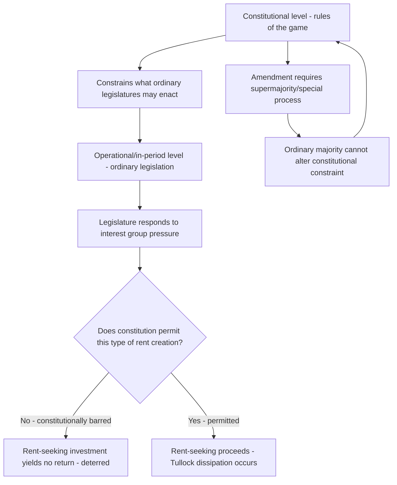

## Constitutional Constraints on Rent-Seeking

### Conceptual Overview

Rent-seeking refers to the expenditure of real resources by individuals or firms to obtain or defend transfers of wealth (rents) created through government action, rather than through productive economic activity. Because such expenditures produce no offsetting social value — they merely redistribute existing wealth while consuming resources in the contest itself — rent-seeking is treated in public choice theory as a pure social loss, additional to the deadweight loss of the underlying policy distortion (monopoly, tariff, licensing restriction) that creates the rent in the first place.

Constitutional political economy — associated foundationally with James Buchanan and Gordon Tullock's *The Calculus of Consent* (1962) and later Buchanan's work on constitutional economics — asks how the **rules of the political game** (as opposed to policy outcomes chosen within those rules) can be designed at a constitutional level to limit the opportunities for and returns to rent-seeking. The core insight is that rent-seeking is a rational response to institutional structure: constrain the structure, and the incentive to rent-seek diminishes correspondingly.

### The Tullock Rectangle: Quantifying Rent-Seeking Loss

**Key Points**

- Standard monopoly welfare analysis identifies a deadweight loss triangle (the Harberger triangle) from reduced output at the monopoly price.
- Tullock's 1967 insight was that the **monopoly rent itself** (the rectangle representing transferred profit, previously treated as a mere distributional transfer with no efficiency implications) is also substantially dissipated in a rent-seeking equilibrium, because rational actors will spend resources competing for the right to capture that rent up to the value of the rent itself.

Formally, if a monopoly (or exclusive license, quota, or protected market position) generates rent $R$, and $n$ risk-neutral competitors expend resources $e_i$ to try to win the right to that rent with probability $p_i(e_1, \ldots, e_n)$ proportional to their own effort relative to total effort, then in a symmetric Tullock contest with $n$ identical rent-seekers:

$$\text{Total rent-seeking expenditure} = \frac{n-1}{n} \cdot R$$

As $n \to \infty$, total expenditure approaches $R$ — the *entire* rent is dissipated in competition for it, transforming what classical analysis treated as a pure transfer into a real social cost equivalent in magnitude to the rent itself.

**[Inference]** Full or near-full rent dissipation is the textbook Tullock-contest prediction under specific assumptions (risk neutrality, symmetric contestants, a particular contest-success function); real-world rent-seeking often exhibits only partial dissipation due to risk aversion, entry barriers into the contest itself, or increasing marginal costs of lobbying effort — the "up to full dissipation" result is a theoretical benchmark, not a universal empirical finding.

### Why Constitutional Rules, Not Ordinary Legislation

**Key Points**

- Buchanan's central methodological move (constitutional political economy) is to distinguish the **"in-period" or operational level** of politics (ordinary legislation, budget decisions made within existing rules) from the **constitutional level** (the rules themselves — how legislation is made, what legislatures are permitted to do, supermajority requirements, structural limits).
- Rent-seeking is analyzed as a problem to be solved primarily at the **constitutional level**, because ordinary legislative majorities have no incentive to restrict their own future ability to create and distribute rents — a legislature cannot credibly self-bind against rent-creation using ordinary legislation, since a future majority can simply repeal or override that legislation.
- This generates the core constitutional-design question: what **pre-commitment devices**, entrenched at a level more durable than ordinary majority legislation (supermajority amendment requirements, judicial review, structural separation of powers), can credibly limit the government's capacity to create rents in the first place?

This logic mirrors, at the level of the state, the standard economic argument for binding contracts and property rights: actors with the power to renege on a commitment will do so unless bound by an external, harder-to-alter constraint. A constitution functions as this external constraint on the legislature's own future behavior.

### Diagram: Levels of Constitutional Political Economy

### Categories of Constitutional Constraints

**1. Generality and non-discrimination requirements**

A constitutional rule requiring that legislation apply generally, rather than targeting specific named individuals or narrow classes, directly limits the ability of legislatures to create narrowly-targeted rents. Historical examples include:

- **Bills of attainder and ex post facto clauses** (U.S. Constitution, Art. I, §9-10) — prohibit legislation targeting specific individuals or retroactively criminalizing conduct, a narrow but illustrative generality constraint.
- **Equal protection doctrine** — while primarily a civil-rights doctrine, equal protection review of economic legislation (particularly under stricter scrutiny standards, historically during the *Lochner* era) functions, in the public choice reading, as a partial check on legislatures enacting narrowly-targeted economic favoritism.

**[Inference]** Buchanan and other constitutional economists have argued that a **general "generality principle"** — requiring that laws apply uniformly rather than to specifically identified beneficiaries or targets — would be one of the most powerful available constitutional constraints on rent-seeking, since narrowly-targeted rents (which are cheapest to create and easiest for concentrated interest groups to lobby for) would become constitutionally unavailable; however, no major constitutional system has adopted a comprehensive generality requirement of this kind, making this largely a normative proposal rather than a description of existing doctrine.

**2. Enumerated and limited powers**

Constitutions that enumerate specific legislative powers (rather than granting plenary authority) constrain the domains within which rent-seeking can occur, since interest groups cannot lobby for rents the legislature has no constitutional authority to grant. The U.S. Constitution's enumerated powers structure (Article I, §8) is the paradigmatic example, though its practical constraining force has been substantially reduced over time by broad interpretations of the Commerce Clause and the Necessary and Proper Clause.

**3. Structural separation of powers and checks**

Bicameralism, presidential veto power, and judicial review each raise the number of independent veto players required to enact any given policy — including rent-creating policy. Under the logic of **veto-player theory** (Tsebelis), more veto players with divergent preferences reduce the set of policies (including rent-transfers) that can successfully be enacted, since a rent-seeking coalition must now satisfy multiple independent gatekeepers rather than a single majority.

**4. Fiscal constitutional rules**

- **Balanced budget requirements** (present in most U.S. state constitutions) limit the ability of legislatures to fund rent-seeking coalitions through deficit spending, forcing rent-creation to compete more directly against other budget priorities within a fixed constraint.
- **Tax and expenditure limitations (TELs)**, supermajority requirements for tax increases, and debt ceilings similarly raise the political cost of assembling rent-seeking coalitions by requiring broader consensus.
- **Uniformity and equal taxation clauses** in many state constitutions restrict the legislature's ability to grant narrowly-targeted tax exemptions or preferences — a direct fiscal analogue to the generality principle above.

**5. Judicial review of economic legislation**

Constitutional judicial review, when applied to economic regulation, can strike down legislation found to lack a legitimate public purpose or to constitute an impermissible transfer to a narrow private interest. The intensity of this constraint has varied dramatically:

- The **Lochner era** (roughly 1897-1937) involved relatively active judicial scrutiny of economic regulation under substantive due process, striking down various labor and licensing regulations partly on grounds resembling anti-rent-seeking logic (protecting economic liberty against special-interest capture), though the doctrinal basis and historical motivations are contested among legal historians.
- Post-1937 "rational basis" review under *United States v. Carolene Products* effectively ended robust judicial scrutiny of ordinary economic regulation, meaning modern U.S. courts provide only a minimal constitutional constraint on rent-seeking legislation, deferring to virtually any stated legislative rationale.

**[Inference]** The public-choice critique of rational basis review is that it provides essentially no constraint on rent-seeking, since courts will uphold almost any economic regulation supported by a plausible (even post-hoc) public-interest rationale, regardless of whether the legislation's actual origin and effect is the transfer of rents to a concentrated interest group (e.g., occupational licensing restrictions defended as "consumer protection" but functioning primarily to restrict entry and protect incumbent rents) — this is a normative critique found extensively in the law-and-economics literature on occupational licensing, not a doctrinal description of current law.

### Table: Constitutional Mechanism vs. Rent-Seeking Channel Addressed

| Mechanism | Primary Rent-Seeking Channel Constrained |
| --- | --- |
| Generality/non-discrimination clauses | Narrowly-targeted transfers to identified beneficiaries |
| Enumerated powers | Domains of government action available for capture |
| Bicameralism/separation of powers | Number of veto points a rent-seeking coalition must satisfy |
| Balanced budget/debt limits | Deficit-financed rent creation |
| Supermajority tax/spending rules | Coalition size needed to enact rent-transfers |
| Judicial review (strict scrutiny) | Legislation lacking genuine public-interest justification |
| Term limits | Long-term relationship-building between legislators and rent-seeking interest groups |

### Example: Occupational Licensing as a Rent-Seeking Case Study

**Example**

Consider a state legislature considering a licensing requirement for a service occupation (e.g., interior design, hair braiding, or floristry — occupations frequently cited in the licensing literature as having minimal genuine public-safety rationale). Incumbent practitioners have concentrated incentives to lobby for licensing requirements (mandatory training hours, examinations, fees) that raise entry costs for competitors, creating a rent (higher prices, reduced competition) captured by incumbents at the expense of diffuse consumers and excluded would-be entrants.

- **Without constitutional constraint**: the legislature, facing concentrated lobbying from incumbent practitioners and no organized opposition (consumers are individually unaffected enough to organize), enacts the licensing rule. Under rational basis review, the law is upheld so long as the state articulates *any* plausible consumer-protection rationale, however weak the actual evidentiary support.
- **Under a hypothetical generality constraint or heightened judicial scrutiny of occupational regulation** (as advocated in some state constitutional reform proposals and in a smaller number of actual state court decisions applying stricter state-level scrutiny to occupational licensing under state constitutional provisions), the legislature would need to demonstrate a substantially closer fit between the restriction and an actual public-safety objective, raising the cost of enacting rent-protective licensing and correspondingly reducing the expected return to lobbying for it.

### Rent-Seeking, Rent-Extraction, and Rent-Avoidance: Related Concepts

**Key Points**

- **Rent-seeking** (the standard Tullock sense): resources spent by private parties to obtain government-created rents.
- **Rent-extraction** (McChesney, 1987): the mirror-image problem in which politicians *threaten* adverse legislation against an industry not to actually enact it, but to extract payments (campaign contributions, political support) in exchange for *not* imposing the threatened harm — here the direction of resource flow is initiated by the politician rather than the private party.
- **Rent-avoidance**: resources spent by private parties to avoid becoming the target of a rent-extracting threat or a rent-transferring regulation (e.g., defensive lobbying, compliance-cost minimization, political donations made purely defensively).

**[Inference]** Rent-extraction is generally treated in the literature as a distinct and arguably more troubling phenomenon than rent-seeking, because it implies politicians possess an independent capacity to *manufacture* threats for personal or political gain, meaning that even a constitution that successfully limits legislatures' capacity to *grant* new rents may leave open equally costly extraction dynamics grounded merely in a credible threat of harmful legislation — reducing legislative capacity to act does not necessarily reduce legislators' capacity to threaten. This is a recognized theoretical extension of Tullock's original framework, and the empirical balance between seeking and extraction dynamics in any given legal system is not well settled.

### Diagram: Rent-Seeking vs. Rent-Extraction Direction of Initiative (svg_diagram)

<svg xmlns="http://www.w3.org/2000/svg" viewBox="0 0 680 300">
<text x="340" y="25" text-anchor="middle" font-size="16" font-weight="bold" fill="#1a1a1a">Rent-Seeking vs. Rent-Extraction (svg_diagram)</text>

<rect x="40" y="60" width="260" height="90" fill="#a3d9a5" stroke="#333" />
<text x="170" y="85" text-anchor="middle" font-size="13" font-weight="bold" fill="#1a1a1a">Rent-Seeking</text>
<text x="170" y="105" text-anchor="middle" font-size="11" fill="#1a1a1a">Private interest initiates</text>
<text x="170" y="122" text-anchor="middle" font-size="11" fill="#1a1a1a">lobbies for favorable rule</text>
<text x="170" y="139" text-anchor="middle" font-size="11" fill="#1a1a1a">Politician grants rent</text>
<line x1="60" y1="180" x2="280" y2="180" stroke="#2e7d32" stroke-width="2" marker-end="url(#arrowA)" />
<text x="170" y="200" text-anchor="middle" font-size="11" fill="#2e7d32">Private party --&gt; Politician (payment/support for favorable rule)</text>

<rect x="380" y="60" width="260" height="90" fill="#ffcdd2" stroke="#333" />
<text x="510" y="85" text-anchor="middle" font-size="13" font-weight="bold" fill="#1a1a1a">Rent-Extraction</text>
<text x="510" y="105" text-anchor="middle" font-size="11" fill="#1a1a1a">Politician initiates</text>
<text x="510" y="122" text-anchor="middle" font-size="11" fill="#1a1a1a">threatens adverse legislation</text>
<text x="510" y="139" text-anchor="middle" font-size="11" fill="#1a1a1a">Private interest pays to avoid harm</text>
<line x1="640" y1="180" x2="420" y2="180" stroke="#b71c1c" stroke-width="2" marker-end="url(#arrowB)" />
<text x="530" y="200" text-anchor="middle" font-size="11" fill="#b71c1c">Politician --&gt; Private party (threat), payment flows back</text>

<text x="340" y="250" text-anchor="middle" font-size="12" fill="`#1a1a1a`">Constitutional limits on legislative power constrain rent-seeking</text>

<text x="340" y="270" text-anchor="middle" font-size="12" fill="`#1a1a1a`">but may not fully constrain the credibility of extraction threats</text>

</svg>

### Term Limits as a Constitutional Constraint

Legislative term limits are frequently proposed and adopted (at the U.S. state level, and for the U.S. presidency federally) as a constitutional mechanism to reduce rent-seeking, on the theory that long-tenured legislators develop durable, mutually profitable relationships with specific interest groups over successive terms (repeated-game rent-seeking relationships), and that term limits disrupt this by forcibly rotating legislators before such relationships mature.

**[Inference]** The empirical evidence on term limits' actual effect on rent-seeking and interest-group influence is decidedly mixed; some studies suggest term limits shift power *toward* legislative staff, executive agencies, or lobbyists (who are not term-limited and thus accumulate the relevant expertise and continuity that departing legislators lose), potentially *increasing* certain forms of interest-group influence rather than reducing it — this is a genuinely contested empirical question in the state politics literature, not a settled result in either direction.

### Limits of Constitutional Design: The Enforcement Problem

**Key Points**

- A fundamental limitation of all constitutional constraints on rent-seeking is the **enforcement/interpretation problem**: constitutional text must be interpreted and enforced by some institution (typically courts), and that institution is itself subject to political pressure, appointment politics, and potential capture or drift over time.
- Constitutional rules can be **circumvented** rather than violated outright — legislatures skilled at rent-creation often find that facially neutral, generally-applicable rules can still be designed to have narrowly-targeted practical effects (e.g., a "generally applicable" size or revenue threshold calibrated to include only the intended beneficiary or exclude only the intended target).

**[Speculation]** Some scholars in the constitutional political economy tradition argue this circumvention problem is close to structurally unavoidable, implying that no purely textual/rule-based constitutional constraint can fully eliminate rent-seeking, and that durable constraint ultimately depends as much on **political culture, transparency norms, and civil society monitoring** as on the formal constitutional text itself — this is a normative/theoretical position within the field rather than an empirically demonstrated conclusion.

### Related Topics

- Tullock's original rent-seeking contest model and contest-success functions
- Buchanan and Tullock's *The Calculus of Consent* and constitutional political economy
- Occupational licensing and regulatory capture (Stigler's economic theory of regulation)
- Veto-player theory and legislative gridlock (Tsebelis)
- McChesney's rent-extraction model
- Logrolling and legislative bargaining (distributive politics)
- Judicial review standards: rational basis vs. heightened scrutiny of economic legislation
- Term limits and legislative professionalization literature