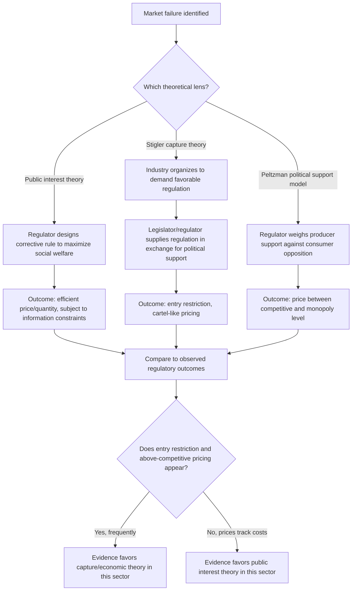

## Public Interest versus Capture Theories of Regulation

### Conceptual Overview

The economic analysis of regulation asks a foundational positive question: **why does regulation exist, and whose interests does it actually serve?** Two competing theoretical frameworks dominate the field: the **public interest theory**, which holds that regulation is created to correct market failures and serve broad social welfare, and the **capture theory** (and its more general successor, the **economic theory of regulation**), which holds that regulation is typically supplied in response to the demands of concentrated interest groups — often the regulated industry itself — and tends to serve narrow private interests rather than the diffuse public.

This debate is central to administrative law and regulatory economics because it shapes normative prescriptions: if public interest theory is correct, the policy problem is designing regulation well; if capture theory is correct, the policy problem may instead be limiting or redesigning the *institutions* that produce regulation in the first place.

### Public Interest Theory: The Baseline Model

**Key Points**

- Public interest theory holds that regulation arises as a corrective response to identifiable market failures: natural monopoly, externalities, information asymmetry, and public goods problems.
- Regulators are modeled (implicitly or explicitly) as benevolent agents of the public, seeking to maximize social welfare subject to informational and administrative constraints.
- The theory does not deny that regulation can be imperfect or costly, but attributes such imperfections to **information limitations and administrative error**, not to the systematic capture of the regulatory process by the entities being regulated.

**Canonical market-failure justifications for regulation:**

1. **Natural monopoly**: industries with declining average costs over the relevant range of output (large fixed costs, low marginal costs — e.g., traditional utility transmission networks) are prone to inefficient duopoly/oligopoly outcomes or monopoly pricing; rate-of-return or price-cap regulation is justified as a substitute for absent competitive discipline.
2. **Externalities**: pollution, workplace hazards, and similar spillover costs not borne by the party generating them justify Pigouvian-style regulatory correction (emissions standards, safety rules).
3. **Information asymmetry**: markets for credence goods (financial products, pharmaceuticals, professional services) where consumers cannot easily verify quality ex ante justify disclosure mandates, licensing, and safety/efficacy testing requirements.
4. **Public goods and common pool resources**: non-excludable, non-rivalrous goods (national defense, certain environmental resources) justify direct government provision or regulatory management, distinct from private-good regulation but often discussed alongside it.

**[Inference]** Public interest theory, though intuitively appealing and historically the default assumption underlying much administrative law doctrine (e.g., "in the public interest, convenience, and necessity" as a statutory standard for agencies like the FCC), has been substantially challenged empirically since the 1960s-70s by studies finding that regulatory outcomes in several industries (trucking, airlines, occupational licensing) more closely tracked incumbent industry interests than plausible measures of consumer welfare — this empirical challenge is the central motivation for the competing capture and economic theories discussed below, though it does not imply public interest theory is wrong in all or even most regulatory domains.

### Capture Theory: Origins and Core Claim

**Key Points**

- **Regulatory capture** describes a process by which regulatory agencies, ostensibly created to act in the public interest, come to be dominated by or systematically responsive to the interests of the industry they are charged with regulating.
- The concept predates its formal economic treatment (early expressions trace to Progressive-era and mid-20th-century political science observations of agency-industry relationships, e.g., studies of the Interstate Commerce Commission), but its rigorous economic formalization is due to **George Stigler's** 1971 article "The Theory of Economic Regulation."

**Mechanisms proposed for capture:**

- **Career/revolving-door incentives**: regulators anticipate future employment in the regulated industry and moderate enforcement to preserve those prospects, or industry expertise is disproportionately sourced from former industry employees who bring pro-industry priors into the agency.
- **Informational asymmetry favoring industry**: regulated firms possess far greater technical and operational information than the agency, and control much of what information reaches the agency, systematically biasing agency decisions toward industry-favorable interpretations.
- **Asymmetric political engagement**: the regulated industry has concentrated, well-organized, well-funded interests in every regulatory decision, while the diffuse public (paying, e.g., a few extra dollars per year in higher prices from a captured tariff) has negligible individual incentive to monitor or lobby the agency — a manifestation of Olson's collective action problem.

### Stigler's Economic Theory of Regulation

Stigler reframed the capture question in supply-and-demand terms: regulation is a **good that industries demand and that legislators/regulators supply**, in exchange for political support (votes, campaign contributions, favorable public relations). This "capture" is not primarily a story of industry corrupting a previously neutral agency after the fact, but of industries **actively seeking and shaping regulation from its inception** to serve their interests — regulation is, in this view, frequently *demanded by* the regulated industry itself, not merely captured after imposition.

**Key predictions of Stigler's theory:**

1. Industries seek regulation that restricts entry (licensing, certificates of public convenience and necessity, quotas) — a direct rent-creation mechanism functionally equivalent to a private cartel, but enforced with the coercive power of the state (which is more durable and effective than a private cartel, which faces internal cheating incentives that state enforcement can suppress).
2. Industries seek regulation of substitutes and complements to protect their market position (e.g., regulating a competing technology more strictly, or subsidizing a complementary input).
3. Industries seek price regulation, especially to prevent price competition from eroding cartel-like rents, and to make new entry unprofitable.
4. Small, well-organized groups are predicted to be more successful at obtaining favorable regulation than large, diffuse groups — a direct application of Mancur Olson's *The Logic of Collective Action* (1965) to the market for regulation.

$$\text{Political support supplied} = f(\text{organizational concentration}, \text{per-capita stakes}, \text{free-rider mitigation capacity})$$

### Peltzman's Extension: A Formal Political-Support Model

Sam Peltzman's 1976 extension formalized Stigler's insight into an explicit optimization model in which the regulator (or the legislator controlling the regulator) maximizes political support/majority, modeled as a function of the **distribution of gains and losses** across the industry (producers) and consumers, not simply industry preferences alone.

**Peltzman's key result**: the politically optimal regulated price is **not** the pure monopoly/cartel price (which would maximize producer surplus but generate maximal, concentrated consumer opposition) and **not** the competitive price (which would maximize consumer welfare but generate zero producer political support) — it is an **intermediate price** that balances the marginal political support gained from producers against the marginal political support lost from consumers.

$$\text{Maximize: } M = M(\pi(p), CS(p))$$

where $M$ is political majority/support, $\pi(p)$ is industry profit as a function of regulated price $p$, and $CS(p)$ is consumer surplus. The optimal $p^*$ satisfies:

$$\frac{\partial M}{\partial \pi} \cdot \frac{d\pi}{dp} + \frac{\partial M}{\partial CS} \cdot \frac{dCS}{dp} = 0$$

**[Inference]** Peltzman's model is generally regarded as a significant theoretical advance over Stigler's more purely industry-capture-centric account because it explains **partial, not total, capture** — regulated prices in most real-world settings fall between the competitive and pure-monopoly benchmarks, which the Peltzman framework predicts as an equilibrium outcome of competing political pressures, rather than treating any deviation from marginal-cost pricing as evidence of pure capture. This is a widely-cited theoretical refinement, though direct empirical estimation of the underlying "political support function" is inherently difficult and model-dependent.

### Table: Comparing the Three Frameworks

| Dimension | Public Interest Theory | Stigler Capture Theory | Peltzman Political Support Model |
| --- | --- | --- | --- |
| Regulator motivation | Maximize social welfare | Supply regulation to highest-value political demander | Maximize political support/majority |
| Who benefits | Diffuse public | Regulated industry (concentrated interest) | Both, in a balance determined by relative organizational power |
| Predicted price/outcome | Efficient (competitive or Ramsey-optimal) | Monopoly/cartel-like | Intermediate between competitive and monopoly |
| Role of consumers | Primary beneficiary | Largely ignored (diffuse, unorganized) | Secondary but non-trivial political constituency |
| Empirical falsifiability | Low (any outcome can be rationalized as welfare-maximizing given some market failure) | Moderate (predicts entry restriction, price floors) | Higher (generates specific comparative statics on price responsiveness to group size/organization) |

### Diagram: Formation of Regulatory Outcomes Under Competing Theories

### Empirical Evidence: Deregulation Episodes as Natural Experiments

**Key Points**

- The U.S. deregulation wave of the late 1970s-1980s (airlines under the Airline Deregulation Act of 1978, trucking under the Motor Carrier Act of 1980, and natural gas, telecommunications, and banking to varying degrees) is frequently cited as an important empirical testing ground for capture versus public interest theories.
- Pre-deregulation airline and trucking regulation (under the Civil Aeronautics Board and Interstate Commerce Commission, respectively) exhibited several patterns consistent with capture theory: extensive entry restriction (new carriers rarely approved), price floors well above competitive levels, and regulatory decisions that appeared to track incumbent-firm interests more closely than consumer welfare.
- Post-deregulation outcomes in these sectors — generally falling real prices, increased entry and route competition (airlines), and increased price competition (trucking) — are widely cited as evidence that pre-existing regulation had been serving a rent-protection function for incumbents rather than correcting a genuine market failure, since removing the regulation was followed by outcomes more consistent with functioning competitive markets than with market failure re-emerging.

**[Unverified]** While the broad direction of these deregulation-era findings (falling prices, increased entry, output expansion) is well documented in the empirical industrial organization literature, attributing the *pre-deregulation regulatory equilibrium itself* definitively to "capture" as opposed to a public-interest rationale that later became obsolete (e.g., regulation initially justified by wartime capacity constraints or genuine early-stage natural monopoly conditions that later eroded with technological change) remains subject to some historical and empirical debate; the two explanations are not always cleanly separable using ex post pricing data alone.

### Reconciling the Theories: Domain-Specific and Dynamic Accounts

Rather than treating public interest and capture theories as mutually exclusive universal explanations, much of the contemporary literature treats them as describing **different points along a spectrum**, or as applicable to **different stages** of a regulatory regime's life cycle:

- **Life-cycle capture theories** (associated with observations sometimes attributed to Marver Bernstein's earlier agency life-cycle model) propose that agencies may begin with genuine public-interest orientation at founding (often following a high-visibility crisis or scandal that creates broad public demand for regulation) but gradually drift toward capture over time as public attention fades, industry expertise and resources within the agency accumulate, and the concentrated regulated interest remains engaged long after the diffuse public coalition that created the agency has dispersed.
- **Mixed-motive/multi-principal models**: some regulatory statutes and agency structures are explicitly designed to serve multiple, sometimes competing, principals (Congress, the President, courts, industry, consumer groups), and outcomes in this view reflect a genuine multi-principal bargaining equilibrium rather than pure capture or pure public interest.

**[Inference]** The life-cycle capture narrative is intuitively persuasive and widely referenced in administrative law scholarship, but it is difficult to test rigorously because it requires longitudinal data on agency behavior and outcomes across long time horizons, and confounding factors (changes in underlying market structure, technology, and statutory mandate) make clean identification of a "drift toward capture" distinct from legitimate evolving regulatory practice genuinely difficult.

### Institutional Responses to the Capture Problem

**Key Points**

- **Structural separation**: assigning enforcement, rulemaking, and adjudicatory functions to separate offices or agencies (or requiring inter-agency review) to reduce any single point of capture.
- **Sunset provisions and periodic reauthorization**: requiring agencies or specific regulations to be affirmatively renewed by the legislature, forcing periodic public and legislative reconsideration rather than allowing indefinite regulatory persistence.
- **Public participation and notice-and-comment requirements**: procedural requirements under the U.S. Administrative Procedure Act (APA) requiring agencies to solicit and respond to public comments before finalizing rules, intended to lower the cost of diffuse-public participation relative to informal industry access, though **[Inference]** the practical effect of notice-and-comment in equalizing access is disputed, since well-funded industry groups can invest far more heavily in the comment process (technical studies, legal argumentation) than diffuse individual consumers, potentially reproducing rather than resolving the underlying organizational asymmetry Olson's theory predicts.
- **Independent agency structures with staggered terms and removal protections**: designed to insulate regulators somewhat from immediate political pressure, though this insulation is a double-edged sword from a capture perspective — it can protect regulators from short-term industry pressure but also reduces direct political accountability that might otherwise counteract long-term industry influence.
- **Judicial review of agency action**: arbitrary-and-capricious review under the APA and analogous doctrines provide a court-based check on agency decisions, though courts generally apply significant deference to agency technical expertise (e.g., historically under the *Chevron* framework), which **[Unverified]** may limit the practical anti-capture force of judicial review depending on the doctrinal deference standard currently in force — this is an evolving area of administrative law doctrine and the degree of deference applied has shifted over time.

### Example: Comparing Two Regulatory Episodes

**Example**

**Case 1 — Consistent with public interest theory**: Automobile passive-restraint (airbag) mandates in the 1980s-90s were opposed by the auto industry (which bore compliance costs) and supported primarily by diffuse consumer-safety advocates and federal safety regulators — the opposite organizational alignment from Stigler's prediction (concentrated industry interest typically *demands* favorable regulation; here the concentrated industry interest *opposed* the regulation, and it was adopted anyway, more consistent with a genuine externality/information-asymmetry correction).

**Case 2 — Consistent with capture/economic theory**: State-level occupational licensing for services with minimal demonstrated public-safety rationale (e.g., some cosmetology or interior design licensing requirements) is frequently initiated and actively lobbied for by *incumbent practitioners* themselves (a concentrated interest group), with diffuse consumers and excluded potential entrants largely unorganized and absent from the legislative process — closely matching Stigler's predicted alignment of interests and outcome (entry restriction benefiting the existing regulated group).

Contrasting these two cases illustrates why the empirical literature generally concludes that **neither theory describes regulation universally**; the predictive power of each theory varies substantially by regulatory domain, and the relevant empirical question in any specific case is which interest group's organizational structure and stakes most closely match the alignment the theory predicts.

### Diagram: Olson's Collective Action Asymmetry Underlying Capture (svg_diagram)

<svg xmlns="http://www.w3.org/2000/svg" viewBox="0 0 680 320">
<text x="340" y="25" text-anchor="middle" font-size="16" font-weight="bold" fill="#1a1a1a">Organizational Asymmetry Driving Regulatory Capture (svg_diagram)</text>
<rect x="40" y="60" width="270" height="150" fill="#a3d9a5" stroke="#333" />
<text x="175" y="85" text-anchor="middle" font-size="13" font-weight="bold" fill="#1a1a1a">Regulated Industry</text>
<text x="175" y="105" text-anchor="middle" font-size="11" fill="#1a1a1a">Few firms, high per-firm stakes</text>
<text x="175" y="122" text-anchor="middle" font-size="11" fill="#1a1a1a">Low cost to organize (trade associations)</text>
<text x="175" y="139" text-anchor="middle" font-size="11" fill="#1a1a1a">Strong incentive to lobby intensively</text>
<text x="175" y="156" text-anchor="middle" font-size="11" fill="#1a1a1a">Free-riding among firms limited</text>
<text x="175" y="180" text-anchor="middle" font-size="13" font-weight="bold" fill="#2e7d32">High effective political influence</text>
<rect x="370" y="60" width="270" height="150" fill="#ffe0b2" stroke="#333" />
<text x="505" y="85" text-anchor="middle" font-size="13" font-weight="bold" fill="#1a1a1a">Diffuse Consumers</text>
<text x="505" y="105" text-anchor="middle" font-size="11" fill="#1a1a1a">Millions of individuals, low per-capita stakes</text>
<text x="505" y="122" text-anchor="middle" font-size="11" fill="#1a1a1a">High cost to organize</text>
<text x="505" y="139" text-anchor="middle" font-size="11" fill="#1a1a1a">Weak individual incentive to engage</text>
<text x="505" y="156" text-anchor="middle" font-size="11" fill="#1a1a1a">Severe free-rider problem</text>
<text x="505" y="180" text-anchor="middle" font-size="13" font-weight="bold" fill="#e65100">Low effective political influence</text>

<text x="340" y="250" text-anchor="middle" font-size="12" fill="`#1a1a1a`">Per Olson (1965): small, concentrated groups overcome collective action problems more easily</text>

<text x="340" y="270" text-anchor="middle" font-size="12" fill="`#1a1a1a`">than large, diffuse groups — predicting systematic capture even absent explicit corruption</text>

</svg>

### Critiques of Capture Theory

**[Speculation]** Critics of the strong-form capture thesis note that it can become close to unfalsifiable if any regulatory outcome favorable to industry is retrospectively labeled "capture" and any outcome unfavorable to industry is dismissed as an exception — without an independent, ex ante measure of what a non-captured baseline outcome would look like, the theory risks circularity. Proponents respond that Peltzman-style formal political-support models provide exactly this independent baseline (specific comparative statics on how prices should respond to changes in group organization, elasticity of demand, and number of firms), making the theory testable in principle even if difficult to test cleanly in practice. This remains an active methodological debate rather than a settled matter.

### Related Topics

- Stigler's "The Theory of Economic Regulation" (1971) and Peltzman's 1976 extension
- Olson's *The Logic of Collective Action* and free-rider problems in political organization
- Natural monopoly regulation: rate-of-return vs. price-cap methods
- Occupational licensing economics and entry-barrier analysis
- Administrative Procedure Act: notice-and-comment rulemaking and judicial review standards
- Chevron deference and its evolution in U.S. administrative law
- Deregulation case studies: airlines, trucking, telecommunications
- Rent-seeking and constitutional constraints on regulatory capture