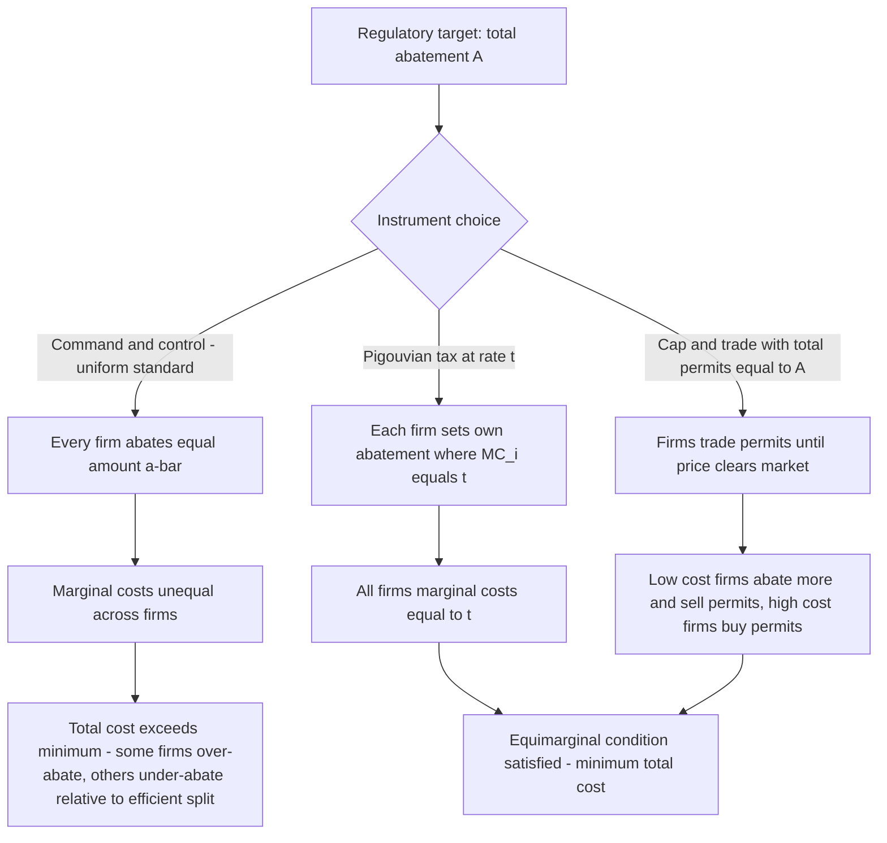

## Command-and-Control versus Market-Based Regulatory Instruments

### Conceptual Overview

Once a regulatory objective has been justified (correcting an externality, addressing an information asymmetry, managing a common pool resource), a distinct and equally important question arises: **what instrument should be used to achieve that objective?** The economic analysis of regulation draws a foundational distinction between **command-and-control (CAC) regulation** — direct legal mandates specifying required actions, technologies, or performance levels — and **market-based instruments (MBIs)** — mechanisms that use price signals or tradable rights to induce efficient behavior while leaving the specific means of compliance to be chosen by regulated parties.

This distinction, most extensively developed in environmental economics (though applicable across many regulatory domains — financial regulation, workplace safety, land use), centers on a core efficiency insight: when the cost of achieving a given unit of regulatory objective (e.g., a ton of pollution abated) varies across regulated parties, a **uniform command** is generically inefficient, while a **price or quantity mechanism that equalizes marginal costs across parties** achieves the objective at minimum total social cost.

### Command-and-Control: Definition and Subtypes

**Key Points**

- **Technology (design) standards**: mandate the specific equipment, process, or method a regulated party must use (e.g., "install scrubber technology X").
- **Performance (specification) standards**: mandate a specific outcome level per unit or per source, but leave the means of achieving it to the regulated party's discretion (e.g., "emissions must not exceed Y grams per unit of output") — this is sometimes considered a hybrid category, since it retains uniform per-source requirements (the CAC element) while allowing some compliance flexibility (a market-adjacent element).
- **Absolute quantity limits/bans**: prohibit an activity or substance outright, or cap total quantity per source with no flexibility (e.g., outright bans on specific chemicals, uniform per-plant emissions ceilings with no trading allowed).

**The core inefficiency of uniform CAC standards**

If marginal abatement cost $MC_i(a_i)$ (the cost of reducing pollution by one more unit) differs across firms $i = 1, \ldots, n$, and a uniform standard requires every firm to abate the same amount $\bar{a}$, then the **cost-minimizing allocation** of a given total abatement target $A = \sum a_i$ requires:

$$MC_1(a_1) = MC_2(a_2) = \cdots = MC_n(a_n)$$

A uniform standard sets $a_i = \bar{a}$ for all $i$, which generally violates this equimarginal condition whenever firms' abatement cost functions differ — some firms end up over-abating relative to the cost-minimizing allocation (spending more than they need to at the margin) while others under-abate (could have cheaply abated more), producing the same total abatement $A$ at higher total cost than necessary.

**[Inference]** This equimarginal-cost inefficiency of uniform standards is one of the most robust and widely accepted results in environmental economics, following directly from basic constrained-optimization logic; the practical magnitude of the resulting cost penalty (how much more expensive uniform CAC is compared to an efficient market mechanism, for a given abatement target) is empirically variable across sectors and depends on how heterogeneous firms' abatement costs actually are — where cost heterogeneity is low, the efficiency gap between CAC and MBIs narrows substantially.

### Market-Based Instruments: Two Canonical Forms

**1. Pigouvian (corrective) taxes**

A tax set equal to the marginal external (social) damage at the efficient output/pollution level, $t^* = MD(Q^*)$, internalizes the externality by making the polluter's private marginal cost equal to social marginal cost. Firms then independently choose their own abatement level by comparing their own marginal abatement cost to the tax rate, equating $MC_i(a_i) = t$ for every firm — automatically satisfying the equimarginal condition above, since all firms face the same marginal price $t$.

**2. Tradable permit (cap-and-trade) systems**

Regulators set a **total quantity** of allowable pollution (the cap), issue tradable permits summing to that total, and allow firms to buy and sell permits. Firms with low abatement costs will find it cheaper to abate and sell surplus permits; firms with high abatement costs will find it cheaper to buy permits than abate. In equilibrium, permit trading drives all firms' marginal abatement costs to equality at the market-clearing permit price $p^*$, achieving the same equimarginal efficiency as a Pigouvian tax — this is the foundational insight of Dales (1968) and Montgomery's (1972) formal proof of cost-minimization under a competitive permit market.

**Price vs. quantity instrument choice (Weitzman, 1974)**

A classic result distinguishes when a tax (price instrument) is preferable to a cap-and-trade system (quantity instrument) under **uncertainty** about firms' abatement costs:

- If the **marginal damage curve is relatively flat** (environmental harm is not highly sensitive to small deviations in total quantity) and the **marginal abatement cost curve is steep** (uncertain costs could vary widely), a **price instrument (tax)** is preferred, because a quantity instrument set at the wrong level risks large cost swings for relatively little environmental benefit gained from precise quantity control.
- If the **marginal damage curve is steep** (environmental harm accelerates sharply near a threshold — e.g., an ecological tipping point) and the **marginal abatement cost curve is relatively flat**, a **quantity instrument (cap-and-trade)** is preferred, because precise control of the total quantity is more valuable than precise control of price, and a poorly calibrated tax risks a damaging overshoot in total pollution.

$$\text{Prefer price instrument if: } |MD''| < |MC''| \text{ (roughly, damage curve flatter than cost curve)}$$

**[Inference]** The Weitzman result is a canonical, well-established theoretical benchmark in environmental economics for instrument choice under cost uncertainty; applying it in practice requires empirical estimates of the relative curvature of marginal damage and marginal cost functions, which are frequently uncertain themselves — the theorem tells you what information you need, not always where to easily obtain it.

### Diagram: Equimarginal Principle Under CAC vs. MBI

### Table: Comparative Properties of Instrument Types

| Property | Command-and-Control | Pigouvian Tax | Cap-and-Trade |
| --- | --- | --- | --- |
| Cost-effectiveness (equimarginal) | No (generally inefficient) | Yes | Yes |
| Certainty of environmental outcome | High (quantity directly mandated) | Lower (quantity depends on cost response to price) | High (quantity fixed by cap) |
| Certainty of compliance cost | Low (firm-specific costs vary, unobserved by regulator) | Higher (price known in advance) | Lower (permit price fluctuates with market) |
| Dynamic incentive to innovate | Weak beyond the standard (no reward for exceeding it) | Strong (continuous incentive to reduce below taxed level) | Strong (can sell excess permits) |
| Revenue generation | None | Yes (can fund other priorities or reduce other taxes) | Depends (auctioned permits generate revenue; freely allocated permits do not) |
| Administrative/monitoring complexity | Moderate (inspect compliance with specific standard) | Moderate (requires accurate measurement of taxed base) | Higher (requires monitoring, registry, trading infrastructure) |
| Political economy considerations | Often favored by regulated industry seeking predictability or by advocates distrustful of market mechanisms | Politically difficult ("tax" framing unpopular) | Often more politically palatable ("cap," not explicitly a "tax," though functionally similar) |

### Dynamic Efficiency: Innovation Incentives

**Key Points**

- Beyond static cost-effectiveness (minimizing the cost of achieving a *given* abatement level), MBIs are generally argued to provide superior **dynamic incentives** for technological innovation in abatement methods, because firms facing a continuous price signal (tax or permit price) benefit from *any* marginal reduction in abatement cost, even below the level currently required.
- A firm subject to a **fixed technology or performance standard**, by contrast, has no economic incentive to innovate beyond the mandated level — compliance is a binary pass/fail condition, and any investment beyond what's needed to meet the standard generates no additional regulatory benefit to the firm (though may generate other benefits, e.g., reputational).

**[Inference]** This innovation-incentive argument for MBIs is a long-standing and influential claim in environmental economics (traceable to early comparisons by economists including Kneese and Schultze in the 1970s), but rigorously isolating and measuring the *marginal* innovation effect attributable specifically to instrument choice (as opposed to general regulatory stringency, firm size, or sector-specific technology trends) is empirically difficult, and the literature's findings on the magnitude of this effect are more mixed than the strength of the underlying theoretical intuition might suggest.

### When Command-and-Control May Be Preferred

Despite the general efficiency case for MBIs, several conditions favor CAC regulation in practice:

**1. Monitoring and enforcement costs**

MBIs require accurate, continuous measurement of the regulated externality (emissions, discharge volume) to determine tax liability or permit compliance. Where monitoring technology is poor, costly, or the pollutant is difficult to measure at the source (as opposed to ambient concentration), a simple technology mandate may be more practically enforceable, since compliance can be verified by inspecting installed equipment rather than continuously metering output.

**2. Localized/non-uniformly-mixing pollutants ("hotspot" problem)**

Standard cap-and-trade and uniform tax instruments assume the externality is a "uniformly mixing" pollutant, where the *location* of emissions doesn't matter to aggregate damage (e.g., most greenhouse gases, given their global mixing). For **non-uniformly mixing pollutants** (localized air or water toxics where the harm depends heavily on *where* the emission occurs relative to population or ecosystem exposure), simple trading can produce "hotspots" — a firm buying permits rather than abating locally can concentrate harm in its immediate vicinity even while aggregate regional emissions stay within the cap. This is a genuine and well-recognized limitation of simple trading systems for spatially-differentiated pollutants, generally requiring either spatially-differentiated trading ratios or supplementary CAC-style local limits.

**3. Catastrophic/irreversible risk**

For hazards involving low-probability, catastrophic, or irreversible outcomes (certain toxic substances, nuclear safety), the Weitzman-style "steep marginal damage" case for quantity instruments can extend to an argument for **absolute prohibition** (a zero-tolerance CAC ban) rather than any price-based mechanism, since the risk of underpricing a catastrophic harm may be considered unacceptable regardless of the theoretical cost savings from flexibility.

**4. Political economy and distributional transparency**

CAC standards can be more transparent and politically salient (specific, verifiable requirements) than price-based mechanisms, which can be perceived (accurately or not) as allowing firms to simply "pay to pollute." **[Speculation]** Some scholars argue this transparency/political-legitimacy advantage partly explains the continued prevalence of CAC regulation in many domains despite its theoretical cost-effectiveness disadvantage relative to MBIs — this is a plausible political-economy explanation but is difficult to disentangle from alternative explanations (administrative inertia, interest-group preferences for the compliance certainty of CAC, legislative drafting path-dependency).

### Example: Comparing Instrument Choice for a Regional Pollutant

**Example**

Consider two firms — Firm A (older plant, high marginal abatement cost of $150/ton) and Firm B (newer plant, low marginal abatement cost of $40/ton) — each currently emitting 100 tons of a uniformly-mixing pollutant, and a regulatory target of 50% total abatement (100 tons combined).

- **Uniform CAC standard** (each firm reduces 50 tons): Total cost $= 50 \times \$150 + 50 \times \$40 = \$7,500 + \$2,000 = \$9,500$.
- **Efficient allocation** (equalize marginal costs — Firm B abates more since it's cheaper): if Firm B abates 90 tons and Firm A abates 10 tons (illustrative, assuming roughly linear marginal cost schedules calibrated so marginal costs equalize near this split), and marginal costs converge near a common price, total cost can fall substantially below the uniform-standard total — the exact efficient split depends on the specific cost functions, but the **direction** of the result (reallocating abatement toward the lower-cost firm reduces total cost for the same aggregate reduction) holds generally whenever cost functions differ.
- **Cap-and-trade implementation**: the regulator issues 100 total permits (50 to each firm, say). Firm A, facing a high abatement cost, will find it cheaper to buy permits from Firm B than to abate itself; Firm B, facing a low abatement cost, will abate more than its allocated 50 tons and sell surplus permits to Firm A. The market permit price settles wherever it equalizes both firms' marginal abatement costs, replicating the efficient allocation without the regulator needing to know each firm's cost function in advance — a critical practical advantage, since the regulator's task under a hypothetical "efficient CAC" solution would require exactly the private cost information that MBIs elicit indirectly through the market instead.

### Diagram: Marginal Abatement Cost Equalization via Trading (svg_diagram)

<svg xmlns="http://www.w3.org/2000/svg" viewBox="0 0 680 340">
<text x="340" y="25" text-anchor="middle" font-size="16" font-weight="bold" fill="#1a1a1a">Permit Trading Equalizes Marginal Abatement Cost (svg_diagram)</text>

<text x="150" y="55" text-anchor="middle" font-size="13" font-weight="bold" fill="`#1a1a1a`">Firm A (high MC)</text>

<line x1="60" y1="290" x2="60" y2="70" stroke="#333" stroke-width="1" />

<line x1="60" y1="290" x2="260" y2="290" stroke="#333" stroke-width="1" />

<path d="M60,80 Q160,150 260,270" stroke="`#b71c1c`" stroke-width="2" fill="none" />

<text x="30" y="80" font-size="10" fill="`#1a1a1a`">$150</text>

<text x="30" y="275" font-size="10" fill="`#1a1a1a`">$0</text>

<text x="150" y="310" text-anchor="middle" font-size="10" fill="`#1a1a1a`">Abatement (tons)</text>

<text x="520" y="55" text-anchor="middle" font-size="13" font-weight="bold" fill="`#1a1a1a`">Firm B (low MC)</text>

<line x1="420" y1="290" x2="420" y2="70" stroke="#333" stroke-width="1" />

<line x1="420" y1="290" x2="620" y2="290" stroke="#333" stroke-width="1" />

<path d="M420,220 Q520,150 620,80" stroke="`#2e7d32`" stroke-width="2" fill="none" />

<text x="390" y="80" font-size="10" fill="`#1a1a1a`">$150</text>

<text x="390" y="275" font-size="10" fill="`#1a1a1a`">$0</text>

<text x="520" y="310" text-anchor="middle" font-size="10" fill="`#1a1a1a`">Abatement (tons)</text>

<line x1="60" y1="180" x2="260" y2="180" stroke="#1565c0" stroke-width="2" stroke-dasharray="4" />
<line x1="420" y1="180" x2="620" y2="180" stroke="#1565c0" stroke-width="2" stroke-dasharray="4" />
<text x="340" y="175" text-anchor="middle" font-size="12" fill="#1565c0" font-weight="bold">Equilibrium permit price p*</text>

<text x="340" y="330" text-anchor="middle" font-size="11" fill="`#1a1a1a`">Firm A buys permits (abates less); Firm B sells permits (abates more) — MC equalizes at p*</text>

</svg>

### Hybrid Instruments and Real-World Complexity

Actual regulatory regimes frequently combine CAC and market-based elements rather than adopting either in pure form:

- **Performance standards with averaging, banking, and trading (ABT)**: a firm-level performance standard (a CAC element) combined with the ability to trade credits for over- or under-performance relative to the standard (an MBI element) — used in various vehicle fuel-economy and renewable-portfolio-standard programs.
- **Safety valves and price ceilings/floors in cap-and-trade**: many real-world cap-and-trade programs (e.g., various regional carbon markets) include a price ceiling (regulator sells additional permits if price exceeds a threshold) or price floor (minimum auction reserve price), effectively hybridizing the pure quantity instrument with price-instrument features to hedge against the Weitzman-style risk of extreme cost or price volatility.
- **Technology mandates as a backstop within a market system**: some regimes retain minimum technology or performance floors (a CAC baseline) even within an overall trading system, particularly to address hotspot or catastrophic-risk concerns discussed above.

**[Inference]** The prevalence of hybrid instruments in practice is generally interpreted in the literature as reflecting real-world regulators' attempts to capture the cost-effectiveness advantages of MBIs while hedging against their principal weaknesses (monitoring difficulty, hotspot risk, price/quantity uncertainty) — this is a reasonable synthesis of the theoretical and empirical literature, though the specific design choices in any given hybrid program reflect political negotiation as much as pure efficiency optimization, and should not be assumed to represent a fully optimized instrument design in every case.

### Related Topics

- Pigouvian taxation: theory and the Weitzman price-vs-quantity framework
- Coase Theorem and the comparison between property-rights bargaining and regulatory correction
- Natural monopoly regulation and rate-of-return vs. price-cap methods
- Public interest versus capture theories of regulation
- Environmental federalism and the assignment of regulatory authority across jurisdictional levels
- Emissions trading program design: allocation methods (auctioning vs. grandfathering)
- Uncertainty and irreversibility in environmental policy (option value, precautionary principle)
- Administrative law standards of review applied to agency instrument-choice decisions