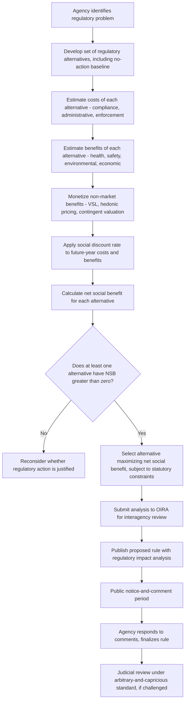

## Cost-Benefit Analysis in Administrative Rulemaking

### Conceptual Overview

Cost-benefit analysis (CBA) is the primary analytical framework through which U.S. federal administrative agencies are required to evaluate proposed regulations — comparing the monetized social benefits of a rule against its monetized social costs to determine whether, and in what form, regulatory action is justified. CBA in rulemaking sits at the intersection of welfare economics (which supplies the theoretical apparatus of net social benefit maximization), administrative law (which supplies the procedural and judicial-review framework within which CBA operates), and applied policy analysis (which supplies the empirical methods for monetizing costs and benefits that often lack observable market prices).

### Legal and Institutional Framework

**Key Points**

- **Executive Order 12866** (1993, Clinton administration, building on and replacing Reagan's Executive Order 12291) requires executive-branch agencies to conduct CBA for "significant regulatory actions" and submit that analysis to the **Office of Information and Regulatory Affairs (OIRA)**, housed within the Office of Management and Budget, for interagency review prior to publication.
- EO 12866 directs agencies to assess whether the benefits of a regulation "justify" its costs and to select the regulatory approach that maximizes net benefits unless a statute directs otherwise, while also permitting consideration of distributional and other non-quantifiable effects.
- **Executive Order 13563** (2011, Obama administration) reaffirmed and extended this framework, emphasizing retrospective review of existing regulations and public participation.
- Independent regulatory agencies (e.g., the SEC, FCC, and other agencies not directly part of the executive departments) are generally **not** subject to the same OIRA/EO 12866 review requirement, though many voluntarily conduct comparable analysis or are separately required to do so by their own governing statutes.
- **[Unverified]** The precise scope and stringency of OIRA CBA review, and executive orders governing it, are subject to revision by each incoming presidential administration; readers should verify the currently operative executive order and OIRA guidance (e.g., OMB Circular A-4) for the present administration rather than assuming continuity of any specific administration's approach.

### The Basic CBA Decision Rule

The core decision criterion in standard rulemaking CBA is the **net social benefit (NSB)** test:

$$NSB = \sum_{t=0}^{T} \frac{B_t - C_t}{(1+r)^t}$$

where $B_t$ and $C_t$ are the monetized social benefits and costs in year $t$, $T$ is the analysis time horizon, and $r$ is the social discount rate used to convert future-year values into present-value terms. A rule is generally considered CBA-justified if $NSB > 0$; when comparing multiple regulatory alternatives, the CBA-preferred option is the one that **maximizes** $NSB$ (not necessarily the option with the highest benefit-cost ratio, since ratio-maximization can favor smaller-scale interventions over larger ones with greater absolute net benefit).

**Key Points**

- CBA in rulemaking is generally understood as an application of the **Kaldor-Hicks efficiency criterion** (potential Pareto improvement) rather than strict Pareto efficiency — a rule can pass CBA even if it creates losers, so long as the gains to winners exceed the losses to losers in monetized terms, without requiring that winners actually compensate losers.
- This Kaldor-Hicks foundation is a significant and frequently debated methodological choice: it means CBA-justified rules can still have adverse distributional effects, and the framework itself is agnostic about *who* bears the costs and *who* receives the benefits, a limitation discussed further below.

### The Statistical Value of a Life (VSL) and Health Benefit Monetization

**Key Points**

- Many regulations (environmental, workplace safety, consumer product safety, transportation) primarily generate benefits in the form of reduced mortality and morbidity risk, which have no direct market price and must be monetized through indirect methods.
- The dominant methodology is the **Value of a Statistical Life (VSL)**, derived not from any individual's "worth" but from **revealed-preference wage-risk studies**: observing the wage premium workers require to accept jobs with marginally higher fatality risk, and inferring an implicit valuation of small probability-of-death reductions.

**Formal derivation**: if workers require a wage premium $\Delta w$ to accept a job with fatality risk increase $\Delta p$, the implied VSL is:

$$VSL = \frac{\Delta w}{\Delta p}$$

For example, if workers require $700 in additional annual wages to accept a job with a 1-in-10,000 additional annual fatality risk, the implied VSL is $\$700 / 0.0001 = \$7{,}000{,}000$.

**[Inference]** U.S. federal agencies (EPA, DOT, and others) use VSL estimates in this general range, though the specific value used varies by agency and is periodically updated for inflation and updated wage-risk research; because the estimate depends heavily on the specific labor market studies and risk-perception assumptions underlying it, and because these figures are revised periodically, readers should consult the current agency-specific guidance documents for the operative VSL figure rather than relying on any single historical value as presently authoritative.

**Critiques of VSL methodology**:

- **[Speculation]** Some scholars argue wage-risk studies may not accurately capture how workers value genuinely catastrophic or dread risks (as opposed to the marginal, statistically small risks in the underlying labor-market data), raising questions about extrapolating VSL estimates to regulations addressing very different risk profiles (e.g., low-probability but catastrophic events) — this is a recognized methodological concern in the risk-analysis literature, not a settled empirical refutation of VSL as a tool.
- VSL is explicitly **not** intended to represent the value of an identified individual's life, but the aggregate willingness-to-pay across a population for a marginal reduction in mortality risk — a distinction agencies typically emphasize precisely because of the ethical sensitivity of the underlying calculation.

### Discounting: Selecting the Social Discount Rate

**Key Points**

- The choice of discount rate $r$ can dramatically affect CBA outcomes for regulations with long time horizons or intergenerational effects (e.g., climate regulation, where costs are often borne in the near term and benefits accrue over decades or centuries).
- **OMB Circular A-4** (the primary technical guidance document governing federal regulatory CBA methodology) has historically directed agencies to present results using multiple discount rates (commonly 3% and 7% in earlier guidance, reflecting different theoretical bases — a "social rate of time preference" approach and an "opportunity cost of capital" approach, respectively) as a sensitivity analysis.
- **[Unverified]** OMB guidance on discount rates has been revised over time (a 2023 update to Circular A-4 proposed changes to the default discount rate methodology); because this is an area of active methodological and administrative revision, readers should verify the currently operative OMB guidance rather than assuming a specific historical discount rate remains the default.

**The discounting-intergenerational-equity tension**

$$PV(B_T) = \frac{B_T}{(1+r)^T}$$

For a benefit $B_T$ occurring $T = 100$ years in the future, even a modest discount rate substantially reduces its present value — at $r = 3\%$, a benefit worth $1 billion in 100 years has a present value of only about $52 million; at $r = 7\%$, under $1 million. This sensitivity is central to debates over climate change regulation CBA, where standard discounting can make even very large future climate damages appear numerically small in present-value terms, prompting some economists (e.g., in the Stern Review debate) to argue for near-zero discount rates on ethical grounds regarding intergenerational equity, while others (e.g., Nordhaus) argue for rates closer to observed market rates of return on capital, reflecting the genuine opportunity cost of resources diverted to current mitigation.

**[Inference]** This discount-rate debate is one of the most consequential and contested methodological issues in regulatory CBA precisely because it is not a purely empirical question — it embeds a value judgment about how to weigh the welfare of future generations against the present — and reasonable economists disagree substantially on the appropriate rate, meaning CBA outcomes for long-horizon regulations can be highly sensitive to a methodological choice that is not fully resolved by economic theory alone.

### Diagram: The Rulemaking CBA Process

### Table: Categories of Costs and Benefits in Rulemaking CBA

| Category | Cost-Side Examples | Benefit-Side Examples |
| --- | --- | --- |
| Direct compliance | Equipment purchase, process redesign, training | N/A |
| Administrative/enforcement | Agency monitoring, reporting requirements, recordkeeping | N/A |
| Health and mortality | N/A (unless rule increases risk elsewhere) | Reduced fatalities (VSL-monetized), reduced illness (cost-of-illness or WTP-based) |
| Environmental | N/A (unless rule causes environmental cost, e.g., disposal of removed equipment) | Ecosystem services, reduced pollution damage, biodiversity (hedonic/contingent valuation) |
| Economic/market | Reduced output, potential job displacement in regulated sector | Increased productivity, avoided property damage, market efficiency gains |
| Indirect/second-order | Compliance costs passed through to consumers via prices | Innovation spillovers, avoided litigation/liability costs |

### Distributional Analysis and Equity Considerations

**Key Points**

- Standard CBA, grounded in Kaldor-Hicks efficiency, is explicitly **distributionally blind** — a dollar of benefit or cost is valued identically in the aggregate calculation regardless of which income group, demographic, or geographic community bears it, which is a deliberate methodological simplification, not an oversight, but one increasingly subject to critique and supplementary analysis requirements.
- Recent executive guidance (and academic proposals) have increasingly called for **distributional weighting** or separate distributional impact analysis alongside the standard aggregate CBA — presenting how costs and benefits fall across income deciles, racial/ethnic groups, or geographic regions, without necessarily altering the core aggregate NSB calculation.
- **[Unverified]** The extent to which distributional weighting has been formally incorporated into binding OMB guidance (as opposed to being presented as supplementary descriptive analysis) has evolved across different administrations' regulatory review frameworks; this is an area of active policy development, and the current requirement should be verified against the most recent OMB guidance in effect.

### Non-Quantifiable and Non-Monetizable Effects

A persistent methodological challenge in rulemaking CBA is the treatment of benefits or costs that resist reliable monetization: existence value of preserved ecosystems, cultural or historical preservation, certain civil-liberties or procedural-fairness considerations, and highly uncertain catastrophic-but-low-probability risks.

**Key Points**

- Agencies are generally directed to describe and, where feasible, **quantify** (even if not fully monetize) such effects, and to include them in a qualitative discussion alongside the quantified NSB calculation, rather than omitting them from the decision entirely.
- **[Inference]** Critics of CBA in rulemaking frequently argue that the practical effect of requiring formal monetization for the "quantified" side of the ledger, while relegating harder-to-monetize values to qualitative discussion, creates a **systematic bias toward under-weighting non-market values** in the ultimate regulatory decision, since decision-makers and reviewing courts may implicitly treat the crisply quantified NSB figure as more authoritative than qualitatively described considerations — this is a long-standing critique in administrative law and environmental policy scholarship (sometimes associated with critiques by scholars like Lisa Heinzerling and Frank Ackerman), though CBA's defenders respond that the alternative (fully discretionary, non-analytical decision-making) risks even greater inconsistency and potential for unexamined bias.

### Judicial Review of CBA-Based Rulemaking

**Key Points**

- Agency rules are reviewed under the **arbitrary-and-capricious standard** of the Administrative Procedure Act (APA §706(2)(A)), which requires that an agency examine relevant data and articulate a rational connection between the facts found and the choices made — courts do not conduct de novo CBA but review whether the agency's analysis was reasoned and adequately explained.
- A significant line of cases has addressed whether specific regulatory statutes **require, permit, or prohibit** cost-benefit balancing — statutory text varies considerably: some environmental and safety statutes have been interpreted to prohibit cost consideration in setting certain standards (e.g., historically, certain Clean Air Act provisions directing standards be set based on health effects alone), while others explicitly require cost-benefit balancing, and courts must determine which framework a given statute embeds before assessing whether the agency's CBA-based (or CBA-excluding) approach was lawful.
- **[Unverified]** Specific judicial doctrine regarding how courts review agency cost-benefit methodology (including matters like the required rigor of monetization, treatment of co-benefits, and permissible discount rate ranges) continues to develop through ongoing litigation and is sensitive to which statute and regulatory context is at issue; general propositions here should not be read as precise guidance for any specific pending case without independent verification against current case law.

### Example: Comparing Two Regulatory Alternatives

**Example**

An agency is evaluating a proposed workplace safety standard with two design alternatives to reduce a specific injury risk:

- **Alternative 1** (stringent engineering control mandate): Compliance cost $500 million (present value), estimated to prevent 50 statistical fatalities and 2,000 injuries over the analysis period. At a VSL of $10 million, mortality benefits alone total $500 million, plus additional monetized injury-reduction benefits — total benefits exceed $600 million. $NSB \approx +\$100$ million or more.
- **Alternative 2** (less stringent performance standard with flexible compliance): Compliance cost $150 million, estimated to prevent 30 statistical fatalities and 1,000 injuries. Mortality benefits alone: $300 million, plus injury benefits — total benefits exceed $350 million. $NSB \approx +\$200$ million or more.

Even though Alternative 1 prevents more fatalities and injuries in absolute terms, **Alternative 2 has the higher net social benefit** under this illustrative calculation, because its substantially lower compliance cost more than offsets its smaller (but still substantial) risk reduction. Under the standard CBA decision rule (maximize NSB, not maximize gross benefit or benefit-cost ratio alone), Alternative 2 would be the CBA-preferred option — illustrating why "more protective" and "more efficient" do not always coincide, and why the specific decision rule chosen (NSB maximization vs. a cost-effectiveness or minimum-acceptable-benefit threshold) materially affects which alternative CBA favors.

### Diagram: Net Social Benefit Across Regulatory Stringency (svg_diagram)

<svg xmlns="http://www.w3.org/2000/svg" viewBox="0 0 680 360">
<text x="340" y="25" text-anchor="middle" font-size="16" font-weight="bold" fill="#1a1a1a">Costs, Benefits, and Net Social Benefit by Stringency (svg_diagram)</text>
<line x1="70" y1="320" x2="620" y2="320" stroke="#333" stroke-width="1" />
<line x1="70" y1="320" x2="70" y2="50" stroke="#333" stroke-width="1" />
<text x="345" y="345" text-anchor="middle" font-size="12" fill="#1a1a1a">Regulatory Stringency</text>
<text x="35" y="190" text-anchor="middle" font-size="12" fill="#1a1a1a" transform="rotate(-90 35 190)">Dollars</text>

<path d="M70,300 Q300,270 570,90" stroke="#b71c1c" stroke-width="2" fill="none" />
<text x="590" y="90" font-size="11" fill="#b71c1c">Total Cost</text>

<path d="M70,300 Q250,120 570,100" stroke="#2e7d32" stroke-width="2" fill="none" />
<text x="590" y="105" font-size="11" fill="#2e7d32">Total Benefit</text>

<circle cx="330" cy="150" r="5" fill="#1565c0" />
<line x1="330" y1="150" x2="330" y2="320" stroke="#1565c0" stroke-dasharray="4" />
<text x="330" y="335" text-anchor="middle" font-size="11" fill="#1565c0">Stringency maximizing NSB (widest vertical gap)</text>

<text x="345" y="358" text-anchor="middle" font-size="11" fill="#555" font-style="italic">NSB-maximizing point is NOT where benefit is highest, but where the vertical gap between curves is largest</text>

</svg>

### International and Comparative Note

**[Unverified]** Many other jurisdictions (the European Union's "Better Regulation" impact assessment framework, the UK's Green Book guidance, and various national regulatory review bodies) employ broadly analogous cost-benefit or impact-assessment frameworks, though specific methodological requirements (discount rates, VSL conventions, treatment of distributional effects) vary by jurisdiction and evolve over time; comparative claims about how closely any specific foreign framework mirrors U.S. practice should be verified against that jurisdiction's current governing guidance rather than assumed from the U.S. framework described here.

### Related Topics

- Kaldor-Hicks efficiency and the theoretical foundations of welfare economics
- Value of a Statistical Life: derivation, critiques, and cross-agency variation
- Social discount rate debates and intergenerational equity (Stern Review vs. Nordhaus)
- OIRA and the institutional structure of centralized regulatory review
- Arbitrary-and-capricious review and Chevron/administrative deference doctrine
- Distributional weighting in welfare economics
- Command-and-control versus market-based regulatory instruments
- Public interest versus capture theories of regulation