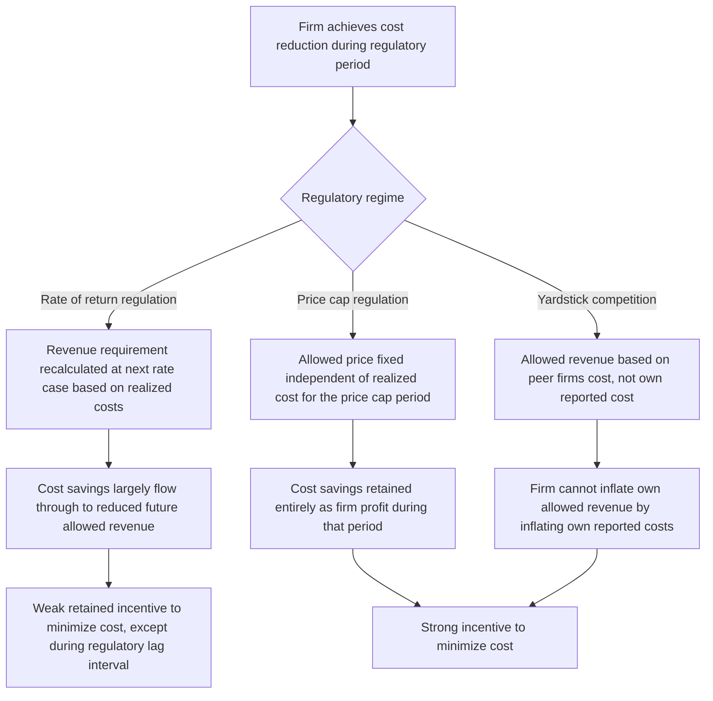

## Rate-of-Return versus Incentive-Based Regulation

### Conceptual Overview

Rate-of-return (or "cost-of-service") regulation and incentive-based regulation are the two dominant frameworks for regulating firms with market power in industries characterized by natural monopoly characteristics — most classically, electric, gas, water, and telecommunications utilities. Both approaches address the same underlying problem (a firm with substantial or complete market power, subject to declining average costs that make competitive entry inefficient or unsustainable), but they differ fundamentally in **how the regulator sets allowed prices or revenues**, and correspondingly in the **efficiency incentives** they create for the regulated firm.

### Rate-of-Return Regulation: Structure and Mechanics

**Key Points**

- Under rate-of-return (ROR) regulation, the regulator permits the firm to set prices (or, more precisely, a total revenue requirement) sufficient to recover its **operating costs plus a specified, "fair" rate of return on its invested capital (rate base)**.
- The foundational U.S. legal standard derives from *Federal Power Commission v. Hope Natural Gas Co.* (1944), which held that the constitutional requirement is that the overall rate of return be "reasonable," commensurate with returns on investments of comparable risk, rather than requiring any specific methodology.

**The revenue requirement formula:**

$$R = O + (V - D) \cdot r$$

where $R$ is the allowed total revenue requirement, $O$ is operating expenses, $V$ is the gross value of invested capital (rate base), $D$ is accumulated depreciation, and $r$ is the allowed rate of return (typically set to approximate the firm's weighted average cost of capital, reflecting both debt and equity financing costs).

**Key Points on process:**

- Regulators periodically conduct **rate cases**: formal proceedings in which the firm's costs, capital investments, and requested rate of return are reviewed, and a new allowed revenue requirement (and corresponding rate schedule) is set.
- Between rate cases, the firm's allowed revenue does not automatically adjust — but critically, because $R$ is calculated to just cover realized costs plus the allowed return, there is limited built-in incentive for the firm to minimize costs *during* the period, since demonstrated costs largely determine future allowed revenue.

### The Averch-Johnson Effect: Capital Bias Under ROR Regulation

**Key Points**

- The most well-known efficiency critique of ROR regulation is the **Averch-Johnson (A-J) effect** (Averch and Johnson, 1962): when the regulator-allowed rate of return $r$ exceeds the firm's true cost of capital $c$ (i.e., $r > c$), the firm has an incentive to **over-invest in capital** relative to the cost-minimizing input mix, substituting capital for other inputs (labor, materials) even where this is not the least-cost way to produce a given output.

**Formal intuition**: because the firm earns a *guaranteed* return $r$ on each additional dollar of rate base, and $r > c$ means that dollar earns more than its true financing cost, the firm has a private incentive to expand its rate base beyond the level that would minimize total production cost for a given output — a distortion sometimes summarized as "gold-plating" (building more or more elaborate capital infrastructure than is efficient).

$$\text{A-J distortion occurs when: } r > c \implies \frac{\partial \text{(firm's chosen capital)}}{\partial r} > 0 \text{ beyond the cost-minimizing level}$$

**[Inference]** The Averch-Johnson effect is one of the most extensively cited theoretical results in regulatory economics and is broadly accepted as a genuine incentive distortion inherent in the basic ROR mechanism; however, its **empirical magnitude** in real-world regulated utilities has been the subject of extensive and somewhat inconclusive investigation since the 1960s-70s, with some studies finding evidence consistent with capital-bias predictions and others finding effects too small to be economically significant or confounded by other factors (regulatory lag, technological change, demand growth) — the theoretical mechanism is well established, but its practical importance is empirically contested.

### Additional Efficiency Critiques of ROR Regulation

**Key Points**

- **Weak cost-minimization incentives**: because allowed revenue is calculated to cover realized costs (plus the allowed return), the firm captures little or no benefit from reducing costs below what was assumed in the last rate case — any cost savings largely flow through to reduced future allowed revenue at the next rate case, rather than being retained as profit, creating what is sometimes called the **"use it or lose it"** problem with cost efficiency.
- **Regulatory lag as a partial offset**: the interval between rate cases (regulatory lag) means that cost reductions achieved during that interval *are* temporarily retained as extra profit by the firm (since the revenue requirement was set based on prior-period costs) — this creates a weak, lag-dependent incentive for cost efficiency, but one that erodes with each subsequent rate case reset and depends heavily on the length and predictability of the lag itself.
- **High administrative and litigation costs**: rate cases are resource-intensive, adversarial proceedings requiring extensive accounting review, expert testimony, and regulatory staff time — a recurring administrative cost borne by both the firm and the regulator (and ultimately, through rates, by consumers).
- **Cross-subsidization and rate base manipulation risk**: firms operating multiple regulated and unregulated business lines have an incentive to shift costs into the regulated rate base (where they earn a guaranteed return) and shift revenue-generating activity into unregulated lines, requiring costly regulatory cost-allocation oversight.

### Table: Efficiency Properties of Rate-of-Return Regulation

| Incentive Margin | ROR Regulation's Effect |
| --- | --- |
| Cost minimization | Weak (allowed revenue tracks realized cost) |
| Capital/input mix efficiency | Distorted toward capital if $r > c$ (Averch-Johnson) |
| Innovation | Weak (savings largely flow to reduced future revenue) |
| Investment risk-bearing | Largely borne by ratepayers (guaranteed return) |
| Administrative cost | High (frequent, adversarial rate cases) |
| Price/service quality predictability | High (well-established, stable methodology) |

### Incentive-Based Regulation: Price Caps

**Key Points**

- **Price-cap regulation** (pioneered in the UK utility privatizations of the 1980s, associated foundationally with the work of Stephen Littlechild) sets a maximum allowed price (or price index) for a defined period, independent of the firm's realized costs during that period.
- The canonical form is the **RPI-X** (or CPI-X) formula: allowed price growth is capped at the rate of general inflation (RPI or CPI) minus an efficiency offset factor $X$, reflecting expected productivity growth:

$$\Delta P_t \leq \pi_t - X$$

where $\pi_t$ is the inflation rate and $X$ is the regulator-determined productivity offset.

**Key incentive property**: because the price cap is fixed for the regulatory period **regardless of the firm's realized costs**, any cost reduction the firm achieves during that period is **retained entirely as additional profit** — creating a much stronger, high-powered incentive for cost minimization than ROR regulation's cost-pass-through structure.

### Incentive-Based Regulation: Revenue Caps and Yardstick Competition

**Revenue-cap regulation** is a close variant of price-cap regulation that caps total allowed revenue rather than the per-unit price, addressing situations where price-cap regulation alone might give a firm a perverse incentive to expand sales volume in ways not aligned with efficient outcomes (relevant particularly in electricity, where price caps alone can create incentives against energy-efficiency-promoting policies that reduce firm sales volume).

**Yardstick competition** (Shleifer, 1985) addresses the information-asymmetry problem underlying both ROR and standard price-cap regulation (the regulator does not know the firm's true achievable cost frontier) by benchmarking a regulated firm's allowed price or revenue against the **observed costs of comparable firms** operating in different, non-competing markets (e.g., regional water utilities that do not directly compete with each other). Because no single firm's own reported costs determine its own allowed revenue, this breaks the direct cost-pass-through link exploited under ROR regulation and creates stronger incentives for genuine cost minimization, so long as a sufficient number of genuinely comparable firms exist for benchmarking.

**[Inference]** Yardstick competition is a theoretically elegant solution to the regulator's information problem, but its practical application requires a sufficient number of genuinely comparable firms (similar technology, service territory characteristics, and cost structure) to construct a meaningful benchmark — in industries with few firms or highly heterogeneous operating conditions (e.g., very different population densities or terrain across utility service territories), constructing a fair yardstick is empirically difficult, and this practical limitation is a recognized constraint on the method's real-world applicability rather than a flaw in the underlying theoretical logic.

### Diagram: Cost-Minimization Incentive Comparison

### The Fundamental Tradeoff: Efficiency Incentives vs. Information Rents and Risk

**Key Points**

- The comparative advantage of incentive-based regulation (stronger cost-minimization incentives) is not costless: because price/revenue caps are fixed independent of realized cost, the firm bears substantially more **cost-uncertainty risk** than under ROR regulation, where cost overruns are largely passed through to ratepayers.
- If the firm is risk-averse (or faces a higher cost of capital due to this additional risk-bearing), incentive-based regulation may require a **higher expected allowed return** to compensate the firm for the additional risk it bears — meaning the regulator faces a genuine tradeoff between stronger efficiency incentives and higher compensated risk premiums, not a costless efficiency improvement.
- There is also an **information-rent problem**: if the regulator sets the price cap based on an inaccurate estimate of the firm's true achievable cost frontier (setting $X$ too low), the firm may capture substantial excess profit (an information rent) simply by exploiting the regulator's imperfect information, rather than through genuine productivity improvement — this is formalized in the broader **mechanism design / regulatory contract theory** literature (notably Laffont and Tirole's influential synthesis, *A Theory of Incentives in Procurement and Regulation*, 1993), which models the choice between ROR-like ("cost-plus") and price-cap-like ("fixed-price") contracts as a specific point on a continuum trading off risk-bearing, information rents, and effort incentives.

### Table: Rate-of-Return vs. Price-Cap Comparison

| Dimension | Rate-of-Return Regulation | Price-Cap/Incentive Regulation |
| --- | --- | --- |
| Basis for allowed price/revenue | Firm's realized costs plus allowed return | Fixed formula (often inflation minus productivity offset), independent of realized cost |
| Cost-minimization incentive | Weak (cost pass-through) | Strong (cost savings retained as profit) |
| Capital-bias distortion (Averch-Johnson) | Present if allowed return exceeds true cost of capital | Largely absent (no direct link between rate base and allowed revenue) |
| Firm's risk exposure | Low (costs largely passed through) | Higher (firm bears cost-overrun risk within the cap period) |
| Information-rent risk to ratepayers | Lower (regulator observes realized costs directly) | Higher (mis-set productivity offset can allow excess profit capture) |
| Administrative burden | High (frequent detailed rate cases) | Lower between periodic cap resets, though reset negotiations remain complex |
| Typical origin/adoption context | Traditional U.S. utility regulation | UK privatizations (1980s) and subsequently adopted, often in hybrid form, across many jurisdictions |

### Hybrid and Modern Approaches

**Key Points**

- Pure ROR and pure price-cap regulation represent theoretical endpoints; most contemporary utility regulation in practice uses **hybrid mechanisms** that combine elements of both.
- **Sliding-scale/earnings-sharing mechanisms**: the firm retains a specified share of cost savings (or bears a specified share of cost overruns) up to some threshold, with sharing ratios adjusting or reverting to more ROR-like treatment beyond that threshold — designed to provide meaningful efficiency incentives while limiting the firm's total risk exposure and limiting the magnitude of potential information rents.
- **Multi-year rate plans with performance-based components**: increasingly common in U.S. state utility regulation, combining a multi-year price or revenue trajectory (reducing the frequency of full ROR-style rate cases) with specific performance metrics (reliability, customer service, environmental targets) tied to financial incentives or penalties, moving toward what is often termed **performance-based regulation (PBR)**.
- **[Unverified]** The specific mix of ROR and incentive-based elements varies substantially across U.S. states and other jurisdictions, and has been evolving over time, particularly in response to policy goals like renewable energy integration and grid modernization that require different investment incentive structures than traditional rate base expansion; current jurisdiction-specific regulatory mechanisms should be verified against that jurisdiction's current regulatory filings rather than assumed from general principles alone.

### Example: Comparing Firm Behavior Under the Two Regimes

**Example**

Consider a regional water utility facing a choice between investing in a new pipeline monitoring system that would reduce leak-related water loss (an operating-cost reduction) versus expanding treatment plant capacity (a capital investment), where the capacity expansion is not strictly necessary to meet current demand but adds to the firm's rate base.

- **Under ROR regulation** with an allowed rate of return exceeding the firm's true cost of capital, the utility has a private incentive to favor the capacity expansion (which increases its rate base and thus its total earned return) over the monitoring system (an operating expenditure that, if it reduces costs, primarily benefits ratepayers at the next rate case rather than firm profit) — a direct illustration of the Averch-Johnson capital bias.
- **Under price-cap regulation**, the utility's allowed revenue does not depend on the size of its capital base, so the firm's investment decision is driven purely by which option minimizes total cost (or maximizes long-run profit) relative to the fixed price cap — the utility would rationally prefer the monitoring system if it is the lower-total-cost solution to reducing water loss, since the resulting cost savings flow directly to firm profit rather than to an expanded, guaranteed-return rate base.

### Diagram: Averch-Johnson Capital-Bias Mechanism (svg_diagram)

<svg xmlns="http://www.w3.org/2000/svg" viewBox="0 0 680 320">
<text x="340" y="25" text-anchor="middle" font-size="16" font-weight="bold" fill="#1a1a1a">Averch-Johnson Capital Bias Under ROR Regulation (svg_diagram)</text>
<rect x="40" y="60" width="270" height="110" fill="#a3d9a5" stroke="#333" />
<text x="175" y="85" text-anchor="middle" font-size="12" font-weight="bold" fill="#1a1a1a">True cost of capital c</text>
<text x="175" y="105" text-anchor="middle" font-size="11" fill="#1a1a1a">Firm's actual financing cost</text>
<text x="175" y="125" text-anchor="middle" font-size="11" fill="#1a1a1a">for each dollar of investment</text>
<rect x="370" y="60" width="270" height="110" fill="#ffcdd2" stroke="#333" />
<text x="505" y="85" text-anchor="middle" font-size="12" font-weight="bold" fill="#1a1a1a">Allowed return r</text>
<text x="505" y="105" text-anchor="middle" font-size="11" fill="#1a1a1a">Regulator-set rate of return</text>
<text x="505" y="125" text-anchor="middle" font-size="11" fill="#1a1a1a">applied to rate base</text>
<line x1="310" y1="115" x2="370" y2="115" stroke="#b71c1c" stroke-width="2" marker-end="url(#arrowAJ)" />
<text x="340" y="105" text-anchor="middle" font-size="11" fill="#b71c1c">r greater than c</text>
<rect x="200" y="210" width="280" height="80" fill="#fff3e0" stroke="#333" />
<text x="340" y="235" text-anchor="middle" font-size="12" font-weight="bold" fill="#1a1a1a">Each dollar added to rate base</text>
<text x="340" y="255" text-anchor="middle" font-size="12" fill="#1a1a1a">earns r, costs only c to finance</text>
<text x="340" y="275" text-anchor="middle" font-size="13" font-weight="bold" fill="#e65100">Firm over-invests in capital (r - c) &gt; 0</text>
<line x1="175" y1="170" x2="300" y2="215" stroke="#333" stroke-width="1" />
<line x1="505" y1="170" x2="380" y2="215" stroke="#333" stroke-width="1" />
</svg>

### Related Topics

- Natural monopoly and the theoretical case for utility regulation
- Command-and-control versus market-based regulatory instruments
- Laffont-Tirole mechanism design approach to regulatory contracts
- Public interest versus capture theories of regulation
- Cost-benefit analysis in administrative rulemaking
- Ramsey pricing and second-best pricing under a zero-profit constraint
- Yardstick competition and comparative benchmarking regulation
- Performance-based regulation in the electric utility sector (grid modernization context)