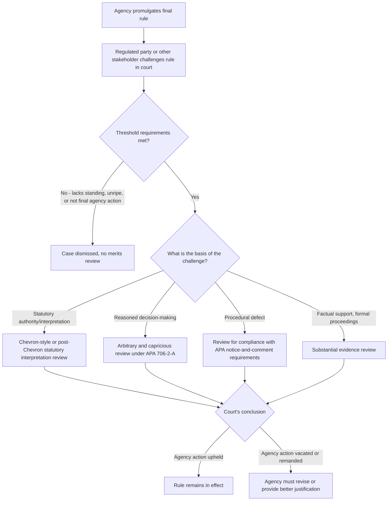

## Judicial Review of Administrative Action

### Conceptual Overview

Judicial review of administrative action is the mechanism by which courts assess the legality of decisions, rules, and orders issued by administrative agencies. In the economic analysis of administrative law, judicial review is understood not merely as a legal-doctrinal safeguard but as a **structural check embedded in the broader principal-agent chain** running from the electorate through Congress and the executive to the administrative agency — courts function as a monitoring mechanism that can constrain agency deviation from statutory mandates, procedural regularity, and (to varying degrees) reasoned decision-making, thereby addressing agency-cost and capture concerns that arise once legislative authority is delegated to an administrative body.

### The Statutory Framework: The Administrative Procedure Act

**Key Points**

- The **Administrative Procedure Act (APA)** of 1946 is the foundational U.S. statute governing both the procedures agencies must follow in rulemaking and adjudication, and the standards courts apply when reviewing agency action.
- **APA §706** sets out the core standards of review, the most significant of which for economic analysis purposes is §706(2)(A): a reviewing court shall set aside agency action found to be **"arbitrary, capricious, an abuse of discretion, or otherwise not in accordance with law."**
- Other APA review standards include review for constitutional violations, action "in excess of statutory jurisdiction," action "without observance of procedure required by law," and (for certain formal proceedings) whether findings are supported by "substantial evidence" on the record.

### The Arbitrary-and-Capricious Standard: Economic Function

**Key Points**

- The arbitrary-and-capricious standard, as elaborated in *Motor Vehicle Manufacturers Association v. State Farm Mutual Automobile Insurance Co.* (1983) (the "State Farm" case, involving rescission of a passive-restraint/airbag rule), requires that an agency **examine the relevant data and articulate a satisfactory explanation** for its action, including a rational connection between the facts found and the choice made.
- *State Farm* identified specific grounds on which agency action is arbitrary and capricious: relying on factors Congress did not intend the agency to consider, entirely failing to consider an important aspect of the problem, offering an explanation that runs counter to the evidence, or an explanation so implausible it cannot be ascribed to a difference in view or agency expertise.

**Economic interpretation**: arbitrary-and-capricious review can be understood as a **judicial demand for minimally rigorous cost-benefit or reasoned-analysis discipline** — it does not require courts to independently re-run an agency's cost-benefit analysis or substitute their own judgment on the merits, but it does require the agency to demonstrate that its decision process considered the relevant tradeoffs and evidence, which indirectly polices against decisions driven by unexamined political pressure, capture-driven reasoning, or simple analytical carelessness.

**[Inference]** Because arbitrary-and-capricious review is explicitly **not** a de novo merits review (courts are not supposed to ask "did the agency reach the objectively best decision?" but "did the agency reason adequately to its decision?"), the standard's practical bite as an anti-capture or efficiency-promoting mechanism depends heavily on how rigorously any given court applies the "reasoned explanation" requirement — this is a matter of judicial practice and doctrine that varies across courts and over time, and general characterizations of the standard's stringency should be treated as describing a doctrinal tendency rather than a fixed, universally applied threshold.

### Diagram: The Judicial Review Process for Agency Rules

### Chevron Deference and Its Evolution

**Key Points**

- *Chevron U.S.A., Inc. v. Natural Resources Defense Council, Inc.* (1984) established a now-historically-significant two-step framework for reviewing an agency's interpretation of an ambiguous statute it administers: (1) has Congress directly spoken to the precise question at issue (if so, that unambiguous intent controls); (2) if the statute is silent or ambiguous, is the agency's interpretation a **permissible/reasonable** construction of the statute (if so, courts defer to the agency's interpretation even if it is not the interpretation the court itself would have reached).
- Chevron deference was economically significant because it shifted substantial interpretive authority from courts to agencies for statutorily ambiguous questions, on the theory that agencies possess greater technical expertise and, as (at least nominally) politically accountable executive-branch actors, greater democratic legitimacy for resolving policy-laden statutory ambiguities than unelected judges.

**[Unverified]** The Chevron framework's continued vitality and precise scope has been the subject of major, actively evolving Supreme Court doctrine, including significant developments after this system's reliable knowledge cutoff; because the governing deference framework for agency statutory interpretation is a live and consequential area of law, readers should verify the currently controlling doctrine (via current case law research) rather than assume the classic two-step Chevron framework described above remains unmodified in its application.

### Substantial Evidence Review and Formal Proceedings

For agency adjudications and rules made through **formal, on-the-record proceedings** (as opposed to informal notice-and-comment rulemaking), the APA substitutes a **substantial evidence** standard: the reviewing court asks whether the agency's factual findings are supported by "such relevant evidence as a reasonable mind might accept as adequate to support a conclusion," considering the record as a whole.

**Key Points**

- Substantial evidence review is generally considered somewhat more searching than arbitrary-and-capricious review with respect to factual findings specifically, since it directs the court to examine the full evidentiary record (including evidence that detracts from the agency's conclusion), but it remains significantly more deferential than de novo factual review.
- **[Inference]** The practical difference between "arbitrary and capricious" and "substantial evidence" review is frequently characterized in case law and scholarship as narrow in most applications — some courts and commentators have suggested the two standards converge closely in practice despite their different formal articulation — though this convergence claim is itself a matter of some doctrinal debate rather than a universally accepted proposition.

### Table: Standards of Review Compared

| Standard | Applies To | Deference Level | Core Question |
| --- | --- | --- | --- |
| Arbitrary and capricious | Informal rulemaking, general agency action | High deference to policy judgment; moderate scrutiny of reasoning process | Did the agency reasonably explain its decision considering relevant factors? |
| Substantial evidence | Formal adjudication/rulemaking (on-the-record proceedings) | High deference; more searching on factual record | Do the facts in the record reasonably support the agency's factual findings? |
| De novo review | Pure questions of law in some contexts; constitutional questions | No deference | What is the correct legal answer? |
| Statutory interpretation deference (post-Chevron doctrinal developments) | Agency interpretation of statutes it administers | Historically significant deference under Chevron; scope of continuing deference is an evolving doctrinal question | Is the agency's interpretation reasonable/within its lawful authority? |

### Standing, Ripeness, and Reviewability: Threshold Constraints

**Key Points**

- Before reaching the merits of a challenge, a plaintiff must establish **standing** (a concrete, particularized injury traceable to the challenged agency action and redressable by the court), that the action is **ripe** for review (not merely a preliminary or non-final step), and that the action constitutes **"final agency action"** under APA §704 (not an interlocutory or merely tentative agency position).
- These threshold doctrines function economically as a **filter on litigation volume and timing**: they prevent premature judicial intervention in ongoing agency processes (preserving administrative efficiency and allowing the agency's expertise and process to fully develop a record) while still permitting challenge once an agency's action has concrete, binding legal effect.
- **[Inference]** From a public-choice/economic-analysis perspective, standing and ripeness doctrines can be understood as shaping **who** has effective access to the judicial-review check on agency behavior — since organized, well-resourced interest groups (including regulated industries) are generally better positioned to satisfy standing and litigation-cost requirements than diffuse, individually-affected members of the public, threshold reviewability doctrines may systematically affect *whose* challenges to agency action are most likely to reach a court, an asymmetry structurally similar to the organizational asymmetries discussed in capture theory, though this is an analytical observation rather than a claim about the doctrines' intended purpose.

### The Hard Look Doctrine and Its Rationale

**Key Points**

- The **"hard look" doctrine**, associated with the D.C. Circuit's development of arbitrary-and-capricious review particularly from the 1970s onward and crystallized in *State Farm*, requires that agencies (and, correspondingly, reviewing courts) take a genuinely careful, thorough look at the relevant evidence, alternatives, and reasoning before finalizing significant regulatory action.
- Hard look review is generally understood in administrative law scholarship as a **judicial response to the same public-choice concerns underlying capture theory**: if agencies are susceptible to disproportionate influence from concentrated regulated interests, a more probing judicial demand for reasoned, evidence-based explanation raises the cost of agency decisions that cannot be justified except by reference to interest-group pressure, since such decisions are harder to defend under a genuinely searching reasoned-explanation requirement.

**[Speculation]** Critics of hard look review argue it can, in practice, produce the opposite of its intended anti-capture effect: by substantially raising the litigation risk and analytical burden associated with significant rulemaking, hard look review may push agencies toward **regulatory ossification** — excessive caution, delay, and reliance on informal guidance or enforcement discretion (which faces less searching review) rather than formal rulemaking, potentially reducing the overall transparency and public participation that formal rulemaking (with its notice-and-comment requirements) is designed to provide. This "ossification thesis" (associated with scholars including Thomas McGarity and Richard Pierce) is an influential but contested claim in administrative law scholarship, and empirical assessments of its magnitude vary.

### Diagram: Judicial Review as a Principal-Agent Monitoring Mechanism (svg_diagram)

<svg xmlns="http://www.w3.org/2000/svg" viewBox="0 0 680 340">
<text x="340" y="25" text-anchor="middle" font-size="16" font-weight="bold" fill="#1a1a1a">Judicial Review Within the Delegation Chain (svg_diagram)</text>
<rect x="30" y="60" width="150" height="60" fill="#a3d9a5" stroke="#333" />
<text x="105" y="95" text-anchor="middle" font-size="12" fill="#1a1a1a">Electorate</text>
<line x1="180" y1="90" x2="230" y2="90" stroke="#333" stroke-width="2" marker-end="url(#arrJ)" />
<rect x="240" y="60" width="150" height="60" fill="#a3d9a5" stroke="#333" />
<text x="315" y="85" text-anchor="middle" font-size="12" fill="#1a1a1a">Congress</text>
<text x="315" y="102" text-anchor="middle" font-size="10" fill="#1a1a1a">(delegates authority)</text>
<line x1="390" y1="90" x2="440" y2="90" stroke="#333" stroke-width="2" marker-end="url(#arrJ)" />
<rect x="450" y="60" width="180" height="60" fill="#ffe0b2" stroke="#333" />
<text x="540" y="85" text-anchor="middle" font-size="12" fill="#1a1a1a">Administrative Agency</text>
<text x="540" y="102" text-anchor="middle" font-size="10" fill="#1a1a1a">(exercises delegated power)</text>
<line x1="540" y1="120" x2="540" y2="180" stroke="#333" stroke-width="2" marker-end="url(#arrJ)" />
<rect x="440" y="190" width="200" height="70" fill="#ffcdd2" stroke="#333" />
<text x="540" y="215" text-anchor="middle" font-size="12" font-weight="bold" fill="#1a1a1a">Judicial Review</text>
<text x="540" y="233" text-anchor="middle" font-size="10" fill="#1a1a1a">Checks: statutory authority,</text>
<text x="540" y="248" text-anchor="middle" font-size="10" fill="#1a1a1a">procedural regularity, reasoned decision</text>
<line x1="440" y1="225" x2="180" y2="225" stroke="#1565c0" stroke-width="2" marker-end="url(#arrJ)" />
<rect x="30" y="195" width="150" height="60" fill="#bbdefb" stroke="#333" />
<text x="105" y="220" text-anchor="middle" font-size="12" fill="#1a1a1a">Regulated parties /</text>
<text x="105" y="237" text-anchor="middle" font-size="12" fill="#1a1a1a">affected stakeholders</text>
<text x="105" y="180" text-anchor="middle" font-size="10" fill="#1a1a1a">(initiate challenge)</text>
<line x1="105" y1="195" x2="105" y2="120" stroke="#1565c0" stroke-width="2" marker-end="url(#arrJ)" />

<text x="340" y="300" text-anchor="middle" font-size="11" fill="#555" font-style="italic">Courts monitor agency fidelity to delegated statutory authority and reasoned process,</text>

<text x="340" y="318" text-anchor="middle" font-size="11" fill="#555" font-style="italic">functioning as an additional check within the broader principal-agent delegation chain</text>

</svg>

### Example: Contrasting Outcomes Under Different Review Postures

**Example**

Consider an agency rule imposing a new emissions limit, challenged simultaneously on two grounds: (1) that the agency's cost-benefit analysis failed to consider a specific, readily available lower-cost compliance technology raised by commenters during notice-and-comment, and (2) that the agency's underlying statutory interpretation (that the relevant statute permits cost consideration at all in setting the standard) was incorrect.

- **On the first ground** (failure to consider an important aspect of the problem — the alternative technology), a court applying arbitrary-and-capricious/hard-look review would likely require the agency to explain why it did not adopt or address the lower-cost alternative; if the agency's rulemaking record is silent on this point despite it being squarely raised in comments, this is a paradigmatic *State Farm*-style basis for vacatur or remand.
- **On the second ground** (statutory authority to consider cost at all), the court's analysis depends on the specific interpretive framework and precedent governing this type of statutory question — whether the statute unambiguously resolves the cost-consideration question, and if not, what degree of deference (if any) the agency's interpretation receives, is a legal question governed by the currently controlling statutory-interpretation doctrine, which — as noted above — is an evolving area that should be independently verified.

### Related Topics

- Cost-benefit analysis in administrative rulemaking
- Public interest versus capture theories of regulation
- Notice-and-comment rulemaking procedures under the APA
- Standing doctrine and the case-or-controversy requirement
- Nondelegation doctrine and constitutional limits on legislative delegation
- Regulatory ossification thesis and its critics
- Command-and-control versus market-based regulatory instruments
- Principal-agent theory applied to legislative-executive-agency relationships