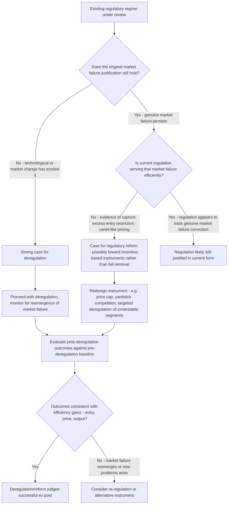

## Deregulation and Regulatory Reform

### Conceptual Overview

Deregulation refers to the deliberate removal, relaxation, or restructuring of government-imposed restrictions on market entry, pricing, and business conduct within a previously regulated industry. Regulatory reform more broadly encompasses not only deregulation but also efforts to redesign the *process* by which regulation is made and reviewed — including the shift from command-and-control to incentive-based instruments, cost-benefit analysis requirements, and periodic retrospective review. In law and economics, deregulation episodes function as important **natural experiments** for testing the competing public interest and capture/economic theories of regulation, since removing a regulatory regime and observing subsequent market outcomes provides direct evidence on whether the prior regulation had been correcting a genuine market failure or primarily protecting incumbent rents.

### Theoretical Rationale for Deregulation

**Key Points**

- Deregulation is economically justified under several distinct rationales, which are not mutually exclusive and often apply differently across sectors:
  1. **Obsolete market-failure rationale**: regulation initially justified by a genuine natural monopoly or other market failure condition that has since eroded due to technological change (e.g., long-distance telecommunications becoming contestable following technological advances that reduced the natural-monopoly characteristics of the original justification).
  2. **Capture correction**: regulation that, per Stigler/Peltzman-style economic theory of regulation, was substantially serving incumbent industry rent-protection rather than a genuine public-interest function, such that removing it restores competitive discipline.
  3. **Direct cost of regulatory compliance**: even where some market failure justification remains valid, the specific regulatory instrument in place may impose compliance costs exceeding its corrective benefit, justifying reform (a different instrument) rather than complete removal.
  4. **Dynamic/technological change outpacing regulatory design**: regulation calibrated to a particular technology or market structure that has since been superseded (e.g., regulatory frameworks designed for analog telecommunications infrastructure becoming poorly suited to digital and internet-based communications).

**[Inference]** Distinguishing which of these rationales explains any particular deregulation episode is often empirically difficult, since obsolete-market-failure and capture-correction stories frequently predict similar deregulation outcomes (falling prices, increased entry) even though they imply different diagnoses of why the original regulation existed — this is a recurring identification challenge in the deregulation literature, not a settled matter resolvable from outcome data alone.

### Major U.S. Deregulation Episodes: A Comparative Survey

**Airlines (Airline Deregulation Act of 1978)**

- Pre-1978, the Civil Aeronautics Board (CAB) controlled route entry and fares under a certificate-of-public-convenience-and-necessity framework, with extremely limited new entry approved over several decades.
- Post-deregulation, the industry saw substantially increased route competition, the emergence of the hub-and-spoke network model, new low-cost entrants, and generally falling average real fares over subsequent decades, alongside increased fare and service-quality variability across routes (some previously cross-subsidized thin routes experienced reduced service).
- **[Unverified]** Specific quantitative estimates of aggregate consumer welfare gains from airline deregulation vary across studies depending on methodology, time period, and how service-quality changes (e.g., reduced legroom, increased ancillary fees, hub-and-spoke inconvenience for some routes) are weighed against fare reductions; general qualitative conclusions (increased competition, generally lower average fares) are well supported, but precise welfare magnitude estimates should be treated as method-dependent rather than a single settled figure.

**Trucking (Motor Carrier Act of 1980)**

- Pre-1980 Interstate Commerce Commission (ICC) regulation restricted entry (operating certificates limited to specific routes and commodities) and set minimum rate floors, widely cited as producing cartel-like industry rents for incumbent carriers and unionized labor.
- Post-deregulation, the industry saw substantial new entry, increased price competition, and a shift toward more decentralized, non-union trucking operations, with studies generally finding reduced shipping costs for freight customers.

**Natural gas (Natural Gas Policy Act of 1978 and subsequent FERC orders)**

- Wellhead price controls on natural gas, combined with pipeline regulation, had produced persistent supply shortages during periods of price-control-driven price ceilings below market-clearing levels — a textbook illustration of a price ceiling generating a shortage.
- Phased deregulation of wellhead prices, combined with subsequent FERC restructuring separating pipeline transportation from gas commodity sales (enabling open-access transportation and a competitive gas commodity market), is generally credited with resolving the earlier supply-shortage dynamics.

**Telecommunications (Telecommunications Act of 1996, building on the 1984 AT&T breakup)**

- The 1984 consent decree breaking up AT&T separated local exchange service (retained as regulated regional monopolies, reflecting continued natural-monopoly characteristics of local loop infrastructure at the time) from long-distance service (opened to competition, reflecting the view that long-distance had become technologically contestable).
- The 1996 Act sought to extend competitive entry into local exchange markets as well, with more mixed and contested results regarding the degree of genuine local-market competition actually achieved.

**Financial services (Depository Institutions Deregulation and Monetary Control Act 1980; Gramm-Leach-Bliley Act 1999; among others)**

- Progressive removal of Depression-era restrictions separating commercial and investment banking (Glass-Steagall-era restrictions) and interest-rate ceilings (Regulation Q) is frequently discussed in the deregulation literature, though this sector's deregulation history is more contested in terms of overall welfare assessment, particularly in light of the 2007-2008 financial crisis.
- **[Speculation]** Some economists and policy analysts have argued that financial deregulation, particularly repeal of activity-separation restrictions, contributed to excessive risk-taking and systemic fragility preceding the 2007-2008 crisis, while others emphasize that the crisis's causes were more directly rooted in specific regulatory gaps (shadow banking, derivatives market opacity, mortgage securitization practices) rather than deregulation of the specific separated-banking-activity type — this remains a genuinely contested empirical and causal question in the financial economics literature, and general claims attributing the crisis primarily to "deregulation" as a monolithic cause should be treated with caution given this ongoing debate.

### Diagram: Deregulation Decision Framework

### Table: Deregulation Episodes and Theoretical Interpretation

| Sector | Pre-Deregulation Pattern | Post-Deregulation Pattern | Best-Fit Theoretical Interpretation |
| --- | --- | --- | --- |
| Airlines | Entry restriction, high fares on many routes | Increased entry, generally lower average fares, hub-spoke restructuring | Substantial capture-correction evidence |
| Trucking | Entry/rate restriction, cartel-like incumbent protection | Increased entry, lower freight costs | Substantial capture-correction evidence |
| Natural gas (wellhead) | Price ceiling below market-clearing level, shortages | Price decontrol, resolved shortage dynamics | Direct price-control inefficiency correction (textbook shortage/ceiling case) |
| Long-distance telecom | Regulated monopoly, limited entry | Increased competition following technological change | Obsolete market-failure rationale (technology eroded natural monopoly) |
| Local telecom (1996 Act) | Regulated local monopoly | Mixed, contested degree of genuine competitive entry | Ambiguous — genuine natural-monopoly characteristics in local loop infrastructure persisted longer than in long-distance |

### Partial Deregulation and Contestable-Segment Unbundling

**Key Points**

- A recurring pattern across telecommunications, natural gas, and electricity deregulation is the **unbundling of genuinely natural-monopoly segments from potentially competitive segments** of a vertically integrated industry — rather than deregulating an entire industry uniformly, reform separates the infrastructure/network component (retained under regulation, often as an open-access, regulated "wires" or "pipes" business) from the commodity or service component layered on top of that infrastructure (opened to competition).
- This approach reflects the theoretical insight that natural monopoly characteristics (declining average cost, high fixed/sunk infrastructure costs) may apply to only *part* of a vertically integrated industry's value chain, while other parts (generation, long-distance transport of a fungible commodity, retail service provision) may be genuinely contestable once separated from the bottleneck infrastructure segment.

**Example**

**Example**

In electricity industry restructuring (pursued to varying degrees across different U.S. states beginning in the 1990s), the typical unbundling separated:

- **Generation**: opened to competitive wholesale markets, on the theory that multiple independent power producers can genuinely compete to supply electricity into a grid.
- **Transmission and distribution**: retained under regulated (often rate-of-return or incentive-based) monopoly franchise, reflecting the continued natural-monopoly characteristics of the physical wire network (duplicating transmission and distribution infrastructure being generally understood as inefficient).
- **Retail supply**: in some restructured states, opened to competitive retail electricity providers who purchase wholesale power and market it to end-use consumers, layered on top of the regulated distribution network which all retail providers must access on comparable terms.

**[Unverified]** The degree of consumer welfare benefit realized from electricity retail competition specifically (as opposed to wholesale generation competition) has been a subject of substantial and not fully resolved empirical debate across different restructured states, with some analyses finding limited or even negative consumer benefit from retail choice in certain states — outcomes appear to vary meaningfully by state-specific market design details, making broad generalizations about electricity retail deregulation's welfare effects unreliable without examining the specific jurisdiction and market design in question.

### Retrospective Regulatory Review

**Key Points**

- Distinct from wholesale deregulation, **retrospective review** refers to the systematic reassessment of *existing* regulations to determine whether they remain justified, achieve their intended objectives cost-effectively, or should be modified or repealed — a process-oriented regulatory reform mechanism rather than a one-time deregulation event.
- **Executive Order 13563** (2011) explicitly directed federal agencies to develop plans for retrospective review of existing significant regulations, reflecting a recognition that the initial CBA justifying a rule's adoption may become outdated as market conditions, technology, and available evidence evolve.
- **Sunset provisions**, discussed also in the constitutional-constraints-on-rent-seeking context, function as a related mechanism, forcing affirmative legislative or regulatory reconsideration rather than allowing indefinite regulatory persistence absent active review.

**[Inference]** Retrospective review is generally regarded in the administrative law and regulatory economics literature as theoretically valuable (correcting the accumulation of regulations that may have made sense individually at adoption but collectively impose excessive or outdated cumulative burden) but persistently underutilized in practice, since agencies generally have stronger institutional incentives to focus resources on new rulemaking (responsive to current political and statutory mandates) than on revisiting settled prior rules — this is a widely observed institutional pattern in administrative law scholarship, though the precise magnitude of underutilization is difficult to measure comprehensively across the full body of federal regulation.

### Diagram: Vertical Unbundling in Network Industry Reform (svg_diagram)

<svg xmlns="http://www.w3.org/2000/svg" viewBox="0 0 680 320">
<text x="340" y="25" text-anchor="middle" font-size="16" font-weight="bold" fill="#1a1a1a">Unbundling Natural Monopoly from Contestable Segments (svg_diagram)</text>
<rect x="60" y="60" width="560" height="60" fill="#e1bee7" stroke="#333" />
<text x="340" y="95" text-anchor="middle" font-size="13" fill="#1a1a1a">Vertically integrated regulated monopoly (pre-reform)</text>
<line x1="340" y1="120" x2="340" y2="150" stroke="#333" stroke-width="2" marker-end="url(#arrD)" />
<text x="340" y="145" text-anchor="middle" font-size="11" fill="#1a1a1a">Unbundle</text>
<rect x="60" y="160" width="170" height="90" fill="#a3d9a5" stroke="#333" />
<text x="145" y="185" text-anchor="middle" font-size="12" font-weight="bold" fill="#1a1a1a">Generation/Commodity</text>
<text x="145" y="205" text-anchor="middle" font-size="11" fill="#1a1a1a">Contestable segment</text>
<text x="145" y="222" text-anchor="middle" font-size="11" fill="#2e7d32" font-weight="bold">Opened to competition</text>
<rect x="255" y="160" width="170" height="90" fill="#ffe0b2" stroke="#333" />
<text x="340" y="185" text-anchor="middle" font-size="12" font-weight="bold" fill="#1a1a1a">Transmission/Distribution</text>
<text x="340" y="205" text-anchor="middle" font-size="11" fill="#1a1a1a">Natural monopoly segment</text>
<text x="340" y="222" text-anchor="middle" font-size="11" fill="#e65100" font-weight="bold">Remains regulated (open access)</text>
<rect x="450" y="160" width="170" height="90" fill="#a3d9a5" stroke="#333" />
<text x="535" y="185" text-anchor="middle" font-size="12" font-weight="bold" fill="#1a1a1a">Retail Supply</text>
<text x="535" y="205" text-anchor="middle" font-size="11" fill="#1a1a1a">Potentially contestable</text>
<text x="535" y="222" text-anchor="middle" font-size="11" fill="#2e7d32" font-weight="bold">Opened to competition (variably)</text>

<text x="340" y="285" text-anchor="middle" font-size="11" fill="#555" font-style="italic">Regulated open-access network segment permits competition in adjacent segments</text>

<text x="340" y="302" text-anchor="middle" font-size="11" fill="#555" font-style="italic">without requiring duplication of the natural-monopoly infrastructure</text>

</svg>

### Risks and Critiques of Deregulation

**Key Points**

- **Re-monopolization/re-concentration risk**: deregulated markets, if not accompanied by robust antitrust enforcement, can experience post-deregulation consolidation that partially recreates market power (e.g., airline industry consolidation through mergers in subsequent decades following initial post-1978 fragmentation and increased competition).
- **Transition costs and distributional effects**: deregulation frequently produces concentrated short-term losses for incumbent firms, workers with industry-specific skills (particularly where deregulation coincides with reduced unionization, as in trucking), and communities dependent on previously cross-subsidized service (e.g., small-market airline service reductions), even where aggregate welfare effects are positive — raising the same Kaldor-Hicks-versus-Pareto distributional concerns discussed in the cost-benefit analysis context.
- **Residual market failure**: deregulation premised on a mistaken assessment that the original market failure justification no longer applies risks reintroducing the original problem (e.g., debates over whether certain financial deregulation removed genuinely obsolete restrictions or prematurely removed restrictions addressing still-relevant systemic risk concerns, as referenced above).

**[Speculation]** Some scholars argue the political economy of deregulation itself can be understood through capture-theory-adjacent logic in reverse: just as concentrated industry interests may lobby for protective regulation, they may equally lobby for deregulation when market conditions shift such that removing regulatory entry barriers serves incumbents' interests (e.g., an established, larger incumbent favoring deregulation once its dominant market position makes it best positioned to withstand new competitive entry) — this suggests that observing an industry group *supporting* rather than opposing deregulation is not automatically strong evidence that deregulation is efficiency-enhancing, since the same organizational-interest logic underlying capture theory can operate on either side of a regulatory change depending on incumbents' specific competitive position. This is a theoretical extension of Stigler-style reasoning rather than a well-established empirical finding.

### Related Topics

- Public interest versus capture theories of regulation
- Command-and-control versus market-based regulatory instruments
- Rate-of-return versus incentive-based regulation
- Natural monopoly and vertical unbundling in network industries
- Cost-benefit analysis in administrative rulemaking (retrospective review)
- Antitrust enforcement following deregulation and re-concentration risk
- Judicial review of administrative action
- Financial regulation and the 2007-2008 crisis: causal debates