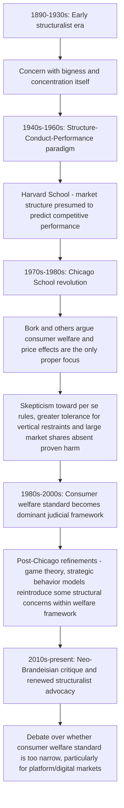

## Goals and History of Antitrust Law

### Conceptual Overview

Antitrust law (called "competition law" in most non-U.S. jurisdictions) is the body of statutory and case law governing the regulation of market power, mergers, and competitive conduct. The economic analysis of antitrust law asks two related but distinct questions: **what goal(s) should antitrust enforcement pursue** (allocative efficiency, consumer welfare, total welfare, or broader political/structural objectives), and **how has the legal doctrine evolved** to reflect changing economic understanding of when market power and specific business practices harm those goals. These two threads — normative goal-setting and doctrinal history — are deeply intertwined, since shifts in the dominant economic paradigm (structuralist, Chicago School, post-Chicago, and contemporary "neo-Brandeisian" perspectives) have directly driven corresponding shifts in enforcement priorities and judicial doctrine.

### The Foundational Statutes

**Key Points**

- The **Sherman Antitrust Act (1890)** is the foundational U.S. antitrust statute. §1 prohibits "every contract, combination... or conspiracy, in restraint of trade," and §2 prohibits monopolization and attempts to monopolize.
- The **Clayton Act (1914)** supplemented the Sherman Act with more specific prohibitions: §7 addresses mergers and acquisitions that may substantially lessen competition, §2 (as amended by the Robinson-Patman Act of 1936) addresses price discrimination, and §3 addresses tying and exclusive dealing arrangements.
- The **Federal Trade Commission Act (1914)** created the FTC and prohibits "unfair methods of competition," providing a second major federal enforcement agency alongside the Department of Justice's Antitrust Division, with overlapping but not identical jurisdiction and enforcement authority.

**[Inference]** The Sherman Act's broad, open-textured statutory language ("restraint of trade," "monopolize") was deliberately general, delegating substantial interpretive authority to courts to develop specific doctrinal content over time through case law — this structural feature is a major reason why antitrust doctrine has been able to evolve so substantially in response to changing economic theory without requiring frequent statutory amendment, in contrast to more detailed regulatory statutes.

### Competing Goals of Antitrust: The Central Normative Debate

**1. Consumer welfare standard**

The dominant articulated standard in contemporary U.S. antitrust doctrine, associated foundationally with Robert Bork's *The Antitrust Paradox* (1978) and the broader Chicago School of antitrust economics, holds that antitrust law's proper and exclusive goal is **maximizing consumer welfare** — understood primarily as preventing practices that would raise prices, reduce output, or reduce quality/innovation relative to the competitive benchmark, for the benefit of purchasers.

**2. Total welfare standard**

An alternative economic formulation holds that antitrust should maximize **total surplus** (consumer surplus plus producer surplus combined), which can in principle diverge from a pure consumer-welfare standard in specific cases — for example, a merger that raises prices (reducing consumer surplus) but generates efficiency gains (reducing costs, increasing producer surplus) by more than the consumer harm could be evaluated as welfare-enhancing under a total-welfare standard while being rejected under a strict consumer-welfare standard.

$$\text{Total welfare} = CS + PS \quad \text{vs.} \quad \text{Consumer welfare standard: evaluate based on } CS \text{ alone}$$

**3. Structuralist/political-economy goals (historical and "neo-Brandeisian" revival)**

Early 20th-century antitrust enforcement, and a significant strand of contemporary scholarship and enforcement advocacy sometimes termed the "New Brandeis Movement" (referencing Louis Brandeis's early-20th-century skepticism of concentrated economic power), argues that antitrust law's goals should extend beyond narrow economic efficiency to encompass **broader political-economy concerns**: preventing excessive concentration of economic power itself (independent of any demonstrable price or output effect), protecting the competitive opportunities of small businesses and new entrants, and limiting the political influence that comes with large-scale corporate concentration.

**[Inference]** The tension between these goal-frameworks is not merely academic — it has direct doctrinal consequences, since a court or agency applying a strict consumer-welfare-standard would evaluate the same merger or conduct very differently than one applying a structuralist framework concerned with market concentration or small-business protection independent of consumer price effects; this remains an actively contested area of both legal doctrine and economic policy debate rather than a settled question, and which framework predominates in current enforcement practice is subject to change across different enforcement administrations.

### Table: Comparing Antitrust Goal Frameworks

| Framework | Primary Metric | Would Approve a Price-Raising, Cost-Reducing Merger? | Historical Association |
| --- | --- | --- | --- |
| Consumer welfare standard | Consumer surplus (prices, output, quality for buyers) | No, if net effect raises prices to consumers | Chicago School, Bork, post-1970s doctrine |
| Total welfare standard | Aggregate surplus (consumer + producer) | Possibly, if efficiency gains exceed consumer harm | Williamson's efficiency-tradeoff framework |
| Structuralist/political-economy | Market concentration, small-business viability, diffusion of economic power | Generally skeptical regardless of efficiency claims | Early 20th-century enforcement, neo-Brandeisian revival |

### Diagram: Evolution of Dominant Antitrust Paradigms

### The Structure-Conduct-Performance Paradigm

**Key Points**

- The mid-20th-century **Structure-Conduct-Performance (SCP)** paradigm, associated with the Harvard School of industrial organization (Edward Mason, Joe Bain), held that market **structure** (concentration, entry barriers, number of firms) causally determines firm **conduct** (pricing behavior, collusive tendencies), which in turn determines market **performance** (prices, profits, efficiency).
- Under SCP logic, **high market concentration itself** was treated as strong evidence of likely anticompetitive performance, justifying relatively aggressive structural remedies (breakups, merger blocking) based substantially on market-share and concentration evidence, without requiring detailed proof of specific anticompetitive conduct or actual price effects.

**[Inference]** The SCP paradigm's presumption that structure reliably predicts performance was the central target of the subsequent Chicago School critique, which argued this presumption was empirically unreliable (high concentration can arise from superior efficiency rather than anticompetitive conduct, and concentrated markets do not always exhibit supra-competitive pricing) — this critique substantially reshaped antitrust doctrine away from structural presumptions and toward requiring more direct evidence of actual or likely competitive harm, a shift widely regarded as one of the most significant doctrinal transitions in the field's history.

### The Chicago School Revolution

**Key Points**

- The Chicago School of antitrust economics (associated with Robert Bork, Richard Posner, George Stigler, and the broader University of Chicago law-and-economics tradition) argued from the 1970s onward that:
  1. Markets are generally self-correcting; monopoly power, absent government-created barriers, tends to erode over time through entry and competition.
  2. Many business practices previously treated with suspicion under structuralist doctrine (vertical restraints, resale price maintenance, tying arrangements) typically have legitimate efficiency justifications and should not be condemned without proof of actual anticompetitive effect.
  3. Antitrust enforcement itself carries **Type I error costs** (blocking or punishing efficient, pro-competitive conduct) that can be as economically damaging as under-enforcement (**Type II errors** — permitting genuinely anticompetitive conduct), and doctrine should be calibrated to minimize the *sum* of both error types, not simply err toward aggressive intervention.

$$\text{Optimal enforcement stringency: minimize } E[\text{Type I error cost}] + E[\text{Type II error cost}]$$

- This error-cost framework, closely associated with Frank Easterbrook's influential 1984 formalization, argued that because false positives (condemning efficient conduct) can chill substantial future efficient behavior across the whole economy (a deterrence/chilling-effect cost extending well beyond the single case), while false negatives affect primarily the single instance of genuinely harmful conduct, legal rules should generally be calibrated to be more tolerant of ambiguous conduct than a naive "when in doubt, condemn" structuralist approach would suggest.

**[Inference]** The Chicago School's error-cost and efficiency-justification arguments were highly influential in reshaping antitrust doctrine from the 1970s onward (reflected in numerous Supreme Court decisions narrowing per se rules and requiring more rigorous economic proof of harm), and this influence is well documented in legal scholarship; whether the resulting doctrinal shift struck the economically optimal balance between under- and over-enforcement, however, remains a genuinely contested normative and empirical question, particularly amid the contemporary neo-Brandeisian critique discussed below.

### Post-Chicago Developments

**Key Points**

- Beginning in the 1980s-90s, "post-Chicago" economists (drawing on advances in game theory and industrial organization) argued that some Chicago School conclusions rested on overly simple assumptions (e.g., static, perfectly competitive baseline models) that did not adequately capture strategic behavior in oligopolistic and imperfectly competitive markets.
- Post-Chicago scholarship reintroduced theoretical support for antitrust concern regarding certain vertical restraints, predatory conduct, and exclusionary strategies that Chicago School analysis had treated with substantial skepticism, using formal game-theoretic models to show conditions under which such conduct could indeed be anticompetitive and profitable for the excluding firm.
- **[Inference]** Post-Chicago economics is generally understood as a refinement and partial correction of Chicago School analysis rather than a full reversion to structuralist priors — it retains the Chicago School's general commitment to rigorous economic modeling and skepticism of structural presumptions, but argues that more sophisticated models sometimes justify antitrust intervention that simpler Chicago School models would reject; this is a widely accepted characterization of the field's intellectual development, though the practical doctrinal influence of specific post-Chicago theories varies by case and jurisdiction.

### Per Se Illegality versus the Rule of Reason

**Key Points**

- Antitrust doctrine evaluates challenged conduct under one of two general analytical frameworks:
  - **Per se illegality**: certain categories of conduct (historically including horizontal price-fixing, market allocation among competitors, and certain group boycotts) are treated as so reliably and predictably anticompetitive that courts condemn them without requiring detailed case-specific proof of actual market effect or considering possible procompetitive justifications.
  - **Rule of reason**: most other conduct is evaluated through a fact-intensive balancing test, weighing the challenged conduct's anticompetitive effects against any procompetitive justifications and business rationale, typically requiring plaintiffs to define a relevant market and demonstrate actual or likely competitive harm within it.
- Over recent decades, courts have progressively **narrowed** the categories of conduct subject to per se treatment (e.g., the Supreme Court's shift of resale price maintenance from per se illegal to rule-of-reason treatment in *Leegin Creative Leather Products v. PSKS* (2007)), reflecting the broader Chicago-School-influenced skepticism toward structural or categorical presumptions absent case-specific proof of harm.

### Table: Major Doctrinal Shifts Over Time

| Era | Approach to Vertical Restraints | Approach to Concentration/Market Share | Dominant Economic Paradigm |
| --- | --- | --- | --- |
| Early 20th century | Highly restrictive | Structural concern, aggressive breakup remedies | Early structuralist/political-economy |
| 1940s-1960s | Restrictive, many per se rules | Concentration treated as strong evidence of harm (SCP) | Harvard School / Structure-Conduct-Performance |
| 1970s-1990s | Substantially liberalized, rule-of-reason expansion | Market share alone insufficient without proof of effect | Chicago School |
| 1990s-2010s | Continued liberalization with some post-Chicago refinements | Effects-based analysis, merger simulation models | Post-Chicago / mainstream IO economics |
| 2010s-present | Contested; neo-Brandeisian advocacy for renewed scrutiny | Renewed debate over structural presumptions, especially in digital markets | Neo-Brandeisian critique alongside continued mainstream economic analysis |

### The Contemporary Digital-Markets Debate

**Key Points**

- A significant contemporary driver of renewed debate over antitrust goals is the rise of large digital platform firms, where critics of the consumer-welfare standard argue that traditional price-and-output-based analysis is poorly suited to markets characterized by **zero-price services** (many platform services are "free" to end users, monetized instead through advertising or data), **network effects** (value to each user increasing with the number of other users, potentially entrenching incumbents), and **multi-sided market structures** (platforms serving distinct user groups — e.g., consumers and advertisers — with different, sometimes offsetting pricing dynamics across sides).
- Proponents of renewed structuralist or neo-Brandeisian approaches argue these features justify weighing considerations beyond narrow price effects — including innovation effects, data-driven market power, and platform gatekeeping power over dependent businesses — in antitrust analysis of digital markets.
- Defenders of the consumer-welfare framework argue that the standard economic toolkit (properly applied, including quality and innovation effects, non-price competition analysis, and multi-sided market modeling) remains adequate to address digital-market competition concerns without requiring abandonment of the consumer-welfare framework itself.

**[Unverified]** This digital-markets antitrust debate is highly active and evolving, both in academic literature and in ongoing enforcement actions and proposed legislation across multiple jurisdictions (U.S. federal enforcement, EU Digital Markets Act, and others); given the pace of doctrinal and regulatory development in this specific area, current enforcement priorities and legal standards should be verified against up-to-date sources rather than assumed static from any general historical account.

### Diagram: The Error-Cost Framework (svg_diagram)

<svg xmlns="http://www.w3.org/2000/svg" viewBox="0 0 680 320">
<text x="340" y="25" text-anchor="middle" font-size="16" font-weight="bold" fill="#1a1a1a">Error-Cost Framework in Antitrust Rule Design (svg_diagram)</text>
<line x1="70" y1="280" x2="620" y2="280" stroke="#333" stroke-width="1" />
<text x="345" y="305" text-anchor="middle" font-size="12" fill="#1a1a1a">Enforcement Stringency (more aggressive right to left is more lenient)</text>
<path d="M70,260 Q250,60 500,260" stroke="#b71c1c" stroke-width="2" fill="none" />
<text x="180" y="90" font-size="11" fill="#b71c1c">Type I error cost</text>
<text x="180" y="105" font-size="10" fill="#b71c1c">(condemning efficient conduct)</text>
<path d="M150,260 Q400,60 620,260" stroke="#2e7d32" stroke-width="2" fill="none" />
<text x="500" y="90" font-size="11" fill="#2e7d32">Type II error cost</text>
<text x="500" y="105" font-size="10" fill="#2e7d32">(permitting harmful conduct)</text>
<circle cx="345" cy="150" r="5" fill="#1565c0" />
<line x1="345" y1="150" x2="345" y2="280" stroke="#1565c0" stroke-dasharray="4" />
<text x="345" y="298" text-anchor="middle" font-size="11" fill="#1565c0" font-weight="bold">Optimal rule minimizes sum of both error costs</text>
</svg>

### Example: Applying Different Frameworks to a Merger

**Example**

Consider a proposed merger between two firms in a moderately concentrated industry (post-merger HHI increase flagged under standard merger guidelines thresholds), where the merging parties claim substantial marginal-cost efficiencies from combined operations, but internal projections also show modest post-merger price increases in the relevant market.

- **Under a strict consumer-welfare standard**: the relevant question is whether the merger, net of any efficiency-driven cost pass-through, results in higher prices or reduced output/quality for consumers. If credible evidence shows even modest net price increases with no offsetting quality/output benefit reaching consumers, this standard would generally favor blocking or requiring remedies for the merger, regardless of the magnitude of producer-side efficiency gains.
- **Under a total-welfare standard**: the analysis would weigh the magnitude of the claimed cost efficiencies (producer surplus gain) against the consumer harm from price increases (consumer surplus loss); if the former numerically exceeds the latter, a total-welfare framework could in principle support approving the merger even with documented price increases to consumers.
- **Under a structuralist/neo-Brandeisian framework**: independent of the specific net welfare calculation, the resulting increase in market concentration itself, and its implications for the viability of remaining smaller competitors and future potential entrants, would weigh substantially in the analysis — potentially favoring a more skeptical or restrictive posture toward the merger even where a total-welfare calculation might support approval.

This example illustrates why the choice of goal framework is not a merely abstract theoretical dispute — it can directly determine case outcomes in specific, economically realistic merger scenarios.

### Related Topics

- Structure-Conduct-Performance paradigm and the Harvard School of industrial organization
- Chicago School antitrust economics and the error-cost framework
- Horizontal merger analysis and the Herfindahl-Hirschman Index (HHI)
- Vertical restraints: resale price maintenance, tying, and exclusive dealing
- Monopolization doctrine under Sherman Act Section 2
- Predatory pricing and the Areeda-Turner test
- Digital platform markets and multi-sided market antitrust analysis
- Public interest versus capture theories of regulation