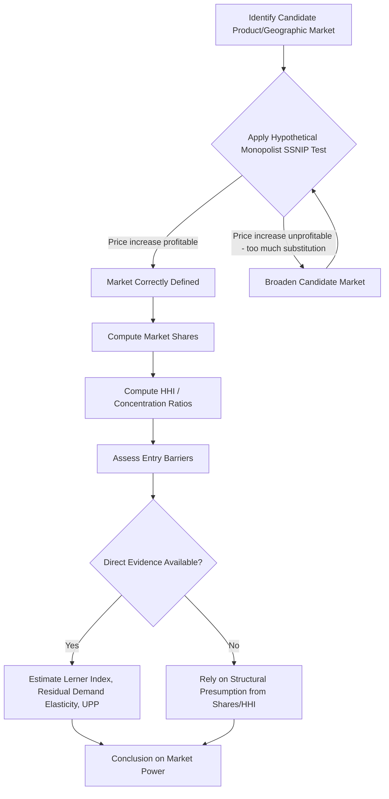

## Market Definition and Measurement of Market Power

### Overview

Market definition is the foundational analytical step in antitrust law and economics: before determining whether conduct is anticompetitive or a merger is likely to harm competition, agencies and courts must delineate the relevant market in which competitive effects will be assessed, and then measure the degree of market power held by the firm(s) in question. Market power is the ability to profitably raise price above the competitive level (or reduce output, quality, or innovation) for a sustained period without losing so many sales that the price increase becomes unprofitable.

### Why Market Definition Matters

**Key Points**

- Market definition establishes the boundaries within which market shares and concentration are calculated.
- It is not an end in itself — it is a tool for inferring the existence and degree of market power.
- Courts and agencies (in the U.S., the FTC and DOJ; internationally, bodies like the European Commission) use market definition as an analytical starting point, though modern merger analysis (post-2010 U.S. Horizontal Merger Guidelines) increasingly allows direct evidence of competitive effects to substitute for or supplement formal market definition.
- Improper market definition (too broad or too narrow) can lead to false negatives (missing genuine market power) or false positives (finding market power where none exists).

### The Relevant Market: Two Dimensions

#### Product Market Definition

The product market includes the product or service at issue and all reasonable substitutes — products that consumers would switch to in response to a price increase.

**Key Points**

- The touchstone is **demand-side substitutability**: do buyers view the products as reasonably interchangeable for the same purpose?
- **Supply-side substitutability** is also considered: can other producers easily and quickly (without significant sunk cost) retool to produce the product in response to a price increase? If so, they are often included in the market (or treated as rapid entrants/uncommitted supply responses).
- Courts historically also examined **cross-elasticity of demand** and practical indicia from *Brown Shoe Co. v. United States* (1962) — industry recognition of submarkets, distinct customers, distinct prices, specialized vendors, and unique production facilities.

#### Geographic Market Definition

The geographic market defines the area within which competitive constraints operate — where consumers could practically turn for substitutes if price rose.

**Key Points**

- Determined by shipping costs, product perishability, regulatory barriers, consumer travel patterns, and evidence of actual customer switching across regions.
- Can range from local (e.g., hospital markets, gasoline retailing) to national or global (e.g., commercial aircraft manufacturing, semiconductor fabrication).

### The Hypothetical Monopolist Test (SSNIP Test)

The dominant analytical framework for market definition in modern U.S. and EU practice is the **hypothetical monopolist test**, formalized in the U.S. Horizontal Merger Guidelines.

**Key Points**

- Ask: if a single hypothetical firm controlled all sales of a candidate set of products/geographic area, could it profitably impose a **Small but Significant and Non-transitory Increase in Price (SSNIP)** — typically 5% for one year — above the competitive benchmark price?
- If enough consumers would substitute away (making the price increase unprofitable), the candidate market is too narrow, and it must be expanded to include the next-best substitute. Repeat iteratively until the smallest market in which a SSNIP would be profitable is found — that is the relevant antitrust market.
- This is a stylized, hypothetical exercise; it does not assume the firm is an actual monopolist, only asks whether one *could* profitably raise price.

**Example**

Suppose a proposed candidate market is "premium ground coffee." Test: would a hypothetical monopolist over all premium ground coffee sellers profitably impose a 5% price increase? If a large share of consumers would switch to standard ground coffee or coffee pods, the price increase would be unprofitable (too much lost volume), so the candidate market is too narrow — it must be broadened, e.g., to "ground coffee" generally, and the test repeated.

$$\text{Critical Loss} = \frac{\text{SSNIP}}{\text{SSNIP} + \text{Contribution Margin}}$$

If the **actual** anticipated loss in sales from the price increase is less than this **critical loss**, the price increase is profitable, and the candidate market is validly defined (no further broadening is needed).

### Critical Loss Analysis

**Key Points**

- Critical loss analysis (CLA) operationalizes the SSNIP test quantitatively by comparing the *critical loss* (the maximum sales loss the firm could sustain and still find the price increase profitable) to the *actual* (predicted) loss in sales.
- Critical loss is a function of the profit margin: firms with high margins can tolerate less sales loss before a price increase becomes unprofitable (lower critical loss), while low-margin firms can tolerate more.
- If actual loss < critical loss → price increase is profitable → market is correctly defined (or could even be defined more narrowly).
- If actual loss > critical loss → price increase is unprofitable → market must be broadened.
- Criticized for sensitivity to margin assumptions and for potential circularity (the "cellophane fallacy," discussed below).

### The Cellophane Fallacy

**Key Points**

- Named after *United States v. E.I. du Pont de Nemours & Co.* (1956), where the Supreme Court found DuPont lacked market power over cellophane because high cross-elasticity of demand existed with other flexible packaging materials.
- The fallacy: if a firm is *already* exercising market power and pricing at the profit-maximizing monopoly level, then consumers' demand will already appear elastic at that price (because they are at the top of the demand curve where further price increases would indeed drive substitution). This makes the market appear artificially broad and can mask real market power.
- The SSNIP test should ideally use a **competitive benchmark price**, not the prevailing (possibly already supra-competitive) price, to avoid this fallacy — though identifying the true competitive benchmark is often practically difficult.

### Quantitative Techniques for Market Definition

#### Elasticity of Demand

$$E_d = \frac{\%\Delta Q_d}{\%\Delta P}$$

**Key Points**

- **Own-price elasticity** measures sensitivity of quantity demanded for a product to its own price change.
- **Cross-price elasticity** ($E_{xy} = \frac{\%\Delta Q_x}{\%\Delta P_y}$) measures substitutability between products X and Y — a high positive cross-elasticity suggests the products belong in the same market.

#### Price Correlation and Cointegration Analysis

**Key Points**

- Examines whether prices of candidate substitute products move together over time (correlation) or share a long-run equilibrium relationship (cointegration).
- High, stable correlation suggests common market forces; used as circumstantial evidence but not dispositive, since correlated prices can also result from correlated input costs rather than demand substitutability.

#### Natural Experiments and Merger "Event Studies"

**Key Points**

- Analyze historical episodes (e.g., plant closures, entry, price shocks, past mergers) to observe actual consumer switching behavior and residual demand responses.
- Considered some of the most persuasive empirical evidence because they reflect real-world behavior rather than hypothetical constructs.

### Measuring Market Power: Structural Indicators

Once the relevant market is defined, market power is inferred using structural (share-based) and behavioral/direct measures.

#### Market Share

**Key Points**

- The starting point, but not sufficient alone — market share is a proxy, not a direct measure of power.
- U.S. courts have used rough thresholds: shares below ~30% rarely support monopolization findings; shares above ~70% strongly support them (from cases like *United States v. Aluminum Co. of America* ("Alcoa"), 1945).
- Share must be interpreted alongside entry barriers, elasticity, and competitive dynamics — a 90% share with low barriers to entry and highly elastic demand may reflect less power than a 40% share with high barriers.

#### Herfindahl-Hirschman Index (HHI)

$$HHI = \sum_{i=1}^{n} s_i^2$$

where $s_i$ is the market share (as a whole number percentage) of firm $i$.

**Key Points**

- Ranges from near 0 (perfect competition, many tiny firms) to 10,000 (pure monopoly).
- Under the 2023 U.S. Merger Guidelines: markets with HHI above 1,800 are considered "highly concentrated"; a merger is presumed to substantially lessen competition if it increases HHI by more than 100 points in a highly concentrated market (or produces a resulting HHI above 1,000 with a delta above 100 in moderately concentrated markets).
- Sensitive to how the market is defined — reinforcing the importance of getting market definition right before computing concentration.

**Example**

Four firms with shares 40%, 30%, 20%, 10%:

$$HHI = 40^2 + 30^2 + 20^2 + 10^2 = 1600 + 900 + 400 + 100 = 3000$$

This market would be classified as highly concentrated.

#### Concentration Ratios (CR_n)

$$CR_n = \sum_{i=1}^{n} s_i$$

**Key Points**

- Sums the market shares of the top $n$ firms (commonly CR4 or CR8).
- Simpler than HHI but discards information about the distribution of shares among the top firms and ignores the fringe entirely.

### Measuring Market Power: Direct (Behavioral) Indicators

#### The Lerner Index

$$L = \frac{P - MC}{P}$$

**Key Points**

- Directly measures the price-cost margin, ranging from 0 (perfectly competitive, price equals marginal cost) to 1 (theoretical maximum markup).
- Under Cournot oligopoly with $n$ symmetric firms, $L = \frac{s_i}{E_d}$, connecting market share, industry demand elasticity, and the price-cost margin — showing that a firm's markup capacity rises with its share and falls with the elasticity of demand it faces.
- Practically difficult to implement because marginal cost is often unobservable; economists commonly proxy with average variable cost or use accounting data cautiously, given that accounting costs may diverge from economic marginal cost.

#### Residual Demand Elasticity

**Key Points**

- Measures the elasticity of demand facing a single firm (as opposed to the whole market), accounting for competitors' likely reactions to a firm's price change.
- A firm facing low residual demand elasticity (steep residual demand curve) can raise prices without losing much volume — indicating market power.
- Considered one of the most direct and economically rigorous ways to estimate market power, though data- and estimation-intensive (often requiring instrumental variables to address endogeneity between price and quantity).

#### Profitability and Persistence of Excess Returns

**Key Points**

- Sustained economic profits above the cost of capital can indicate market power, but must be distinguished from returns to legitimate risk-taking, efficiency, or innovation ("competition on the merits").
- Courts are generally cautious about relying on profitability alone, since accounting profit measures are imperfect proxies for economic profit.

### Entry Barriers as a Qualifying Factor

**Key Points**

- Market power measured via share or concentration is only durable if entry barriers prevent new competitors from eroding it.
- Common barriers: economies of scale, network effects, switching costs, intellectual property (patents), regulatory/licensing requirements, control of essential inputs, and reputation/brand loyalty.
- The **contestable markets theory** (Baumol, Panzar, Willig) argues that even a single-firm market can behave competitively if entry and exit are costless and rapid ("hit-and-run entry"), since the threat of entry alone disciplines pricing.

### Merger Simulation and Upward Pricing Pressure (UPP)

**Key Points**

- Modern merger analysis often supplements or substitutes for formal market definition with direct estimation of unilateral price effects.
- **Upward Pricing Pressure (UPP)**, developed by Farrell and Shapiro, estimates the incentive to raise price post-merger for differentiated products by measuring diverted sales value:

$$UPP_1 = D_{12} \cdot (P_2 - MC_2) - E_1 \cdot MC_1$$

where $D_{12}$ is the diversion ratio from product 1 to product 2, $(P_2 - MC_2)$ is product 2's margin, and $E_1 \cdot MC_1$ represents merger-specific efficiencies (cost reductions) for product 1.

- A positive UPP indicates upward pricing pressure from eliminated competition between merging parties; efficiencies can offset this pressure.
- **Merger simulation** models (e.g., using logit or nested-logit demand systems) formally estimate post-merger equilibrium prices under assumed competitive conduct (e.g., Bertrand-Nash).

### Diagram: Market Definition and Power Assessment Process

### Comparative Legal Frameworks

**Key Points**

- **United States**: Section 2 of the Sherman Act (monopolization) requires proof of monopoly power in a relevant market plus willful acquisition/maintenance through exclusionary conduct (*United States v. Grinnell Corp.*, 1966). Section 7 of the Clayton Act governs mergers, assessed under the Horizontal Merger Guidelines.
- **European Union**: Article 102 TFEU prohibits abuse of a "dominant position," defined in *Hoffmann-La Roche v. Commission* (1979) as a position of economic strength enabling a firm to behave independently of competitors, customers, and consumers. The European Commission's 1997 Notice on Market Definition also relies on the SSNIP-style test.
- [Unverified] Precise numerical thresholds for presumptive dominance vary by jurisdiction and are subject to periodic guideline revisions; practitioners should consult current agency guidance for the applicable jurisdiction and year.

### Practical Example: Merger Review Walkthrough

**Example**

Two regional grocery chains propose to merge in a metropolitan area.

1. **Product market**: Defined as "supermarkets" (not all grocery retail) if the hypothetical monopolist test shows consumers would not switch enough to convenience stores or warehouse clubs to defeat a SSNIP.
2. **Geographic market**: Defined by drive-time analysis (e.g., 10–15 minute radius) reflecting actual consumer shopping patterns.
3. **Concentration**: Pre-merger HHI calculated across all supermarkets in each local geographic market; post-merger HHI computed assuming combined shares of the merging parties.
4. **Threshold check**: If the merger increases HHI by more than 100 points in a market with post-merger HHI above 1,800, a presumption of competitive harm arises under the Merger Guidelines.
5. **Rebuttal evidence**: Merging parties may present evidence of low entry barriers (e.g., planned entry by a national chain), efficiencies (verifiable cost savings passed to consumers), or that the pre-merger market shares overstate competitive significance (e.g., a failing firm defense).

### Common Pitfalls and Critiques

**Key Points**

- Overreliance on market share without regard to elasticity or entry conditions ("share fetishism").
- The cellophane fallacy when SSNIP is applied naively to already-supra-competitive prices.
- Ignoring innovation competition and potential/nascent competitors, which is increasingly important in digital markets ([Inference] many contemporary antitrust economists and some agencies argue traditional market definition tools are less suited to zero-price or multi-sided digital platforms, though this remains an area of active methodological debate).
- Static analysis in dynamic, fast-moving industries where today's market boundaries may not reflect near-future competitive constraints.

**Next Steps**

- Horizontal merger analysis and the U.S./EU Merger Guidelines in depth
- Monopolization and abuse of dominance doctrine (Sherman Act §2, TFEU Article 102)
- Two-sided markets and antitrust analysis of digital platforms
- Vertical mergers and foreclosure theories of harm
- Econometric estimation of demand systems (logit, nested logit, AIDS models) for merger simulation
- Predatory pricing and the *Brooke Group* cost-based tests
- Essential facilities doctrine and refusal-to-deal analysis
- Oligopoly theory: Cournot, Bertrand, and tacit collusion models