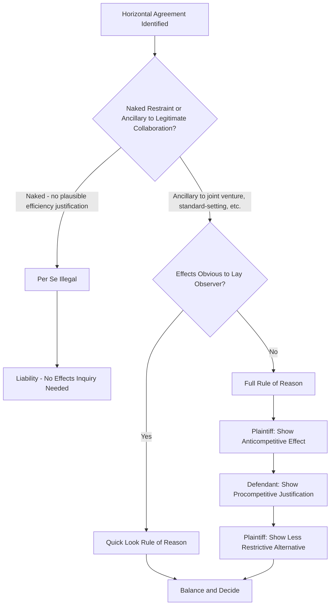

## Horizontal Restraints and Cartel Behavior

### Overview

Horizontal restraints are agreements or coordinated practices among competitors — firms operating at the same level of the supply chain — that restrict competition among them. Cartel behavior represents the most severe form of horizontal restraint: explicit collusion to fix prices, allocate markets, restrict output, or rig bids. Because horizontal restraints directly eliminate rivalry between competitors (rather than merely restructuring vertical relationships), they are treated as the most serious category of antitrust violation in nearly every jurisdiction.

### Legal Framework

**Key Points**

- In the U.S., horizontal restraints are governed primarily by **Section 1 of the Sherman Act**, which prohibits "every contract, combination, or conspiracy in restraint of trade."
- In the EU, **Article 101 TFEU** prohibits agreements between undertakings that have as their object or effect the prevention, restriction, or distortion of competition.
- Both frameworks distinguish between conduct that is condemned **per se** (or "by object" in EU terms) without inquiry into actual competitive effects, and conduct analyzed under the **rule of reason**, which requires a full balancing of procompetitive and anticompetitive effects.

### Per Se Illegality vs. Rule of Reason

#### Per Se Rule

**Key Points**

- Applied to categories of conduct with such predictable and overwhelmingly anticompetitive effects, and so little redeeming procompetitive value, that individualized inquiry into actual market effects is unnecessary and wasteful of judicial resources.
- Established in *United States v. Socony-Vacuum Oil Co.* (1940) for price fixing and reaffirmed across decades of case law.
- Classic per se categories: naked price fixing, bid rigging, output restriction agreements, and horizontal market/customer allocation among competitors.
- **No defense of "reasonableness"** of the fixed price is permitted once a per se violation is established — even a price fixing agreement that produces a "reasonable" price is illegal (*Socony-Vacuum*: fixing prices at any level, even competitive ones, is illegal).

#### Rule of Reason

**Key Points**

- Applied to restraints where competitive effects are ambiguous and depend on market context — the restraint might plausibly enhance efficiency or output even though it also restricts some dimension of rivalry.
- Requires a **structured burden-shifting framework** (articulated in cases like *NCAA v. Board of Regents*, 1984, and refined in *Ohio v. American Express*, 2018):
  1. Plaintiff shows the restraint has substantial anticompetitive effects in the relevant market.
  2. Defendant shows procompetitive justifications (efficiencies, quality improvements, output-enhancing effects).
  3. Plaintiff shows any legitimate objectives could be achieved through less restrictive alternatives.
- Courts weigh actual and likely effects on price, output, quality, and innovation.

#### The "Quick Look" / Truncated Rule of Reason

**Key Points**

- An intermediate approach used when anticompetitive effects are obvious to a lay observer even though the restraint doesn't fit neatly into a per se category (*California Dental Association v. FTC*, 1999; *NCAA v. Board of Regents*).
- Shifts the burden to the defendant to articulate a procompetitive justification more quickly than under full rule of reason, without requiring the plaintiff to conduct a complete market analysis upfront.

### Diagram: Analytical Framework for Horizontal Restraints

### Economic Theory of Cartels

#### Why Cartels Form

**Key Points**

- Firms in an oligopoly recognize that, absent coordination, competitive rivalry (Bertrand or Cournot competition) drives prices toward marginal cost and dissipates joint industry profit.
- A cartel seeks to replicate monopoly outcomes by having members jointly restrict output to the monopoly quantity $Q_m$ and charge the monopoly price $P_m$, then divide the resulting profit.

$$\pi_{cartel} = (P_m - MC) \cdot Q_m$$

- The **monopoly output problem**: joint profit maximization requires each member to produce less than it would under competition, moving industry output from the competitive level (where $P = MC$) to the monopoly level (where $MR = MC$).

#### The Fundamental Instability Problem: Incentive to Cheat

**Key Points**

- Cartels are inherently unstable because each member has a private incentive to secretly cheat — undercut the cartel price slightly or sell beyond its allocated quota — to capture additional sales at the supra-competitive price.
- This is a classic **prisoner's dilemma**: while joint adherence to the cartel maximizes group profit, unilateral defection is individually rational absent detection and punishment.
- Requires: (1) a mechanism for **monitoring** members' compliance, and (2) a credible **punishment mechanism** for detected defection (often reversion to competitive or "price war" pricing for a period).

#### Repeated Games and the Folk Theorem

**Key Points**

- Game theory (particularly the **Folk Theorem** for infinitely or indefinitely repeated games) shows that cooperation (collusion) can be sustained as a Nash equilibrium if firms are sufficiently patient (high enough discount factor) and can credibly threaten future punishment for deviation.
- Common strategies: **trigger strategies** (permanent reversion to competitive pricing after any detected deviation) and **tit-for-tat**.
- The critical discount factor condition for sustaining collusion in a simple symmetric setting:

$$\delta \geq \frac{\pi_{deviate} - \pi_{collude}}{\pi_{deviate} - \pi_{punish}}$$

where $\delta$ is the discount factor, $\pi_{collude}$ is the per-period profit from cooperating, $\pi_{deviate}$ is the one-time profit from cheating, and $\pi_{punish}$ is the profit during the punishment phase.

### Factors Facilitating Collusion (Market Structure Conditions)

**Key Points**

- **High market concentration / few firms**: easier to coordinate and monitor with fewer players.
- **Product homogeneity**: standardized products simplify price coordination (harder to disguise cheating via quality/feature differentiation).
- **High entry barriers**: prevents new entrants from undercutting the cartel and capturing supra-competitive rents.
- **Price/output transparency**: public price announcements, standardized list prices, or information-sharing arrangements make deviations easier to detect.
- **Frequent, small-volume, repeated transactions**: allows fast detection of cheating (versus infrequent, large, lumpy contracts where cheating is harder to observe quickly).
- **Multi-market contact**: firms competing against each other in multiple markets simultaneously can support collusion in each by threatening retaliation across all markets.
- **Symmetric costs and capacities**: reduces conflicts of interest over the "right" cartel price and quota allocations.
- **Stable demand**: fluctuating demand makes it harder to distinguish a legitimate price drop (due to a demand shock) from cheating, undermining monitoring (per Green & Porter, 1984).

### The Green-Porter Model: Collusion Under Imperfect Monitoring

**Key Points**

- Addresses how cartels sustain cooperation when firms cannot directly observe rivals' output/prices, only market price, which is also affected by random demand shocks.
- Because low prices can result either from cheating or from an adverse demand shock, firms cannot perfectly distinguish the cause.
- Equilibrium involves **periodic "price wars"**: when price falls below a trigger threshold, all firms revert to competitive punishment pricing for a fixed period, regardless of whether the low price was actually caused by cheating — this is necessary to preserve the incentive not to cheat even though it is triggered "by mistake" during genuine demand downturns.

### Forms of Horizontal Restraints

#### Naked Price Fixing

**Key Points**

- Direct agreements setting, stabilizing, or coordinating prices, price components, discounts, or credit terms among competitors.
- Per se illegal under U.S. law regardless of whether the fixed price is higher, lower, or the same as the competitive price (*Socony-Vacuum*).

#### Bid Rigging

**Key Points**

- Competitors coordinate bids on procurement or construction contracts, commonly through:
  - **Bid rotation**: competitors take turns being the low bidder.
  - **Cover bidding (complementary bidding)**: losing bidders submit deliberately high or non-competitive bids to create the appearance of competition.
  - **Bid suppression**: some competitors agree to refrain from bidding or withdraw bids.
  - **Subcontracting arrangements**: designated "winners" subcontract work to competitors who agreed not to bid.
- Per se illegal and frequently prosecuted criminally in the U.S. (DOJ Antitrust Division).

#### Market and Customer Allocation

**Key Points**

- Competitors divide markets by geography, customer type, or product line, agreeing not to compete for each other's designated territory or customers.
- Functionally equivalent to price fixing since it eliminates rivalry, and treated as per se illegal.

#### Output Restrictions

**Key Points**

- Agreements to limit production or capacity, which raise price by constraining supply — economically equivalent to price fixing since price and quantity are linked through the demand curve.

#### Group Boycotts (Concerted Refusals to Deal)

**Key Points**

- Agreements among competitors to collectively refuse to deal with a particular supplier, customer, or competitor.
- Historically often per se illegal (*Fashion Originators' Guild of America v. FTC*, 1941; *Klor's v. Broadway-Hale Stores*, 1959), but the Supreme Court in *Northwest Wholesale Stationers v. Pacific Stationery* (1985) and *FTC v. Superior Court Trial Lawyers Association* (1990) clarified that rule-of-reason analysis applies unless the boycotting group has market power and lacks a plausible efficiency justification.

#### Information Exchange Among Competitors

**Key Points**

- Not automatically illegal — information sharing can have legitimate purposes (benchmarking, demand forecasting).
- Risk of antitrust liability increases with: (1) exchange of current or future (rather than historical) price/output data, (2) disaggregated firm-specific data (rather than aggregated industry statistics), (3) frequent exchange, and (4) exchange in concentrated markets.
- Evaluated under the rule of reason typically, per *United States v. Container Corp. of America* (1969) and *American Column & Lumber Co. v. United States* (1921), though facilitating practices that function as a price-fixing mechanism can draw per se treatment.
- Algorithmic pricing and pricing software raise contemporary concerns: [Inference] many competition authorities and scholars have expressed concern that algorithmic pricing tools using shared or similar data inputs could facilitate tacit coordination without an explicit "agreement," a boundary condition that remains legally contested and jurisdiction-dependent.

#### Trade Association Activity

**Key Points**

- Legitimate functions (standard-setting, statistical reporting, lobbying) are permissible, but trade associations can serve as conduits for illegal coordination if used to facilitate price fixing, output restriction, or information exchange that functions as a cartel mechanism.

### Ancillary Restraints Doctrine

**Key Points**

- A horizontal restraint that would otherwise be condemned may be permitted if it is **ancillary** — reasonably necessary — to a legitimate, efficiency-enhancing joint venture or integration of economic activity.
- Established in *United States v. Addyston Pipe & Steel Co.* (1898, Judge Taft) and applied in modern joint venture analysis (e.g., *Texaco Inc. v. Dagher*, 2006, upholding a joint pricing arrangement within a genuine joint venture refining operation).
- Distinguishes **naked restraints** (no purpose other than restricting competition) from restraints ancillary to integration that plausibly increases output, quality, or efficiency.

### Detection and Enforcement Mechanisms

#### Leniency (Amnesty) Programs

**Key Points**

- The DOJ's **Corporate Leniency Policy** and the EU's **Leniency Notice** offer the first cartel member to self-report and cooperate full immunity from criminal prosecution (or fines), significantly destabilizing cartels by creating a "race to confess."
- Exploits the same prisoner's dilemma logic that makes cartels unstable in the first place — leniency programs increase the payoff to defection specifically toward the enforcer.

#### Screening and Econometric Detection

**Key Points**

- Agencies and economists use **structural and behavioral screens** to detect suspected collusion: abnormal price stability, parallel pricing, unusual bid patterns (e.g., suspiciously close bid margins in rigged auctions), and structural break analysis around suspected cartel formation/collapse dates.
- **Variance screens** examine whether price variance drops abnormally (consistent with coordinated behavior) relative to a competitive benchmark period.

#### Sanctions

**Key Points**

- U.S.: Sherman Act Section 1 violations can be prosecuted criminally, with substantial corporate fines (up to the greater of $100 million, twice the gain to the violator, or twice the loss to victims, under the Alternative Fines Act) and individual imprisonment for responsible executives.
- Civil treble damages are available to injured private plaintiffs under Section 4 of the Clayton Act.
- EU: Fines up to 10% of worldwide annual turnover of the offending undertaking, though no criminal liability at the EU level (though some member states impose criminal sanctions domestically).

### Tacit Collusion vs. Explicit Agreement

**Key Points**

- **Tacit collusion (conscious parallelism)**: firms independently arrive at parallel, supra-competitive pricing through mutual recognition of interdependence, without any communication or agreement.
- U.S. law requires proof of an actual **agreement** (a "meeting of the minds") under Section 1; parallel conduct alone is insufficient (*Theatre Enterprises v. Paramount Film Distributing Corp.*, 1954).
- Courts look for **"plus factors"** beyond mere parallel pricing to infer an agreement: actions against self-interest absent coordination, opportunities to conspire, industry-wide simultaneous action inconsistent with independent business justification, and exchange of assurances.

### Diagram: Cartel Stability Dynamics (SVG)

<svg xmlns="http://www.w3.org/2000/svg" viewBox="0 0 700 380">
<title>Cartel Stability Dynamics (svg_diagram)</title>
<rect x="0" y="0" width="700" height="380" fill="#ffffff" />
<text x="350" y="25" font-family="Arial" font-size="16" font-weight="bold" text-anchor="middle" fill="#1a1a1a">Cartel Stability Dynamics (svg_diagram)</text>

<line x1="80" y1="320" x2="650" y2="320" stroke="#333" stroke-width="2" />
<line x1="80" y1="320" x2="80" y2="50" stroke="#333" stroke-width="2" />
<text x="365" y="355" font-family="Arial" font-size="13" text-anchor="middle" fill="#333">Time (periods)</text>
<text x="30" y="185" font-family="Arial" font-size="13" text-anchor="middle" fill="#333" transform="rotate(-90 30 185)">Price</text>

<line x1="80" y1="90" x2="300" y2="90" stroke="#2563eb" stroke-width="2.5" />
<text x="185" y="80" font-family="Arial" font-size="12" fill="#2563eb" text-anchor="middle">Collusive (monopoly) price</text>

<line x1="300" y1="90" x2="330" y2="130" stroke="#dc2626" stroke-width="2.5" />
<text x="335" y="130" font-family="Arial" font-size="11" fill="#dc2626">Cheating detected (price drop)</text>

<line x1="330" y1="130" x2="450" y2="290" stroke="#dc2626" stroke-width="2.5" stroke-dasharray="0" />
<line x1="450" y1="290" x2="480" y2="290" stroke="#dc2626" stroke-width="2.5" />
<text x="410" y="310" font-family="Arial" font-size="12" fill="#dc2626" text-anchor="middle">Punishment phase (competitive pricing)</text>

<line x1="480" y1="290" x2="520" y2="90" stroke="#16a34a" stroke-width="2.5" stroke-dasharray="4,3" />
<line x1="520" y1="90" x2="640" y2="90" stroke="#2563eb" stroke-width="2.5" />
<text x="580" y="80" font-family="Arial" font-size="11" fill="#16a34a" text-anchor="middle">Renewed cooperation</text>

<line x1="80" y1="290" x2="650" y2="290" stroke="#9ca3af" stroke-width="1.5" stroke-dasharray="5,4" />
<text x="600" y="305" font-family="Arial" font-size="11" fill="#6b7280">Competitive price level</text>

<circle cx="300" cy="90" r="4" fill="#1a1a1a" />
<text x="300" y="70" font-family="Arial" font-size="11" text-anchor="middle" fill="#1a1a1a">Deviation begins</text>
</svg>

### Practical Example: A Simple Bid-Rigging Scenario

**Example**

Four construction firms regularly bid on municipal road contracts. They agree that for each contract, one firm will be the designated "winner" (rotating on a schedule), and the other three will submit intentionally high "cover bids" to make the process appear competitive. The winning firm compensates the others through subcontracting a portion of the work back to them.

- **Analysis**: This is a naked horizontal restraint (bid rotation with cover bidding) among direct competitors with no efficiency justification — it is per se illegal under Section 1 of the Sherman Act and typically prosecuted criminally.
- **Economic effect**: The municipality pays a price close to what a monopolist would charge rather than the competitive price, causing deadweight loss and transferring surplus from taxpayers to the colluding firms.
- **Detection**: A bid-rigging screen might flag a suspiciously stable rotation pattern in "winners" over time or unusually small gaps between the winning bid and the next-lowest cover bid across many contracts.

### Facilitating Practices Short of Explicit Agreement

**Key Points**

- **Price signaling**: public announcements of future price intentions (e.g., via press releases or earnings calls) that could be interpreted as invitations to coordinate, without direct communication among competitors.
- **Most-favored-nation (MFN) clauses**: can facilitate horizontal coordination in some contexts by reducing each firm's incentive to offer secret discounts (though also debated as vertically procompetitive in other contexts).
- **Resale price maintenance networks**: while primarily a vertical restraint, can be used as a "hub-and-spoke" conspiracy mechanism to facilitate horizontal coordination among retailers via a common supplier (*Interstate Circuit v. United States*, 1939; *United States v. Apple*, 2015, involving e-book pricing).

### Hub-and-Spoke Conspiracies

**Key Points**

- A vertical player (the "hub," e.g., a common supplier or platform) facilitates horizontal coordination among competitors at another level (the "spokes," e.g., competing retailers), typically by relaying pricing intentions between them.
- Requires proof of a "rim" — an agreement among the spokes themselves (facilitated through the hub) — not merely separate vertical agreements between the hub and each spoke individually (*Toys "R" Us, Inc. v. FTC*, 2000; *United States v. Apple, Inc.*, 2015).

**Next Steps**

- Oligopoly theory: Cournot, Bertrand, and Stackelberg models of strategic interaction
- Game theory foundations: repeated games, Folk Theorem, and trigger strategies
- Leniency programs and optimal cartel deterrence design
- Merger analysis and coordinated effects theories of harm
- Vertical restraints: resale price maintenance, exclusive dealing, and tying
- Econometric cartel screening methods (variance screens, structural break tests)
- Algorithmic collusion and antitrust implications of pricing algorithms
- International cartel enforcement and cross-border cooperation (ICN, OECD guidance)