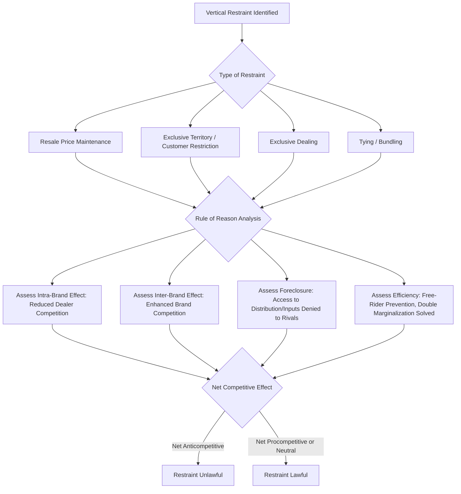

## Vertical Restraints and Their Competitive Effects

### Overview

Vertical restraints are contractual arrangements between firms operating at different levels of the supply chain — typically manufacturers/suppliers and their distributors/retailers — that restrict some dimension of freedom in the distribution relationship. Unlike horizontal restraints, which eliminate rivalry between direct competitors, vertical restraints govern how products move from producer to consumer, and their competitive effects are far more ambiguous: the same restraint can simultaneously reduce intra-brand competition while enhancing inter-brand competition, making vertical restraints one of the most economically nuanced areas of antitrust analysis.

### Legal Framework

**Key Points**

- U.S.: governed by **Section 1 of the Sherman Act** (concerted vertical restraints) and **Section 3 of the Clayton Act** (exclusive dealing and tying involving goods).
- EU: governed by **Article 101 TFEU**, with the **Vertical Block Exemption Regulation (VBER)** providing safe harbors for vertical agreements between firms with market shares below 30% that do not contain "hardcore" restrictions.
- Virtually all vertical restraints in modern U.S. law are analyzed under the **rule of reason** — a significant shift from earlier per se treatment of certain vertical restraints (discussed below).

### Intra-Brand vs. Inter-Brand Competition

**Key Points**

- **Intra-brand competition**: competition among different distributors/retailers selling the *same* manufacturer's brand (e.g., two different dealers both selling Ford vehicles).
- **Inter-brand competition**: competition between different manufacturers' competing brands (e.g., Ford vs. Toyota).
- Central economic insight: a manufacturer may rationally restrict intra-brand competition (e.g., via exclusive territories) specifically *to enhance* inter-brand competition — by giving dealers stronger incentives to invest in promoting and servicing that brand against rival brands. This insight, developed in the economic literature and adopted into case law, is the foundation for the rule-of-reason treatment of most vertical restraints.

### Resale Price Maintenance (RPM)

#### Legal Evolution

**Key Points**

- **Minimum RPM** (manufacturer sets a floor price below which dealers cannot sell) was per se illegal for over a century following *Dr. Miles Medical Co. v. John D. Park & Sons Co.* (1911).
- The Supreme Court overruled this in **Leegin Creative Leather Products v. PSKS, Inc.** (2007), holding that minimum RPM should be evaluated under the **rule of reason**, recognizing potential procompetitive justifications.
- **Maximum RPM** (manufacturer sets a price ceiling) was held subject to rule of reason earlier, in *State Oil Co. v. Khan* (1997).
- [Unverified] Several U.S. states have enacted or interpreted state antitrust statutes to continue treating minimum RPM as per se illegal notwithstanding *Leegin*, so practitioners must check state law separately from federal Sherman Act analysis.

#### Procompetitive Justifications

**Key Points**

- **Prevents free-riding**: without RPM, a discount retailer offering no services (showroom demonstrations, pre-sale advice) could free-ride on the promotional investment of full-service retailers, undermining the incentive for any retailer to provide those services.
- **Encourages promotional effort and quality certification services**: guarantees a dealer margin sufficient to invest in advertising, staff training, and point-of-sale support.
- **Facilitates entry** of new brands by ensuring adequate distributor margins during the early promotional phase.

#### Anticompetitive Risks

**Key Points**

- Can function as a **facilitating device for a dealer cartel** (a "hub-and-spoke" arrangement) if dealers, rather than the manufacturer, are the ones driving adoption of RPM to suppress retail price competition among themselves.
- Can facilitate a **manufacturer cartel** if used as a mechanism to monitor and enforce a horizontal price-fixing agreement among competing manufacturers.
- Raises retail prices and can reduce output if the anticompetitive use dominates.

### Non-Price Vertical Restraints

#### Exclusive Territories and Customer Restrictions

**Key Points**

- Manufacturer assigns each dealer an exclusive geographic territory or customer segment, prohibiting sales outside the assigned area.
- Analyzed under the rule of reason since *Continental T.V., Inc. v. GTE Sylvania Inc.* (1977), which explicitly adopted the inter-brand/intra-brand competition framework and overruled the prior per se rule of *United States v. Arnold, Schwinn & Co.* (1967).
- Procompetitive rationale: reduces intra-brand free-riding on dealer investment (e.g., a dealer investing in local advertising and showrooms wants assurance a neighboring dealer cannot free-ride on those customers).

#### Exclusive Dealing

**Key Points**

- A supplier requires a distributor (or a buyer requires a supplier) to deal exclusively with it, foreclosing rivals from that distribution channel or input source.
- Analyzed under **Section 3 of the Clayton Act** (where it "may substantially lessen competition") and Section 1 of the Sherman Act, generally under the rule of reason.
- Key case: *Tampa Electric Co. v. Nashville Coal Co.* (1961) established that foreclosure must be assessed relative to the total market — a small percentage of foreclosure is unlikely to raise concerns; *United States v. Microsoft Corp.* (2001) found exclusive dealing arrangements anticompetitive when they foreclosed a substantial share of a market with high entry barriers and network effects.
- Economic concern: **quantitative substantiality of foreclosure** — does the exclusive arrangement deny rivals sufficient scale to remain viable or enter effectively?

#### Tying Arrangements

**Key Points**

- A seller conditions the sale of one product (the "tying" product) on the buyer also purchasing a second, distinct product (the "tied" product), or at least agreeing not to buy the tied product from a competitor.
- Historically treated as per se illegal when the seller has market power in the tying product market, per *Jefferson Parish Hospital District No. 2 v. Hyde* (1984), but the Court has progressively moved toward a more effects-based approach; the D.C. Circuit in *United States v. Microsoft Corp.* (2001) applied rule-of-reason analysis to platform software tying.
- Elements traditionally required: (1) two separate products, (2) conditioning of sale, (3) seller market power in the tying product, and (4) a "not insubstantial" amount of commerce foreclosed in the tied market.
- Potential efficiencies: quality control, reduced transaction costs, technological integration (bundling complementary components), and price discrimination that can increase output in some circumstances (metering ties).

#### Full-Line Forcing and Bundling

**Key Points**

- Requires a dealer to carry a manufacturer's entire product line rather than cherry-picking only the most profitable items — analyzed similarly to tying, focused on foreclosure effects on rivals producing only a subset of the line.

### The Chicago School Critique and Its Influence

**Key Points**

- Chicago School economists (Bork, Posner, and others) argued that vertical restraints are generally procompetitive or competitively neutral because:
  1. A manufacturer's profit depends on the ultimate retail price and output — it has no independent incentive to restrict output/raise prices beyond what maximizes its own profit through the distribution chain (the **"single monopoly profit" theorem**).
  2. Vertical restraints typically solve genuine contracting problems (free-riding, double marginalization) rather than serving exclusionary purposes.
- This view heavily influenced the shift from per se to rule-of-reason treatment across vertical restraint categories (*Sylvania*, *State Oil*, *Leegin*).
- **Post-Chicago critiques** identify conditions under which the single monopoly profit theorem breaks down: when the tied/tying products are not used in fixed proportions, when there are multiple points of leverage, or when restraints raise rivals' costs or facilitate foreclosure strategically rather than merely capturing existing monopoly rents.

### Double Marginalization

**Key Points**

- Occurs when both an upstream manufacturer (with market power) and a downstream retailer (with market power) independently mark up price above marginal cost, resulting in a final retail price *higher* and output *lower* than would occur under vertical integration or a single markup.

$$P_{final} = MC \cdot m_{upstream} \cdot m_{downstream}$$

where $m_{upstream}, m_{downstream} > 1$ are the respective markup multipliers.

**Key Points**

- Vertical restraints such as RPM (setting a maximum price) or two-part tariffs can **eliminate double marginalization**, lowering the final price and increasing output and joint profit — a genuinely procompetitive effect that benefits consumers.

**Example**

Suppose marginal cost is $10. If the upstream manufacturer marks up by a multiplier of 1.5 and the downstream retailer independently marks up by a further 1.5, the final price is:

$$P = 10 \times 1.5 \times 1.5 = 22.50$$

If the manufacturer instead imposes a maximum resale price of $18 (eliminating the second independent markup layer while still allowing a reasonable retail margin), consumers pay less and volume sold increases — illustrating why maximum RPM is generally viewed as procompetitive.

### Vertical Foreclosure and Raising Rivals' Costs

**Key Points**

- Vertical restraints can be used strategically to **foreclose rivals** from access to critical distribution channels or input supplies, raising their costs of doing business and impairing their ability to compete, even without any direct price effect.
- Distinguished from "mere harm to a competitor" (not an antitrust concern by itself) by requiring proof of **harm to the competitive process** — i.e., that consumers are ultimately harmed through higher prices, reduced output, or reduced innovation.
- Relevant to modern platform antitrust debates: a dominant platform's exclusive arrangements with input suppliers or distribution partners may raise foreclosure concerns analogous to traditional vertical restraint doctrine.

### Diagram: Vertical Restraint Effects Analysis

### Quantifying Foreclosure

**Key Points**

- Foreclosure share is often calculated as the percentage of the relevant market's distribution capacity, input supply, or customer base rendered inaccessible to rivals by the restraint.

$$\text{Foreclosure Rate} = \frac{\text{Volume/Capacity Foreclosed}}{\text{Total Market Volume/Capacity}}$$

- Courts and agencies generally require **substantial** foreclosure (commonly cited informal benchmarks in the 30–40%+ range, though no fixed numerical threshold governs, and analysis is fact-specific and depends on duration of contracts, ease of switching, and availability of alternative channels) before finding likely competitive harm — [Inference] the specific percentage treated as significant varies considerably across cases and enforcement guidance, and practitioners should not rely on a single bright-line number.

### Comparative Approach: EU Vertical Block Exemption Regulation (VBER)

**Key Points**

- The EU's VBER (most recently revised effective 2022) creates a safe harbor for vertical agreements where neither party's market share exceeds 30%, provided the agreement does not contain "hardcore restrictions" (e.g., fixed or minimum resale price maintenance, absolute territorial protection preventing passive sales, and certain online sales restrictions).
- Agreements falling outside the safe harbor are not automatically illegal but require individual assessment under Article 101(3)'s efficiency-based exemption criteria.
- [Unverified] Specific thresholds, hardcore restriction categories, and exemption conditions are subject to periodic revision by the European Commission; current guidance should be verified against the latest VBER text and accompanying Guidelines.

### Practical Example: Exclusive Dealing Analysis

**Example**

A dominant beverage manufacturer offers retailers rebates conditioned on retailers agreeing not to stock any competing beverage brands. A rival beverage producer, unable to secure retail shelf space, struggles to achieve minimum viable scale.

**Analysis**:

1. **Market definition**: Define the relevant retail distribution channel market (e.g., convenience store beverage coolers) and calculate the manufacturer's share of that channel.
2. **Foreclosure calculation**: If the arrangement locks up, say, 70% of available shelf space in the relevant channel for multi-year terms, this suggests substantial foreclosure.
3. **Efficiency defense**: The manufacturer may argue the exclusivity reduces free-riding on cooler placement investment or secures volume commitments that lower distribution costs.
4. **Balancing**: If the rival can access alternative channels (online, other retail formats) at reasonable cost, foreclosure concerns diminish; if the foreclosed channel is essential to achieving minimum efficient scale, anticompetitive effects are more likely to predominate.

### Vertical Mergers vs. Vertical Restraints

**Key Points**

- Vertical restraints (contractual) should be distinguished from **vertical mergers** (structural integration), though both raise overlapping foreclosure and raising-rivals'-costs concerns analyzed under the 2020 U.S. Vertical Merger Guidelines (jointly issued by DOJ and FTC).
- A vertical restraint can sometimes substitute for vertical integration as a lower-cost way of achieving the same coordination or efficiency benefits (or, symmetrically, the same competitive harms).

### Key Case Law Summary Table (Illustrative, Not Exhaustive)

**Key Points**

- *Dr. Miles* (1911) — established per se illegality of minimum RPM (later overruled).
- *United States v. Arnold, Schwinn & Co.* (1967) — per se illegality of territorial restraints (later overruled).
- *Continental T.V. v. GTE Sylvania* (1977) — rule of reason for non-price vertical territorial restraints; introduced inter-brand/intra-brand framework.
- *Jefferson Parish Hospital District No. 2 v. Hyde* (1984) — modern tying test requiring market power in tying product.
- *State Oil Co. v. Khan* (1997) — rule of reason for maximum RPM.
- *Leegin Creative Leather Products v. PSKS* (2007) — rule of reason for minimum RPM.

**Next Steps**

- Tying and bundling: economic theory and leverage doctrine in detail
- Double marginalization and vertical integration incentives
- Vertical merger analysis under the 2020 DOJ/FTC Vertical Merger Guidelines
- Platform antitrust: self-preferencing and vertical foreclosure in digital markets
- Raising rivals' costs theory (Salop and Scheffman)
- Franchise and distribution contract design under antitrust constraints
- EU Vertical Block Exemption Regulation: hardcore restrictions and safe harbors
- Free-riding problems in distribution and their contractual solutions