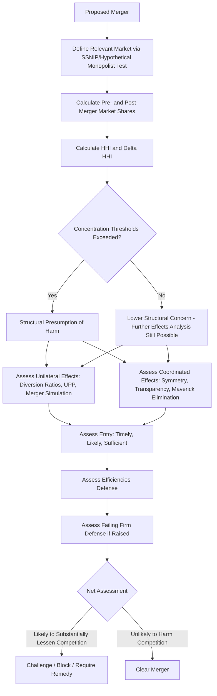

## Merger Analysis and Concentration Measures

### Overview

Merger analysis is the process by which competition agencies and courts evaluate whether a proposed merger or acquisition is likely to substantially lessen competition. It combines market definition, concentration measurement, and economic theories of harm (unilateral and coordinated effects) with an assessment of countervailing factors such as entry, efficiencies, and failing-firm considerations. Concentration measures — principally market shares and the Herfindahl-Hirschman Index — serve as the structural screening tools that trigger closer scrutiny.

### Legal Framework

**Key Points**

- U.S.: governed by **Section 7 of the Clayton Act**, which prohibits mergers whose effect "may be substantially to lessen competition, or to tend to create a monopoly."
- Premerger notification for sufficiently large transactions is required under the **Hart-Scott-Rodino (HSR) Act**, triggering a waiting period during which the DOJ or FTC can investigate before the deal closes.
- The analytical framework is set out in the **U.S. Horizontal Merger Guidelines** (most recently revised in 2023, jointly issued by DOJ and FTC), and for vertical mergers, the **2020 Vertical Merger Guidelines**.
- EU: governed by the **EU Merger Regulation (EUMR)**, using the "significant impediment to effective competition" (SIEC) test, assessed by the European Commission.

### The General Analytical Framework

**Key Points**

- Modern merger review under the U.S. Guidelines proceeds through several analytical steps rather than a rigid formula:
  1. Define the relevant product and geographic market(s) (see hypothetical monopolist/SSNIP test).
  2. Identify the merging parties and calculate pre- and post-merger market shares.
  3. Compute concentration measures (HHI) and changes therein.
  4. Assess whether the merger raises unilateral or coordinated effects concerns.
  5. Evaluate entry conditions — could timely, likely, and sufficient entry defeat an attempted price increase?
  6. Consider merger-specific efficiencies claimed by the parties.
  7. Consider the failing-firm or flailing-firm defense, if raised.
- The 2023 Guidelines emphasize that market definition and structural presumptions are tools to aid analysis, not prerequisites — direct evidence of likely competitive effects can independently establish a violation.

### The Herfindahl-Hirschman Index (HHI) in Merger Review

$$HHI = \sum_{i=1}^{n} s_i^2$$

**Key Points**

- Calculated using market shares expressed as whole numbers (e.g., a 30% share contributes $30^2 = 900$).
- **Concentration categories** under the 2023 U.S. Guidelines:
  - **Unconcentrated markets**: HHI below 1,000.
  - **Moderately concentrated markets**: HHI between 1,000 and 1,800.
  - **Highly concentrated markets**: HHI above 1,800.
- **Structural presumption of harm**: a merger is presumed to substantially lessen competition if it results in a highly concentrated market (post-merger HHI above 1,800) and increases HHI by more than 100 points, or if it results in a moderately concentrated market and increases HHI by more than 100 points (with somewhat greater scrutiny warranted as the resulting HHI and delta increase within that range).
- This presumption can be rebutted by evidence that the merger is unlikely to increase market power despite the structural indicators (e.g., strong entry conditions, dynamic competitive effects not captured by current shares, or repositioning by rivals).

**Example**

Merging firms have pre-merger shares of 25% and 15% in a market where other firms hold 30%, 20%, and 10%.

Pre-merger HHI:

$$HHI_{pre} = 25^2 + 15^2 + 30^2 + 20^2 + 10^2 = 625 + 225 + 900 + 400 + 100 = 2250$$

Post-merger (combining the 25% and 15% firms into one 40% firm):

$$HHI_{post} = 40^2 + 30^2 + 20^2 + 10^2 = 1600 + 900 + 400 + 100 = 3000$$

Change in HHI: $\Delta HHI = 3000 - 2250 = 750$. Since the post-merger market is highly concentrated (above 1,800) and $\Delta HHI$ exceeds 100, this merger would trigger the structural presumption of competitive harm.

**Shortcut formula**: For a merger of two firms with premerger shares $s_1$ and $s_2$, the increase in HHI equals:

$$\Delta HHI = 2 \cdot s_1 \cdot s_2$$

Applying this to the example: $\Delta HHI = 2 \times 25 \times 15 = 750$, matching the direct calculation.

### Concentration Ratios (CR_n)

$$CR_n = \sum_{i=1}^{n} s_i$$

**Key Points**

- Sums the shares of the largest $n$ firms (commonly CR4 or CR8); simpler to compute than HHI but discards distributional information among leading firms and ignores the competitive fringe entirely.
- Less commonly used than HHI in modern U.S. merger enforcement, though still referenced in some academic and international contexts.

### Theories of Harm: Unilateral Effects

**Key Points**

- Applies primarily to mergers involving **differentiated products**, where the merging firms' products are each other's closest substitutes for a meaningful set of customers.
- The concern: post-merger, the combined firm internalizes the sales it would have lost to its rival when raising price — sales that previously "escaped" to the competitor now remain within the merged firm, reducing the discipline that previously constrained pricing.
- Central metric: the **diversion ratio**, the fraction of sales lost by product 1 (if its price rises) that are diverted to product 2, rather than lost to the market entirely or diverted to outside options.

$$D_{12} = \frac{\text{Sales diverted from Product 1 to Product 2}}{\text{Total sales lost by Product 1}}$$

- High diversion ratios between the merging parties' products (relative to diversion to non-merging rivals) indicate the products are close substitutes, heightening unilateral effects concerns.
- **Upward Pricing Pressure (UPP)** (Farrell & Shapiro) formalizes this:

$$UPP_1 = D_{12} \cdot (P_2 - MC_2) - E_1$$

where $E_1$ represents merger-specific marginal cost efficiencies for product 1. Positive UPP indicates incentive to raise price absent offsetting efficiencies.

- Applies also to markets with **capacity constraints** and **bidding markets** (e.g., mergers between two of a small number of qualified bidders for large procurement contracts), where unilateral effects arise from reduced bidding competition rather than differentiated product substitution per se.

### Theories of Harm: Coordinated Effects

**Key Points**

- Concerns whether the merger makes **explicit or tacit coordination** among remaining competitors more likely, more effective, or more stable, by increasing concentration, homogenizing firm characteristics, or eliminating a maverick firm.
- Relevant factors mirror the market structure conditions that facilitate cartel stability: fewer, more symmetric firms; homogeneous products; transparent pricing; high entry barriers; historical evidence of prior coordination or facilitating practices in the industry.
- A **"maverick" firm** — one with a distinct incentive or lower cost structure that causes it to disrupt coordination (e.g., discounting aggressively) — is given particular weight; a merger that eliminates or absorbs a maverick is especially concerning even at moderate concentration levels.

### Entry Analysis

**Key Points**

- Under the Merger Guidelines, entry can defeat competitive concerns if it is likely to be:
  - **Timely**: entry and its effects would occur within a reasonably short period (traditionally referenced around two years, though this is applied flexibly and is not a rigid rule).
  - **Likely**: entry would be profitable at premerger prices and thus rational for a firm to undertake.
  - **Sufficient**: entry would be of adequate scale and scope to restore competitive pricing, not merely token entry.
- Barriers assessed include sunk costs, regulatory/licensing requirements, access to essential inputs or distribution, network effects, and reputation/switching costs.

### Efficiencies Defense

**Key Points**

- Merging parties may argue that the merger will generate **merger-specific efficiencies** (cost savings, product improvements, innovation gains) that could not reasonably be achieved through less anticompetitive means (e.g., internal growth, contractual arrangements short of merger).
- Efficiencies must be verifiable, merger-specific, and of a type and magnitude sufficient to offset the likely anticompetitive effects — courts and agencies generally treat pure cost savings (as opposed to output-enhancing efficiencies) with skepticism absent strong verification, since cost savings alone do not guarantee they will be passed through to consumers rather than retained as profit.

### Failing Firm and Flailing Firm Defenses

**Key Points**

- **Failing firm defense** (from *International Shoe Co. v. FTC*, 1930, and *Citizen Publishing Co. v. United States*, 1969): requires showing (1) the target would fail and exit the market absent the merger, (2) it could not successfully reorganize under bankruptcy, and (3) no less anticompetitive alternative purchaser is available.
- **Flailing firm** (weakened, though not imminently failing) considerations may be given some weight in the broader competitive effects analysis without meeting the full failing-firm standard, though this is treated cautiously and is not a formal safe harbor.

### Diagram: U.S. Horizontal Merger Analysis Framework

### Merger Simulation Models

**Key Points**

- Structural econometric models (commonly using **logit** or **nested logit** discrete choice demand systems) estimate consumer demand parameters from historical price and quantity data, then simulate the post-merger equilibrium under an assumed conduct model (typically **Bertrand-Nash** price competition for differentiated products).
- Output: predicted post-merger price changes for the merging parties' products and, often, competitors' products (accounting for strategic repricing responses).
- Requires assumptions about functional form of demand, marginal cost pass-through, and competitive conduct; results are sensitive to these assumptions and to data quality — [Inference] the reliability of any specific merger simulation depends heavily on the appropriateness of the chosen demand model and the quality of underlying data, and results are typically presented as one input among several rather than dispositive proof.

### Vertical Merger Analysis (Brief Comparative Note)

**Key Points**

- Vertical mergers combine firms at different levels of the supply chain and are analyzed under the 2020 U.S. Vertical Merger Guidelines, focusing on:
  - **Foreclosure/raising rivals' costs**: whether the merged firm could profitably deny or degrade rivals' access to critical inputs or distribution.
  - **Elimination of double marginalization (EDM)**: a recognized efficiency specific to vertical integration that can lower final prices, which agencies must weigh against foreclosure risks.
  - **Access to competitively sensitive information**: whether the merger gives the upstream/downstream party access to rivals' sensitive data through the supply relationship.

### Remedies

**Key Points**

- **Structural remedies**: divestiture of overlapping business units, brands, or assets to a suitable buyer, preserving a standalone competitor.
- **Behavioral (conduct) remedies**: ongoing restrictions on the merged firm's conduct (e.g., firewalls, non-discrimination commitments, licensing obligations) — generally disfavored by U.S. agencies relative to structural remedies due to monitoring costs and enforcement difficulty, though more commonly used in some vertical merger contexts and in the EU.
- Agencies assess whether a proposed divestiture buyer has the incentive and capability to replace the competitive significance lost from the merger.

### International Comparison: EU SIEC Test

**Key Points**

- The EU's **Significant Impediment to Effective Competition (SIEC)** test under the EUMR is substantively similar to the U.S. framework but formally captures both unilateral (non-coordinated) and coordinated effects explicitly within a single standard, and expressly considers whether the merger would create or strengthen a dominant position.
- The European Commission also uses HHI thresholds (broadly comparable, though not identical, to U.S. Guidelines thresholds) as an initial screening device in its Horizontal Merger Guidelines.

### Practical Example: Full Walkthrough

**Example**

Two national office supply retailers propose to merge. Pre-merger, the market (defined via SSNIP analysis as "business-to-business office supply superstores," distinct from general retail or online-only sellers) has five significant competitors with shares 35%, 30%, 15%, 12%, 8%.

1. **Pre-merger HHI**: $35^2 + 30^2 + 15^2 + 12^2 + 8^2 = 1225 + 900 + 225 + 144 + 64 = 2558$ (highly concentrated).
2. **Merging parties**: the 35% and 30% firms propose to combine.
3. **Post-merger HHI**: $65^2 + 15^2 + 12^2 + 8^2 = 4225 + 225 + 144 + 64 = 4658$.
4. **$\Delta HHI = 2 \times 35 \times 30 = 2100$**, far exceeding the 100-point threshold in an already highly concentrated market — triggering a strong structural presumption of harm.
5. **Unilateral effects**: with only three remaining competitors and the merging parties as the two largest players, diversion ratios between them are likely high, indicating significant unilateral pricing pressure.
6. **Entry**: office supply superstores require significant capital investment and logistics infrastructure; entry is unlikely to be timely or sufficient to discipline post-merger pricing.
7. **Likely outcome**: absent a compelling efficiencies showing or divestiture remedy, this merger would likely be challenged.

### Common Pitfalls in Merger Analysis

**Key Points**

- Treating HHI thresholds as rigid pass/fail rules rather than as triggers for further investigation — the Guidelines create presumptions, not automatic conclusions.
- Ignoring the distinction between static market share snapshots and dynamic competitive significance (e.g., a firm with a small current share but a disruptive new product pipeline may be a more important competitive constraint than its share suggests).
- Overlooking coordinated effects in markets where unilateral effects concerns seem low (and vice versa) — both theories should typically be considered.
- Failing to properly identify merger-specific efficiencies (i.e., savings achievable only through the merger, not through alternative means).

**Next Steps**

- Market definition and the hypothetical monopolist (SSNIP) test in depth
- Unilateral effects modeling: diversion ratios and merger simulation techniques
- Vertical merger guidelines and elimination of double marginalization
- Coordinated effects and the economics of tacit collusion
- Merger remedies: structural divestiture design and behavioral remedy monitoring
- International merger control cooperation and multi-jurisdictional filings
- Potential competition and nascent competitor acquisitions (killer acquisitions debate)
- Efficiencies analysis and consumer welfare vs. total welfare standards