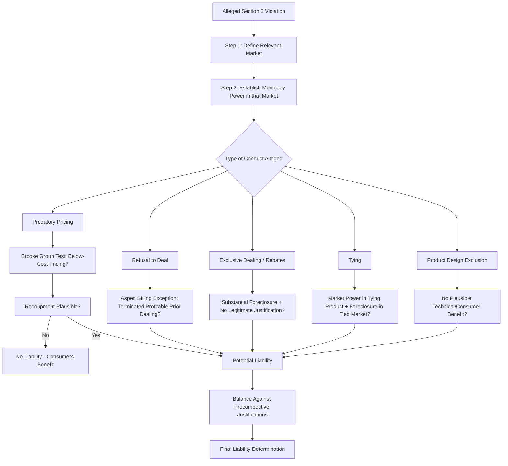

## Predatory Pricing and Exclusionary Conduct

### Overview

Predatory pricing and exclusionary conduct fall under monopolization and abuse-of-dominance doctrine — the branch of antitrust law addressing unilateral conduct by a single dominant firm designed to eliminate or discipline competitors rather than compete on the merits. The central analytical challenge is distinguishing aggressive, procompetitive competition (which benefits consumers, even when it harms rivals) from genuinely exclusionary conduct that sacrifices short-term profit to eliminate competition and enable long-term supra-competitive pricing.

### Legal Framework

**Key Points**

- U.S.: governed by **Section 2 of the Sherman Act**, which prohibits monopolization, attempted monopolization, and conspiracy to monopolize.
- Requires proof of: (1) possession of monopoly power in a relevant market, and (2) willful acquisition or maintenance of that power through exclusionary conduct, as opposed to growth from a superior product, business acumen, or historic accident (*United States v. Grinnell Corp.*, 1966).
- EU: governed by **Article 102 TFEU**, prohibiting "abuse of a dominant position," which does not require a separate showing of intent to monopolize but focuses on objective exclusionary or exploitative effects of conduct by a firm already found dominant.
- The foundational tension: Section 2 must be applied cautiously because false positives (condemning legitimate aggressive competition) chill the very rivalry antitrust law seeks to protect, while false negatives allow genuine predation to entrench monopoly power.

### Predatory Pricing: The Core Economic Problem

**Key Points**

- Predatory pricing theory: a dominant firm deliberately prices below some measure of cost to drive rivals out of the market (or deter entry/expansion), intending to recoup the short-term losses later by raising prices to supra-competitive levels once competition is eliminated.
- Economically controversial because it requires the predator to **sacrifice profit now** for **uncertain profit later**, and rational rivals or new entrants may simply re-enter once prices rise again — undermining the strategy's rationality unless specific conditions hold (e.g., significant barriers preventing re-entry).
- Chicago School economists (notably McGee, 1958) argued predatory pricing is rarely a rational strategy because the predator typically loses more from below-cost sales (given it usually has larger market share, hence higher volume losses) than the prey, and because acquisition of the prey (rather than a price war) is usually cheaper.
- Post-Chicago scholars identify conditions under which predation can be rational: reputation effects across multiple markets or repeated encounters, signaling low costs to deter future entrants, capital market imperfections that make the prey's access to financing unusually vulnerable to short-term losses, and long-lived sunk-cost asymmetries.

### The Brooke Group Test

**Key Points**

- Established in ***Brooke Group Ltd. v. Brown & Williamson Tobacco Corp.*** (1993), the controlling U.S. standard for predatory pricing claims requires plaintiffs to prove **two elements**:
  1. **Below-cost pricing**: the defendant's prices were below an appropriate measure of cost.
  2. **Dangerous probability of recoupment**: the defendant had a realistic prospect of recouping its investment in below-cost pricing through supra-competitive pricing after competition is eliminated.
- The recoupment requirement is often the more difficult element to satisfy and functions as a screening device — without a plausible path to recoupment, below-cost pricing cannot be an antitrust violation because it simply benefits consumers with no offsetting future harm.
- Recoupment analysis requires examining post-predation market structure: sufficiently high entry barriers, durable market power, ability to raise prices without new entry or re-entry by the vanquished rival undermining the strategy.

### Cost Benchmarks for "Below Cost"

**Key Points**

- The relevant cost measure has been extensively debated in the economic literature, since no single cost benchmark perfectly captures the economically appropriate distinction between predatory and non-predatory low pricing.

#### Average Variable Cost (AVC) — The Areeda-Turner Rule

**Key Points**

- Proposed by Areeda and Turner (1975): pricing at or above average variable cost should be conclusively presumed lawful (since a firm pricing above AVC is at least covering its short-run marginal decision-relevant costs and would rationally produce that output even absent predatory intent); pricing below AVC should be presumptively unlawful.
- Rationale: AVC is used as a practical proxy for marginal cost (MC), which is theoretically the correct benchmark but often difficult to measure directly from accounting data.
- Widely adopted, though not uniformly, across U.S. circuits, sometimes with rebuttable rather than conclusive presumptions.

#### Average Total Cost (ATC)

**Key Points**

- Some courts and commentators argue pricing between AVC and ATC (average total cost, including fixed costs) can still be predatory in certain circumstances, since a firm covering only variable costs is not covering the full cost of remaining in business long-run.
- Generally treated as an ambiguous zone requiring additional evidence of intent or market context rather than a clear per se rule in either direction.

#### Average Avoidable Cost (AAC)

**Key Points**

- An alternative benchmark advocated in more recent economic literature and by some agencies: includes all costs (variable and any fixed costs) that could have been avoided by not producing the additional output in question, addressing some criticisms of AVC in industries with lumpy or non-marginal cost structures.

$$\text{Predation Test (simplified)}: \quad P < AVC \;\; (\text{or } AAC) \;\; \text{and} \;\; \text{Recoupment Plausible}$$

### Diagram: Predatory Pricing Cost Benchmarks

<svg xmlns="http://www.w3.org/2000/svg" viewBox="0 0 700 400">
<title>Predatory Pricing Cost Benchmarks (svg_diagram)</title>
<rect x="0" y="0" width="700" height="400" fill="#ffffff" />
<text x="350" y="25" font-family="Arial" font-size="16" font-weight="bold" text-anchor="middle" fill="#1a1a1a">Predatory Pricing Cost Benchmarks (svg_diagram)</text>
<line x1="90" y1="340" x2="650" y2="340" stroke="#333" stroke-width="2" />
<line x1="90" y1="340" x2="90" y2="60" stroke="#333" stroke-width="2" />
<text x="370" y="375" font-family="Arial" font-size="13" text-anchor="middle" fill="#333">Price Level</text>

<rect x="90" y="90" width="560" height="40" fill="#dbeafe" />
<line x1="90" y1="90" x2="650" y2="90" stroke="#2563eb" stroke-width="2" />
<text x="660" y="95" font-family="Arial" font-size="12" fill="#2563eb">ATC (Average Total Cost)</text>

<rect x="90" y="130" width="560" height="60" fill="#e0f2fe" />
<text x="100" y="165" font-family="Arial" font-size="11" fill="#0369a1">Ambiguous zone: below ATC, above AVC</text>

<line x1="90" y1="190" x2="650" y2="190" stroke="#16a34a" stroke-width="2" />
<text x="660" y="195" font-family="Arial" font-size="12" fill="#16a34a">AVC / AAC (approx. Marginal Cost)</text>

<rect x="90" y="190" width="560" height="120" fill="#fee2e2" />
<text x="100" y="230" font-family="Arial" font-size="12" fill="#dc2626" font-weight="bold">Presumptively Predatory Zone</text>
<text x="100" y="250" font-family="Arial" font-size="11" fill="#dc2626">(Price below AVC/AAC)</text>
<line x1="90" y1="310" x2="650" y2="310" stroke="#9ca3af" stroke-width="1" stroke-dasharray="4,3" />
<text x="100" y="325" font-family="Arial" font-size="11" fill="#6b7280">Zero / floor</text>

<text x="90" y="55" font-family="Arial" font-size="11" fill="`#1a1a1a`">Above ATC: Presumptively Lawful</text>

</svg>

### Exclusionary Conduct Beyond Pricing

Monopolization can be achieved or maintained through non-price exclusionary practices, evaluated for whether they harm competition (not merely competitors) without offsetting business justification.

#### Refusal to Deal

**Key Points**

- Generally, firms — even monopolists — have no antitrust duty to deal with rivals (*Verizon Communications v. Trinko*, 2004, reaffirming broad freedom to choose business partners).
- A narrow exception exists where a firm terminates a **voluntary and profitable prior course of dealing** for no legitimate business reason, apparently to sacrifice short-term profits in order to harm a competitor long-term (*Aspen Skiing Co. v. Aspen Highlands Skiing Corp.*, 1985).
- The **essential facilities doctrine** — requiring a monopolist to grant access to a facility indispensable to competition — remains a contested and narrowly applied theory in U.S. law post-*Trinko*, and is more broadly recognized in EU law under Article 102.

#### Exclusive Dealing and Loyalty Rebates

**Key Points**

- When used by a dominant firm, exclusive dealing arrangements or loyalty/volume rebate structures can foreclose rivals from access to distribution or customers, analyzed for whether they foreclose a substantial share of the market and lack legitimate business justification.
- **Retroactive/all-units rebates** conditioned on reaching a volume threshold across the *entire* purchase quantity (rather than only the incremental units above threshold) are viewed with particular suspicion in EU law (*Intel v. Commission*, 2017, requiring analysis of actual capability to foreclose an "as-efficient competitor") because they can create steep effective discount cliffs that make switching a meaningful share of purchases to a rival unprofitable even when the rival is efficient.

#### Predatory Product Design and Innovation-Related Exclusion

**Key Points**

- Claims that a dominant firm redesigned its product specifically to exclude interoperability with rivals' complementary products (rather than to improve the product for genuine technical or consumer-benefit reasons) — courts apply significant deference to product design decisions given the difficulty of distinguishing innovation from exclusion, requiring strong evidence that the redesign had no plausible technological benefit (*Allied Orthopedic Appliances v. Tyco Health Care*, 2010; contrasted with EU's somewhat more interventionist approach in cases like *Google Android*, and *Google Shopping*).

#### Tying as Exclusionary Conduct

**Key Points**

- When used by a monopolist, tying (discussed in vertical restraints) can serve as an exclusionary mechanism to leverage monopoly power from one market into an adjacent market, foreclosing rivals in the tied product market (*United States v. Microsoft Corp.*, 2001, regarding bundling of the Windows operating system and Internet Explorer browser).

#### Predatory Buying (Monopsony Predation)

**Key Points**

- Mirror-image theory: a dominant buyer purchases inputs at above-competitive prices specifically to deny rivals access to a scarce input or to drive up rivals' costs, intending to recoup through later monopsony power over sellers — analytically parallel to predatory pricing but on the input-purchasing side, and correspondingly rare in successful litigation for similar recoupment-feasibility reasons.

### Diagram: Section 2 Monopolization Analysis Framework

### Intent Evidence and Its Limited Role

**Key Points**

- Courts generally treat subjective statements of intent to "kill," "crush," or "eliminate" a competitor with caution — aggressive competitive rhetoric is common even among firms competing lawfully on the merits, and intent alone cannot establish antitrust liability without objective anticompetitive conduct and effects.
- Intent evidence is typically used as corroborating evidence alongside objective economic evidence (e.g., cost data, recoupment analysis) rather than as an independent basis for liability.

### Distinguishing Predation from Legitimate Competition: The "No Economic Sense" and "Profit Sacrifice" Tests

**Key Points**

- **Profit sacrifice test**: asks whether the conduct would be profitable for the defendant *apart from* its tendency to eliminate or discipline competitors — if the conduct only makes sense as a strategy to exclude rivals (i.e., it would be unprofitable but for the anticipated elimination of competition), it is more likely exclusionary.
- **Equally efficient competitor test**: asks whether the conduct (e.g., a pricing or rebate scheme) would exclude a hypothetical rival that is *as efficient* as the dominant firm — if only a less efficient rival would be excluded, competition law generally should not intervene, since protecting inefficient rivals from lawful competition is not the goal of antitrust.
- Both tests aim to operationalize the same underlying principle: distinguish conduct that excludes rivals *through superior efficiency* (lawful) from conduct that excludes rivals *through sacrifice or strategic exploitation of market power* (potentially unlawful).

### Practical Example: Applying the Brooke Group Framework

**Example**

A dominant airline on a particular route drops fares below a level a new low-cost entrant can sustain, then raises fares again after the entrant exits.

**Analysis**:

1. **Market definition**: the relevant market might be defined narrowly as the specific city-pair route, given limited substitutability with other routes for most travelers.
2. **Cost test**: economists would examine whether the incumbent's fares fell below average variable cost (or avoidable cost) for the relevant flights, or merely below average total cost (which could reflect legitimate short-run capacity-driven discounting).
3. **Recoupment test**: assess whether, once the entrant exits, the incumbent's route faces low re-entry risk from that competitor or others (e.g., due to gate/slot constraints at the relevant airports, brand loyalty programs, or the sunk costs of establishing route presence) — if re-entry is easy and likely once prices rise again, recoupment is implausible and the claim likely fails even if fares were briefly below cost.
4. **Outcome**: absent both below-cost pricing and plausible recoupment, low fares — even fares specifically timed to compete against a new entrant — are generally treated as lawful aggressive competition rather than antitrust predation.

### EU Approach: Abuse of Dominance Without a Formal Recoupment Requirement

**Key Points**

- The European Court of Justice in ***AKZO Chemie BV v. Commission*** (1991) adopted a cost-based test broadly similar in structure to Areeda-Turner (pricing below average variable cost presumptively abusive; pricing between AVC and ATC abusive if part of a plan to eliminate a competitor), but EU law has **not required a separate formal recoupment showing** to the same degree as U.S. law post-*Brooke Group* — reflecting EU competition law's somewhat greater willingness to intervene against exclusionary conduct by dominant firms even absent certainty about post-exclusion market power. [Unverified] The precise degree to which recoupment-type reasoning has since been incorporated into EU practice has evolved through subsequent case law (e.g., *France Télécom v. Commission*, 2009; *Post Danmark*, 2012) and should be checked against current EU jurisprudence for case-specific application.

### Remedies for Monopolization

**Key Points**

- **Behavioral remedies**: injunctions against the specific exclusionary conduct, non-discrimination or interoperability requirements, prohibition on specific contract terms.
- **Structural remedies**: in the most severe cases, breakup of the monopolist into separate competing entities (rarely ordered in practice; e.g., initially ordered but ultimately not implemented in *United States v. Microsoft Corp.* after appellate revision).
- **Damages**: private plaintiffs may recover treble damages under Section 4 of the Clayton Act for injuries caused by Section 2 violations.

**Next Steps**

- Monopoly power measurement: market share thresholds and durability requirements
- Essential facilities doctrine: U.S. narrow approach vs. EU broader recognition
- Loyalty rebates and the as-efficient-competitor standard (post-*Intel*)
- Platform monopolization: self-preferencing, interoperability, and digital gatekeeper regulation
- Attempted monopolization: the dangerous probability of success standard
- Predatory innovation and product design litigation
- Comparative U.S./EU approaches to unilateral conduct enforcement
- Remedies design: behavioral vs. structural relief in monopolization cases