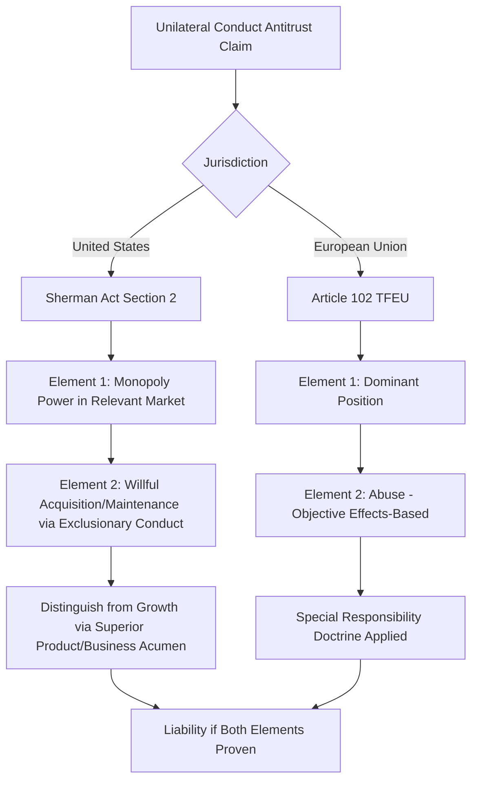

## Monopolization and Abuse of Dominant Position

### Overview

Monopolization (U.S. terminology under Sherman Act Section 2) and abuse of dominant position (EU terminology under Article 102 TFEU) form the doctrinal core of unilateral-conduct antitrust law — governing how a single firm's own market power and behavior, rather than agreements among multiple firms, can violate competition law. Both frameworks share the same underlying economic concern: preventing a firm from acquiring, entrenching, or exploiting substantial market power through means other than competition on the merits, while carefully avoiding the chilling of legitimately superior competitive performance.

### Comparative Legal Architecture

**Key Points**

- **U.S. Section 2 (Sherman Act)**: requires proof of (1) possession of monopoly power in a relevant market, and (2) willful acquisition or maintenance of that power through anticompetitive conduct, as distinguished from growth attributable to "a superior product, business acumen, or historic accident" (*United States v. Grinnell Corp.*, 1966). Also covers **attempted monopolization** (requiring specific intent plus a dangerous probability of achieving monopoly power) and **conspiracy to monopolize**.
- **EU Article 102 TFEU**: prohibits "abuse of a dominant position," structured as (1) establishing dominance, and (2) identifying abusive conduct — notably, EU law does not require proof of intent to monopolize; abuse is assessed largely on an objective/effects basis, reflecting a somewhat more interventionist philosophy toward dominant-firm conduct than U.S. law.
- A key structural difference: U.S. law is generally more permissive toward unilateral conduct by dominant firms absent clear exclusionary intent and effect (reflecting concern about chilling competition, per *Trinko*), while EU law imposes a **"special responsibility"** on dominant firms not to allow their conduct to further distort competition (*Michelin v. Commission*, 1983), which can include some conduct that would be lawful for a non-dominant firm.

### Establishing Monopoly Power / Dominance

#### U.S.: Monopoly Power

**Key Points**

- Defined as "the power to control prices or exclude competition" (*United States v. E.I. du Pont de Nemours & Co.*, 1956 — the "Cellophane" case).
- Typically inferred from a **high and durable market share** in a properly defined relevant market, combined with significant entry barriers preventing erosion of that share.
- Rough judicial benchmarks: shares below approximately 50% are rarely sufficient standing alone; shares above roughly 70% strongly support a finding of monopoly power, with the range in between requiring closer examination of entry barriers, elasticity of demand, and competitive dynamics (drawing on cases like *United States v. Aluminum Co. of America* ("Alcoa"), 1945, and subsequent lower-court decisions).
- Direct evidence (e.g., demonstrated ability to profitably raise price without losing significant sales, per the Lerner Index or residual demand elasticity) can substitute for or supplement share-based inference.

#### EU: Dominant Position

**Key Points**

- Defined in *Hoffmann-La Roche v. Commission* (1979) as a position of economic strength that enables a firm "to prevent effective competition being maintained... by affording it the power to behave to an appreciable extent independently of its competitors, customers and ultimately of consumers."
- Market shares above 50% create a presumption of dominance under EU case law (*AKZO Chemie v. Commission*, 1991); shares below 40% rarely support a dominance finding absent other strong indicators, though dominance has occasionally been found at lower shares combined with other factors (e.g., fragmented competitors, strong brand, technological advantages).
- **Collective dominance** is recognized under EU law — two or more legally independent firms can jointly hold a dominant position if they present themselves on the market as a single collective entity with respect to competitors, trading partners, and consumers (*Compagnie Maritime Belge*, 2000), a concept without a precise U.S. equivalent under Section 2.

### Diagram: Comparative Monopolization/Dominance Framework

### Categories of Exclusionary/Abusive Conduct

**Key Points**

- Both frameworks address broadly overlapping categories of unilateral conduct, generally including: predatory pricing, exclusive dealing, tying and bundling, refusals to deal, loyalty/fidelity rebates, and (in EU law particularly) certain forms of margin squeeze and discriminatory pricing.
- See related detailed coverage in predatory pricing and vertical restraints materials; this section focuses on the overarching monopolization/dominance framework and categories not fully covered elsewhere.

#### Margin Squeeze

**Key Points**

- Occurs when a vertically integrated dominant firm, which sells an input to downstream rivals while also competing with them downstream, sets input prices and/or downstream retail prices such that the margin between them is insufficient for an equally efficient downstream rival to compete profitably.

$$\text{Margin} = P_{retail} - P_{input}$$

- If this margin is insufficient to cover the downstream costs of an equally efficient competitor, a margin squeeze may constitute an independent form of abuse under EU law (*Deutsche Telekom v. Commission*, 2010; *TeliaSonera*, 2011), even absent a showing that either the wholesale or retail price alone is independently unlawful.
- [Unverified] U.S. law's treatment of margin squeeze as an independent theory of liability is considerably more limited following *Pacific Bell Telephone Co. v. linkLine Communications* (2009), which held that a margin squeeze claim cannot proceed under Section 2 absent an independent antitrust duty to deal at the wholesale level or independently unlawful predatory pricing at retail — reflecting a significant U.S./EU divergence on this specific theory.

#### Discriminatory and Exploitative Pricing

**Key Points**

- EU Article 102 recognizes **exploitative abuses** (e.g., excessive/unfair pricing directly exploiting consumers through the exercise of market power) as a distinct category from **exclusionary abuses** (conduct harming the competitive process by excluding rivals) — a category with limited direct U.S. equivalent, since U.S. antitrust law generally does not condemn a lawfully acquired monopolist merely for charging a high monopoly price (*Trinko*; *Verizon Communications v. Law Offices of Curtis V. Trinko*, reaffirming that charging monopoly prices is "an important element of the free-market system").
- Price discrimination by a dominant firm across trading partners without objective justification can independently constitute abuse under EU law (Article 102(c)) if it places some trading partners at a competitive disadvantage.

#### Refusal to License Intellectual Property

**Key Points**

- Both jurisdictions treat compelled licensing of IP with particular caution given the tension with incentives to innovate, but EU law has been somewhat more willing to require licensing in exceptional circumstances (*IMS Health*, 2004; *Microsoft v. Commission*, 2007, requiring interoperability information disclosure) where refusal would eliminate all competition in a downstream market, the input is indispensable, and there is no objective justification — a standard still narrower than general essential facilities doctrine but broader than the corresponding narrow U.S. approach post-*Trinko*.

### The "Special Responsibility" Doctrine (EU-Specific)

**Key Points**

- EU case law imposes a heightened standard of conduct on dominant firms specifically because their market position already limits the competitive constraints they face — conduct that would be unobjectionable for a non-dominant firm (e.g., certain exclusivity arrangements, discount structures) can be abusive when engaged in by a dominant firm.
- This doctrine has no direct U.S. counterpart; U.S. law generally applies the same conduct standards regardless of the defendant's market position, focusing instead on whether specific conduct is exclusionary as such.
- [Inference] This doctrinal difference is frequently cited by commentators as a core driver of divergent U.S./EU enforcement outcomes in cases involving the same underlying conduct by multinational dominant firms (e.g., differing treatment of the same rebate schemes or tying practices across jurisdictions), though the extent to which this fully explains outcome differences versus other institutional and procedural factors remains debated in the literature.

### Attempted Monopolization (U.S.-Specific)

**Key Points**

- Requires proof of: (1) specific intent to monopolize, (2) predatory or anticompetitive conduct, and (3) a **dangerous probability of achieving monopoly power** (*Spectrum Sports v. McQuillan*, 1993).
- Unlike completed monopolization, attempted monopolization does not require the defendant to have already achieved monopoly power — but does require more than mere aggressive competition, and the probability-of-success element ties back to market share and structural analysis similar to full monopolization claims.
- Has no precise structural equivalent in EU Article 102, which is framed around abuse of an *existing* dominant position rather than an inchoate attempt to acquire one (though EU competition law can address anticompetitive conduct by non-dominant firms through Article 101 agreements or, in principle, national unfair competition law).

### Digital Markets and Emerging Frameworks

**Key Points**

- Both jurisdictions have grappled with applying traditional monopolization/dominance frameworks to digital platforms exhibiting network effects, multi-sided markets, and zero-price consumer-facing services, raising questions about market definition, measurement of market power absent conventional pricing, and self-preferencing conduct.
- The EU has supplemented traditional Article 102 enforcement with the **Digital Markets Act (DMA)**, a distinct ex ante regulatory regime (rather than a case-by-case abuse standard) imposing specific obligations and prohibitions directly on designated "gatekeeper" platforms.
- [Unverified] The DMA's specific designation criteria, obligations, and enforcement track record continue to evolve; current guidance should be verified against the European Commission's latest DMA materials given the framework's relative novelty and ongoing implementation.
- U.S. federal legislative proposals analogous to the DMA have been introduced in Congress in recent years but [Unverified] have not been enacted into federal law as of the knowledge available here; current status should be verified for the most up-to-date legislative developments.

### Establishing the Conduct Element: Balancing Tests

**Key Points**

- U.S. courts generally apply some version of a **burden-shifting framework** for Section 2 exclusionary conduct claims: plaintiff shows the conduct has anticompetitive effect on competition (not just on a competitor); defendant offers a procompetitive business justification; plaintiff shows the anticompetitive harm outweighs the justification or that the justification could be achieved through less restrictive means.
- EU law's abuse assessment under Article 102 similarly considers **objective justification** and **proportionality** defenses — a dominant firm may defend conduct that would otherwise appear abusive by showing it is objectively necessary or that its pro-competitive effects (e.g., efficiencies) outweigh anticompetitive effects, per the Commission's Guidance on Article 102 enforcement priorities.

### Practical Example: Comparative Analysis of the Same Conduct

**Example**

A dominant software platform bundles a new feature into its core product for free, which competes with and ultimately displaces a previously separate paid product sold by rivals.

**U.S. analysis (Section 2)**: Courts would examine whether the bundling has a plausible technological/consumer-benefit justification (e.g., genuine integration improving performance) versus serving no purpose other than excluding rivals from the tied market, drawing on the *Microsoft* framework; free integration of features is generally viewed skeptically as a basis for liability absent strong evidence of pretextual exclusionary purpose, given the general presumption favoring product innovation and the difficulty of second-guessing design choices.

**EU analysis (Article 102)**: Given the "special responsibility" doctrine, EU authorities may scrutinize the same bundling more closely if the platform is found dominant, particularly examining whether the conduct forecloses an equally efficient competitor and whether the platform provided objective justification — reflecting the EU's generally lower threshold for intervention against dominant-firm conduct, as illustrated by cases like *Google Shopping* (2017) concerning self-preferencing of the platform's own comparison-shopping service.

### Diagram: Abuse of Dominance Assessment (EU Framework)

<svg xmlns="http://www.w3.org/2000/svg" viewBox="0 0 700 340">
<title>Abuse of Dominance Assessment (svg_diagram)</title>
<rect x="0" y="0" width="700" height="340" fill="#ffffff" />
<text x="350" y="25" font-family="Arial" font-size="16" font-weight="bold" text-anchor="middle" fill="#1a1a1a">Abuse of Dominance Assessment - EU Framework (svg_diagram)</text>
<rect x="40" y="55" width="180" height="60" rx="6" fill="#dbeafe" stroke="#2563eb" stroke-width="1.5" />
<text x="130" y="80" font-family="Arial" font-size="12" text-anchor="middle" fill="#1e3a8a">Step 1</text>
<text x="130" y="98" font-family="Arial" font-size="11" text-anchor="middle" fill="#1e3a8a">Establish Dominant Position</text>
<line x1="220" y1="85" x2="270" y2="85" stroke="#333" stroke-width="2" marker-end="url(#arrow1)" />
<rect x="270" y="55" width="180" height="60" rx="6" fill="#dcfce7" stroke="#16a34a" stroke-width="1.5" />
<text x="360" y="80" font-family="Arial" font-size="12" text-anchor="middle" fill="#14532d">Step 2</text>
<text x="360" y="98" font-family="Arial" font-size="11" text-anchor="middle" fill="#14532d">Identify Conduct: Exclusionary or Exploitative</text>
<line x1="450" y1="85" x2="500" y2="85" stroke="#333" stroke-width="2" marker-end="url(#arrow1)" />
<rect x="500" y="55" width="160" height="60" rx="6" fill="#fef9c3" stroke="#ca8a04" stroke-width="1.5" />
<text x="580" y="80" font-family="Arial" font-size="12" text-anchor="middle" fill="#713f12">Step 3</text>
<text x="580" y="98" font-family="Arial" font-size="11" text-anchor="middle" fill="#713f12">Assess Effect: Foreclosure/Harm</text>
<line x1="580" y1="115" x2="580" y2="160" stroke="#333" stroke-width="2" marker-end="url(#arrow1)" />
<rect x="440" y="160" width="220" height="60" rx="6" fill="#fee2e2" stroke="#dc2626" stroke-width="1.5" />
<text x="550" y="185" font-family="Arial" font-size="12" text-anchor="middle" fill="#7f1d1d">Step 4</text>
<text x="550" y="203" font-family="Arial" font-size="11" text-anchor="middle" fill="#7f1d1d">Objective Justification / Efficiency Defense?</text>
<line x1="440" y1="190" x2="130" y2="190" stroke="#333" stroke-width="2" />
<line x1="130" y1="190" x2="130" y2="240" stroke="#333" stroke-width="2" marker-end="url(#arrow1)" />
<rect x="30" y="240" width="200" height="60" rx="6" fill="#f3e8ff" stroke="#7c3aed" stroke-width="1.5" />
<text x="130" y="265" font-family="Arial" font-size="12" text-anchor="middle" fill="#4c1d95">Step 5</text>
<text x="130" y="283" font-family="Arial" font-size="11" text-anchor="middle" fill="#4c1d95">Proportionality Balancing</text>
<line x1="230" y1="270" x2="450" y2="270" stroke="#333" stroke-width="2" marker-end="url(#arrow1)" />
<rect x="450" y="240" width="200" height="60" rx="6" fill="#e0e7ff" stroke="#4338ca" stroke-width="1.5" />
<text x="550" y="265" font-family="Arial" font-size="12" text-anchor="middle" fill="#312e81">Outcome</text>
<text x="550" y="283" font-family="Arial" font-size="11" text-anchor="middle" fill="#312e81">Abuse Found / No Abuse</text>
</svg>

### Remedies

**Key Points**

- **U.S.**: injunctive relief against specific conduct, treble damages in private civil actions, and (rarely) structural divestiture in the most severe cases.
- **EU**: the European Commission can impose fines up to 10% of worldwide annual turnover, order termination of the abusive conduct, and impose behavioral or (exceptionally) structural remedies; private damages actions are also available following a Commission infringement finding, facilitated by the EU Antitrust Damages Directive.

**Next Steps**

- Predatory pricing and the Brooke Group/AKZO cost-based tests in depth
- Essential facilities doctrine: comparative U.S./EU treatment
- Tying and bundling as exclusionary conduct
- Digital Markets Act and ex ante platform regulation
- Margin squeeze theory and vertically integrated dominant firms
- Collective dominance and oligopolistic abuse under EU law
- Attempted monopolization and the dangerous probability standard
- Remedies design: structural breakup vs. behavioral commitments in dominant-firm cases