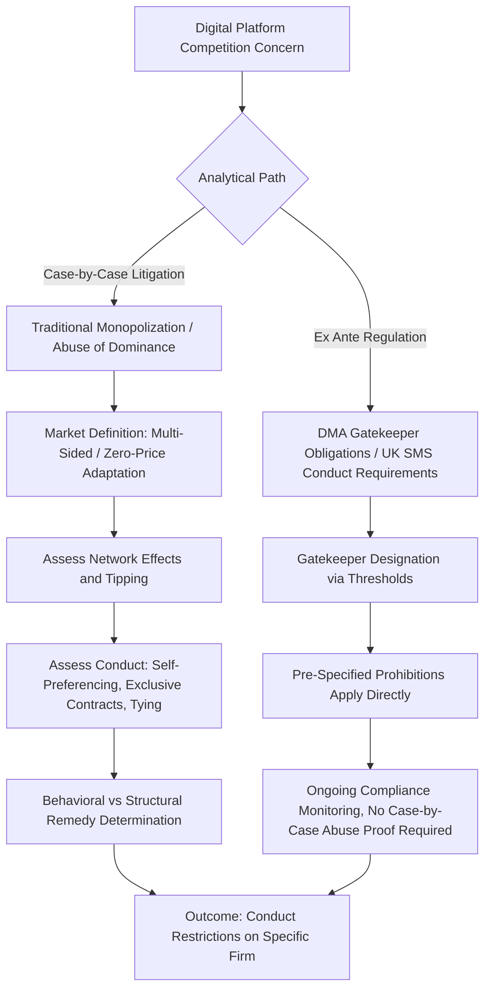

## Antitrust Analysis of Digital Platforms and Network Markets

### Overview

Digital platforms present distinctive challenges for antitrust analysis because they typically operate as multi-sided markets connecting distinct user groups (e.g., advertisers and consumers, app developers and device users, merchants and buyers), exhibit strong network effects that can entrench incumbents, frequently offer services at a zero monetary price, and generate vast proprietary datasets that can themselves constitute a competitive advantage. Traditional tools — market definition via SSNIP, market share, and price-based effects analysis — require significant adaptation, and enforcement has evolved along two parallel tracks: case-by-case application of existing monopolization/abuse-of-dominance law, and purpose-built ex ante regulatory regimes such as the EU's Digital Markets Act.

### Why Digital Platforms Are Analytically Distinct

**Key Points**

- **Multi-sided markets**: platforms serve two or more interdependent user groups simultaneously, and pricing/conduct on one side affects demand on the other (cross-group network effects) — a search engine's value to advertisers depends on the number of users, and vice versa.
- **Network effects**: a service becomes more valuable as more users join (direct network effects, e.g., social networks) or as more complementary products/users join an adjacent side (indirect network effects, e.g., app stores becoming more valuable to users as more developers build apps, and vice versa).
- **Zero-price markets**: many consumer-facing digital services charge no monetary price, monetizing instead through advertising or data, which complicates traditional SSNIP-based market definition (a 5% price increase on a $0 price is not meaningful) and profitability-based tests of market power.
- **Data as a competitive asset**: accumulated user data can create feedback loops (more users → more data → better product/targeting → more users), potentially entrenching incumbents independent of price or conventional quality competition.
- **Tipping and winner-take-most dynamics**: strong network effects can cause markets to "tip" toward a single dominant provider, after which switching costs and network lock-in make entry and multi-homing difficult even for otherwise superior rivals.

### Market Definition in Multi-Sided and Zero-Price Markets

**Key Points**

- The U.S. Supreme Court addressed multi-sided market definition directly in ***Ohio v. American Express Co.*** (2018), holding that for a **transaction platform** (where the platform facilitates a simultaneous transaction between the two sides, such as a credit card network matching cardholders and merchants), both sides of the market must generally be considered together as a single relevant market, since a price change on one side necessarily affects output/demand on the other in a way that cannot be assessed in isolation.
- This is distinguished from **non-transaction (or "matching") platforms** where the interdependence is real but the transaction itself is not simultaneous or platform-mediated in the same tight sense (e.g., an ad-supported media outlet and its advertisers versus its readers) — courts and agencies have generally treated these as more amenable to separate analysis of each side, though the correct doctrinal line remains debated in the literature. [Unverified] The precise scope and application of *Amex*'s single-market holding beyond credit card networks continues to be litigated and interpreted differently across lower courts.
- For zero-price services, agencies have adapted the hypothetical monopolist test using a **SSNDQ** (Small but Significant and Non-transitory Decrease in Quality) framework as an alternative to SSNIP, or have focused directly on non-price dimensions: would a hypothetical monopolist profitably degrade quality, increase data extraction, or increase advertising load without losing sufficient users?
- Attention (i.e., user time and engagement) is sometimes treated as the implicit "price" being competed for and is used as a variable for measuring competitive constraint even absent a monetary price.

### Diagram: Multi-Sided Platform Structure

<svg xmlns="http://www.w3.org/2000/svg" viewBox="0 0 700 340">
<title>Multi-Sided Platform Structure (svg_diagram)</title>
<rect x="0" y="0" width="700" height="340" fill="#ffffff" />
<text x="350" y="25" font-family="Arial" font-size="16" font-weight="bold" text-anchor="middle" fill="#1a1a1a">Multi-Sided Platform Structure (svg_diagram)</text>
<circle cx="350" cy="170" r="70" fill="#dbeafe" stroke="#2563eb" stroke-width="2" />
<text x="350" y="165" font-family="Arial" font-size="13" text-anchor="middle" fill="#1e3a8a">Platform</text>
<text x="350" y="183" font-family="Arial" font-size="11" text-anchor="middle" fill="#1e3a8a">(e.g. search, app store)</text>
<rect x="60" y="60" width="150" height="60" rx="6" fill="#dcfce7" stroke="#16a34a" stroke-width="1.5" />
<text x="135" y="85" font-family="Arial" font-size="12" text-anchor="middle" fill="#14532d">Side A: Consumers</text>
<text x="135" y="103" font-family="Arial" font-size="10" text-anchor="middle" fill="#14532d">Often zero price</text>
<rect x="490" y="60" width="150" height="60" rx="6" fill="#fef9c3" stroke="#ca8a04" stroke-width="1.5" />
<text x="565" y="85" font-family="Arial" font-size="12" text-anchor="middle" fill="#713f12">Side B: Advertisers/</text>
<text x="565" y="103" font-family="Arial" font-size="10" text-anchor="middle" fill="#713f12">Developers/Merchants</text>
<rect x="270" y="260" width="160" height="50" rx="6" fill="#fee2e2" stroke="#dc2626" stroke-width="1.5" />
<text x="350" y="290" font-family="Arial" font-size="11" text-anchor="middle" fill="#7f1d1d">Indirect Network Effects</text>
<line x1="200" y1="90" x2="290" y2="145" stroke="#333" stroke-width="1.5" marker-end="url(#arrow2)" />
<line x1="290" y1="195" x2="200" y2="250" stroke="#333" stroke-width="1.5" marker-end="url(#arrow2)" />
<line x1="500" y1="90" x2="410" y2="145" stroke="#333" stroke-width="1.5" marker-end="url(#arrow2)" />
<line x1="410" y1="195" x2="500" y2="250" stroke="#333" stroke-width="1.5" marker-end="url(#arrow2)" />
</svg>

### Network Effects and Market Power Durability

**Key Points**

- **Direct network effects**: value to a user increases directly with the number of other users on the same side (e.g., a messaging app).
- **Indirect (cross-side) network effects**: value to users on one side increases with the number of participants on the other side (e.g., ride-hailing riders benefit from more available drivers, and drivers benefit from more riders).
- **Tipping**: markets with strong network effects can tip decisively toward a single provider once it reaches critical mass, after which switching costs, data lock-in, and coordination problems among users (no individual user wants to switch alone if their contacts/counterparties stay on the incumbent) can make the resulting position extremely durable — a structural feature relevant to assessing whether current dominance reflects ongoing superior performance or entrenched first-mover advantage.
- **Multi-homing** (users maintaining accounts on multiple competing platforms simultaneously) can mitigate tipping and lock-in; its feasibility and actual prevalence in a given market is a key empirical question in assessing durability of market power.

### Self-Preferencing

**Key Points**

- Occurs when a vertically integrated platform that also competes in an adjacent market favors its own downstream products or services over third-party rivals that depend on the platform (e.g., ranking the platform's own products more prominently in search results, app store listings, or marketplace placements).
- EU enforcement has treated self-preferencing as an independent theory of abuse under Article 102 (*Google Shopping*, 2017, finding Google abused its dominance in general search by systematically favoring its own comparison-shopping service), and the **Digital Markets Act** now directly prohibits self-preferencing by designated gatekeepers as an ex ante rule rather than requiring case-by-case abuse proof.
- U.S. law has been more cautious about self-preferencing as an independent theory absent a clearer showing that the conduct excludes an equally efficient rival and lacks legitimate justification, reflecting the general U.S. skepticism toward second-guessing product design and integration decisions (see monopolization materials).

### Key U.S. Litigation: Search and Ad Tech

**Key Points**

- In *United States v. Google LLC* (District of Columbia, search case), the court found in 2024 that Google illegally maintained a monopoly in general search services, and in April 2026 the court issued a remedies ruling prohibiting Google from entering or maintaining exclusive contracts relating to the distribution of Google Search, Chrome, Google Assistant, and Gemini, with remedies also extended to reach generative AI technologies given DOJ's concern about the same tactics being repeated in that adjacent market. Both parties have since pursued competing appeals of that ruling. [U.S. Department of Justice](https://www.justice.gov/opa/pr/department-justice-wins-significant-remedies-against-google)
- In a separate case, *United States v. Google LLC* (Eastern District of Virginia, ad tech case), the court ruled in April 2025 that Google's publisher ad-serving tools unfairly excluded rivals, while Google's advertiser tools and its DoubleClick and AdMeld acquisitions were not found anticompetitive. In the remedies phase, Judge Brinkema in September 2026 rejected the DOJ's proposed structural remedies — including divestiture of the AdX ad exchange and open-sourcing of the DFP auction logic — instead ordering the parties to submit a jointly proposed final judgment built primarily around behavioral remedies, with Google having committed to measures such as making real-time bid data for open-web display ads sold through AdX available to rival ad servers. [Alphabet Inc. - Form 10-Q - FY2026 +2](https://www.sec.gov/Archives/edgar/data/0001652044/000165204426000071/goog-20260630.htm)
- These parallel cases illustrate the current U.S. judicial preference for **behavioral remedies over structural breakup** in digital platform monopolization cases, reflecting judicial caution about the workability and unintended consequences of divestiture in fast-evolving technical infrastructure, even where liability for exclusionary conduct has been established.

### The EU Digital Markets Act (DMA): Ex Ante Regulation

**Key Points**

- The DMA represents a structurally different regulatory approach from traditional Article 102 abuse-of-dominance enforcement: rather than requiring the Commission to prove abuse case-by-case after the fact, it imposes **direct, pre-specified obligations and prohibitions** on designated "gatekeeper" platforms meeting quantitative thresholds (user numbers, market capitalization/turnover, and entrenched position criteria).
- Core obligations for gatekeepers include prohibitions on self-preferencing, requirements to allow interoperability and sideloading (for mobile app ecosystems), restrictions on combining personal data across services without consent, and anti-circumvention provisions preventing gatekeepers from favoring their own services through technical design choices.
- The Commission has been actively enforcing the DMA against designated gatekeepers, with recent sanctioning proceedings targeting how AI tools are bundled with gatekeeper services and concerns about fairness in how those tools were trained, reflecting the ongoing question of whether the DMA's existing framework will be extended to cover generative AI or whether AI-specific rules will develop separately. [ProMarket](https://www.promarket.org/2026/01/14/the-trends-that-will-define-european-antitrust-in-2026/)
- [Unverified] The DMA's designation criteria, obligations, and case-specific enforcement outcomes are actively evolving; given the framework's relative novelty, current details should be verified against the European Commission's latest published decisions and guidance.

### UK Digital Markets Framework

**Key Points**

- The UK's Competition and Markets Authority (CMA) operates a comparable but distinct regime under the Digital Markets, Competition and Consumers Act, using a **Strategic Market Status (SMS)** designation analogous to the EU's gatekeeper concept, with a third SMS investigation expected in early 2026 as the regime continues to be built out. [Wilson Sonsini Goodrich & Rosati](https://www.wsgr.com/en/insights/2026-antitrust-year-in-preview-big-tech.html)
- Unlike the DMA's largely uniform obligations across gatekeepers, the UK framework contemplates more firm-specific "conduct requirements" tailored to the particular competition concerns identified for each designated firm.

### Algorithmic Pricing and Coordination Concerns

**Key Points**

- A rapidly developing enforcement area concerns whether pricing algorithms — especially shared third-party pricing software or algorithms trained on common data inputs — can facilitate coordination among competitors without a traditional explicit "agreement."
- U.S. Antitrust Division officials have publicly identified open analytical questions including what constitutes an actionable agreement when pricing is mediated by a model, where criminal intent lies when humans delegate pricing decisions to AI, and whether the per se rule applies to algorithmically generated pricing arrangements, indicating this remains unsettled doctrine rather than resolved law. [Arnold & Porter](https://www.arnoldporter.com/en/perspectives/publications/2026/07/antitrust-agency-insights-developments-at-the-us-antitrust-enforcement-agencies-second-quarter-2026)
- Agencies globally are also deploying algorithmic detection tools themselves — for example, the UK CMA's tool ingesting public procurement bid data to flag anomalous patterns such as bid rotation and cover bidding, and a comparable Spanish tool (BRAVA) for detecting bid rigging — illustrating that both the conduct concern and the enforcement toolkit in this space are becoming increasingly technology-driven. [Inference] Given the pace of both algorithmic pricing adoption and regulatory responses, specific doctrinal answers to these questions should be expected to develop further and should be checked against the most current agency guidance and case law. [Hogan Lovells](https://www.hoganlovells.com/en/publications/global-antitrust-enforcement-outlook-2026-the-trends-shaping-the-year-ahead)

### Diagram: Digital Platform Antitrust Analysis Pathways

### Killer Acquisitions and Nascent Competitor Theory

**Key Points**

- A significant concern in digital merger review is that dominant platforms may acquire small, early-stage rivals not for their current competitive significance (often minimal, evading traditional HHI-based screening) but to eliminate a nascent future threat before it matures — the so-called "killer acquisition" theory.
- This has prompted scrutiny of acquisitions falling below traditional HSR notification thresholds, and the EU has extended jurisdiction to smaller digital deals where data, innovation, or ecosystem effects are involved, even below traditional filing thresholds. [McDermott](https://www.mcdermottlaw.com/insights/global-antitrust-update-spring-2026-key-takeaways/)
- Assessing this theory empirically is difficult, since it requires distinguishing genuinely anticompetitive "kill" acquisitions from ordinary, procompetitive acqui-hires or complementary product integrations that also benefit consumers — [Inference] this remains one of the more empirically and doctrinally contested areas of digital merger policy, without settled consensus on reliable ex ante screening criteria.

### Data as a Barrier to Entry and Competitive Asset

**Key Points**

- Accumulated proprietary data (user behavior, transaction history, targeting signals) can function as a barrier to entry independent of conventional cost or capacity barriers, since new entrants lack the historical data needed to match incumbent product quality or ad-targeting efficiency, even if their underlying technology is comparable.
- Raises novel remedy questions distinct from traditional structural relief: whether required **data portability** or **data-sharing/interoperability mandates** (as imposed under the DMA and considered in various merger remedy contexts) can meaningfully restore competitive balance without imposing excessive compliance burden or creating privacy/security risks.

### Comparative Enforcement Philosophy Summary

**Key Points**

- U.S. approach (current trajectory): litigation-driven, cautious about structural remedies even after establishing liability, relatively more permissive toward technology M&A in the current environment reflecting a more permissive posture toward technology mergers alongside a more mature and assertive phase of digital enforcement in Europe, and still working through foundational doctrinal questions (e.g., self-preferencing, algorithmic coordination) via case law rather than comprehensive ex ante legislation. [Goodwin](https://www.goodwinlaw.com/en/insights/publications/2026/07/insights-technology-antc-antitrust-competition-technology-1h-2026)
- EU/UK approach: increasingly reliant on purpose-built ex ante regulatory frameworks (DMA, UK SMS regime) operating alongside traditional Article 102 enforcement, with a generally more interventionist posture reflecting the "special responsibility" doctrine's extension into digital markets.
- Both jurisdictions are converging on treating **algorithmic conduct, AI bundling, and labor-market effects in talent-intensive tech sectors** as emerging enforcement priorities alongside the more established platform-dominance concerns.

**Related Topics**

- Multi-sided market theory and the *Ohio v. American Express* framework in depth
- Self-preferencing doctrine: comparative U.S./EU treatment
- EU Digital Markets Act: gatekeeper designation, obligations, and enforcement track record
- Killer acquisitions and nascent competitor merger theory
- Algorithmic collusion and the boundaries of Section 1/Article 101 "agreement"
- Data portability and interoperability as antitrust remedies
- Structural vs. behavioral remedies in Big Tech monopolization cases
- Network effects and tipping: economic modeling of platform market dynamics