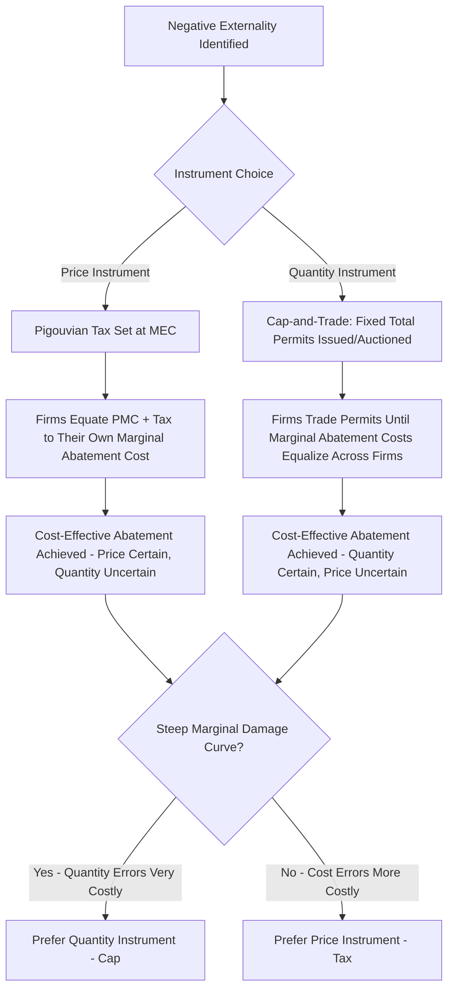

## Externalities and the Economic Case for Environmental Regulation

### Overview

Externalities are the foundational market failure justifying environmental regulation in law and economics: costs or benefits of an economic activity that fall on third parties who are not party to the transaction generating them, and that are therefore not reflected in market prices. When production or consumption generates external costs (negative externalities) — pollution being the paradigmatic example — private markets, left unregulated, systematically overproduce the polluting activity relative to the socially efficient level. This section develops the economic theory of externalities and traces how it translates into the principal legal and policy tools of environmental regulation.

### The Basic Economics of Negative Externalities

**Key Points**

- A negative externality exists when a firm's private marginal cost ($PMC$) of production is less than the social marginal cost ($SMC$), because the firm does not bear the external cost (e.g., pollution damage) it imposes on others.

$$SMC = PMC + MEC$$

where $MEC$ is the marginal external cost.

- Absent correction, a profit-maximizing firm produces where $PMC = MB$ (marginal benefit/demand), yielding output $Q_{market}$ — but the socially efficient output $Q^*$ occurs where $SMC = MB$. Because $SMC > PMC$, $Q_{market} > Q^*$: the market **overproduces** relative to the social optimum.
- The **deadweight loss** from this overproduction equals the area between the SMC and demand curves for output between $Q^*$ and $Q_{market}$ — representing units where the true social cost of production exceeds the value consumers place on them.

### Diagram: Negative Externality and Deadweight Loss

<svg xmlns="http://www.w3.org/2000/svg" viewBox="0 0 700 420">
<title>Negative Externality and Deadweight Loss (svg_diagram)</title>
<rect x="0" y="0" width="700" height="420" fill="#ffffff" />
<text x="350" y="25" font-family="Arial" font-size="16" font-weight="bold" text-anchor="middle" fill="#1a1a1a">Negative Externality and Deadweight Loss (svg_diagram)</text>
<line x1="80" y1="370" x2="650" y2="370" stroke="#333" stroke-width="2" />
<line x1="80" y1="370" x2="80" y2="50" stroke="#333" stroke-width="2" />
<text x="370" y="400" font-family="Arial" font-size="13" text-anchor="middle" fill="#333">Quantity</text>
<text x="30" y="210" font-family="Arial" font-size="13" text-anchor="middle" fill="#333" transform="rotate(-90 30 210)">Price / Cost</text>

<line x1="100" y1="80" x2="620" y2="340" stroke="#2563eb" stroke-width="2.5" />
<text x="600" y="335" font-family="Arial" font-size="12" fill="#2563eb">Demand (MB)</text>

<line x1="100" y1="340" x2="620" y2="130" stroke="#16a34a" stroke-width="2.5" />
<text x="560" y="155" font-family="Arial" font-size="12" fill="#16a34a">PMC (Private Supply)</text>

<line x1="100" y1="370" x2="620" y2="90" stroke="#dc2626" stroke-width="2.5" />
<text x="560" y="105" font-family="Arial" font-size="12" fill="#dc2626">SMC = PMC + MEC</text>

<line x1="410" y1="370" x2="410" y2="207" stroke="#9ca3af" stroke-width="1" stroke-dasharray="4,3" />
<circle cx="410" cy="207" r="4" fill="#1a1a1a" />
<text x="410" y="390" font-family="Arial" font-size="11" text-anchor="middle" fill="#1a1a1a">Q_market</text>

<line x1="300" y1="370" x2="300" y2="218" stroke="#9ca3af" stroke-width="1" stroke-dasharray="4,3" />
<circle cx="300" cy="218" r="4" fill="#1a1a1a" />
<text x="300" y="390" font-family="Arial" font-size="11" text-anchor="middle" fill="#1a1a1a">Q*</text>

<polygon points="300,218 410,207 410,255" fill="#fca5a5" opacity="0.6" />
<text x="345" y="245" font-family="Arial" font-size="10" fill="#7f1d1d">DWL</text>
</svg>

### Coase Theorem and Its Limits

**Key Points**

- The **Coase Theorem** (Coase, 1960) states that if property rights are clearly defined and transaction costs are zero, private parties will bargain to the efficient outcome regardless of the initial assignment of the property right (e.g., whether the polluter has a right to pollute or the affected party has a right to clean air) — the assignment only affects the distribution of wealth, not efficiency.

$$\text{If transaction costs} = 0 \text{ and property rights are well-defined} \Rightarrow \text{efficient allocation regardless of initial entitlement}$$

- In practice, environmental externalities typically involve **high transaction costs**: diffuse, numerous affected parties (e.g., an entire airshed or watershed), difficulty identifying and organizing all affected parties, free-rider problems in collective bargaining, and information asymmetries about actual damage levels.
- Because real-world transaction costs are rarely zero for environmental harms, the Coase Theorem functions primarily as a **baseline/benchmark** clarifying *why* government intervention (regulation, taxation, or the creation of tradable rights) is needed — the case for regulation rests on identifying which situations transaction costs make private bargaining infeasible.

### Pigouvian Taxation

**Key Points**

- A **Pigouvian tax** (Pigou, 1920) is a tax set equal to the marginal external cost at the efficient output level, internalizing the externality by raising the polluter's private marginal cost to equal the social marginal cost.

$$t^* = MEC(Q^*)$$

- With the tax in place, the firm's effective marginal cost becomes $PMC + t^*= SMC$, so the firm's private profit-maximizing choice coincides with the socially efficient output $Q^*$.
- **Advantages**: cost-effective (firms with lower abatement costs reduce pollution more, since it is cheaper for them than paying the tax, achieving a given aggregate reduction at minimum total cost); raises government revenue that can fund other priorities or offset other distortionary taxes (the "double dividend" hypothesis, though its empirical validity is debated); provides a continuous incentive for further abatement innovation since the tax applies to every unit of pollution, not just units above a threshold.
- **Practical challenges**: requires the regulator to know (or estimate) the correct marginal external cost, which is often highly uncertain (e.g., valuing long-term health or ecosystem damage); political economy resistance to new taxes; potential for the tax to be captured or set at an inefficiently low level.

### Cap-and-Trade and Tradable Permits

**Key Points**

- An alternative to Pigouvian taxation, developed from the underlying logic of Coasean bargaining: government sets a fixed **cap** on total allowable pollution (aggregate quantity), issues (or auctions) tradable permits equal to that cap, and allows firms to trade permits freely.
- Firms with low abatement costs sell excess permits to firms with high abatement costs, achieving the same **cost-effective allocation of abatement** as an optimally set Pigouvian tax — this is the practical embodiment of Coasean bargaining once government has created the missing, clearly defined, tradable property right (the permit).
- **Price vs. quantity instrument distinction** (Weitzman, 1974): a tax fixes the *price* of pollution (marginal abatement cost) but leaves the *quantity* of pollution uncertain (depends on how firms respond); a cap fixes the *quantity* but leaves the *price* (permit price) uncertain, which can be volatile if abatement costs are misjudged or demand shocks occur.
- Choice between the two instruments depends partly on the **relative slopes of the marginal benefit (damage) and marginal cost (abatement) curves**: when marginal damage from pollution rises steeply with quantity (small quantity errors are very costly), quantity instruments (caps) are generally preferred; when marginal abatement costs are steep and uncertain relative to marginal damage (price certainty matters more), price instruments (taxes) are generally preferred.
- Real-world examples: the U.S. Acid Rain Program (SO2 allowance trading under the 1990 Clean Air Act Amendments), the EU Emissions Trading System (EU ETS) for carbon dioxide, and California's cap-and-trade program.

### Diagram: Pigouvian Tax vs. Cap-and-Trade Mechanism

### Command-and-Control Regulation

**Key Points**

- Traditional regulatory approach: government directly mandates specific technology (technology-based standards), specific emission limits per facility (performance standards), or specific practices, without relying on price or quantity-based market mechanisms.
- **Advantages**: administrative simplicity and certainty for regulators; can be appropriate where monitoring emissions directly is difficult but monitoring technology/practice compliance is easier; may be preferred where uniform minimum standards are considered a baseline regardless of cost (e.g., certain public health protections).
- **Disadvantages relative to market-based instruments**: not generally cost-effective, since it typically requires uniform reductions or uniform technology regardless of firms' widely varying marginal abatement costs — firms with cheap abatement options are not incentivized to over-comply, and firms with expensive options are forced to meet the same standard, raising total compliance cost for a given level of aggregate pollution reduction relative to a tax or cap-and-trade approach achieving the same aggregate reduction.
- Much of the U.S. Clean Air Act and Clean Water Act framework historically relied heavily on technology-based and performance standards (e.g., "Best Available Control Technology," "Maximum Achievable Control Technology"), with market-based instruments introduced later and in specific programs (e.g., SO2 trading).

### Comparing Instrument Choice: A Summary

**Key Points**

- **Pigouvian tax**: cost-effective, revenue-generating, price-certain, quantity-uncertain; requires accurate estimate of marginal damage.
- **Cap-and-trade**: cost-effective, quantity-certain, price-uncertain (unless price collars/floors are added); requires initial allocation decision (auction vs. free allocation, which raises distributional/political economy questions) and robust monitoring/enforcement infrastructure to prevent permit fraud.
- **Command-and-control**: administratively simple and predictable per-firm compliance, but generally not cost-effective across heterogeneous firms; can still be justified where transaction costs of a market-based system are prohibitive, where uniform standards serve non-efficiency goals (equity, precaution), or where the pollutant/damage pathway is poorly suited to tradable unit definition (e.g., highly localized "hot spot" pollutants where aggregate trading could mask concentrated local harm).
- **Hybrid instruments**: price floors/ceilings ("collars") within cap-and-trade systems combine features of both, bounding price volatility while retaining a quantity target.

### Valuing Externalities: The Social Cost of Carbon and Related Concepts

**Key Points**

- Implementing either a Pigouvian tax or an efficient cap requires estimating the monetized marginal external damage — for climate policy, this is operationalized as the **Social Cost of Carbon (SCC)**, an estimate of the present-value economic damage caused by one additional ton of CO2 emissions.
- SCC estimation requires: (1) climate modeling linking emissions to temperature and physical impacts, (2) economic damage functions translating physical impacts (agriculture, health, sea-level rise, extreme weather) into monetized terms, and (3) a **discount rate** to convert future damages into present value — the choice of discount rate is highly consequential and contested, since environmental damages are often realized decades to centuries in the future, and small changes in the discount rate produce large changes in the resulting SCC estimate.
- [Unverified] Specific official SCC values used in U.S. federal rulemaking have varied substantially across presidential administrations and ongoing litigation regarding the methodology used to calculate them; current applicable values and methodology should be verified against the latest federal guidance or agency rulemaking record.
- Similar valuation challenges apply to other environmental externalities (e.g., value of a statistical life used in health-based environmental cost-benefit analysis, non-market valuation of ecosystem services via contingent valuation or hedonic pricing methods).

### Positive Externalities and Environmental Policy

**Key Points**

- Environmental economics also addresses **positive externalities** — activities generating external benefits not captured by the actor, leading to underprovision relative to the social optimum (mirror image of the negative externality case, where $SMB > PMB$).
- Examples: reforestation and carbon sequestration, biodiversity conservation, open-space preservation, and basic research into clean energy technology (which also generates knowledge spillovers beyond the innovating firm).
- Standard policy response is a **Pigouvian subsidy** set equal to the marginal external benefit, or direct public provision/funding, since underprovided public-good-like environmental benefits often cannot be efficiently supplied by private markets even with a subsidy if free-riding and non-excludability are severe (classic **public goods problem** — non-rivalrous and non-excludable, as with clean air itself, or biodiversity value).

### Public Goods, Common-Pool Resources, and the Tragedy of the Commons

**Key Points**

- Many environmental resources exhibit characteristics beyond simple externalities: clean air and climate stability function as **public goods** (non-excludable and non-rivalrous), while fisheries, groundwater aquifers, and grazing lands function as **common-pool resources** (non-excludable but rivalrous — one user's extraction reduces availability for others).
- The **Tragedy of the Commons** (Hardin, 1968, building on earlier economic analysis of common property) describes how open-access common-pool resources are systematically overexploited because each user captures the full private benefit of extraction but bears only a fraction of the resulting depletion cost, which is spread across all users — structurally identical to a negative externality problem but arising from a shared, rivalrous resource stock rather than a simple bilateral (or diffuse third-party) external cost.
- Policy responses include: property rights allocation (individual transferable quotas in fisheries), regulation of access/harvest limits, and Ostrom's (1990) empirical work on community-based, self-governed institutions that can sustainably manage common-pool resources without either full privatization or centralized government control under certain identified institutional conditions.

### Legal Doctrines Connecting to Externality Theory

**Key Points**

- **Nuisance law** (the common-law antecedent to statutory environmental regulation) directly addresses externalities at a case-by-case, ex post level — courts weigh the harm to the plaintiff against the utility of the defendant's conduct, and remedies (injunction vs. damages) map closely onto the Coasean property-rule/liability-rule distinction developed by Calabresi and Melamed (1972).
- **Property rules vs. liability rules**: a property rule (injunction) requires the polluter to negotiate with and obtain consent from the affected party before continuing the activity, while a liability rule (damages) allows the activity to continue upon payment of court-determined compensation — the choice affects which party bears the transaction-cost burden of achieving the efficient outcome, connecting directly back to Coasean analysis of when bargaining is likely to succeed.
- Statutory environmental regulation (Clean Air Act, Clean Water Act, and analogous frameworks internationally) can be understood as government's institutional response precisely because case-by-case nuisance litigation is a poor mechanism for diffuse, technically complex, cumulative externalities affecting large numbers of unidentifiable victims — the transaction costs and information demands of individual lawsuits are prohibitive at the scale of ambient air or water pollution.

### Practical Example: Comparing Instruments for a Concrete Pollutant

**Example**

A regulator must reduce sulfur dioxide (SO2) emissions from a set of power plants with heterogeneous abatement costs (some plants can cheaply switch to lower-sulfur coal or install scrubbers at low marginal cost; others face much higher retrofit costs).

- **Command-and-control** (e.g., mandating scrubbers at every plant): achieves the target reduction but forces high-cost plants to spend far more per ton abated than necessary, and may force some low-cost plants to over-comply if standards are set at a uniform level rather than optimally targeted to each plant's true marginal cost — raising total compliance cost economy-wide.
- **Pigouvian tax on SO2 emissions**: each plant abates up to the point where its own marginal abatement cost equals the tax rate; low-cost plants abate heavily, high-cost plants abate less and pay more tax — achieving the same aggregate reduction target (if the tax is well-calibrated) at lower total cost, though the exact aggregate reduction achieved is not perfectly guaranteed in advance.
- **Cap-and-trade** (the actual U.S. Acid Rain Program approach): sets the aggregate cap directly (quantity certainty), and lets permit trading achieve the same cost-effective allocation as the tax, while avoiding the need to correctly guess the tax rate that would produce the desired aggregate reduction — this program is widely cited as having achieved substantial emissions reductions at a fraction of the cost initially projected under a command-and-control approach, illustrating the cost-effectiveness gains available from market-based instruments; [Inference] specific cost-savings figures from various assessments of the program vary depending on the counterfactual and methodology used and should be checked against the specific study being cited if precision is required.

**Next Steps**

- Coase Theorem and the property-rule/liability-rule framework (Calabresi-Melamed) in depth
- Cap-and-trade program design: allocation methods, banking/borrowing, price collars
- Social Cost of Carbon methodology and discount rate controversies
- Common-pool resource management and Ostrom's institutional design principles
- Environmental cost-benefit analysis and non-market valuation techniques
- Nuisance law and the common-law foundations of environmental liability
- Environmental federalism: allocation of regulatory authority across government levels
- Comparative international carbon pricing mechanisms (EU ETS, carbon border adjustments)