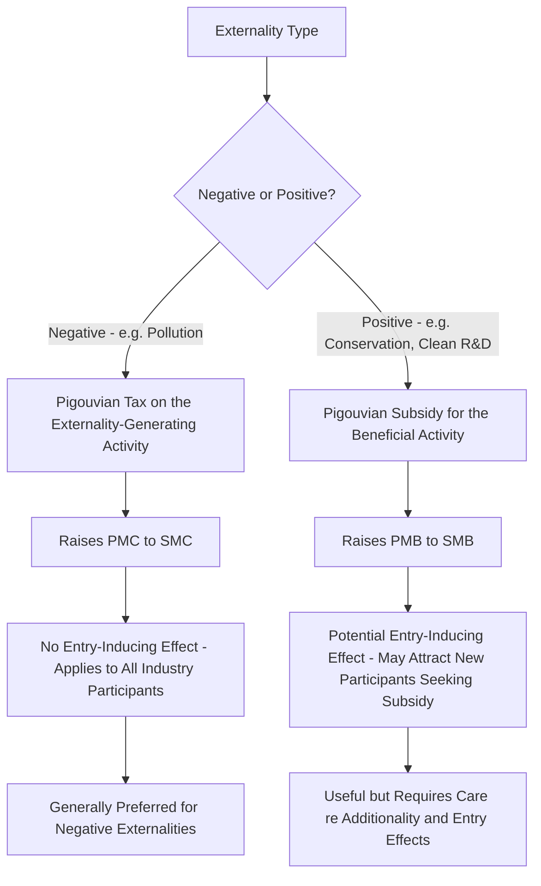

## Pigouvian Taxes and Subsidies

### Overview

Pigouvian taxes and subsidies, named after economist Arthur Pigou, are the foundational price-based instrument for correcting externalities: a tax on activities generating negative external costs, or a subsidy for activities generating positive external benefits, set equal to the marginal external effect at the efficient level of output. By adjusting the private price signal faced by decision-makers, Pigouvian instruments aim to make private incentives align with social costs and benefits, restoring efficient resource allocation without requiring government to dictate specific technologies or quantities directly.

### Theoretical Foundation

**Key Points**

- The core insight: under a negative externality, private marginal cost ($PMC$) diverges from social marginal cost ($SMC = PMC + MEC$), causing markets to overproduce relative to the efficient quantity $Q^*$ (where $SMC$ intersects marginal benefit/demand).
- A **Pigouvian tax** $t^*$ set equal to the marginal external cost evaluated at $Q^*$ closes this gap:

$$t^* = MEC(Q^*)$$

- With the tax imposed, the firm's effective marginal cost becomes $PMC + t^* = SMC$, so the firm's privately optimal output choice coincides with the socially efficient quantity — the tax "internalizes the externality."
- Symmetrically, for a positive externality where $SMB = PMB + MEB > PMB$, a **Pigouvian subsidy** $s^*$ equal to the marginal external benefit at the efficient quantity raises the private incentive to produce/consume up to the socially optimal level:

$$s^* = MEB(Q^*)$$

### Diagram: Pigouvian Tax Correcting a Negative Externality

<svg xmlns="http://www.w3.org/2000/svg" viewBox="0 0 700 400">
<title>Pigouvian Tax Correcting a Negative Externality (svg_diagram)</title>
<rect x="0" y="0" width="700" height="400" fill="#ffffff" />
<text x="350" y="25" font-family="Arial" font-size="15" font-weight="bold" text-anchor="middle" fill="#1a1a1a">Pigouvian Tax Correcting a Negative Externality (svg_diagram)</text>
<line x1="80" y1="350" x2="650" y2="350" stroke="#333" stroke-width="2" />
<line x1="80" y1="350" x2="80" y2="50" stroke="#333" stroke-width="2" />
<text x="370" y="378" font-family="Arial" font-size="12" text-anchor="middle" fill="#333">Quantity</text>
<text x="30" y="200" font-family="Arial" font-size="12" text-anchor="middle" fill="#333" transform="rotate(-90 30 200)">Price / Cost</text>
<line x1="100" y1="80" x2="600" y2="320" stroke="#2563eb" stroke-width="2.5" />
<text x="580" y="315" font-family="Arial" font-size="11" fill="#2563eb">Demand (MB)</text>
<line x1="100" y1="320" x2="600" y2="120" stroke="#16a34a" stroke-width="2.5" />
<text x="540" y="140" font-family="Arial" font-size="11" fill="#16a34a">PMC</text>
<line x1="100" y1="350" x2="600" y2="80" stroke="#dc2626" stroke-width="2.5" />
<text x="540" y="95" font-family="Arial" font-size="11" fill="#dc2626">SMC = PMC + t*</text>
<line x1="280" y1="350" x2="280" y2="203" stroke="#9ca3af" stroke-width="1" stroke-dasharray="4,3" />
<circle cx="280" cy="203" r="4" fill="#1a1a1a" />
<text x="280" y="370" font-family="Arial" font-size="10" text-anchor="middle" fill="#1a1a1a">Q* (efficient)</text>

<line x1="280" y1="203" x2="280" y2="240" stroke="#7c3aed" stroke-width="3" />
<text x="330" y="222" font-family="Arial" font-size="10" fill="#7c3aed">tax wedge = t*</text>
</svg>

### Deriving the Optimal Tax Rate

**Key Points**

- The theoretically correct Pigouvian tax rate requires knowledge of the **marginal damage function** — how external cost per additional unit of the activity changes with the level of the activity — evaluated specifically at the efficient quantity, not at the current (inefficient) market quantity.
- This is a demanding informational requirement: regulators must estimate the monetized value of damages (health effects, ecosystem harm, climate impacts) as a function of the polluting activity's scale, which typically requires interdisciplinary work combining natural science (dose-response relationships) with economic valuation techniques.
- In practice, regulators often instead target a specific desired aggregate reduction in the externality-generating activity and back out an approximate corresponding tax rate, blending Pigouvian logic with the practical target-setting more characteristic of cap-and-trade design.

### Advantages of Pigouvian Taxes

**Key Points**

- **Cost-effectiveness (static efficiency)**: because the tax applies uniformly per unit of the externality-generating activity, firms with lower abatement costs will find it cheaper to reduce their activity than to pay the tax, while firms with higher abatement costs will find it cheaper to pay the tax and continue — this decentralized response achieves any given aggregate reduction in the externality at the lowest possible total cost across the economy, without the regulator needing to know each firm's individual abatement cost curve.
- **Dynamic efficiency (innovation incentives)**: unlike a fixed technology standard or a threshold-based performance standard, a Pigouvian tax applies to every unit of the externality, giving firms a continuous incentive to invest in abatement technology even below any regulatory compliance threshold, since further reductions continue to save tax payments.
- **Revenue generation**: tax revenue can fund public priorities, be returned to citizens as a dividend, or be used to reduce other distortionary taxes (labor or capital taxes) — the potential efficiency gain from this second channel is sometimes called the **"double dividend"** (environmental improvement plus reduced deadweight loss from other taxes), though the empirical magnitude and even existence of a genuine double dividend beyond simple revenue recycling is debated in the public finance literature.
- **Administrative simplicity relative to command-and-control**: once the tax rate is set, no case-by-case technology approval or facility-specific negotiation is required.

### Disadvantages and Practical Challenges

**Key Points**

- **Information requirements**: setting the "correct" tax rate requires accurate knowledge of marginal external damage, which is frequently highly uncertain, contested, or politically sensitive (e.g., valuing statistical lives, long-term climate damages, or ecosystem services).
- **Quantity uncertainty**: because a tax fixes the price of the externality-generating activity but not the resulting quantity, the actual aggregate reduction achieved depends on how firms respond, which may be difficult to predict precisely, especially for elasticities that are themselves uncertain — a key contrast with quantity-based instruments (cap-and-trade).
- **Distributional and political economy concerns**: Pigouvian taxes can be regressive if the taxed activity or good represents a larger share of spending for lower-income households (e.g., energy taxes), raising equity objections that are often addressed through revenue recycling (rebates, dividends) rather than by abandoning the tax instrument itself.
- **Political feasibility**: new taxes are frequently more politically difficult to enact than equivalent-effect regulatory standards, even when economically preferable, due to visibility of the tax burden and organized opposition from affected industries.
- **International competitiveness and leakage concerns**: a unilaterally imposed Pigouvian tax (e.g., a national carbon tax) can shift production to jurisdictions without equivalent pricing ("carbon leakage"), potentially undermining the environmental goal while imposing domestic competitiveness costs — addressed through mechanisms like border carbon adjustments.

### Pigouvian Subsidies for Positive Externalities

**Key Points**

- Where an activity generates positive externalities (e.g., reforestation, renewable energy R&D, habitat conservation, vaccination in the parallel public-health context), the underlying market failure is **underprovision**: private actors capture only $PMB$, ignoring the additional social value $MEB$ they generate for others, so they produce less than the socially optimal quantity.
- A subsidy set equal to $MEB(Q^*)$ raises the effective private marginal benefit to equal $SMB$, inducing the efficient level of the activity.
- **Practical examples**: renewable energy production tax credits and investment tax credits, subsidies for reforestation and afforestation, agricultural conservation easement payments, R&D tax credits for clean technology innovation (addressing the compounded externality of both environmental benefit and knowledge spillovers).
- **Challenges specific to subsidies**: government must fund the subsidy (raising its own distortionary tax-revenue cost elsewhere, sometimes called the "shadow cost of public funds"); subsidies can be captured by industries seeking rents beyond the efficient correction; may unintentionally subsidize activity that would have occurred anyway (imperfect "additionality"), wasting public funds without generating the intended incremental social benefit.

### Pigouvian Taxes vs. Subsidies: Symmetry and Asymmetry

**Key Points**

- In idealized theory, a tax on the negative-externality-generating activity and a subsidy for its opposite (e.g., a tax on emissions vs. a subsidy for abatement) can be designed to produce equivalent incentives at the margin for an individual firm's abatement decision.
- However, they are **not equivalent in general equilibrium or in the long run**: a subsidy for abatement (or for staying out of a polluting industry) can attract new entrants into the industry overall (since it makes participating, and then abating, profitable), potentially increasing total industry output and, in some cases, total pollution — a tax on the externality itself does not have this entry-inducing effect, since it raises costs for all industry participants rather than creating a payment conditional on participation. This is sometimes called the **entry/exit asymmetry** between taxes and subsidies as corrective instruments.
- This asymmetry is a standard reason economists frequently prefer taxing the "bad" (pollution) directly over subsidizing the "good" (abatement or clean alternatives) when addressing negative externalities, even though the two can appear symmetric in a narrow, single-firm marginal analysis.

### Diagram: Tax and Subsidy Instrument Comparison

### Real-World Implementations

**Key Points**

- **Carbon taxes**: implemented in various forms in jurisdictions including Sweden, British Columbia, and other national/subnational programs, setting a direct per-ton price on carbon dioxide emissions.
- **Congestion pricing**: a Pigouvian-style charge on road use during peak periods, correcting the externality one driver's presence imposes on others' travel time (e.g., London's congestion charge, New York City's central business district tolling).
- **Extended producer responsibility fees and disposal taxes**: e.g., taxes on single-use plastics, tire disposal fees, and electronic waste fees, internalizing end-of-life disposal externalities into the upstream product price.
- **Renewable energy subsidies**: production tax credits and investment tax credits for wind, solar, and other renewable generation, functioning as Pigouvian subsidies for the positive externality of reduced emissions relative to conventional generation.
- **Agricultural conservation payments**: payments to farmers for practices generating positive externalities such as wetland preservation, reduced runoff, or carbon sequestration in soil.

### Practical Example: Setting a Carbon Tax

**Example**

Suppose a jurisdiction's estimate of the Social Cost of Carbon (the present-value marginal damage from one additional ton of CO2 emissions) is a specific dollar figure per ton, derived from integrated assessment modeling of climate damages discounted to present value.

- **Efficient tax design**: set the carbon tax rate equal to this estimated marginal damage figure, applied uniformly per ton of CO2 emitted across all covered sources, regardless of the source's specific abatement cost — allowing low-abatement-cost sources (e.g., easy fuel-switching opportunities) to reduce emissions substantially while high-abatement-cost sources pay the tax and reduce less, achieving cost-effective aggregate abatement.
- **Uncertainty in practice**: because the Social Cost of Carbon estimate itself depends heavily on the discount rate and damage function assumptions used, and these are genuinely contested among economists and across administrations, the "correct" tax rate is subject to significant estimation uncertainty — a practical reason some jurisdictions instead choose a quantity-based cap-and-trade approach (accepting price uncertainty) or a hybrid approach with a price floor/ceiling.
- **Revenue use**: the jurisdiction might return carbon tax revenue as a per-capita dividend to households (addressing distributional/regressivity concerns while preserving the marginal price signal that drives behavioral change), a design choice separate from the core Pigouvian correction itself but important for political feasibility and equity.

### Pigouvian Instruments in the Broader Policy Toolkit

**Key Points**

- Pigouvian taxes/subsidies are one of several tools economists compare for correcting externalities, alongside cap-and-trade (quantity-based) and command-and-control regulation (technology/performance standards) — see the related market definition and instrument-choice discussion in the externalities overview.
- The core price-vs-quantity tradeoff (Weitzman, 1974) applies directly: a Pigouvian tax is preferred on efficiency grounds when marginal abatement costs are more uncertain relative to marginal damages (price certainty matters more), while a cap is preferred when marginal damages rise steeply and quantity certainty is paramount.
- Hybrid designs (e.g., a cap-and-trade system with a price floor and/or ceiling, sometimes called a "price collar") attempt to capture benefits of both instrument types by bounding price volatility while retaining an aggregate quantity target.

**Next Steps**

- Social Cost of Carbon estimation methodology and discount rate debates
- Cap-and-trade design as an alternative/complementary quantity-based instrument
- Double dividend hypothesis and revenue recycling in environmental taxation
- Border carbon adjustments and international competitiveness concerns
- Command-and-control regulation and instrument choice comparison
- Congestion pricing as an applied Pigouvian mechanism in transportation economics
- Distributional and regressivity effects of environmental taxation
- Political economy of environmental tax adoption and industry capture