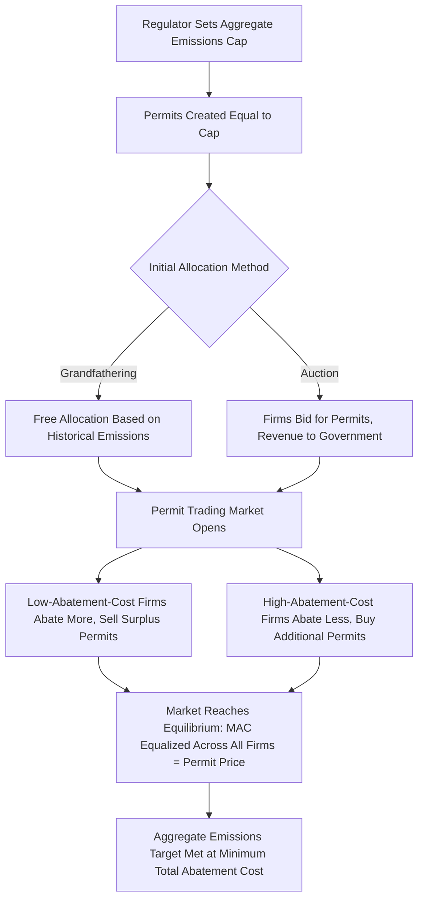

## Cap-and-Trade Systems and Tradable Permits

### Overview

Cap-and-trade systems (also called tradable permit systems or emissions trading systems) are a quantity-based market mechanism for correcting externalities: government sets an aggregate limit ("cap") on total pollution or resource extraction, divides that cap into tradable allowances or permits, and allows regulated entities to buy and sell permits freely. This creates a market price for the right to pollute, decentralizing the abatement decision to firms while government retains direct control over the aggregate environmental outcome — the practical, government-created embodiment of Coasean bargaining in situations where transaction costs would otherwise prevent private parties from achieving efficient allocation on their own.

### Theoretical Foundation

**Key Points**

- The system works by creating a well-defined, tradable property right (the permit) where none previously existed, directly operationalizing the Coase Theorem's insight that clearly defined and tradable property rights allow parties to bargain to an efficient allocation regardless of the initial distribution of those rights.
- Once permits are allocated (whether via free allocation or auction), firms with **low marginal abatement costs** will find it profitable to reduce emissions below their allocation and sell surplus permits, while firms with **high marginal abatement costs** will find it cheaper to buy additional permits than to abate — trading continues until marginal abatement costs are equalized across all firms.
- This equalization of marginal abatement costs across firms is precisely the condition for **cost-effectiveness**: for any given aggregate emissions target, the total cost of achieving it is minimized when no further gains from trade between firms remain, i.e., when all firms face the same marginal abatement cost (equal to the market permit price).

$$MAC_1 = MAC_2 = \dots = MAC_n = P_{permit}$$

where $MAC_i$ is firm $i$'s marginal abatement cost and $P_{permit}$ is the equilibrium market price of a permit.

### The Independence Property

**Key Points**

- A foundational theoretical result (sometimes attributed to Montgomery, 1972): the **cost-effective final allocation of abatement effort across firms is independent of the initial allocation of permits** — whether permits are distributed for free based on historical emissions ("grandfathering"), auctioned, or allocated by some other rule, trading will drive the system to the same cost-effective equilibrium abatement pattern, because firms will always trade toward equalized marginal abatement costs regardless of their starting endowment.
- The initial allocation method does, however, have significant **distributional consequences**: grandfathering effectively gives away valuable permits to existing emitters (windfall gains, particularly salient in the earliest phases of the EU ETS), while auctioning captures that value as government revenue, which can then be used for other purposes (rebates, deficit reduction, funding complementary programs) — this is a pure distributional/political economy choice, separate from the efficiency of the resulting abatement pattern.
- This independence result assumes **negligible transaction costs in permit trading**; in practice, transaction costs, market power in the permit market, and imperfect information can cause the actual outcome to deviate from the theoretical cost-effective benchmark, particularly in thin or illiquid permit markets.

### Diagram: Cap-and-Trade Mechanism

### Price vs. Quantity Instrument Choice (Weitzman Analysis)

**Key Points**

- Cap-and-trade fixes the **quantity** of the externality-generating activity with certainty (the cap), but leaves the resulting **price** (permit market price) uncertain, since it depends on the aggregate marginal abatement cost curve, which regulators may not know precisely in advance.
- This is the mirror image of a Pigouvian tax, which fixes price but leaves quantity uncertain — see the Weitzman (1974) framework in the related Pigouvian tax content.
- **When cap-and-trade (quantity instrument) is preferred**: when the marginal damage function is steep relative to the marginal abatement cost function — i.e., small errors in the total quantity of pollution translate into large changes in damage, making quantity certainty especially valuable (e.g., pollutants with threshold effects or catastrophic risk at high cumulative concentrations).
- **When a tax (price instrument) may be preferred instead**: when marginal abatement costs are steep and highly uncertain relative to a relatively flat marginal damage function — price certainty (bounding compliance cost) becomes more valuable than precise quantity control (e.g., where the pollutant's damage function is smooth and cumulative rather than threshold-driven, as is often argued for greenhouse gases at current concentration levels, though this remains a genuinely debated point in the literature).

### Key Design Elements of Cap-and-Trade Systems

#### Cap Setting and Cap Tightening

**Key Points**

- The cap is typically set to decline over time according to a pre-announced schedule, providing firms with predictable long-run price signals for investment planning while progressively reducing aggregate emissions toward a policy target.
- Cap-setting requires the same fundamental information challenge as Pigouvian tax-rate setting — ideally reflecting the socially efficient aggregate pollution level, though caps are frequently set based on political targets (e.g., percentage reduction from a baseline year) rather than derived directly from marginal damage/marginal abatement cost equalization.

#### Allocation Methods

**Key Points**

- **Grandfathering (free allocation based on historical emissions)**: eases industry transition and political acceptability but creates windfall gains for existing emitters and can implicitly reward past pollution levels; may also discourage early voluntary emissions reductions if a firm's future allocation is based on a historical baseline (a perverse incentive addressed in later program designs through updated or benchmark-based allocation rules).
- **Auctioning**: captures the economic value of permits as public revenue, which can be used to reduce other distortionary taxes, fund complementary climate programs, or be returned to citizens as dividends; generally favored by economists on both efficiency and distributional grounds, though politically more difficult to introduce than free allocation, particularly in the initial phase of a program.
- **Output-based allocation/benchmarking**: allocates permits based on a facility's output relative to an industry efficiency benchmark rather than historical emissions, intended to reduce incentives for firms to relocate production to avoid the cap (addressing leakage concerns) while still preserving marginal abatement incentives.

#### Banking and Borrowing

**Key Points**

- **Banking**: allowing firms to save unused permits for use in future compliance periods, which smooths price volatility over time and gives firms flexibility to abate more when costs are temporarily low (banking the surplus) and less when costs are temporarily high (drawing down the bank).
- **Borrowing**: allowing firms to use future-period permits for current compliance, which can help manage short-term cost spikes but raises concerns about weakening the credibility of the declining cap if borrowing becomes excessive or systematic.

#### Price Collars (Floors and Ceilings)

**Key Points**

- A **price floor** (minimum permit price, often enforced via a minimum auction reserve price) prevents the permit price from collapsing to near-zero during periods of unexpectedly low abatement costs or weak demand, preserving investment incentives for long-term abatement technology.
- A **price ceiling** (sometimes called a "cost containment reserve" or safety valve, implemented by releasing additional permits if the price exceeds a trigger level) bounds compliance costs during periods of unexpectedly high abatement costs or demand shocks, addressing one of the central critiques of pure quantity instruments (unbounded price volatility).
- A cap-and-trade system with both a floor and ceiling is sometimes called a **"price collar"** design, blending features of price and quantity instruments to manage the Weitzman tradeoff directly within a single program rather than choosing purely one instrument type.

#### Monitoring, Reporting, and Verification (MRV)

**Key Points**

- Robust, credible measurement of actual emissions is essential to the integrity of any cap-and-trade system — permits are only meaningful if compliance can be reliably verified, requiring continuous emissions monitoring systems (CEMS) or equivalent reporting protocols, third-party verification, and penalties for non-compliance sufficient to deter fraud or underreporting.
- Weak MRV infrastructure is a common practical constraint on extending cap-and-trade to pollutants or jurisdictions with less developed monitoring capacity, sometimes favoring simpler command-and-control or tax-based approaches where verification of specific emissions is more difficult than verification of, say, fuel inputs or technology installed.

### Leakage and Competitiveness

**Key Points**

- **Emissions leakage**: when a cap-and-trade program raises production costs in the covered jurisdiction, some production (and associated emissions) may shift to jurisdictions without an equivalent carbon price, partially or fully offsetting the domestic emissions reduction while imposing competitiveness costs on domestic industry.
- Addressed through mechanisms including free allocation targeted at trade-exposed, emissions-intensive industries, output-based benchmarking, and increasingly, **border carbon adjustments** (tariffs on imports from jurisdictions without comparable carbon pricing, and rebates for exports) — the EU's Carbon Border Adjustment Mechanism (CBAM) is a prominent example of this approach being operationalized.

### Real-World Examples

**Key Points**

- **U.S. Acid Rain Program** (Clean Air Act Amendments of 1990): the first large-scale cap-and-trade program, targeting sulfur dioxide (SO2) emissions from power plants, widely cited as a successful demonstration of achieving substantial emissions reductions at lower cost than initially projected under command-and-control alternatives.
- **EU Emissions Trading System (EU ETS)**: the largest carbon cap-and-trade program globally, covering power generation, industry, and (progressively) other sectors, which has evolved through multiple phases addressing early over-allocation problems by tightening the cap and introducing a Market Stability Reserve to manage permit surplus.
- **California Cap-and-Trade Program**: covers a broad share of California's greenhouse gas emissions, linked with Quebec's program to form a joint carbon market, and includes both a price floor and an allowance price containment reserve (a form of price ceiling mechanism).
- **RGGI (Regional Greenhouse Gas Initiative)**: a cooperative cap-and-trade program among northeastern and mid-Atlantic U.S. states covering power sector CO2 emissions.
- [Unverified] Current program-specific details (cap levels, participating jurisdictions, price levels, linkage arrangements) evolve over time through legislative and regulatory action; practitioners should verify current parameters against the latest official program documentation for any application requiring precision.

### Diagram: Permit Market Equilibrium

<svg xmlns="http://www.w3.org/2000/svg" viewBox="0 0 700 380">
<title>Tradable Permit Market Equilibrium (svg_diagram)</title>
<rect x="0" y="0" width="700" height="380" fill="#ffffff" />
<text x="350" y="25" font-family="Arial" font-size="15" font-weight="bold" text-anchor="middle" fill="#1a1a1a">Tradable Permit Market Equilibrium (svg_diagram)</text>
<line x1="90" y1="330" x2="620" y2="330" stroke="#333" stroke-width="2" />
<line x1="90" y1="330" x2="90" y2="60" stroke="#333" stroke-width="2" />
<text x="360" y="358" font-family="Arial" font-size="12" text-anchor="middle" fill="#333">Quantity of Permits</text>
<text x="40" y="195" font-family="Arial" font-size="12" text-anchor="middle" fill="#333" transform="rotate(-90 40 195)">Permit Price</text>

<line x1="380" y1="330" x2="380" y2="70" stroke="#16a34a" stroke-width="2.5" />
<text x="390" y="85" font-family="Arial" font-size="11" fill="#16a34a">Supply (Fixed Cap)</text>

<line x1="120" y1="90" x2="580" y2="310" stroke="#2563eb" stroke-width="2.5" />
<text x="480" y="290" font-family="Arial" font-size="11" fill="#2563eb">Demand (Aggregate MAC)</text>

<line x1="90" y1="200" x2="380" y2="200" stroke="#9ca3af" stroke-width="1" stroke-dasharray="4,3" />
<circle cx="380" cy="200" r="4" fill="#1a1a1a" />
<text x="60" y="204" font-family="Arial" font-size="10" fill="#1a1a1a">P*</text>

<text x="380" y="350" font-family="Arial" font-size="10" text-anchor="middle" fill="`#1a1a1a`">Cap (Q_fixed)</text>

</svg>

### Cap-and-Trade vs. Pigouvian Tax: A Direct Comparison

**Key Points**

- Both instruments achieve **cost-effectiveness** (minimizing total abatement cost for a given environmental outcome) under idealized conditions with well-functioning markets and accurate regulator information.
- **Cap-and-trade advantages**: direct control over aggregate quantity (important where cumulative or threshold effects make quantity certainty paramount); does not require government to estimate marginal damage in dollar terms to set an effective instrument (only requires setting the desired quantity target); can be politically more palatable than a new "tax" despite functionally similar economic effects, since permit trading is often perceived differently from direct taxation.
- **Pigouvian tax advantages**: price certainty for firms (aiding investment planning); administratively simpler (no need to design allocation rules, permit registries, or trading infrastructure); avoids permit market volatility and potential for market manipulation or speculative trading dynamics; more straightforward to extend to diffuse, hard-to-monitor emissions sources.
- In practice, many jurisdictions have converged on **hybrid designs** incorporating price collars into cap-and-trade systems, blurring the pure theoretical distinction and capturing some benefits of both instrument types.

### Practical Example: Firm-Level Trading Decision

**Example**

Consider two firms subject to the same cap-and-trade program, each initially allocated 1,000 permits (one permit per ton of allowed emissions).

- **Firm A** has low-cost abatement options (e.g., can switch to a cleaner fuel at $15 per ton avoided) and currently emits 1,200 tons, requiring 200 additional permits or 200 tons of abatement.
- **Firm B** has high-cost abatement options (e.g., requires expensive equipment retrofits at $60 per ton avoided) and currently emits 1,200 tons, facing the same 200-ton shortfall.
- If the market permit price settles at $30 per ton (between the two firms' abatement costs): **Firm A** finds it cheaper to abate its own emissions (at $15/ton) than to buy permits (at $30/ton) — it abates its full 200 tons and additionally abates further, selling surplus permits to Firm B at $30 each, profiting on the spread. **Firm B** finds it cheaper to buy permits (at $30/ton) than to abate (at $60/ton) — it buys the needed permits from Firm A rather than installing costly retrofits.
- **Outcome**: the same aggregate 400 tons of required reduction is achieved, but essentially all of it comes from Firm A's cheap abatement rather than being split evenly or drawn disproportionately from Firm B's expensive options — achieving the target at lower total cost than if each firm had been required to abate its own shortfall independently (which would have cost $200 \times 15 + 200 \times 60 = 15{,}000$ under a uniform command-and-control mandate, versus a lower total cost achieved through trading where Firm A abates more than its own shortfall at its low cost and Firm B avoids its expensive retrofit entirely).

**Next Steps**

- Pigouvian taxes and the price-vs-quantity instrument choice in depth
- EU ETS design evolution: Market Stability Reserve and phase-by-phase reforms
- Border carbon adjustments and the EU CBAM in comparative context
- Permit allocation methods: auction design and revenue recycling options
- Linking separate cap-and-trade systems across jurisdictions
- Monitoring, reporting, and verification infrastructure for emissions trading
- Individual transferable quotas in fisheries management as an analogous application
- Environmental federalism and multi-jurisdictional cap-and-trade coordination