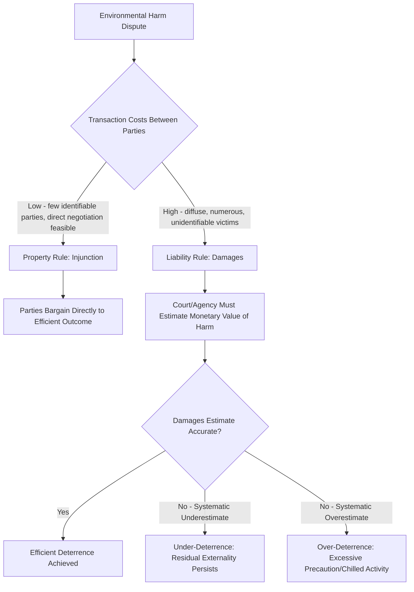

## Liability Rules for Environmental Harm

### Overview

Liability rules for environmental harm govern how the law assigns and enforces financial responsibility for pollution damage after it has occurred, complementing ex ante regulatory instruments like Pigouvian taxes and cap-and-trade. Where regulation seeks to prevent excessive pollution before it happens, liability rules operate ex post, creating incentives for potential polluters to take efficient precautions by making them internalize the expected cost of harm they might cause, and providing a mechanism for compensating victims and, ideally, restoring damaged natural resources.

### Property Rules vs. Liability Rules: The Calabresi-Melamed Framework

**Key Points**

- Calabresi and Melamed (1972) identified two fundamentally different ways law can protect an entitlement (e.g., a right to clean air or water):
  - **Property rule**: the entitlement can only be transferred through a voluntary transaction at a price set by the entitlement holder — protected by injunction. If a polluter wants to continue an activity that infringes the entitlement, it must negotiate with and obtain the consent of the affected party.
  - **Liability rule**: the entitlement can be taken without the holder's consent, provided the taker pays compensation set by an objective, third-party valuation (typically a court-determined damages award) — protected by a damages remedy rather than injunction.
- The choice between these two protection mechanisms has major implications for both efficiency and who bears the burden of the transaction costs of achieving an efficient outcome.

### When Property Rules Are Efficient

**Key Points**

- Property rules (injunctive relief) work well when **transaction costs are low** and the number of affected parties is small — the classic bilateral nuisance dispute between two neighboring landowners, where direct negotiation to an efficient resolution is feasible regardless of which party initially holds the entitlement (a direct application of the Coase Theorem).
- Under a property rule, the market (private bargaining) determines the price and quantity of the harmful activity, since the entitlement holder can refuse any offer below their true valuation — this can achieve efficiency without requiring courts or regulators to estimate the monetary value of the harm at all.

### When Liability Rules Are Efficient

**Key Points**

- Liability rules (damages remedies) are generally preferred when **transaction costs are high** — precisely the situation with most environmental harms, which are diffuse, cumulative, spread across many affected parties (an entire airshed, watershed, or region), and often characterized by significant information asymmetries about the fact, source, or extent of harm.
- Under a liability rule, courts (or agencies) must estimate the monetary value of the harm ex post, since the affected party cannot simply refuse the transaction and force bilateral negotiation — this substitutes a court-determined price (damages) for a market-determined price, which is only efficient if the court's damage estimate is reasonably accurate.
- Because environmental harm liability rules require courts to value externalities directly, they inherit the same fundamental information challenge as Pigouvian taxation — the accuracy of the outcome depends critically on getting the damages figure right, and systematic under-assessment of damages (a common critique of tort damages in practice) can lead to under-deterrence.

### Diagram: Property Rule vs. Liability Rule Decision Framework

### Standards of Liability: Negligence vs. Strict Liability

#### Negligence-Based Liability

**Key Points**

- Under a **negligence standard**, a polluter is liable only if it failed to exercise a legally required level of care (often benchmarked against the **Hand Formula**, from *United States v. Carroll Towing Co.*, 1947): a party is negligent if the burden of precaution ($B$) is less than the probability of harm ($P$) multiplied by the magnitude of the loss ($L$).

$$\text{Negligent if: } B < P \times L$$

- Economic theory shows that, under a properly calibrated negligence standard where the legal standard of care is set equal to the efficient level of precaution, injurers have an incentive to take exactly the efficient level of care — because taking less than the efficient level exposes them to liability for the full harm, while taking the efficient level (or more) avoids liability altogether, so there is no incentive to over-invest in precaution beyond the standard.
- A key limitation for environmental harm specifically: negligence standards require courts to determine and articulate a specific standard of care for often highly technical activities (industrial processes, chemical handling), which can be informationally demanding and prone to error, particularly for novel technologies or emerging contaminants without established safety practices.

#### Strict Liability

**Key Points**

- Under **strict liability**, a polluter is liable for harm caused regardless of the level of care exercised — liability attaches based on causation alone, without any inquiry into whether the polluter's conduct fell below a standard of care.
- Economically justified for **abnormally dangerous or ultrahazardous activities** (the traditional common-law category, e.g., *Rylands v. Fletcher*, 1868, involving the escape of stored water; applied to activities like blasting, storage of hazardous materials, and various forms of pollution) where: (1) the activity carries substantial risk even when carried out with reasonable care (making a negligence standard, which conditions liability on *failure* to exercise care, ineffective at deterring risk from the activity's *inherent* nature), or (2) courts have particular difficulty setting an appropriate standard of care given the specialized or evolving nature of the technology.
- Strict liability has an important **activity-level advantage** over negligence: because liability attaches to any harm caused regardless of care taken, an injurer internalizes not only the incentive to take proper precautions in each instance of the activity, but also the incentive to adjust the **overall level (scale)** of the activity itself — reducing total exposure to liability by conducting the activity less frequently or in lower volume, when that is the efficient response. Negligence-based liability, by contrast, does not directly discipline activity level once the standard of care is met, since a party exercising the required care faces no liability regardless of how much of the activity it undertakes.
- Major U.S. federal environmental liability statutes — notably **CERCLA (the Superfund law)** for hazardous waste site contamination and cleanup, and the **Oil Pollution Act** for oil spills — impose strict liability on responsible parties, reflecting this economic preference for strict liability where activity-level control matters and where establishing a specific negligence standard for complex industrial contamination would be especially difficult.

### Joint and Several Liability

**Key Points**

- Many environmental contamination sites (e.g., Superfund sites) involve **multiple potentially responsible parties (PRPs)** whose individual contributions to the harm may be difficult or impossible to precisely apportion (e.g., co-mingled waste from multiple generators at a single landfill over decades).
- Under **joint and several liability**, any single responsible party can be held liable for the *entire* cleanup cost, regardless of its individual proportional contribution, with that party then having a right of contribution against other responsible parties.
- **Economic rationale**: shifts the burden and cost of identifying and locating other responsible parties, and the risk of any given party's insolvency, onto the parties who caused the harm collectively rather than onto the victims or the public (who would otherwise bear the shortfall if any liable party cannot be located or cannot pay) — improves victim compensation certainty, though it can be criticized as imposing disproportionate liability on "deep pocket" defendants relative to their actual causal contribution, particularly for parties whose waste contribution was minor.
- Creates strong incentives for private parties to **monitor and screen counterparties** (e.g., waste generators screening the disposal practices of the landfills/handlers they use) ex ante, since any party in the chain could ultimately bear the full cleanup cost.

### Punitive Damages and Deterrence

**Key Points**

- Where the probability of detection and successful enforcement is less than certain, purely compensatory damages **under-deter**, since a rational polluter facing only a chance of being caught and held liable for actual harm will still find violation profitable in expectation if the probability of enforcement is low enough.
- Economic theory suggests damages should, in principle, be scaled up by the inverse of the probability of detection/liability to restore full deterrence:

$$D^* = \frac{H}{p}$$

where $D^*$ is the required damages award, $H$ is the actual harm caused, and $p$ is the probability that liability is actually imposed (accounting for detection, successful litigation, and effective collection).

- This provides an economic justification for **punitive damages** in appropriate cases as a deterrence-restoring multiplier, distinct from purely compensatory functions, though courts apply punitive damages under separate constitutional and doctrinal constraints (e.g., U.S. due process limits on the ratio of punitive to compensatory damages) that do not map precisely onto this economic optimal-deterrence calculation.

### Insolvency and the Judgment-Proof Problem

**Key Points**

- A significant limitation of liability rules as a deterrence mechanism: if potential damages exceed a firm's assets, the firm is effectively **"judgment-proof"** beyond its asset value, and faces reduced or no marginal deterrence from additional expected liability beyond that point — the firm's decision-making is not fully disciplined by the true expected social cost of harm, since it will not actually bear costs beyond its ability to pay.
- This is a particular concern for environmental liability given the potentially very large scale of some contamination or catastrophic events (e.g., major oil spills, large-scale chemical contamination) relative to the assets of some potentially responsible entities, especially thinly capitalized subsidiaries or shell entities.
- Regulatory responses include: **mandatory financial responsibility requirements** (insurance, bonding, or demonstrated net worth requirements as a condition of engaging in the hazardous activity, e.g., under the Oil Pollution Act and various hazardous waste regulations), and, more controversially, **piercing the corporate veil** doctrines that can extend liability to parent companies or individual officers in certain circumstances to prevent judgment-proofing through corporate structuring.

### CERCLA and Retroactive Liability: A Special Case

**Key Points**

- CERCLA's strict, joint-and-several liability scheme is also **retroactive** — it can impose liability on parties for conduct that was entirely lawful at the time it occurred (e.g., disposal practices that complied with then-existing law decades before the statute's enactment), a design choice justified primarily on the grounds of ensuring cleanup funding and victim/environmental restoration certainty rather than on ex ante deterrence grounds, since retroactive liability cannot influence conduct that already occurred.
- [Unverified] This retroactive strict liability feature has been subject to extensive litigation and academic debate regarding both its fairness and its economic efficiency (since it does not serve traditional ex ante deterrence functions for the specific conduct being penalized, though it may still generate valuable deterrence for *future* disposal decisions by signaling that liability schemes can be applied retroactively), and specific doctrinal limits continue to be shaped by ongoing case law.

### Natural Resource Damages (NRD)

**Key Points**

- Beyond cleanup costs, environmental liability regimes (CERCLA, the Oil Pollution Act, and comparable state statutes) often provide for recovery of **Natural Resource Damages** — compensation for injury to natural resources themselves (e.g., harm to wildlife, habitats, groundwater) held in trust for the public by government trustees, distinct from cleanup/remediation costs and from private party compensatory damages.
- NRD valuation frequently relies on **non-market valuation techniques** developed in environmental economics, including contingent valuation (survey-based willingness-to-pay estimation) and habitat equivalency analysis (calculating the scale of restoration or replacement resources needed to offset the interim loss of ecological services), reflecting the same fundamental challenge as Pigouvian tax-rate setting: putting a monetary value on non-market environmental goods.

### Comparative International Approaches

**Key Points**

- The EU's **Environmental Liability Directive** establishes a framework based on the polluter-pays principle, imposing strict liability for certain listed hazardous activities and a fault-based (negligence) standard for environmental damage caused by other occupational activities affecting protected species and habitats — reflecting a hybrid approach combining both liability standards depending on the activity and type of harm involved.
- [Unverified] Specific implementation details vary by EU member state given the directive-based (rather than directly binding regulation) nature of this instrument, and current specifics should be verified against the applicable national implementing legislation for any jurisdiction-specific application.

### Liability Rules as a Complement to Ex Ante Regulation

**Key Points**

- Liability rules and ex ante instruments (Pigouvian taxes, cap-and-trade, command-and-control standards) are generally viewed as **complements rather than substitutes** in an efficient overall regulatory design: ex ante instruments address the ordinary, predictable course of pollution from regulated activity, while liability rules address accidents, non-compliance, and harms not fully anticipated or captured by the ex ante regulatory scheme (e.g., a catastrophic accidental spill exceeding routine permitted discharge levels).
- A comprehensive regulatory approach often layers instruments: a permit/cap-and-trade system governing routine emissions, combined with strict liability and mandatory financial assurance for accidental or catastrophic releases, reflecting the different economic logic and information requirements appropriate to routine versus low-probability, high-consequence events.

### Practical Example: Applying the Framework to an Industrial Spill

**Example**

A chemical manufacturing facility experiences an accidental release contaminating a nearby river, affecting numerous downstream water users, fisheries, and municipal water supplies.

**Analysis**:

1. **Liability standard**: given the hazardous nature of chemical storage and handling, the facility is likely subject to strict liability under applicable federal and/or state statutes (e.g., CERCLA if the substance is a designated hazardous substance), meaning the facility is liable for cleanup and damages regardless of whether it exercised reasonable care in its storage and handling practices.
2. **Multiple responsible parties**: if the contamination resulted from co-mingled discharges or the facility had multiple past operators, joint and several liability may allow injured parties and government to recover full cleanup costs from any solvent responsible party, who then seeks contribution from others.
3. **Property vs. liability rule**: given the large number of diffuse downstream victims (many individual water users, fisheries, municipalities) and the practical impossibility of pre-injury bargaining, a liability rule (damages/cleanup cost recovery) is the only administrable remedy — an injunction-based property rule approach would be impossible to implement given the number of affected parties and the fact that the harm has already occurred.
4. **Natural Resource Damages**: separate from cleanup costs and any private compensatory damages, government trustees may pursue NRD claims for harm to the river ecosystem and affected wildlife, potentially using non-market valuation techniques to establish the appropriate scale of restoration funding.
5. **Financial responsibility**: if the facility's assets are insufficient to cover the full scope of damages, judgment-proofing concerns may leave a funding gap, which mandatory financial responsibility/insurance requirements (if applicable to this facility type) are designed to prevent.

**Next Steps**

- CERCLA (Superfund) statutory framework and potentially responsible party litigation in depth
- Non-market valuation methods: contingent valuation and habitat equivalency analysis
- Optimal damages theory and the probability-of-detection multiplier in depth
- Judgment-proof problem and mandatory financial responsibility regulation design
- Comparative U.S./EU environmental liability regimes
- Insurance markets for environmental liability and moral hazard considerations
- Nuisance law doctrine and its relationship to statutory environmental liability
- Activity-level vs. care-level incentives under alternative liability standards