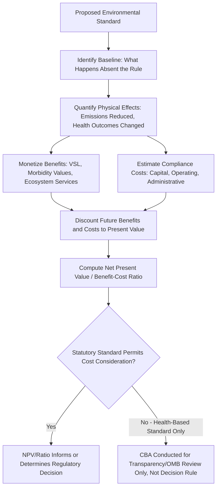

## Cost-Benefit Analysis of Environmental Standards

### Overview

Cost-benefit analysis (CBA) is the principal analytical framework used by regulatory agencies and courts to evaluate whether proposed environmental standards are economically justified — comparing the monetized social benefits of a regulation (avoided health harms, ecosystem preservation, climate damage reduction) against its monetized social costs (compliance costs, administrative costs, potential output/employment effects). In U.S. federal rulemaking, CBA has been institutionalized through executive orders requiring agencies to conduct and, in many cases, satisfy a net-benefit test before adopting major regulations, making it a central and often contested methodology in environmental law and economics.

### Legal and Institutional Framework

**Key Points**

- In the U.S., CBA requirements for major federal regulations trace to a series of executive orders, notably **Executive Order 12866** (1993), requiring agencies to assess costs and benefits of significant regulatory actions and, to the extent permitted by law, to propose or adopt a regulation only upon a reasoned determination that its benefits justify its costs.
- Statutory authority varies considerably by environmental statute: some statutes (e.g., certain provisions of the Clean Air Act) have been interpreted to preclude cost consideration in setting specific standards (e.g., National Ambient Air Quality Standards, which the Supreme Court held in *Whitman v. American Trucking Associations* (2001) must be based on public health criteria alone, without cost-benefit balancing, given the statutory text), while other provisions and other statutes explicitly require or permit cost-benefit balancing.
- This creates a fragmented landscape where the *legal permissibility* of CBA depends heavily on the specific statutory provision at issue, even though the *executive branch policy* of conducting CBA analysis (for internal review and public transparency, via OMB's Office of Information and Regulatory Affairs) applies broadly across significant rules regardless of the ultimate statutory decision rule.
- The EU and other jurisdictions employ analogous "impact assessment" requirements, though with varying degrees of formality and centralized review compared to the U.S. OMB/OIRA process.

### The Basic CBA Decision Rule

**Key Points**

- A regulation is economically justified under standard CBA if the present value of its social benefits exceeds the present value of its social costs:

$$\sum_{t=0}^{T} \frac{B_t}{(1+r)^t} > \sum_{t=0}^{T} \frac{C_t}{(1+r)^t}$$

where $B_t$ and $C_t$ are benefits and costs in period $t$, and $r$ is the discount rate.

- Agencies typically also compute **net present value (NPV)** and, where useful for comparing across regulatory options, **cost-effectiveness ratios** (cost per unit of a specific outcome achieved, e.g., cost per ton of pollutant reduced, or cost per statistical life saved) — the latter is especially useful when benefits are difficult to fully monetize but a policy goal (e.g., a specific health outcome) is already given.

### Diagram: Cost-Benefit Analysis Process for Environmental Rulemaking

### Valuing Life and Health: The Value of a Statistical Life (VSL)

**Key Points**

- The single most consequential and most debated input into environmental CBA is the **Value of a Statistical Life (VSL)** — not the value of any identified individual's life, but the aggregate willingness-to-pay across a population for a small reduction in mortality risk, divided by the resulting expected number of statistical lives saved.

$$VSL = \frac{\text{Aggregate Willingness to Pay for Risk Reduction}}{\text{Expected Number of Lives Saved}}$$

- Conceptual example: if 100,000 people are each willing to pay $50 for a reduction in their individual annual mortality risk that would be expected to prevent one death across the group, the implied VSL is $100{,}000 \times \$50 = \$5{,}000{,}000$.
- VSL estimates are typically derived from **revealed preference** studies (e.g., wage premiums workers demand for jobs with higher occupational fatality risk — hedonic wage studies) or **stated preference** studies (e.g., contingent valuation surveys asking hypothetical willingness-to-pay questions).
- [Unverified] Specific VSL figures used by different U.S. agencies (EPA, DOT, OMB guidance) have varied over time and across agencies, and are periodically updated for inflation and methodology revisions; current applicable figures should be verified against the specific agency's latest official guidance for any application requiring precision.
- VSL is contested on multiple grounds: whether it should vary by age (a "senior discount" controversy, where some early EPA analyses applying age-adjusted VSL drew significant public and political criticism and were subsequently withdrawn), whether it should vary by income (raising equity concerns if higher-income populations' higher willingness-to-pay is used to justify less protection for lower-income communities), and broader philosophical objections to monetizing mortality risk at all.

### Morbidity and Non-Fatal Health Effects

**Key Points**

- Beyond mortality, environmental CBA must value non-fatal health outcomes (respiratory illness, cardiovascular effects, developmental effects, lost workdays) using **cost-of-illness** approaches (medical costs plus lost productivity) or **willingness-to-pay** approaches for avoiding the illness itself (generally preferred by economists as more theoretically complete, since cost-of-illness omits the value of pain, suffering, and non-market time losses, but often harder to estimate reliably).
- **Quality-Adjusted Life Years (QALYs)** and **Disability-Adjusted Life Years (DALYs)** are alternative metrics sometimes used, particularly in health-economics-adjacent contexts, weighting survival time by health-related quality of life, though their formal use in U.S. environmental regulatory CBA is less standardized than VSL-based mortality valuation.

### Discounting Future Benefits and Costs

**Key Points**

- Because many environmental benefits (avoided climate damages, avoided long-latency disease) accrue far in the future while many costs (compliance investment) are borne immediately, the choice of **discount rate** is often the single most consequential and contested parameter in environmental CBA — small changes in the discount rate can flip the sign of the net present value calculation for long-horizon environmental problems.
- **Descriptive (market-based) discounting**: uses observed market interest rates or the social opportunity cost of capital, reflecting how society actually trades off present versus future resources through capital markets.
- **Prescriptive (ethical) discounting**: derives the discount rate from first-principles ethical reasoning about how much weight to give future generations' welfare relative to the present generation (the **Ramsey formula** decomposes the discount rate into a pure time preference component and a component reflecting expected future consumption growth), often yielding lower rates than pure market-based approaches, particularly influential in climate-related CBA debates (e.g., the contrast between the low discount rates used in the Stern Review and higher rates used in some other prominent climate-economic assessments).
- **Intergenerational equity concerns**: high discount rates can make even severe long-term environmental damages (multi-decade or multi-century climate impacts) appear numerically insignificant in present-value terms, which many argue understates the moral weight properly given to future generations — this tension is central to disputes over Social Cost of Carbon calculation, discussed in the related externalities and Pigouvian tax content.

### Categories of Costs in Environmental CBA

**Key Points**

- **Direct compliance costs**: capital expenditure on pollution control equipment, operating and maintenance costs, monitoring and reporting costs.
- **Indirect/general equilibrium costs**: potential effects on output, employment, and prices in regulated and related industries, which can be more difficult to estimate reliably than direct engineering-based compliance cost estimates and are sometimes a source of significant dispute between agency and regulated-industry cost estimates.
- **Administrative costs**: government costs of implementing, monitoring, and enforcing the regulation.
- **Transition costs**: costs specific to the adjustment period (e.g., retraining, capital write-offs for prematurely retired equipment) as distinct from ongoing steady-state compliance costs.
- A recurring empirical finding in retrospective regulatory studies is that **ex ante (prospective) cost estimates for environmental regulations have often exceeded actual ex post compliance costs**, frequently attributed to underestimated innovation and cost-reducing technological adaptation induced by the regulation itself — though [Inference] the generality and magnitude of this pattern across different types of regulations and studies remains an area of ongoing empirical research rather than a settled universal finding.

### Categories of Benefits in Environmental CBA

**Key Points**

- **Direct health benefits**: reduced mortality and morbidity from improved air/water quality, valued via VSL and morbidity valuation methods described above.
- **Ecosystem service benefits**: harder-to-monetize benefits such as biodiversity preservation, recreational value, and ecosystem resilience, often estimated via **non-market valuation techniques**:
  - **Contingent valuation**: survey-based elicitation of hypothetical willingness-to-pay for a specified environmental improvement.
  - **Hedonic pricing**: inferring implicit prices for environmental amenities (e.g., clean air, proximity to green space) from their effect on observable market prices, such as housing values.
  - **Travel cost method**: inferring recreational site value from the costs (time and money) visitors incur to travel there.
  - **Benefit transfer**: applying valuation estimates from an existing study of a comparable environmental good/location to the policy context under analysis, used when original valuation studies for the specific context are unavailable, but introducing additional uncertainty from the transfer's applicability.
- **Co-benefits (ancillary benefits)**: benefits of a regulation beyond its primary target — e.g., a regulation targeting a specific pollutant that also happens to reduce co-emitted pollutants, generating additional health benefits beyond the regulation's stated primary purpose; the appropriate weight to give co-benefits in the formal CBA has itself been a point of methodological and political dispute in some rulemakings.

### Distributional Analysis and Environmental Justice

**Key Points**

- Standard aggregate CBA, by design, sums benefits and costs across the entire affected population using a common monetary metric, without regard to *who* bears the costs and *who* receives the benefits — a regulation can pass a net-benefit test in aggregate while imposing costs disproportionately on some communities and benefits disproportionately on others.
- **Environmental justice** analysis supplements aggregate CBA with **distributional analysis**, examining whether the burdens of pollution (and the burdens or benefits of proposed regulation) fall disproportionately on particular demographic or socioeconomic groups, reflecting a normative concern that pure aggregate efficiency analysis does not, by itself, capture.
- Some economists have proposed **distributionally weighted CBA**, applying different welfare weights to costs and benefits accruing to different income groups (reflecting the declining marginal utility of income), though this remains methodologically and politically more contested and less standardized in official agency practice than unweighted aggregate CBA.

### Uncertainty and Sensitivity Analysis

**Key Points**

- Given the substantial uncertainty inherent in key CBA inputs (VSL, discount rate, dose-response relationships, cost projections), rigorous environmental CBA typically includes **sensitivity analysis** (testing how the net benefit conclusion changes under alternative plausible parameter values) and, increasingly, formal **probabilistic/Monte Carlo uncertainty analysis** presenting a distribution of possible net benefit outcomes rather than a single point estimate.
- **Break-even analysis** is sometimes used as an alternative to full monetization when key benefit categories are especially difficult to value: calculating what value a currently unmonetized benefit (e.g., a specific ecosystem service) would need to have for the regulation's benefits to just equal its costs, allowing decision-makers to judge plausibility without requiring a precise point estimate of that value.

### Critiques of Cost-Benefit Analysis in Environmental Regulation

**Key Points**

- **Commensurability objections**: critics argue that reducing health, ecological, and aesthetic values to a common monetary metric obscures important qualitative distinctions and can undervalue goods that are difficult to price (a critique associated with various strands of environmental ethics and some legal scholarship skeptical of welfare economics as the sole basis for regulatory policy).
- **Uncertainty and manipulability concerns**: given the sensitivity of CBA conclusions to contested parameter choices (VSL, discount rate, co-benefit treatment), critics on various sides argue CBA outcomes can be manipulated toward a predetermined political conclusion by strategic parameter selection, undermining CBA's claimed objectivity.
- **Precautionary principle counter-framework**: some regulatory philosophies (more prominent in EU environmental and chemical regulation, e.g., REACH) favor a precautionary approach that shifts the burden of proof onto demonstrating safety before an activity/substance is permitted, rather than requiring regulators to affirmatively demonstrate that benefits exceed costs before restricting an activity — a meaningfully different default allocation of the burden of uncertainty than standard U.S.-style CBA.
- **Defenders' response**: proponents argue that, despite its imperfections, CBA imposes valuable analytical discipline, transparency, and consistency across regulatory decisions compared to the alternative of ad hoc, unstructured decision-making, and that its limitations are best addressed by improving methodology (better valuation studies, more rigorous uncertainty analysis, supplementary distributional analysis) rather than abandoning the framework.

### Practical Example: Simplified CBA of an Air Quality Standard

**Example**

An agency considers a proposed tightening of a particulate matter emissions standard for power plants.

1. **Baseline and quantification**: agency scientists estimate the standard would reduce particulate matter emissions by a specified amount, and epidemiological dose-response models translate this into an estimated reduction in premature deaths and non-fatal respiratory illness cases annually.
2. **Monetizing benefits**: premature deaths avoided are valued using the agency's current VSL figure; non-fatal illness cases avoided are valued using cost-of-illness or willingness-to-pay estimates for the specific conditions involved (e.g., asthma exacerbations, emergency room visits).
3. **Estimating costs**: engineering analysis estimates the capital and operating costs of the pollution control technology (e.g., additional scrubber capacity) needed to meet the tighter standard across affected facilities.
4. **Discounting**: both cost streams (front-loaded capital costs) and benefit streams (ongoing annual health benefits) are converted to present value using the agency's specified discount rate(s), often reported at multiple rates (e.g., both a lower and higher rate) given discounting's contested nature.
5. **Net result and sensitivity**: if the present value of health benefits substantially exceeds present value compliance costs even under conservative (low) VSL and (high) discount rate assumptions, the standard is robustly justified under a CBA framework; if the conclusion flips depending on which plausible parameter values are used, the agency's ultimate decision (where the statute permits weighing costs) may depend more heavily on judgment calls about which assumptions are most appropriate, and sensitivity analysis results are typically reported to make that dependency transparent to reviewers and the public.

**Next Steps**

- Value of a Statistical Life: methodology, controversies, and cross-agency variation
- Discount rate selection: Ramsey formula and intergenerational equity debates
- Non-market valuation techniques: contingent valuation, hedonic pricing, travel cost method
- Environmental justice and distributionally weighted cost-benefit analysis
- Precautionary principle vs. cost-benefit analysis as competing regulatory philosophies
- Social Cost of Carbon methodology as an application of environmental CBA principles
- Retrospective regulatory review and ex ante vs. ex post cost estimation accuracy
- Judicial review of agency cost-benefit analysis under U.S. administrative law