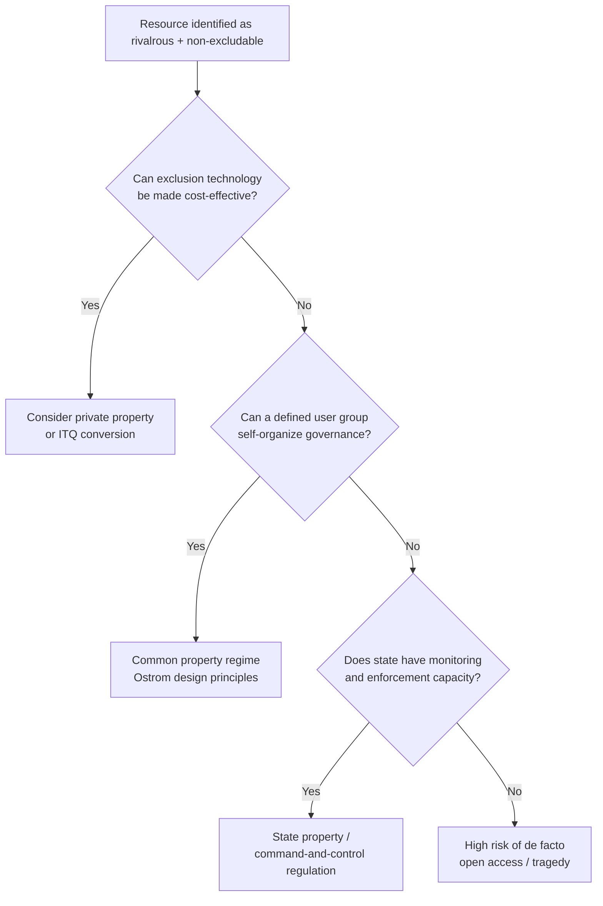

## Common Pool Resources and Natural Resource Management

### Definition and Classification

A common pool resource (CPR) is a good characterized by two defining properties: **subtractability** (also called rivalry) and **difficulty of exclusion**. Subtractability means one user's consumption reduces the quantity or quality available to others. Difficulty of exclusion means preventing access to non-payers or unauthorized users is costly or technically infeasible.

Goods are classified along these two dimensions:

|  | Excludable | Non-Excludable |
| --- | --- | --- |
| **Rivalrous** | Private goods (food, clothing) | Common pool resources (fisheries, aquifers, grazing land) |
| **Non-Rivalrous** | Club goods (cable TV, toll roads) | Public goods (national defense, clean air) |

CPRs occupy the quadrant combining rivalry with non-excludability, which is precisely the combination that generates the incentive problems central to this topic. Examples include ocean fisheries, groundwater aquifers, forests, irrigation systems, grazing commons, the electromagnetic spectrum (historically), and, in modern extensions, the global atmosphere's capacity to absorb greenhouse gases.

It is important to distinguish the resource system (the stock, e.g., a fishery) from the resource units (the flow extracted from it, e.g., individual fish). Sustainable management concerns the relationship between the extraction rate and the regeneration rate of the stock.

### The Tragedy of the Commons

The canonical framing comes from Garrett Hardin's 1968 essay, though the underlying economic logic predates it (H. Scott Gordon's 1954 fishery model is the more rigorous economic origin). The core mechanism:

Each resource user receives the full private benefit of an additional unit of extraction but bears only a fraction of the cost imposed on the resource stock, since that cost is spread across all users. This creates a wedge between private marginal benefit and social marginal benefit.

Formally, consider $n$ identical users extracting effort $e_i$ from a shared resource. Total effort is $E = \sum_{i=1}^{n} e_i$. Resource yield $Y(E)$ typically follows a logistic or similar concave growth function. Each user's private return depends on $Y(E)$, but the individual user does not internalize the effect of their own $e_i$ on aggregate $E$ and therefore on the yield available to everyone else.

**Key Points**

- Open-access equilibrium occurs where average product equals marginal cost (dissipation of rent), not where marginal product equals marginal cost (the efficient point).
- The gap between these two equilibria represents the welfare loss from open access — sometimes called the "commons rent dissipation."
- Under free entry and exit, resource rents are driven to zero in the open-access equilibrium; all economic profit is competed away through overinvestment in extraction effort.
- The tragedy is not inherent to sharing per se — it is specifically a failure of well-defined property rights or governance institutions over rival, non-excludable goods.

### The Gordon-Schaefer Bioeconomic Model

The standard formalization for renewable resources (most commonly applied to fisheries) combines a biological growth function with an economic harvest function.

**Biological growth** (logistic/Verhulst function):

$$\frac{dX}{dt} = rX\left(1 - \frac{X}{K}\right) - H$$

where $X$ is the resource stock, $r$ is the intrinsic growth rate, $K$ is the carrying capacity, and $H$ is the harvest rate.

**Harvest function** (Schaefer production function):

$$H = qEX$$

where $q$ is the catchability coefficient and $E$ is fishing effort.

**Steady-state condition** ($dX/dt = 0$) gives the sustainable yield curve:

$$H_{sy}(E) = qEX^* = qE\left[K\left(1 - \frac{qE}{r}\right)\right]$$

**Revenue and cost:**

$$TR(E) = pH_{sy}(E), \quad TC(E) = cE$$

where $p$ is price per unit harvest and $c$ is cost per unit effort.

Three equilibria emerge from this model:

1. **Maximum Sustainable Yield (MSY)**: effort level $E_{MSY}$ that maximizes $H_{sy}(E)$, occurring at $X = K/2$ under logistic growth.
2. **Maximum Economic Yield (MEY) / bionomic optimum**: effort level maximizing $TR(E) - TC(E)$, i.e., where marginal revenue equals marginal cost. This is the socially efficient outcome, and $E_{MEY} < E_{MSY}$ in essentially all standard calibrations.
3. **Open-access equilibrium** ($E_{OA}$): effort level where $TR(E) = TC(E)$ (average revenue equals average cost, zero economic rent). Under open access, $E_{OA} > E_{MSY} > E_{MEY}$, meaning open access typically drives effort beyond even the level that maximizes physical yield, into a region of biological and economic overexploitation.

**Example**

Suppose $r = 0.5$, $K = 1{,}000{,}000$ tons, $q = 0.001$, $p = \$1{,}000$/ton, $c = \$5{,}000$ per unit of effort.

- $E_{MSY} = r/(2q) = 250$ units of effort, yielding $X^* = 500{,}000$ tons and $H_{MSY} = 125{,}000$ tons.
- Solving $MR = MC$ analytically for MEY gives an effort level below 250, with a positive rent margin.
- Open access drives effort to where $TR = TC$, which in this parameterization pushes $E_{OA}$ close to or beyond $2 \times E_{MSY}$, collapsing the stock toward a fraction of $K$ and dissipating all resource rent.

[Inference] The exact numerical values of $E_{MEY}$ and $E_{OA}$ depend on solving the specific quadratic form of $TR(E)$ and $TC(E)$ derived from the parameters above; the qualitative ordering $E_{MEY} < E_{MSY} < E_{OA}$ is the standard theoretical result, not a claim specific to these numbers.

### Diagram: Bioeconomic Equilibria

### Property Rights Regimes

Economic analysis distinguishes four idealized property rights structures over a resource, following Ostrom and the broader property rights literature:

- **Open access (res nullius)**: No defined rights; anyone can extract. Generates the tragedy described above.
- **State property**: The resource is owned/managed by a government entity, which sets and (ideally) enforces extraction rules. Effectiveness depends on state capacity, monitoring costs, and the absence of corruption or regulatory capture.
- **Private property**: Rights are assigned to individuals or firms, who then face the full intertemporal cost of depletion (internalizing the externality) and are incentivized to conserve for future value, subject to their discount rate relative to the resource's growth rate.
- **Common property (communal/collective property)**: A defined group holds rights collectively, with internally generated rules governing access, use, and exclusion of non-members. This is distinct from open access — a common property regime has defined boundaries and members even though no single individual holds exclusive title.

A critical conceptual clarification: Hardin's "tragedy of the commons" is, in this typology, actually a tragedy of *open access*, not of common property per se. Ostrom's empirical research demonstrated that well-governed common property regimes can sustainably manage CPRs indefinitely without converting to private or state property.

### Ostrom's Design Principles for Robust CPR Institutions

Elinor Ostrom's fieldwork (synthesized in *Governing the Commons*, 1990), which contributed to her 2009 Nobel Memorial Prize in Economic Sciences, identified recurring institutional features in long-enduring, self-governed CPR regimes (irrigation systems, forests, fisheries across multiple continents):

1. **Clearly defined boundaries** — both of the resource system and of the individuals/households with rights to withdraw from it.
2. **Congruence between appropriation/provision rules and local conditions** — rules governing time, place, technology, and quantity of resource units are matched to local ecological and social conditions.
3. **Collective-choice arrangements** — most individuals affected by operational rules can participate in modifying those rules.
4. **Monitoring** — monitors who audit conditions and appropriator behavior are accountable to the appropriators or are the appropriators themselves.
5. **Graduated sanctions** — appropriators who violate rules receive graduated sanctions depending on the severity and context of the offense, rather than immediate severe punishment.
6. **Conflict-resolution mechanisms** — low-cost, local arenas exist for resolving disputes among appropriators.
7. **Minimal recognition of rights to organize** — external authorities (government) do not challenge the right of local appropriators to devise their own institutions.
8. **Nested enterprises** — for larger CPRs, governance is organized in multiple layers of nested enterprises (local, regional).

[Inference] The applicability and relative weight of each principle can vary substantially by resource type and social context; Ostrom's own work treats these as necessary-but-context-dependent conditions observed across successful cases rather than a strict sufficient checklist guaranteeing success in every setting.

### Policy Instruments for CPR Management

**Command-and-control regulation**

- Input controls: effort limits, gear restrictions, seasonal closures, licensing caps.
- Output controls: total allowable catch (TAC), individual harvest quotas.
- **Drawback**: input controls often induce "input substitution" or "capital stuffing" — regulated users substitute toward unregulated inputs (larger engines, more sophisticated technology) to circumvent effort limits, partially undermining conservation goals while raising costs.

**Individual Transferable Quotas (ITQs)**

- A share of the TAC is allocated to individual users (often based on historical catch) and can be bought, sold, or leased.
- Converts a common pool problem into a bundle of tradable private-like rights, aligning private incentives with efficient long-run resource use.
- **Key Points**
  - ITQs internalize the stock externality by giving quota holders a residual claim on future resource value, incentivizing conservation-supportive lobbying and reduced overcapacity.
  - Well-documented outcomes in economics literature include reduced "race to fish" (since quota holders no longer need to out-compete rivals within a short season), improved product quality and safety (fishing can be timed to market demand rather than a compressed derby season), and reduced fleet overcapitalization.
  - Distributional concerns arise from initial allocation method (grandfathering versus auction) and consolidation of quota ownership over time, which can disadvantage small-scale or new entrant fishers.
  - New Zealand and Iceland are widely cited as long-standing, well-documented ITQ implementations in fisheries economics.

**Taxes and Pigouvian instruments**

- A per-unit extraction tax set equal to the marginal external cost (the "user cost" or scarcity rent that the private extractor ignores) can, in principle, replicate the efficient MEY outcome.
- Requires the regulator to know or estimate the marginal damage/scarcity function, which is informationally demanding in practice.

**Cap-and-trade systems**

- Analogous to ITQs but generalized to any resource/emissions context (e.g., water withdrawal permits, groundwater pumping rights, carbon allowances as an extension of CPR logic to the atmosphere).
- Efficiency properties rely on well-functioning secondary markets, low transaction costs, and credible monitoring/enforcement (MRV: measurement, reporting, verification).

**Co-management and community-based natural resource management (CBNRM)**

- Hybrid arrangements combining state authority (setting overall limits, providing legal backing) with local/community-level implementation and monitoring, drawing on Ostrom-style local knowledge and legitimacy.

### Dynamic Efficiency and the Discount Rate

Beyond the static open-access versus optimal-effort comparison, CPR economics incorporates the intertemporal dimension: how fast should a renewable resource be drawn down over time?

The **optimal extraction path** for a renewable resource under private or well-governed property satisfies a modified Hotelling-type condition. For a resource with own-growth rate $r(X)$ (stock-dependent, e.g., logistic growth), the efficient steady-state stock $X^*$ satisfies:

$$r'(X^*) = \delta$$

where $\delta$ is the social discount rate (assuming linear harvesting costs; the condition is more complex with stock-dependent costs). This is the resource-economics analogue of the Hotelling rule for exhaustible resources, adapted for a resource that regenerates.

**Key Points**

- If the discount rate $\delta$ exceeds the maximum possible biological growth rate $r_{max}$, it can be privately optimal — even under secure private property — to drive the stock toward extinction/exhaustion (the "discount rate exceeds biological growth rate" extinction condition, formalized by Colin Clark).
- This shows that private property rights, while solving the *static* open-access dissipation problem, do not automatically guarantee conservation if the resource owner's discount rate is high relative to biological renewal — an important qualification against treating privatization as a universal solution.
- High discount rates can arise from insecure tenure (fear of expropriation), high time preference, credit constraints forcing rapid liquidation, or genuinely high opportunity cost of capital.

### Applications by Resource Type

**Fisheries**: The most extensively modeled CPR in economics (Gordon-Schaefer framework above). Global policy relies heavily on TACs, ITQs, and regional fisheries management organizations (RFMOs) for straddling/highly migratory stocks that cross national jurisdictions, which is itself a second-order CPR problem at the international level.

**Groundwater aquifers**: Subtractability arises because withdrawal by one user lowers the water table for all users drawing from the same aquifer, raising pumping costs and, in coastal areas, risking saltwater intrusion. Management tools include pumping permits, well-spacing requirements, and (less commonly, due to metering costs) extraction taxes.

**Forests**: CPR dynamics apply particularly to non-timber forest products, grazing understory, and carbon/biodiversity services in open-access or weakly governed forests. Community forestry programs (e.g., in Nepal, India) are frequently cited Ostrom-style case studies.

**Grazing land (rangelands)**: The original Hardin example. Real-world pastoral commons (e.g., historical English commons, African pastoralist systems) often had customary rules limiting stocking rates — a frequently cited example of Ostrom's point that "the commons" in practice were rarely open-access in the strict economic sense.

**Irrigation systems**: A CPR both on the supply side (shared water source) and coordination side (shared infrastructure requiring collective maintenance). Ostrom's original fieldwork included extensive study of farmer-managed irrigation systems.

**Global atmospheric commons**: Greenhouse gas absorptive capacity is framed as a global CPR with essentially zero excludability at the national level, motivating cap-and-trade and carbon tax instruments as the atmospheric analogue of ITQs and Pigouvian taxes discussed above. [Inference] Applying the CPR/Ostrom framework to global climate governance is an extension of the core theory to a setting with far larger numbers of heterogeneous "appropriators" (nation-states) and much weaker enforcement mechanisms, so the direct transferability of design principles like graduated sanctions is more contested in the literature than in small-scale local commons.

### Diagram: CPR Governance Decision Structure

### Empirical and Experimental Evidence

Laboratory common-pool resource experiments (pioneered by Ostrom, Gardner, and Walker in the late 1980s/1990s) consistently find:

- Subjects in one-shot or anonymous repeated CPR games over-extract relative to the social optimum, consistent with Nash equilibrium predictions of open-access theory.
- When subjects are allowed **face-to-face communication** (cheap talk) between rounds, extraction typically falls substantially closer to the optimum, even without binding external enforcement — suggesting social sanctioning and trust-building play a role independent of formal property rights.
- Allowing subjects to design and vote on their own sanctioning mechanisms (endogenous rule-making) produces better conservation outcomes than externally imposed rules of similar stringency, consistent with Ostrom's collective-choice design principle.

[Inference] These experimental regularities are robust across many replications in the behavioral/experimental economics literature, but the magnitude of communication and self-governance effects varies with group size, stake size, and cultural context studied, so specific numerical effect sizes are not quoted here as universal constants.

### Conclusion

Common pool resource theory sits at the intersection of environmental economics, property rights theory, and institutional economics. The core insight — that non-excludability combined with rivalry drives a wedge between private and social incentives — explains why unregulated extraction tends toward dissipation of resource rents and, in many biological systems, stock depletion. However, the policy-relevant refinement from decades of subsequent research (Gordon, Clark, Ostrom, and the ITQ/cap-and-trade literatures) is that neither privatization nor state control is a universal solution: successful CPR governance is empirically associated with well-matched, locally legitimate institutions, credible monitoring and graduated enforcement, and property/quota structures that align individual incentives with the stock's long-run productive capacity, tempered by attention to the resource owner's effective discount rate.

**Next Steps**

- Hotelling's rule and exhaustible (non-renewable) resource economics
- Coase Theorem and transaction costs in externality problems
- Regional Fisheries Management Organizations (RFMOs) and international CPR governance
- Cap-and-trade design: allowance allocation, banking/borrowing, price collars
- Water rights systems: prior appropriation versus riparian doctrine
- Payments for Ecosystem Services (PES) as an alternative CPR governance instrument
- Behavioral and experimental economics of public goods and commons games
- Carbon pricing and the atmosphere as a global commons