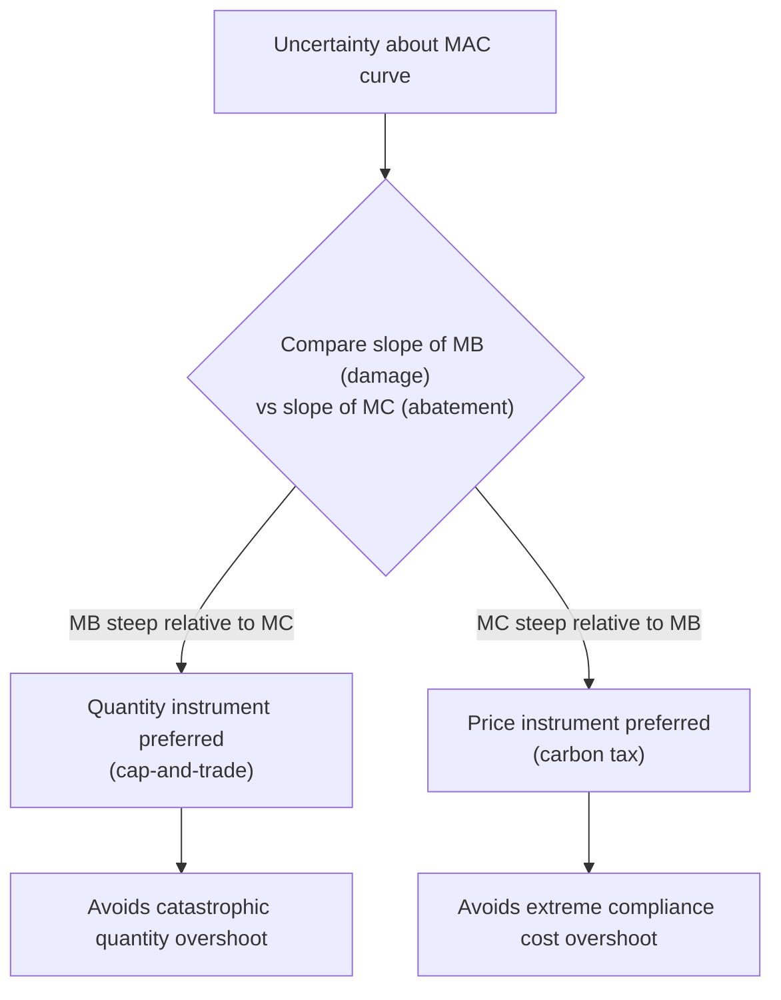
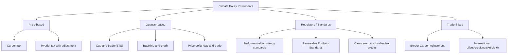

## Climate Change Law and Economic Policy Instruments

### Conceptual Foundation: Climate Change as a Global Externality Problem

Greenhouse gas (GHG) emissions constitute a negative externality with several features that distinguish climate policy from ordinary pollution regulation:

- **Global stock pollutant**: Unlike local pollutants, GHGs (chiefly CO₂, CH₄, N₂O) mix globally in the atmosphere; the location of emission is irrelevant to the location of damage. Damage depends on cumulative atmospheric stock, not the flow rate at any instant, because CO₂ has an atmospheric residence time on the order of centuries.
- **Global public bad**: Because the atmosphere is non-excludable and the damage is non-rivalrous across countries, mitigation is a global public good — every country's abatement benefits all countries, creating a strong free-rider incentive at the international level. This gives climate policy a common pool resource / public goods structure layered on top of an ordinary externality.
- **Long time horizons and irreversibility**: Damages emerge over decades to centuries, raising acute questions about the appropriate social discount rate (the Stern–Nordhaus discounting debate) and about irreversible or quasi-irreversible tipping points (ice sheet collapse, permafrost feedback).
- **Deep uncertainty**: Climate sensitivity (the temperature response to a doubling of atmospheric CO₂) and damage functions carry substantial scientific and economic uncertainty, motivating both expected-value cost-benefit approaches and precautionary/robust-control approaches.

The standard Pigouvian logic applies at its core: emitters do not bear the full marginal social cost of their emissions, so unregulated markets over-produce GHGs relative to the social optimum. The policy question is which instrument best closes that gap given the scale, uncertainty, and international-coordination challenges unique to climate change.

### The Social Cost of Carbon (SCC)

The SCC is the monetized value of the marginal damage caused by emitting one additional ton of CO₂ (or CO₂-equivalent), typically expressed in dollars per metric ton. It is the theoretical foundation for Pigouvian carbon pricing and for cost-benefit analysis of climate regulations.

**Construction of the SCC** proceeds through Integrated Assessment Models (IAMs) that link:

1. An emissions scenario to atmospheric concentration pathways (carbon cycle model).
2. Concentration pathways to global mean temperature change (climate sensitivity).
3. Temperature change to economic damages (a damage function, often calibrated as a fraction of GDP lost per degree of warming).
4. Damages back to the present via a chosen discount rate, producing the present value of the marginal ton.

$$SCC_t = \sum_{s=t}^{T} \frac{D_s(E_t)}{(1+\delta)^{s-t}}$$

where $D_s(E_t)$ is the incremental damage in year $s$ attributable to the marginal unit of emissions $E_t$ released in year $t$, and $\delta$ is the discount rate.

**Widely used IAMs**: DICE/RICE (Nordhaus), FUND (Tol), PAGE (Hope) — each embodies different structural assumptions about damage functions and regional disaggregation, and historically produced SCC estimates differing by an order of magnitude, driven primarily by discount rate assumptions and damage function curvature rather than by disagreement over physical climate science.

**Key Points**

- The choice of discount rate is the single largest driver of SCC estimate variance in the literature; lower discount rates (reflecting greater concern for future generations, as in the Stern Review's ~1.4% rate) produce much higher SCC values than higher rates (as in Nordhaus's earlier ~4–5% market-based rates).
- The U.S. Interagency Working Group on the Social Cost of Carbon has published and revised official SCC estimates used in federal regulatory cost-benefit analysis; [Unverified] the specific dollar figure currently in force is subject to ongoing interagency revision and litigation, so any single number should be checked against the current official source rather than treated as fixed.
- SCC estimates are used both normatively (to set an efficient carbon tax equal to the SCC) and practically (as the "shadow price" plugged into regulatory impact analyses even absent an explicit carbon price).

### Price Instruments: Carbon Taxes

A carbon tax sets a fixed price per ton of CO₂-equivalent emitted, leaving the quantity of abatement to be determined by the market response to that price.

**Design parameters:**

- **Base and point of taxation**: Upstream (on fossil fuel producers/importers, based on carbon content) versus downstream (on emitters directly). Upstream taxation is generally preferred for administrative simplicity, since it requires monitoring far fewer entities (a small number of fuel producers/importers rather than millions of end emitters).
- **Rate trajectory**: Often designed to rise over time (a pre-announced escalation schedule) to give firms a credible long-run price signal for capital investment decisions while easing short-run adjustment costs.
- **Revenue recycling**: Revenue can be returned via lump-sum dividends ("tax-and-dividend," as in the Swiss and some Canadian federal backstop designs), used to reduce other distortionary taxes (the "double dividend" hypothesis — that recycling into cuts to labor or capital taxes can reduce the overall efficiency cost of the tax package), or directed to green investment.

**Efficiency case**: Under certainty, a carbon tax set equal to the SCC achieves the first-best efficient level of abatement, since firms abate up to the point where their marginal abatement cost equals the tax, which by construction equals marginal damage.

**Key Points**

- Price certainty: firms know the exact marginal cost of emitting, aiding investment planning.
- Quantity uncertainty: the resulting aggregate emissions level is not fixed in advance and depends on realized marginal abatement cost curves, which is a drawback if a specific emissions target (e.g., a science-based budget) is the binding policy objective.
- Administratively simpler than cap-and-trade in many respects: no need to design and monitor a permit market, allocate initial allowances, or prevent market manipulation.

### Quantity Instruments: Cap-and-Trade

Cap-and-trade sets a firm limit (cap) on aggregate emissions and allocates tradable allowances (permits) summing to that cap; firms can buy and sell allowances, and the market-clearing price emerges endogenously.

**Design parameters:**

- **Initial allocation**: Grandfathering (free allocation based on historical emissions) versus auctioning. Auctioning is generally favored by economists on efficiency and revenue-recycling grounds, since it avoids windfall profits to incumbent emitters and generates government revenue with the same double-dividend potential as a tax; grandfathering is often adopted for political-economy reasons (reducing compliance costs and opposition from regulated incumbents).
- **Banking and borrowing**: Allowing firms to bank unused allowances for future use (and, less commonly, borrow against future allocations) smooths price volatility and allows firms to respond efficiently to unexpected cost shocks across periods.
- **Price collars (safety valves)**: A price floor (minimum auction reserve price) and/or ceiling (cost containment reserve, releasing additional allowances if the price exceeds a trigger) hybridize the quantity instrument with price-instrument features, addressing the pure cap-and-trade's exposure to price volatility.
- **Offsets**: Allowing regulated entities to meet compliance obligations by purchasing verified emissions reductions from uncovered sectors (e.g., forestry, agriculture) or other jurisdictions, which can lower compliance costs but raises additivity, permanence, and leakage verification concerns.

**Efficiency case**: Under the Coase Theorem logic, once the cap fixes the aggregate quantity, trading among heterogeneous emitters with different marginal abatement costs drives the market to the cost-minimizing allocation of abatement effort — abatement occurs wherever it is cheapest, regardless of the initial permit allocation (which affects only the distribution of costs, not the aggregate abatement cost, absent transaction costs).

### Weitzman's Prices vs. Quantities: Choosing Between Instruments

Martin Weitzman's 1974 analysis provides the canonical framework for choosing between price and quantity instruments under uncertainty about the marginal abatement cost (MAC) curve.

**Core result**: When there is uncertainty about firms' MAC curves (but not about the marginal damage/benefit curve), the relative slopes of the marginal benefit (MB) and marginal cost (MC) curves determine which instrument minimizes expected welfare loss:

$$\text{Prefer price instrument if: } |MC'| > |MB'|$$

$$\text{Prefer quantity instrument if: } |MB'| > |MC'|$$

Intuition: if the marginal damage curve is relatively steep (small changes in quantity cause large changes in marginal damage — as might be argued for pollutants with sharp threshold effects) relative to a flat marginal abatement cost curve, then quantity control is more robust to cost uncertainty, because it prevents a costly overshoot in emissions even if abatement costs turn out to be lower than expected. Conversely, if the MAC curve is steep relative to a flat marginal damage curve (as many economists argue is closer to the case for CO₂, since the atmosphere's stock nature and long residence time make the marginal damage from any single year's emissions relatively insensitive to precise annual quantities), a price instrument is more robust, since it caps compliance costs directly and avoids the risk of extremely high abatement costs if the true MAC curve turns out steeper than assumed.

**Application to climate policy**: [Inference] Many economists have argued, on the basis of the flat-marginal-damage/steep-marginal-cost reasoning above, that this favors carbon taxes or hybrid quantity instruments (price collars) over pure cap-and-trade for CO₂ specifically; however, this remains a modeling judgment about relative curve slopes rather than a settled empirical fact, and prominent economists have supported both instrument types for climate policy on other grounds (political feasibility, revenue properties, integration with existing regulatory law).

### Diagram: Weitzman Prices vs. Quantities

### Hybrid Instruments

Because pure price and pure quantity instruments each have a distinct weakness, several hybrid designs have emerged:

- **Price collar cap-and-trade**: Combines a cap with a price floor and ceiling, bounding price volatility while preserving a quantity anchor. Effectively converts the instrument into a price instrument near the boundaries and a quantity instrument in the interior.
- **Carbon tax with a quantity adjustment mechanism**: The tax rate is periodically adjusted based on observed progress toward an emissions target (sometimes called a "tax-and-adjust" or indexed carbon tax).
- **Baseline-and-credit systems**: Firms are assigned an emissions-intensity baseline (rather than an absolute cap) and can generate/purchase credits for performance better than baseline; common in systems targeting emissions intensity per unit of output rather than absolute emissions (e.g., some Canadian provincial systems, China's national ETS for power generation).

### Regulatory (Command-and-Control) Alternatives

Where price or quantity market instruments are politically or administratively infeasible, direct regulation remains common:

- **Technology and performance standards**: e.g., vehicle fuel-economy standards (CAFE in the U.S.), power plant emissions performance standards, building energy codes.
- **Renewable Portfolio Standards (RPS) / Clean Energy Standards**: Quantity mandates on the share of electricity generation from qualifying low-carbon sources, functioning as a sector-specific quantity instrument for a proxy variable (generation mix) rather than emissions directly.
- **Subsidies for clean technology**: R&D subsidies, investment tax credits, and production tax credits for renewables (addressing a *second* externality — the positive knowledge spillover from innovation — that a carbon price alone does not fully correct, per the "two-externality problem" identified in innovation-and-environment economics: pollution externality plus knowledge externality).

**Key Points**

- Command-and-control instruments generally do not equalize marginal abatement costs across regulated entities, and therefore do not achieve the cost-minimizing allocation of abatement that price or quantity market instruments can achieve in theory — a central efficiency argument economists raise in comparing the two categories.
- Standards can be preferred on grounds other than static cost-efficiency: administrative familiarity, distributional/political acceptability, addressing non-price market failures (e.g., split incentives in rental housing for efficiency standards, information asymmetries for consumers), or as a backstop when a price signal alone is judged insufficient to overcome behavioral or capital-market barriers to adoption.

### Border Carbon Adjustments (BCAs) and Leakage

**Carbon leakage** occurs when unilateral climate regulation in one jurisdiction raises production costs for emissions-intensive, trade-exposed industries, causing production (and associated emissions) to shift to jurisdictions with laxer regulation, partially or wholly offsetting the regulating jurisdiction's domestic emissions reduction.

**Border Carbon Adjustment mechanisms** address leakage by imposing a charge on imports (reflecting the embedded carbon content and the domestic carbon price they would have faced) and/or providing a rebate on exports (to maintain competitiveness in markets without equivalent carbon pricing).

- The EU's Carbon Border Adjustment Mechanism (CBAM) is the most prominent implemented example, applying to imports in specified carbon-intensive sectors (e.g., cement, steel, aluminum, fertilizers, electricity, hydrogen).
- **Key Points**
  - Economically, a well-designed BCA can restore a level playing field and reduce leakage without requiring full multilateral coordination, functioning as a second-best substitute for a globally harmonized carbon price.
  - BCAs raise WTO-consistency questions under GATT Article XX exceptions (general exceptions for measures relating to conservation of exhaustible natural resources or protection of human/animal/plant life), and design details (calculation of embedded carbon, treatment of exporters facing their own domestic carbon prices) materially affect legal defensibility.
  - [Unverified] Litigation and formal WTO dispute rulings specifically testing BCA/CBAM designs are an evolving area; the legal status of any particular BCA design should be checked against current trade law developments rather than assumed settled.

### International Legal and Institutional Architecture

**UNFCCC framework**: The United Nations Framework Convention on Climate Change (1992) established the overarching international legal framework, including the principle of "common but differentiated responsibilities and respective capabilities" (CBDR-RC) — recognizing that developed countries bear greater historical responsibility for cumulative emissions and generally greater capacity to act.

**Kyoto Protocol (1997)**: Established binding emissions reduction targets for developed countries (Annex I parties) and introduced the first major international market mechanisms:

- **Clean Development Mechanism (CDM)**: Allowed developed countries to earn certified emission reduction credits from emission-reduction projects in developing countries.
- **Joint Implementation (JI)**: Similar mechanism for emission-reduction projects between developed (Annex I) countries.
- **International Emissions Trading**: Allowed Annex I countries to trade portions of their emissions allowances (Assigned Amount Units) among themselves.

**Paris Agreement (2015)**: Shifted from top-down binding targets to a bottom-up structure of **Nationally Determined Contributions (NDCs)** — self-determined emissions pledges submitted and periodically updated (ratcheted upward in ambition) by each party, combined with a transparency and stocktake framework rather than binding international enforcement. Article 6 of the Paris Agreement establishes a framework for voluntary international cooperation, including cooperative approaches involving internationally transferred mitigation outcomes (ITMOs) and a centralized crediting mechanism, functioning as a successor architecture to the CDM.

**Key Points**

- The shift from Kyoto's binding-target model to Paris's pledge-and-review model reflects, in institutional-economics terms, a response to the free-rider and enforcement problems inherent in a global public goods game among sovereign states without a supranational enforcement mechanism.
- Game-theoretic analyses of international climate cooperation (following the seminal work on international environmental agreements) generally find that stable, self-enforcing coalitions absent side payments or sanctions tend to be small relative to the globally efficient coalition size, which is offered as one economic explanation for the persistent ambition gap between aggregate NDC pledges and emissions pathways consistent with stated temperature goals.

### Diagram: Climate Policy Instrument Landscape

### Litigation and Domestic Legal Instruments

Climate litigation has grown into a distinct sub-field bridging tort law, administrative law, and constitutional/human-rights law, complementing legislative and regulatory instruments:

- **Regulatory-authority litigation**: Cases testing whether existing statutes (e.g., environmental protection statutes predating explicit climate legislation) grant regulatory agencies authority to regulate GHG emissions as pollutants — a major line of U.S. administrative law litigation concerning the scope of agency authority under statutes not originally drafted with climate change in mind.
- **Rights-based and constitutional litigation**: Cases asserting that inadequate government climate action violates constitutional or human rights (life, health, a stable environment), increasingly seen in comparative and international courts.
- **Corporate tort and disclosure litigation**: Claims against major emitting companies alleging liability for climate damages, and securities-law-based claims concerning inadequate disclosure of climate-related financial risk.

[Inference] The doctrinal success rate and precedential weight of these litigation categories vary substantially by jurisdiction and are evolving rapidly, so specific case outcomes should be verified against current legal developments rather than treated as fixed doctrine.

### Distributional and Political Economy Considerations

- **Regressivity concern**: Carbon pricing, absent revenue recycling, tends to be regressive in incidence relative to income for goods like home heating fuel and gasoline, since lower-income households often spend a larger share of income on energy — though incidence studies show this can be mitigated or even reversed by progressive revenue recycling (per-capita dividends favor lower-income households who consume less carbon-intensive goods overall in absolute terks).
- **Just transition**: Policy design increasingly incorporates transitional support (retraining, regional economic diversification funds) for workers and communities dependent on carbon-intensive industries, addressing a distinct equity externality from the core emissions externality.
- **Political economy of instrument choice**: Carbon taxes are often more transparent (a visible price) but face stronger direct political resistance; cap-and-trade can obscure the implicit carbon price within a permit market, sometimes easing political passage, at the cost of price-volatility and complexity concerns discussed above.

### Conclusion

Climate change law and economics extends the standard Pigouvian externality framework to a uniquely challenging setting: a global, cumulative-stock pollutant with long time horizons, deep scientific and economic uncertainty, and no supranational enforcement authority. The core instrument-choice debate — carbon taxes versus cap-and-trade — is best understood through the Weitzman prices-versus-quantities lens, with real-world designs increasingly converging on hybrid instruments (price collars, indexed taxes) that borrow strengths from both pure forms. Because unilateral action creates leakage and free-rider incentives at the international level, effective climate law requires layering domestic instruments (taxes, cap-and-trade, standards, subsidies for the parallel innovation externality) with international legal architecture (UNFCCC, Paris Agreement NDCs) and trade-linked mechanisms (BCAs) designed to sustain cooperation and competitiveness simultaneously.

**Next Steps**

- Social discount rate debates in long-horizon cost-benefit analysis (Stern Review vs. Nordhaus)
- International environmental agreements and coalition stability (game theory)
- Emissions trading system design comparative case studies (EU ETS, California cap-and-trade, RGGI)
- Innovation externalities and the "two-externality" rationale for clean-tech subsidies
- Climate litigation doctrine: administrative law and constitutional/rights-based claims
- Just transition policy design and distributional incidence analysis
- Integrated Assessment Models: DICE, FUND, PAGE — structural comparison
- Adaptation economics and loss-and-damage financing mechanisms