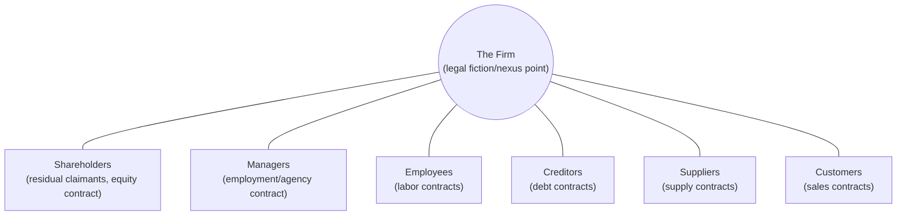
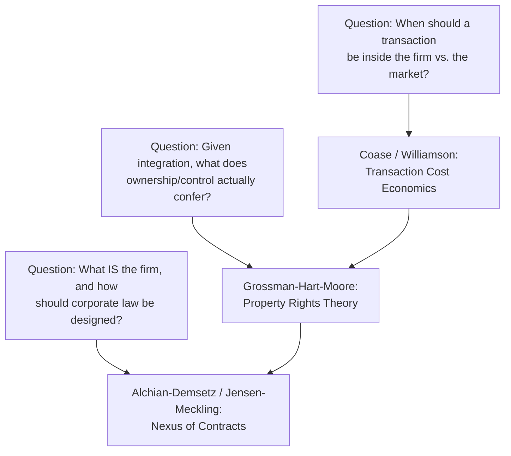

## The Theory of the Firm and the Nexus of Contracts

### The Foundational Question: Why Do Firms Exist?

Neoclassical price theory treats production as a technical relationship (a production function) and largely leaves unanswered why economic activity is organized inside firms — hierarchical, non-market entities — rather than being coordinated entirely through arms-length market transactions between individuals. Ronald Coase's 1937 article "The Nature of the Firm" posed this question directly and supplied the conceptual foundation for the entire law-and-economics treatment of corporate organization.

Coase's central insight: using the price mechanism (the market) is not costless. Discovering relevant prices, negotiating and drafting contracts for every transaction, and monitoring compliance all consume real resources — what came to be called **transaction costs**. A firm emerges when the cost of organizing a set of transactions internally (through managerial direction/authority) is lower than the cost of coordinating the same transactions through a sequence of market contracts.

**Key Points**

- The firm's boundary (what is done "in-house" versus purchased on the market) is determined at the margin where the cost of an additional internal transaction equals the cost of the same transaction conducted via the market.
- This reframes the firm not as a production function but as an alternative *governance structure* for organizing transactions — a shift that became the foundation of transaction cost economics.
- Coase's answer implies firms should expand until the marginal cost of organizing an extra transaction internally (which rises with firm size due to managerial diminishing returns, bureaucratic costs, and loss of high-powered market incentives) equals the marginal cost of the market alternative.

### Transaction Cost Economics: Williamson's Extension

Oliver Williamson (Nobel Memorial Prize, 2009, shared with Ostrom) developed Coase's insight into a full analytical framework identifying *which* transactions are more efficiently organized inside a firm versus through market contracting.

**Key dimensions of transactions** driving governance choice:

1. **Asset specificity**: The degree to which an investment is specialized to a particular transacting relationship and loses value in alternative uses. Types include site specificity, physical asset specificity, human asset specificity, and dedicated assets. Higher asset specificity increases the risk of **holdup** — post-investment opportunistic renegotiation by a trading partner who can appropriate the quasi-rents attached to the specific investment.
2. **Uncertainty**: Higher uncertainty about future contingencies makes it more costly to write complete contracts specifying obligations for every state of the world, favoring governance structures (like vertical integration) that allow flexible ex post adaptation via managerial fiat rather than renegotiation.
3. **Frequency**: Transactions occurring frequently can justify the fixed cost of establishing specialized (including internal) governance structures, whereas one-off transactions may be more efficiently left to spot markets or short-term contracts.

**The fundamental transformation**: Even where an ex ante competitive market exists for a good or service, once a relationship-specific investment is sunk, the transaction is transformed ex post into a bilateral monopoly (small-numbers bargaining), because switching partners becomes costly. This transformation is the mechanism generating holdup risk and motivating governance responses.

**Williamson's discriminating alignment hypothesis**: Transactions, which differ in their attributes (especially asset specificity), are aligned with governance structures, which differ in their costs and competencies, so as to minimize the sum of production and transaction costs. This yields a mapping:

| Asset Specificity | Uncertainty | Predicted Governance |
| --- | --- | --- |
| Low | Low/High | Market (spot contract) |
| Moderate | Moderate | Hybrid (long-term contract, relational contract, franchise) |
| High | High | Vertical integration (hierarchy/firm) |

### Diagram: Governance Structure as a Function of Asset Specificity

### Incomplete Contracts and the Property Rights Theory of the Firm

Because it is prohibitively costly (or impossible) to specify contractual obligations for every conceivable future contingency, real-world contracts are necessarily **incomplete**. The Grossman-Hart-Moore (GHM) property rights theory, building on this observation, offers a formal answer to what "ownership of the firm" actually means and why it matters.

**Core GHM insight**: Ownership is defined as the allocation of **residual control rights** — the right to make decisions about an asset's use in circumstances not explicitly covered by a contract. Since contracts cannot specify everything, whoever holds residual control rights over a physical or non-human asset effectively holds the bargaining power in any contingency the contract failed to address.

**Formal logic:**

- Two parties make relationship-specific investments that increase the joint surplus of a transaction, but each party's investment is *non-contractible* (cannot be verified by a court, so cannot be directly incentivized through contract).
- Because contracts are incomplete, the division of any ex post surplus generated is determined by ex post bargaining (often modeled with Nash bargaining, i.e., an equal split of the incremental surplus).
- Anticipating that they will capture only a fraction of the returns to their investment in ex post bargaining, each party underinvests relative to the socially efficient level — a hold-up problem arising purely from contractual incompleteness, distinct from Williamson's asset-specificity-driven holdup but closely related.
- **Integration (common ownership)** changes the allocation of residual control rights: the party who acquires ownership of a critical asset gains greater bargaining power ex post (since they can threaten to exclude the other party from access to that asset), which increases their incentive to invest but can *further reduce* the other, now-weaker party's investment incentive.

**Key Points**

- The GHM framework's central normative implication is that asset ownership should be allocated to the party whose investment is more important to total surplus (i.e., the party facing the more severe underinvestment problem should be given ownership/control), since integration cannot eliminate the hold-up problem — it only reallocates whose investment incentive is protected at the expense of the other party's.
- This formalizes and refines Coase's insight: the boundary of the firm is not merely about minimizing generic "transaction costs" but specifically about efficiently allocating residual control rights given non-contractible investments.
- The theory predicts vertical integration is more likely when one party's investment is relatively more important to surplus creation, and less likely (favoring separate ownership) when both parties' investments are similarly important, since concentrating control would severely undermine one party's incentives.

### The Firm as a "Nexus of Contracts"

A distinct but related strand of law-and-economics scholarship, most influentially developed by Armen Alchian and Harold Demsetz (1972) and later formalized in corporate law scholarship by Michael Jensen and William Meckling (1976) and by Frank Easterbrook and Daniel Fischel, characterizes the firm not as a single entity with clear boundaries defined by asset ownership, but as a **legal fiction** — a convenient label for a complex web (nexus) of voluntary contractual relationships among numerous input suppliers: shareholders, managers, employees, creditors, suppliers, and customers.

**Core claims of the nexus-of-contracts view:**

- There is no meaningful sense in which "the firm" itself has interests, rights, or duties distinct from the sum of the contracts among its constituent participants; statements like "the firm decided X" or "the firm's purpose is Y" are shorthand for the outcome of these contractual relationships.
- Corporate law is best understood as supplying a standardized set of **default contract terms** ("off-the-rack" rules) that the relevant parties would likely have bargained for themselves had transaction costs of individualized negotiation been zero — reducing the cost of forming and operating a business enterprise by economizing on drafting costs for commonly recurring provisions (e.g., default fiduciary duty standards, default voting rules, default rules on dividend distribution).
- Most corporate law rules should therefore be understood as **enabling and default (gap-filling)** rather than **mandatory**: parties can contract around most default rules (e.g., via charter or bylaw provisions), and the small set of genuinely mandatory rules (e.g., core fiduciary duty prohibitions against self-dealing without disclosure, certain disclosure requirements) exist primarily to address specific, identifiable market failures (e.g., preventing insiders from exploiting information or control advantages that outside investors cannot contract around ex ante due to their diffuse and comparatively powerless bargaining position).

**Alchian-Demsetz's team production rationale**: Their earlier (1972) contribution specifically explains why firms feature a residual claimant/monitor (equity holders and management) overseeing team production: when output results from joint (team) input from multiple factors and individual marginal contributions are difficult to separately observe and meter, team members have an incentive to shirk (since the cost of individual reduced effort is partly borne by teammates). Assigning one party (the monitor) the *residual claim* on output (rather than a fixed wage) and the right to monitor and discipline other team members internalizes the shirking externality, since the monitor's own income now depends directly on detecting and reducing shirking.

### Diagram: The Nexus of Contracts Around the Firm

### Agency Costs and the Separation of Ownership and Control

The nexus-of-contracts framework connects directly to agency theory, formalized in corporate law economics primarily by Jensen and Meckling (1976), addressing the specific contractual relationship between shareholders (principals) and managers (agents).

**Agency costs** arise whenever a principal delegates decision-making authority to an agent whose interests are imperfectly aligned with the principal's, and consist of three components:

1. **Monitoring costs**: Expenditures by the principal to observe and constrain the agent's behavior (e.g., auditing, board oversight, disclosure requirements).
2. **Bonding costs**: Expenditures by the agent to credibly commit not to take actions harmful to the principal, or to compensate the principal if such actions occur (e.g., contractual restrictions the agent voluntarily accepts, performance bonds).
3. **Residual loss**: The remaining welfare loss from divergence between the agent's actual decisions and the decisions that would have maximized the principal's welfare, even after optimal monitoring and bonding.

**Application to the public corporation**: Berle and Means's classic (1932) observation of the separation of ownership (dispersed shareholders) and control (concentrated in professional managers) in large public corporations is, in this framework, understood as creating a structural agency problem: dispersed shareholders individually have weak incentives to monitor management (since monitoring is a public good among shareholders, giving rise to a free-rider problem in monitoring itself — a second-order collective action problem layered on top of the underlying agency problem).

**Corporate law and governance mechanisms as agency-cost-reducing devices:**

- Fiduciary duties (duty of care, duty of loyalty) imposed on directors and officers as default, largely mandatory legal constraints.
- Independent board composition requirements and audit committee requirements.
- Executive compensation structures linking pay to performance (stock options, equity grants) to align managerial incentives with shareholder wealth.
- The market for corporate control (hostile takeovers) as an external disciplining mechanism: poorly managed firms with a large gap between actual and potential value become attractive takeover targets, and the threat of takeover (and associated management replacement) disciplines incumbent management even absent active shareholder monitoring.
- Derivative litigation, allowing shareholders to sue on behalf of the corporation when directors breach fiduciary duties, as a private enforcement mechanism supplementing regulatory oversight.

**Example**

A manager deciding whether to pursue a value-destroying corporate acquisition that nonetheless increases the size of the firm (and the manager's compensation and prestige, if compensation is tied to firm size or if "empire building" carries private managerial benefits) illustrates a classic agency cost: shareholders bear the wealth loss from an unprofitable acquisition while the manager captures private, non-pecuniary benefits. Alignment mechanisms such as tying compensation to stock price performance rather than firm size, or an active market for corporate control, are designed specifically to counteract this particular class of agency cost.

### Reconciling the Frameworks: Contracts, Property Rights, and Legal Personality

These strands are complementary rather than competing:

- **Coase/Williamson (transaction cost economics)** answers: *when* is it efficient to organize a transaction inside a firm versus across a market (the "make or buy" boundary question)?
- **Grossman-Hart-Moore (property rights theory)** answers: given that integration occurs, *what does ownership actually confer*, and how should residual control rights be allocated to best mitigate hold-up given non-contractible investments?
- **Alchian-Demsetz/Jensen-Meckling/Easterbrook-Fischel (nexus of contracts)** answers: what *is* the firm as a legal and economic matter, and how should corporate law itself be designed, given that the firm is ultimately reducible to a web of voluntary contracts among self-interested parties operating under agency and monitoring constraints?

**Key Points**

- A significant conceptual tension exists between the nexus-of-contracts view and the traditional legal-entity view of the corporation (the corporation as a distinct legal "person" with independent rights, capable of owning property, suing, and being sued in its own name); the nexus-of-contracts theorists treat legal personality as a useful procedural fiction for reducing contracting costs, not as evidence of any independent corporate interest.
- This debate has direct doctrinal implications for stakeholder theory versus shareholder primacy debates in corporate law: if the firm is genuinely just a nexus of voluntary contracts, the argument follows that non-shareholder constituencies (employees, creditors, communities) are protected primarily through their own explicit contracts (and background law like tort and labor law), while shareholders — as residual claimants bearing the firm's variable risk after all fixed contractual claims are paid — have the strongest claim to control rights, since they alone bear the marginal consequences of managerial decisions. [Inference] This is a normative implication drawn by proponents of the nexus-of-contracts/shareholder-primacy view rather than an uncontested conclusion; stakeholder theorists dispute the premise that non-shareholder constituencies can, in practice, fully contract for protection against all relevant risks (e.g., employees facing firm-specific human capital investments analogous to the asset-specificity holdup problem described above).

### Diagram: Three Complementary Theories of the Firm

### Doctrinal Applications in Corporate Law

- **Default versus mandatory rules**: The nexus-of-contracts framework provides the analytical justification underlying much of modern corporate statutory design (e.g., enabling statutes like the Delaware General Corporation Law), where most governance provisions are defaults that can be varied by charter or bylaw, and mandatory rules are reserved for addressing specific market failures (e.g., preventing majority shareholder or insider opportunism against minority shareholders who cannot practically renegotiate protective terms after investing).
- **Fiduciary duty doctrine**: Understood in this framework as a judicially supplied gap-filler for the incomplete contract between shareholders and managers — courts apply fiduciary standards (business judgment rule for ordinary decisions, heightened scrutiny for self-dealing or conflict transactions) precisely because it would be prohibitively costly to specify ex ante, by contract, the correct managerial response to every possible future business contingency.
- **Close corporation and partnership law**: Where the number of contracting parties is small and asset specificity/relationship-specific investment (including reputational and human capital) is often high, doctrines imposing heightened good-faith and fair-dealing obligations among co-owners can be understood as addressing the acute hold-up risk GHM theory identifies in small-numbers, high-specificity relationships lacking the exit option (public trading markets) available to public company shareholders.

### Conclusion

The theory of the firm in law and economics developed as a sequence of increasingly refined answers to Coase's original question of why firms exist at all. Transaction cost economics (Coase, Williamson) explains the firm's *boundary* as a response to asset specificity, uncertainty, and the hold-up problem; property rights theory (Grossman-Hart-Moore) explains what ownership *means* once integration occurs, formalizing residual control rights as the mechanism for allocating bargaining power under contractual incompleteness; and the nexus-of-contracts view (Alchian-Demsetz, Jensen-Meckling, Easterbrook-Fischel) reframes the firm itself as a convenient legal fiction for a bundle of voluntary contracts, providing the foundational justification for treating most corporate law as default, gap-filling rules rather than mandatory constraints, and directly informing shareholder-primacy versus stakeholder-theory debates that remain central to contemporary corporate governance scholarship.

**Next Steps**

- Agency theory and executive compensation design
- Fiduciary duties: business judgment rule versus entire fairness review
- Shareholder primacy versus stakeholder theory debates
- Market for corporate control and takeover defenses
- Incomplete contracts and the hold-up problem in vertical integration
- Delaware corporate law as an enabling statute: charter and bylaw flexibility
- Close corporations and heightened fiduciary duties among co-owners
- Team production theory and internal governance of joint enterprises